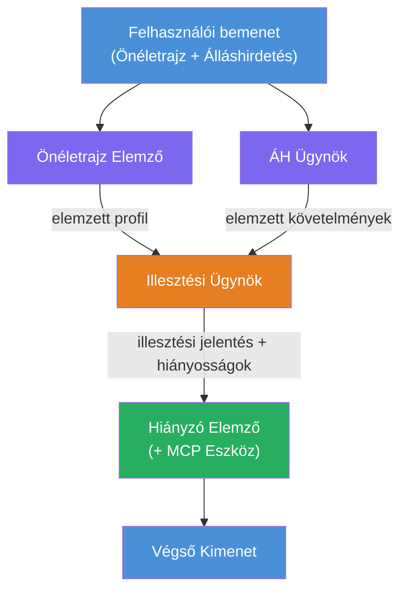
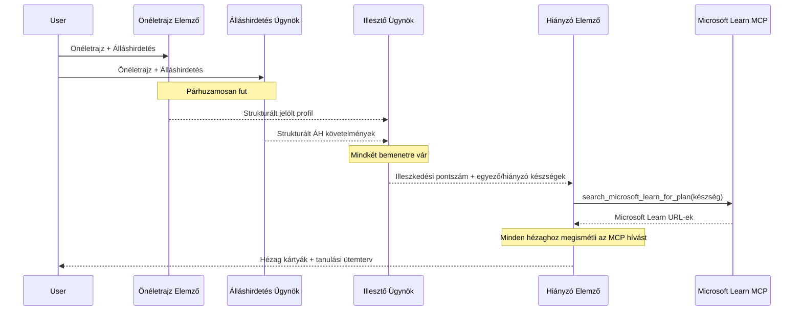
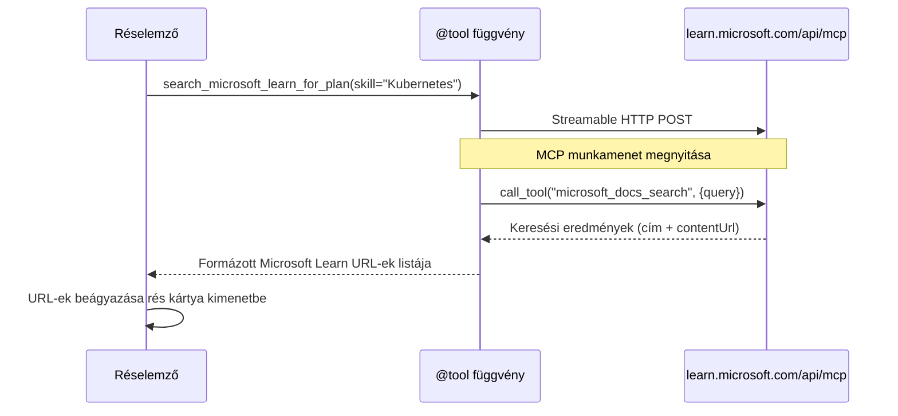

# 1. modul – Ismerd meg a többügynökös architektúrát

Ebben a modulban megismered a Resume → Job Fit Evaluator architektúráját, mielőtt bármilyen kódot írnál. Az orchestration gráf, az ügynökök szerepe és az adatok áramlásának megértése kritikus a hibakereséshez és a [többügynökös munkafolyamatok](https://learn.microsoft.com/azure/architecture/ai-ml/idea/multiple-agent-workflow-automation) bővítéséhez.

---

## A megoldandó probléma

Az önéletrajz és az álláshirdetés összehangolása több különálló képességet igényel:

1. **Elemzés** – Strukturált adatok kinyerése nem strukturált szövegből (önéletrajz)
2. **Analízis** – Követelmények kinyerése az álláshirdetésből
3. **Összehasonlítás** – A két dokumentum közötti megfelelés pontozása
4. **Tervezés** – Tanulási útvonal kidolgozása a hiányosságok pótlására

Egyetlen ügynök, amely mind a négy feladatot egy promptban végzi, gyakran:
- Hiányos kinyerést produkál (siet az elemzéssel, hogy gyorsan a pontozásra jusson)
- Felületes pontozást (nincs bizonyítékokon alapuló lebontás)
- Általános tanulási tervet ad (nem a konkrét hiányosságokra szabva)

Azáltal, hogy négy **szakosodott ügynökre** bontjuk a munkát, mindegyik az adott feladatra fókuszál dedikált instrukciókkal, így minden lépésnél magasabb minőségű eredményt kapunk.

---

## A négy ügynök

Minden ügynök egy teljes [Microsoft Foundry](https://learn.microsoft.com/azure/foundry/agents/concepts/hosted-agents) ügynök, amely az `AzureAIAgentClient.as_agent()` metódusával jön létre. Ugyanolyan modell-deploymentet használnak, de eltérő instrukcióik és (opcionálisan) eszközeik vannak.

| # | Ügynök neve | Szerep | Bemenet | Kimenet |
|---|-------------|--------|---------|---------|
| 1 | **ResumeParser** | Strukturált profil kinyerése az önéletrajzból | Nyers önéletrajz szöveg (felhasználótól) | Jelölt profil, technikai készségek, soft skillek, bizonyítványok, szakterületi tapasztalat, eredmények |
| 2 | **JobDescriptionAgent** | Strukturált követelmények kinyerése az álláshirdetésből | Nyers álláshirdetés szöveg (felhasználótól, ResumeParser-en keresztül továbbítva) | Munkakör áttekintése, szükséges készségek, előnyös készségek, tapasztalat, bizonyítványok, végzettség, felelősségek |
| 3 | **MatchingAgent** | Bizonyítékokon alapuló megfelelés pontozása | ResumeParser + JobDescriptionAgent kimenetei | Megfelelési pontszám (0-100, lebontással), egyező készségek, hiányzó készségek, hiányosságok |
| 4 | **GapAnalyzer** | Személyre szabott tanulási útvonal kialakítása | MatchingAgent kimenete | Hiányosság kártyák (készségenként), tanulási sorrend, idővonal, Microsoft Learn források |

---

## Az orchestration gráf

A munkafolyamat **párhuzamos szétnyílást** és azt követő **soros aggregálást** alkalmaz:


> **Jelmagyarázat:** Lila = párhuzamos ügynökök, Narancs = aggregációs pont, Zöld = végső eszközzel rendelkező ügynök

### Az adatok áramlása


1. A **felhasználó küld** egy üzenetet, amely tartalmaz egy önéletrajzot és egy álláshirdetést.
2. A **ResumeParser** megkapja a teljes felhasználói bemenetet, és strukturált jelölt profilt készít.
3. A **JobDescriptionAgent** párhuzamosan megkapja a felhasználói bemenetet, és strukturált követelményeket nyer ki.
4. A **MatchingAgent** mindkét kimenetet kapja (ResumeParser és JobDescriptionAgent – a keretrendszer mindkettő befejezésére vár, mielőtt futtatná a MatchingAgent-et).
5. A **GapAnalyzer** megkapja a MatchingAgent kimenetét, és meghívja a **Microsoft Learn MCP eszközt**, hogy valódi tanulási forrásokat szerezzen be a hiányosságokhoz.
6. A **végső kimenet** a GapAnalyzer válasza, amely tartalmazza a megfelelési pontot, a hiányosság kártyákat és a teljes tanulási útvonalat.

### Miért fontos a párhuzamos szétnyílás?

A ResumeParser és a JobDescriptionAgent **párhuzamosan futnak**, mert egyik sem függ a másiktól. Ez:
- Csökkenti az összlatenciát (mindkettő egyszerre fut, nem sorban)
- Természetes szétválasztás (az önéletrajz és az álláshirdetés elemzése független feladatok)
- Közismert többügynökös mintát demonstrál: **szétnyílás → aggregálás → végrehajtás**

---

## WorkflowBuilder kódban

Így térképezhetőek fel a fenti gráf elemek a [`WorkflowBuilder`](https://learn.microsoft.com/agent-framework/workflows/agents-in-workflows) API hívásaival a `main.py`-ben:

```python
from agent_framework import WorkflowBuilder

workflow = (
    WorkflowBuilder(
        name="ResumeJobFitEvaluator",
        start_executor=resume_parser,       # Első ügynök, aki megkapja a felhasználói bemenetet
        output_executors=[gap_analyzer],     # Az utolsó ügynök, akinek a kimenete visszaadásra kerül
    )
    .add_edge(resume_parser, jd_agent)      # ÖnéletrajzElemző → MunkaköriLeírásÜgynök
    .add_edge(resume_parser, matching_agent) # ÖnéletrajzElemző → EgyezésÜgynök
    .add_edge(jd_agent, matching_agent)      # MunkaköriLeírásÜgynök → EgyezésÜgynök
    .add_edge(matching_agent, gap_analyzer)  # EgyezésÜgynök → HiányElemző
    .build()
)
```

**Az élek értelmezése:**

| Él | Jelentése |
|----|-----------|
| `resume_parser → jd_agent` | A JD Agent megkapja a ResumeParser kimenetét |
| `resume_parser → matching_agent` | A MatchingAgent megkapja a ResumeParser kimenetét |
| `jd_agent → matching_agent` | A MatchingAgent szintén megkapja a JD Agent kimenetét (mindkettő befejezésére vár) |
| `matching_agent → gap_analyzer` | A GapAnalyzer megkapja a MatchingAgent kimenetét |

Mivel a `matching_agent`-nek **két bemeneti éle van** (`resume_parser` és `jd_agent`), a keretrendszer automatikusan mindkettő befejezésére vár, mielőtt futtatná a MatchingAgent-et.

---

## Az MCP eszköz

A GapAnalyzer ügynöknek van egy eszköze: `search_microsoft_learn_for_plan`. Ez egy **[MCP eszköz](https://learn.microsoft.com/agent-framework/agents/tools/hosted-mcp-tools)**, amely a Microsoft Learn API-t hívja meg kurált tanulási források lekérésére.

### Így működik

```python
@tool
async def search_microsoft_learn_for_plan(
    skill: str, role: str = "", max_results: int = 5
) -> str:
    """Search Microsoft Learn MCP and return curated official links."""
    # Csatlakozik a https://learn.microsoft.com/api/mcp címhez Streamable HTTP-n keresztül
    # Meghívja a 'microsoft_docs_search' eszközt az MCP szerveren
    # Visszaadja a Microsoft Learn URL-ek formázott listáját
```

### MCP hívási folyamat


1. A GapAnalyzer úgy dönt, hogy szüksége van tanulási forrásokra egy készséghez (pl. „Kubernetes”)
2. A keretrendszer meghívja a `search_microsoft_learn_for_plan(skill="Kubernetes")` függvényt
3. A függvény megnyit egy [Streamable HTTP](https://learn.microsoft.com/agent-framework/agents/tools/hosted-mcp-tools) kapcsolatot a `https://learn.microsoft.com/api/mcp` címen
4. Meghívja a `microsoft_docs_search` eszközt az [MCP szerveren](https://learn.microsoft.com/azure/foundry/agents/how-to/tools/model-context-protocol)
5. Az MCP szerver visszaadja a keresési találatokat (cím + URL)
6. A függvény formázza az eredményt, és sztringként visszaadja
7. A GapAnalyzer a visszakapott URL-eket használja a hiányosság kártya kimenetében

### Várt MCP naplók

Amikor az eszköz fut, az alábbihoz hasonló naplóbejegyzéseket látod:

```
GET https://learn.microsoft.com/api/mcp → 405 (Method Not Allowed)
POST https://learn.microsoft.com/api/mcp → 200
DELETE https://learn.microsoft.com/api/mcp → 405 (Method Not Allowed)
```

**Ezek normálisak.** Az MCP kliens az inicializáció során GET és DELETE kérésekkel tesztel (ezekre 405-ös válasz a várható viselkedés). A tényleges eszközhívás POST-tal történik, amely 200-as választ kap. Csak akkor kell aggódni, ha a POST hívások hibáznak.

---

## Ügynök létrehozási minta

Minden ügynök az **[`AzureAIAgentClient.as_agent()`](https://learn.microsoft.com/python/api/overview/azure/ai-agents-readme) aszinkron kontextuskezelővel** jön létre. Ez a Foundry SDK mintája az automatikusan takarított ügynökök létrehozásához:

```python
async with (
    get_credential() as credential,
    AzureAIAgentClient(
        project_endpoint=PROJECT_ENDPOINT,
        model_deployment_name=MODEL_DEPLOYMENT_NAME,
        credential=credential,
    ).as_agent(
        name="ResumeParser",
        instructions=RESUME_PARSER_INSTRUCTIONS,
    ) as resume_parser,
    # ... ismételje meg minden ügynöknél ...
):
    # Itt mind a 4 ügynök létezik
    workflow = create_workflow(resume_parser, jd_agent, matching_agent, gap_analyzer)
```

**Fő pontok:**
- Minden ügynök kap egy saját `AzureAIAgentClient` példányt (az SDK megköveteli, hogy az ügynök neve a kliensre legyen scoped)
- Az összes ügynök ugyanazt a `credential`, `PROJECT_ENDPOINT` és `MODEL_DEPLOYMENT_NAME` értékeket használja
- Az `async with` blokk biztosítja, hogy az összes ügynök takarításra kerüljön a szerver leállásakor
- A GapAnalyzer ezen felül megkapja a `tools=[search_microsoft_learn_for_plan]` paramétert is

---

## Szerver indítása

Miután az ügynökök létrejöttek és a munkafolyamat elkészült, elindul a szerver:

```python
from azure.ai.agentserver.agentframework import from_agent_framework

agent = create_workflow(resume_parser, jd_agent, matching_agent, gap_analyzer)
await from_agent_framework(agent).run_async()
```

A `from_agent_framework()` becsomagolja a munkafolyamatot HTTP szerverré, amely a 8088-as porton a `/responses` végpontot teszi elérhetővé. Ez ugyanaz a minta, mint az 1. laborban, de az "ügynök" most az egész [munkafolyamat gráf](https://learn.microsoft.com/agent-framework/workflows/as-agents).

---

### Ellenőrzőpont

- [ ] Érted a 4-ügynökös architektúrát és az egyes ügynökök szerepét
- [ ] Követni tudod az adatok áramlását: Felhasználó → ResumeParser → (párhuzamosan) JD Agent + MatchingAgent → GapAnalyzer → Kimenet
- [ ] Tudod, miért vár a MatchingAgent mind a ResumeParserre, mind a JD Agentre (két bemeneti él)
- [ ] Érted az MCP eszközt: mit csinál, hogyan hívják, miért normális a GET 405 napló
- [ ] Érted az `AzureAIAgentClient.as_agent()` mintát és hogy miért van minden ügynöknek saját kliens példánya
- [ ] El tudod olvasni a `WorkflowBuilder` kódot, és össze tudod kötni a vizuális gráffal

---

**Előző:** [00 - Előfeltételek](00-prerequisites.md) · **Következő:** [02 - A többügynökös projekt vázának elkészítése →](02-scaffold-multi-agent.md)

---

<!-- CO-OP TRANSLATOR DISCLAIMER START -->
**Felelősség kizárása**:  
Ez a dokumentum az AI fordítási szolgáltatás, a [Co-op Translator](https://github.com/Azure/co-op-translator) segítségével készült. Bár az pontosságra törekszünk, kérjük, vegye figyelembe, hogy az automatikus fordítások hibákat vagy pontatlanságokat tartalmazhatnak. Az eredeti dokumentum anyanyelvű változatát kell tekinteni hiteles forrásnak. Fontos információk esetén szakmai emberi fordítást javaslunk. Nem vállalunk felelősséget az ebből a fordításból eredő félreértésekért vagy félreértelmezésekért.
<!-- CO-OP TRANSLATOR DISCLAIMER END -->