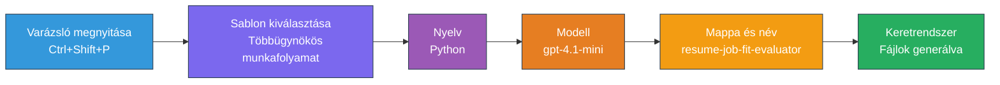
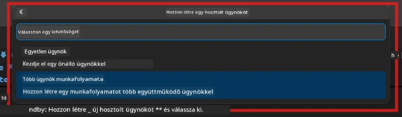

# Modul 2 - Multi-agent projekt előkészítése

Ebben a modulban a [Microsoft Foundry bővítményt](https://marketplace.visualstudio.com/items?itemName=TeamsDevApp.vscode-ai-foundry) használod egy **multi-agent munkafolyamat projekt előkészítésére**. A bővítmény létrehozza az egész projekt struktúrát - `agent.yaml`, `main.py`, `Dockerfile`, `requirements.txt`, `.env` és hibakeresési konfiguráció. Ezeket a fájlokat a 3. és 4. modulokban testre szabod.

> **Megjegyzés:** A `PersonalCareerCopilot/` mappa ebben a laborban egy teljes, működő példa egy testreszabott multi-agent projektre. Vagy létrehozhatsz egy új projektet (tanuláshoz ajánlott), vagy közvetlenül tanulmányozhatod a meglévő kódot.

---

## 1. lépés: Nyisd meg az Új Hosted Agent létrehozó varázslót


1. Nyomd meg a `Ctrl+Shift+P` billentyűkombinációt a **Parancspaletta** megnyitásához.
2. Írd be: **Microsoft Foundry: Create a New Hosted Agent**, és válaszd ki.
3. Megnyílik a hosted agent létrehozó varázsló.

> **Alternatív megoldás:** Kattints a **Microsoft Foundry** ikonra az Aktivitássávban → kattints az **Agents** mellett lévő **+** ikonra → **Create New Hosted Agent**.

---

## 2. lépés: Válaszd a Multi-Agent Workflow sablont

A varázsló sablont kér tőled:

| Sablon | Leírás | Mikor használd |
|----------|-------------|-------------|
| Egyetlen Ügynök | Egy ügynök utasításokkal és opcionális eszközökkel | 01-es labor |
| **Multi-Agent Workflow** | Több ügynök, akik a WorkflowBuilder segítségével működnek együtt | **Ez a labor (02-es labor)** |

1. Válaszd a **Multi-Agent Workflow** opciót.
2. Kattints a **Next** gombra.



---

## 3. lépés: Válassz programozási nyelvet

1. Válaszd a **Python** nyelvet.
2. Kattints a **Next** gombra.

---

## 4. lépés: Válaszd ki a modelledet

1. A varázsló megmutatja a Foundry projektedben telepített modelleket.
2. Válaszd ki azt a modellt, amit az 01-es laborban használtál (például **gpt-4.1-mini**).
3. Kattints a **Next** gombra.

> **Tipp:** A [`gpt-4.1-mini`](https://learn.microsoft.com/azure/foundry/foundry-models/concepts/models-sold-directly-by-azure#gpt-41-series) ajánlott fejlesztéshez – gyors, olcsó és jól kezeli a multi-agent munkafolyamatokat. Végleges éles kiadás esetén válts `gpt-4.1`-re a jobb minőségű outputért.

---

## 5. lépés: Válaszd ki a mappa helyét és az ügynök nevét

1. Megnyílik egy fájlválasztó ablak. Válassz célmappát:
   - Ha a workshop repóval haladsz: navigálj a `workshop/lab02-multi-agent/` mappába és hozz létre egy almappát
   - Ha új projektet indítasz: válassz tetszőleges mappát
2. Írj be egy **nevet** a hosted agent számára (pl. `resume-job-fit-evaluator`).
3. Kattints a **Create** gombra.

---

## 6. lépés: Várd meg az előkészítés befejeződését

1. A VS Code új ablakban nyitja meg (vagy a jelenlegi ablak frissül) az előkészített projektet.
2. Ezt a fájlszerkezetet kell látnod:

```
resume-job-fit-evaluator/
├── .env                ← Environment variables (placeholders)
├── .vscode/
│   └── launch.json     ← Debug configuration
├── agent.yaml          ← Agent definition (kind: hosted)
├── Dockerfile          ← Container configuration
├── main.py             ← Multi-agent workflow code (scaffold)
└── requirements.txt    ← Python dependencies
```

> **Megjegyzés a workshophoz:** A workshop repóban a `.vscode/` mappa a **munkaterület gyökérkönyvtárában** található megosztott `launch.json` és `tasks.json` fájlokkal. Az 01-es és 02-es labor hibakeresési konfigurációi is benne vannak. F5 megnyomásakor válaszd a legördülőből a **"Lab02 - Multi-Agent"** opciót.

---

## 7. lépés: Ismerd meg az előkészített fájlokat (multi-agent sajátosságok)

A multi-agent előkészítés több pontban eltér az egyetlen ügynök előkészítésétől:

### 7.1 `agent.yaml` - Ügynök definíció

```yaml
kind: hosted
name: resume-job-fit-evaluator
description: >
  A multi-agent workflow that evaluates resume-to-job fit.
metadata:
  authors:
    - Microsoft
  tags:
    - Multi-Agent Workflow
    - Resume Evaluator
protocols:
  - protocol: responses
    version: v1
environment_variables:
  - name: PROJECT_ENDPOINT
    value: ${PROJECT_ENDPOINT}
  - name: MODEL_DEPLOYMENT_NAME
    value: ${MODEL_DEPLOYMENT_NAME}
```

**Főbb különbségek az 01-es laborhoz képest:** Az `environment_variables` szekció tartalmazhat további változókat MCP végpontokhoz vagy egyéb eszköz konfigurációkhoz. A `name` és `description` a multi-agent használati esethez igazodik.

### 7.2 `main.py` - Multi-agent munkafolyamat kód

A scaffold tartalmazza:
- **Több ügynök utasítás sztringjét** (egy konstans ügynökönként)
- **Több [`AzureAIAgentClient.as_agent()`](https://learn.microsoft.com/python/api/overview/azure/ai-agents-readme) context managert** (egy ügynökönként)
- **[`WorkflowBuilder`](https://learn.microsoft.com/agent-framework/workflows/agents-in-workflows)** az ügynökök összekapcsolására
- **`from_agent_framework()`** a munkafolyamat HTTP végpontként való kiszolgálásához

```python
from agent_framework import WorkflowBuilder, tool
from agent_framework.azure import AzureAIAgentClient
from azure.ai.agentserver.agentframework import from_agent_framework
```

Az extra import a [`WorkflowBuilder`](https://learn.microsoft.com/agent-framework/workflows/agents-in-workflows) az 01-es laborhoz képest újdonság.

### 7.3 `requirements.txt` - Kiegészítő függőségek

A multi-agent projekt ugyanazokat az alap csomagokat használja mint az 01-es labor, plusz bármely MCP-vel kapcsolatos csomag:

```
agent-framework-azure-ai==1.0.0rc3
agent-framework-core==1.0.0rc3
azure-ai-agentserver-agentframework==1.0.0b16
azure-ai-agentserver-core==1.0.0b16
debugpy
agent-dev-cli --pre
```

> **Fontos verzió megjegyzés:** Az `agent-dev-cli` csomag telepítéséhez a `requirements.txt`-ben szükséges a `--pre` jelző a legfrissebb előzetes verzió telepítéséhez. Ez szükséges az Agent Inspector kompatibilitásához az `agent-framework-core==1.0.0rc3` verzióval. Verzió részletekért lásd a [8. modul - Hibakeresés](08-troubleshooting.md) részt.

| Csomag | Verzió | Cél |
|---------|---------|---------|
| [`agent-framework-azure-ai`](https://learn.microsoft.com/agent-framework/overview/) | `1.0.0rc3` | Azure AI integráció a [Microsoft Agent Framework](https://github.com/microsoft/agent-framework) számára |
| [`agent-framework-core`](https://learn.microsoft.com/agent-framework/overview/) | `1.0.0rc3` | Alaprendszer (tartalmazza a WorkflowBuilder-t) |
| `azure-ai-agentserver-agentframework` | `1.0.0b16` | Hosted agent szerver futtatókörnyezet |
| `azure-ai-agentserver-core` | `1.0.0b16` | Ügynök szerver alapok |
| `debugpy` | legújabb | Python hibakeresés (F5 VS Code-ban) |
| `agent-dev-cli` | `--pre` | Helyi fejlesztői CLI + Agent Inspector backend |

### 7.4 `Dockerfile` - Ugyanaz mint az 01-es laborban

A Dockerfile megegyezik az 01-es laboréval - fájlokat másol, telepíti a függőségeket a `requirements.txt`-ből, megnyitja a 8088-as portot, és futtatja a `python main.py`-t.

```dockerfile
FROM python:3.14-slim
WORKDIR /app
COPY ./ .
RUN pip install --upgrade pip && \
    if [ -f requirements.txt ]; then \
        pip install -r requirements.txt; \
    else \
      echo "No requirements.txt found" >&2; exit 1; \
    fi
EXPOSE 8088
CMD ["python", "main.py"]
```

---

### Ellenőrzőpont

- [ ] Elkészült a scaffold varázsló → látható az új projekt struktúra
- [ ] Az összes fájl látható: `agent.yaml`, `main.py`, `Dockerfile`, `requirements.txt`, `.env`
- [ ] A `main.py` tartalmazza a `WorkflowBuilder` importot (ez megerősíti a multi-agent sablon választását)
- [ ] A `requirements.txt` tartalmazza az `agent-framework-core` és `agent-framework-azure-ai` csomagokat
- [ ] Érted, hogyan különbözik a multi-agent scaffold az egyetlen ügynök scaffoldjától (több ügynök, WorkflowBuilder, MCP eszközök)

---

**Előző:** [01 - Értsd meg a Multi-Agent Felépítést](01-understand-multi-agent.md) · **Következő:** [03 - Ügynökök és környezet konfigurálása →](03-configure-agents.md)

---

<!-- CO-OP TRANSLATOR DISCLAIMER START -->
**Jogi nyilatkozat**:  
Ezt a dokumentumot az AI fordító szolgáltatás, a [Co-op Translator](https://github.com/Azure/co-op-translator) segítségével fordítottuk. Bár törekszünk a pontosságra, kérjük, vegye figyelembe, hogy az automatikus fordítások hibákat vagy pontatlanságokat tartalmazhatnak. Az eredeti dokumentum az anyanyelvén tekintendő hiteles forrásnak. Kritikus információk esetén professzionális, emberi fordítás igénylése javasolt. Nem vállalunk felelősséget a fordítás használatából eredő félreértésekért vagy félreértelmezésekért.
<!-- CO-OP TRANSLATOR DISCLAIMER END -->