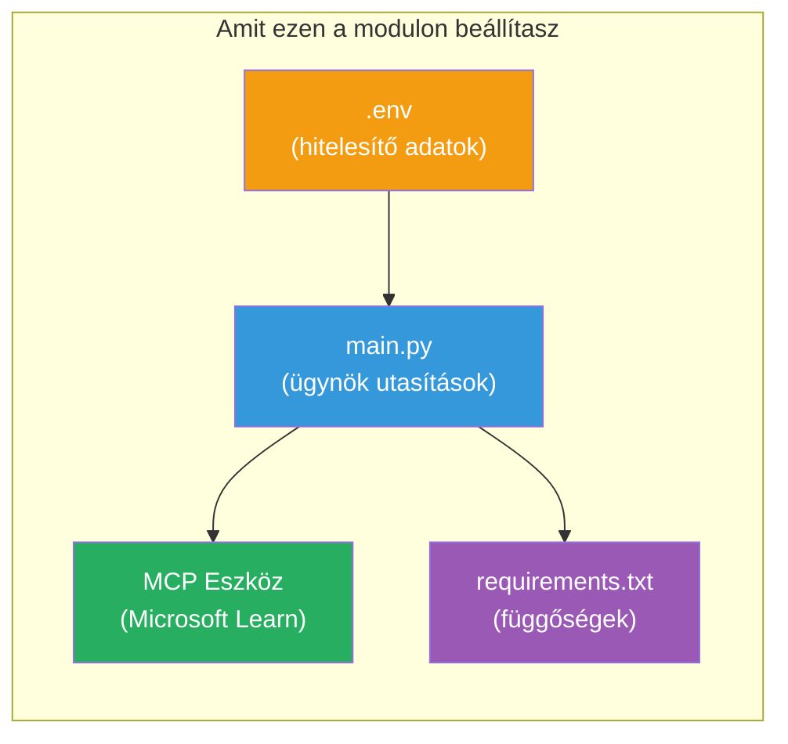

# Modul 3 - Ügynökök, MCP eszköz és környezet konfigurálása

Ebben a modulban testre szabod a sablonként szolgáló többügynökös projektet. Írásos utasításokat készítesz mind a négy ügynök számára, beállítod a Microsoft Learn MCP eszközt, konfigurálod a környezeti változókat, és telepíted a függőségeket.


> **Referenciaként:** A teljes működő kód a [`PersonalCareerCopilot/main.py`](../../../../../workshop/lab02-multi-agent/PersonalCareerCopilot/main.py) fájlban található. Használd referenciaként a saját építésed során.

---

## 1. lépés: Környezeti változók konfigurálása

1. Nyisd meg a projekt gyökerében található **`.env`** fájlt.
2. Töltsd ki a Foundry projekt adataiddal:

   ```env
   PROJECT_ENDPOINT=https://<your-account>.services.ai.azure.com/api/projects/<your-project>
   MODEL_DEPLOYMENT_NAME=gpt-4.1-mini
   ```

3. Mentsd el a fájlt.

### Hol találhatók ezek az értékek

| Érték | Hol található |
|-------|---------------|
| **Project endpoint** | Microsoft Foundry oldalsáv → kattints a projektedre → végpont URL a részlet nézetben |
| **Model deployment name** | Foundry oldalsáv → bővítsd ki a projektet → **Models + endpoints** → név a telepített modell mellett |

> **Biztonság:** Soha ne kötelezd el a `.env` fájlt verziókövetésbe. Ha még nincs ott, add hozzá a `.gitignore`-hoz.

### Környezeti változó leképezés

A többügynökös `main.py` mind a szabványos, mind a workshop-specifikus környezeti változó neveket olvassa:

```python
PROJECT_ENDPOINT = os.getenv("AZURE_AI_PROJECT_ENDPOINT") or os.getenv("PROJECT_ENDPOINT")
MODEL_DEPLOYMENT_NAME = os.getenv(
    "AZURE_AI_MODEL_DEPLOYMENT_NAME",
    os.getenv("MODEL_DEPLOYMENT_NAME", "gpt-4.1-mini"),
)
MICROSOFT_LEARN_MCP_ENDPOINT = os.getenv(
    "MICROSOFT_LEARN_MCP_ENDPOINT", "https://learn.microsoft.com/api/mcp"
)
```

Az MCP végpont rendelkezik ésszerű alapértelmezettséggel – nem szükséges azt `.env`-ben beállítani, kivéve, ha felül akarod írni.

---

## 2. lépés: Ügynöki utasítások megírása

Ez a legkritikusabb lépés. Minden ügynöknek gondosan kidolgozott utasításokra van szüksége, amelyek meghatározzák a szerepét, a kimeneti formátumot és a szabályokat. Nyisd meg a `main.py` fájlt, és készítsd el (vagy módosítsd) az utasítás konstansokat.

### 2.1 Önéletrajz elemző ügynök

```python
RESUME_PARSER_INSTRUCTIONS = """\
You are the Resume Parser.
Extract resume text into a compact, structured profile for downstream matching.

Output exactly these sections:
1) Candidate Profile
2) Technical Skills (grouped categories)
3) Soft Skills
4) Certifications & Awards
5) Domain Experience
6) Notable Achievements

Rules:
- Use only explicit or strongly implied evidence.
- Do not invent skills, titles, or experience.
- Keep concise bullets; no long paragraphs.
- If input is not a resume, return a short warning and request resume text.
"""
```

**Miért ezek a szekciók?** A MatchingAgent struktúrált adatokat igényel a pontozáshoz. A konzisztens szekciók megbízhatóvá teszik az ügynökök közötti átadást.

### 2.2 Álláshirdetés elemző ügynök

```python
JOB_DESCRIPTION_INSTRUCTIONS = """\
You are the Job Description Analyst.
Extract a structured requirement profile from a JD.

Output exactly these sections:
1) Role Overview
2) Required Skills
3) Preferred Skills
4) Experience Required
5) Certifications Required
6) Education
7) Domain / Industry
8) Key Responsibilities

Rules:
- Keep required vs preferred clearly separated.
- Only use what the JD states; do not invent hidden requirements.
- Flag vague requirements briefly.
- If input is not a JD, return a short warning and request JD text.
"""
```

**Miért különíti el a kötelező és az ajánlott képességeket?** A MatchingAgent különböző súlyozást alkalmaz rájuk (Kötelező készségek = 40 pont, Ajánlott készségek = 10 pont).

### 2.3 Matching ügynök

```python
MATCHING_AGENT_INSTRUCTIONS = """\
You are the Matching Agent.
Compare parsed resume output vs JD output and produce an evidence-based fit report.

Scoring (100 total):
- Required Skills 40
- Experience 25
- Certifications 15
- Preferred Skills 10
- Domain Alignment 10

Output exactly these sections:
1) Fit Score (with breakdown math)
2) Matched Skills
3) Missing Skills
4) Partially Matched
5) Experience Alignment
6) Certification Gaps
7) Overall Assessment

Rules:
- Be objective and evidence-only.
- Keep partial vs missing separate.
- Keep Missing Skills precise; it feeds roadmap planning.
"""
```

**Miért explicit a pontozás?** Az ismételhető pontozás lehetővé teszi a futások összehasonlítását és a hibák nyomon követését. A 100 pontos skála könnyen értelmezhető a végfelhasználók számára.

### 2.4 Hiányzó képességek elemző ügynök

```python
GAP_ANALYZER_INSTRUCTIONS = """\
You are the Gap Analyzer and Roadmap Planner.
Create a practical upskilling plan from the matching report.

Microsoft Learn MCP usage (required):
- For EVERY High and Medium priority gap, call tool `search_microsoft_learn_for_plan`.
- Use returned Learn links in Suggested Resources.
- Prefer Microsoft Learn for free resources.

CRITICAL: You MUST produce a SEPARATE detailed gap card for EVERY skill listed in
the Missing Skills and Certification Gaps sections of the matching report. Do NOT
skip or combine gaps. Do NOT summarize multiple gaps into one card.

Output format:
1) Personalized Learning Roadmap for [Role Title]
2) One DETAILED card per gap (produce ALL cards, not just the first):
   - Skill
   - Priority (High/Medium/Low)
   - Current Level
   - Target Level
   - Suggested Resources (include Learn URL from tool results)
   - Estimated Time
   - Quick Win Project
3) Recommended Learning Order (numbered list)
4) Timeline Summary (week-by-week)
5) Motivational Note

Rules:
- Produce every gap card before writing the summary sections.
- Keep it specific, realistic, and actionable.
- Tailor to candidate's existing stack.
- If fit >= 80, focus on polish/interview readiness.
- If fit < 40, be honest and provide a staged path.
"""
```

**Miért a "CRITICAL" hangsúly?** Ha nincs egyértelmű utasítás az ÖSSZES hiányzó kártya létrehozására, a modell általában csak 1-2 kártyát generál, és összefoglalja a többit. A "CRITICAL" blokk megakadályozza ezt a lerövidítést.

---

## 3. lépés: MCP eszköz definiálása

A GapAnalyzer egy olyan eszközt használ, amely a [Microsoft Learn MCP szervert](https://learn.microsoft.com/azure/foundry/agents/how-to/tools/model-context-protocol) hívja. Ezt add hozzá a `main.py`-hez:

```python
import json
from agent_framework import tool
from mcp.client.session import ClientSession
from mcp.client.streamable_http import streamable_http_client

@tool
async def search_microsoft_learn_for_plan(
    skill: str, role: str = "", max_results: int = 5
) -> str:
    """Search Microsoft Learn MCP and return curated official links for roadmap planning."""
    query = " ".join(part for part in [skill, role, "learning path module"] if part).strip()
    query = query or "job skills learning path"

    try:
        async with streamable_http_client(MICROSOFT_LEARN_MCP_ENDPOINT) as (
            read_stream, write_stream, _,
        ):
            async with ClientSession(read_stream, write_stream) as session:
                await session.initialize()
                result = await session.call_tool(
                    "microsoft_docs_search", {"query": query}
                )

        if not result.content:
            return (
                "No results returned from Microsoft Learn MCP. "
                "Fallback: https://learn.microsoft.com/training/support/catalog-api"
            )

        payload_text = getattr(result.content[0], "text", "")
        data = json.loads(payload_text) if payload_text else {}
        items = data.get("results", [])[:max(1, min(max_results, 10))]

        if not items:
            return f"No direct Microsoft Learn results found for '{skill}'."

        lines = [f"Microsoft Learn resources for '{skill}':"]
        for i, item in enumerate(items, start=1):
            title = item.get("title") or item.get("url") or "Microsoft Learn Resource"
            url = item.get("url") or item.get("link") or ""
            lines.append(f"{i}. {title} - {url}".rstrip(" -"))
        return "\n".join(lines)
    except Exception as ex:
        return (
            f"Microsoft Learn MCP lookup unavailable. Reason: {ex}. "
            "Fallbacks: https://learn.microsoft.com/api/mcp"
        )
```

### Hogyan működik az eszköz

| Lépés | Mi történik |
|-------|-------------|
| 1 | A GapAnalyzer eldönti, hogy szüksége van egy képességhez (például "Kubernetes") erőforrásokra |
| 2 | A keretrendszer meghívja a `search_microsoft_learn_for_plan(skill="Kubernetes")` függvényt |
| 3 | A függvény megnyit egy [Streamable HTTP](https://learn.microsoft.com/agent-framework/agents/tools/hosted-mcp-tools) kapcsolatot a `https://learn.microsoft.com/api/mcp` címen |
| 4 | Meghívja a `microsoft_docs_search`-t a [MCP szerveren](https://learn.microsoft.com/azure/foundry/agents/how-to/tools/model-context-protocol) |
| 5 | Az MCP szerver visszaadja a keresési eredményeket (cím + URL) |
| 6 | A függvény formázza az eredményeket számozott listává |
| 7 | A GapAnalyzer beépíti az URL-eket a hiányzó képesség kártyába |

### MCP függőségek

Az MCP klienskönyvtárak átmenetileg benne vannak az [`agent-framework-core`](https://learn.microsoft.com/agent-framework/overview/) csomagban. Nem szükséges külön hozzáadni őket a `requirements.txt`-hez. Ha import hibákat kapsz, ellenőrizd:

```powershell
pip list | Select-String "mcp"
```

Elvárt: a `mcp` csomag telepítve van (1.x vagy újabb verzió).

---

## 4. lépés: Ügynökök és munkafolyamat összekapcsolása

### 4.1 Ügynökök létrehozása kontextuskezelőkkel

```python
from contextlib import asynccontextmanager

@asynccontextmanager
async def create_agents():
    async with (
        get_credential() as credential,
        AzureAIAgentClient(
            project_endpoint=PROJECT_ENDPOINT,
            model_deployment_name=MODEL_DEPLOYMENT_NAME,
            credential=credential,
        ).as_agent(
            name="ResumeParser",
            instructions=RESUME_PARSER_INSTRUCTIONS,
        ) as resume_parser,
        AzureAIAgentClient(
            project_endpoint=PROJECT_ENDPOINT,
            model_deployment_name=MODEL_DEPLOYMENT_NAME,
            credential=credential,
        ).as_agent(
            name="JobDescriptionAgent",
            instructions=JOB_DESCRIPTION_INSTRUCTIONS,
        ) as jd_agent,
        AzureAIAgentClient(
            project_endpoint=PROJECT_ENDPOINT,
            model_deployment_name=MODEL_DEPLOYMENT_NAME,
            credential=credential,
        ).as_agent(
            name="MatchingAgent",
            instructions=MATCHING_AGENT_INSTRUCTIONS,
        ) as matching_agent,
        AzureAIAgentClient(
            project_endpoint=PROJECT_ENDPOINT,
            model_deployment_name=MODEL_DEPLOYMENT_NAME,
            credential=credential,
        ).as_agent(
            name="GapAnalyzer",
            instructions=GAP_ANALYZER_INSTRUCTIONS,
            tools=[search_microsoft_learn_for_plan],
        ) as gap_analyzer,
    ):
        yield resume_parser, jd_agent, matching_agent, gap_analyzer
```

**Fő pontok:**
- Minden ügynöknek saját `AzureAIAgentClient` példánya van
- Csak a GapAnalyzer kap `tools=[search_microsoft_learn_for_plan]` eszközt
- A `get_credential()` visszaadja az [`ManagedIdentityCredential`](https://learn.microsoft.com/python/api/overview/azure/identity-readme#managed-identity-support) példányt Azure környezetben, a [`DefaultAzureCredential`](https://learn.microsoft.com/azure/developer/python/sdk/authentication/credential-chains#defaultazurecredential-overview) példányt helyileg

### 4.2 Munkafolyamat gráf felépítése

```python
def create_workflow(resume_parser, jd_agent, matching_agent, gap_analyzer):
    workflow = (
        WorkflowBuilder(
            name="ResumeJobFitEvaluator",
            start_executor=resume_parser,
            output_executors=[gap_analyzer],
        )
        .add_edge(resume_parser, jd_agent)
        .add_edge(resume_parser, matching_agent)
        .add_edge(jd_agent, matching_agent)
        .add_edge(matching_agent, gap_analyzer)
        .build()
    )
    return workflow.as_agent()
```

> Nézd meg a [Munkafolyamatok ügynökként](https://learn.microsoft.com/agent-framework/workflows/as-agents) témakört, hogy megértsd a `.as_agent()` mintát.

### 4.3 Szerver indítása

```python
async def main() -> None:
    validate_configuration()
    async with create_agents() as (resume_parser, jd_agent, matching_agent, gap_analyzer):
        agent = create_workflow(resume_parser, jd_agent, matching_agent, gap_analyzer)
        from azure.ai.agentserver.agentframework import from_agent_framework
        await from_agent_framework(agent).run_async()

if __name__ == "__main__":
    asyncio.run(main())
```

---

## 5. lépés: Virtuális környezet létrehozása és aktiválása

### 5.1 Környezet létrehozása

```powershell
cd workshop\lab02-multi-agent\PersonalCareerCopilot
python -m venv .venv
```

### 5.2 Aktiválása

**PowerShell (Windows):**
```powershell
.\.venv\Scripts\Activate.ps1
```

**macOS/Linux:**
```bash
source .venv/bin/activate
```

### 5.3 Függőségek telepítése

```powershell
pip install -r requirements.txt
```

> **Megjegyzés:** Az `agent-dev-cli --pre` sor a `requirements.txt`-ben biztosítja, hogy a legfrissebb előzetes verzió legyen telepítve. Ez szükséges az `agent-framework-core==1.0.0rc3` kompatibilitáshoz.

### 5.4 Telepítés ellenőrzése

```powershell
pip list | Select-String "agent-framework|agentserver|agent-dev"
```

Várt kimenet:
```
agent-dev-cli                  0.0.1b260316
agent-framework-azure-ai       1.0.0rc3
agent-framework-core            1.0.0rc3
azure-ai-agentserver-agentframework 1.0.0b16
azure-ai-agentserver-core      1.0.0b16
```

> **Ha az `agent-dev-cli` régebbi verziót mutat** (például `0.0.1b260119`), az Agent Inspector 403/404 hibákkal fog leállni. Frissítsd: `pip install agent-dev-cli --pre --upgrade`

---

## 6. lépés: Hitelesítés ellenőrzése

Futtasd ugyanazt az azonosítási ellenőrzést, mint a 01-es laborban:

```powershell
az account show --query "{name:name, id:id}" --output table
```

Ha ez sikertelen, futtasd a [`az login`](https://learn.microsoft.com/cli/azure/authenticate-azure-cli-interactively) parancsot.

Többügynökös munkafolyamat esetén mind a négy ügynök ugyanazt a hitelesítési adatot használja. Ha az egyik ügynöknél működik, mindegyiknél működni fog.

---

### Ellenőrző pont

- [ ] A `.env` érvényes `PROJECT_ENDPOINT` és `MODEL_DEPLOYMENT_NAME` értékeket tartalmaz
- [ ] Mind a 4 ügynök utasítás konstansai definiálva vannak a `main.py`-ban (ResumeParser, JD Agent, MatchingAgent, GapAnalyzer)
- [ ] A `search_microsoft_learn_for_plan` MCP eszköz definiálva és regisztrálva van a GapAnalyzer-rel
- [ ] A `create_agents()` létrehozza mind a 4 ügynököt egyéni `AzureAIAgentClient` példányokkal
- [ ] A `create_workflow()` helyes gráfot épít `WorkflowBuilder`-rel
- [ ] A virtuális környezet létre van hozva és aktiválva (`(.venv)` látható)
- [ ] A `pip install -r requirements.txt` hiba nélkül lefut
- [ ] A `pip list` mutatja az összes várt csomagot a megfelelő verzióval (rc3 / b16)
- [ ] Az `az account show` visszaadja az előfizetésed adatait

---

**Előző:** [02 - Többügynökös projekt sablon](02-scaffold-multi-agent.md) · **Következő:** [04 - Orkesztrációs minták →](04-orchestration-patterns.md)

---

<!-- CO-OP TRANSLATOR DISCLAIMER START -->
**Nyilatkozat**:  
Ez a dokumentum az AI fordító szolgáltatás, a [Co-op Translator](https://github.com/Azure/co-op-translator) segítségével készült. Bár törekszünk a pontosságra, kérjük, vegye figyelembe, hogy az automatikus fordítások tartalmazhatnak hibákat vagy pontatlanságokat. Az eredeti dokumentum a saját nyelvén tekintendő hiteles forrásnak. Kritikus információk esetén professzionális emberi fordítást javaslunk. Nem vállalunk felelősséget a fordítás használatából eredő esetleges félreértésekért vagy félreértelmezésekért.
<!-- CO-OP TRANSLATOR DISCLAIMER END -->