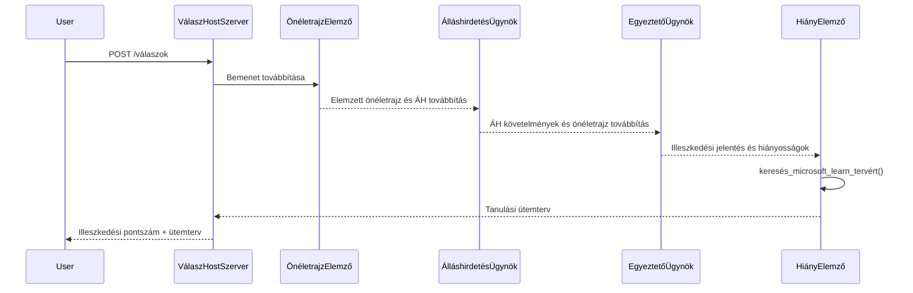

# Modul 3 - Utasítások konfigurálása, környezet és függőségek telepítése

⏱️ ~15 perc

Ebben a modulban az előkészített sablont alakítod át **saját** többügynökös munkafolyamatoddá - környezeti változók beállításával, ügynökök utasításainak megírásával, az MCP eszköz hozzáadásával, a munkafolyamat gráf összekapcsolásával és függőségek telepítésével.

> **Referencia:** A teljes működő kód a [`PersonalCareerCopilot/main.py`](../../../../../workshop/lab02-multi-agent/PersonalCareerCopilot/main.py) fájlban található. Használd referenciaként a saját munkafolyamat gráfod és prompt blokkok építése közben.

---

## Hogyan illeszkednek össze a négy ügynök


```mermaid
sequenceDiagram
    participant User
    participant Server as VálaszHostSzerver
    participant RP as ÖnéletrajzElemző
    participant JD as ÁlláshirdetésÜgynök
    participant MA as EgyeztetőÜgynök
    participant GA as HiányElemző

    User->>Server: POST /válaszok
    Server->>RP: Bemenet továbbítása
    RP-->>JD: Elemzett önéletrajz és ÁH továbbítás
    JD-->>MA: ÁH követelmények és önéletrajz továbbítás
    MA-->>GA: Illeszkedési jelentés és hiányosságok
    GA->>GA: keresés_microsoft_learn_tervért()
    GA-->>Server: Tanulási ütemterv
    Server-->>User: Illeszkedési pontszám + ütemterv
```

---

## 1. lépés: Környezeti változók beállítása

1. Nyisd meg a projekt gyökerében lévő **`.env`** fájlt (a scaffold varázsló hozta létre).
2. Cseréld ki a helyőrzőket a Lab 01-ben kapott valós értékekre.

<details open>
<summary><strong>🅰️ A útvonal - Foundry előfizetés</strong></summary>

```env
FOUNDRY_PROJECT_ENDPOINT=https://<your-account>.services.ai.azure.com/api/projects/<your-project>
AZURE_AI_MODEL_DEPLOYMENT_NAME=gpt-4.1-mini
```

> **Értékek megtalálása:** Lásd [Lab 01, Modul 1](../../lab01-single-agent/docs/01-setup.md#deploy-a-model--assign-rbac).

</details>

<details open>
<summary><strong>🅱️ B útvonal - Foundry helyi</strong></summary>

```env
FOUNDRY_PROJECT_ENDPOINT=http://localhost:5273/v1
AZURE_AI_MODEL_DEPLOYMENT_NAME=phi-4-mini
```

> Az összes inferencia a gépeden fut - az adatok nem hagyják el az eszközödet. Futtasd a `foundry model list` parancsot a pontos modell alias ellenőrzéséhez. Az egyetlen kimenő kérés az MCP eszköz hívása a `https://learn.microsoft.com/api/mcp` felé.

> **Értékek megtalálása:** Lásd [Lab 01, Modul 1 - helyi útvonal](../../lab01-single-agent/docs/01-setup.md#step-2-set-up-based-on-your-access).

</details>

> **Biztonság:** A `.env` fájlt soha ne add hozzá verziókezeléshez. Már benne kell legyen a `.gitignore` fájlban.

---

## 2. lépés: Írd meg az ügynök utasításokat

Az utasítások határozzák meg az ügynök szerepét, kimeneti formátumát és szabályait. Nyisd meg a `main.py`-t, és definiáld (vagy cseréld le) a négy utasítás konstansát - a teljes szövegek a [`PersonalCareerCopilot/main.py`](../../../../../workshop/lab02-multi-agent/PersonalCareerCopilot/main.py) fájlban találhatók.

### 2.1 `RESUME_PARSER_INSTRUCTIONS`
A motivációs levelet strukturált jelöltprofilra bontja **és** szó szerint átmásolja az álláshirdetés szövegét a `[JOB DESCRIPTION PASS-THROUGH]` részbe. Mindkét címkézett szakasznak meg kell jelennie a kimenetben.

> **Miért van szükség a pass-through-ra?** A `context_mode="last_agent"` esetén a ResumeParser az **egyedüli** ügynök, amely látja az eredeti felhasználói üzenetet. Ha nem másolja tovább az álláshirdetést, a későbbi ügynökök sosem látják.

### 2.2 `JOB_DESCRIPTION_INSTRUCTIONS`
Beolvassa a ResumeParser kimenetéből `[PARSED RESUME]` és `[JOB DESCRIPTION PASS-THROUGH]` részeket. Kimenet: `[JD REQUIREMENTS]` (strukturált követelmények) és `[PARSED RESUME PASS-THROUGH]` (szó szerinti önéletrajz másolat a MatchingAgent részére).

### 2.3 `MATCHING_AGENT_INSTRUCTIONS`
Beolvassa a `[JD REQUIREMENTS]` és `[PARSED RESUME PASS-THROUGH]` részeket. Készít egy pontozott illeszkedési jelentést (0–100), amely tartalmazza a lebontó számítást, egyező készségeket, hiányzó készségeket és tapasztalati egyezést.

### 2.4 `GAP_ANALYZER_INSTRUCTIONS`
Beolvassa az illeszkedési jelentést. Minden egyes hiányzó készséghez meghívja a `search_microsoft_learn_for_plan` függvényt a Microsoft Learn tartalmak lekérésére. Készít egy részletes hiányosság kártyát készségenként és heti bontású tanulási ütemtervet.

---

## 3. lépés: Add hozzá az MCP eszközt

A GapAnalyzer a [Microsoft Learn MCP szervert](https://learn.microsoft.com/azure/foundry/agents/how-to/tools/model-context-protocol) hívja meg, hogy valós tananyagokat töltsön be minden egyes készség hiányhoz. A teljes `search_microsoft_learn_for_plan` függvény megtalálható a [`PersonalCareerCopilot/main.py`](../../../../../workshop/lab02-multi-agent/PersonalCareerCopilot/main.py) fájlban.

Regisztráld az eszközt a GapAnalyzerhez az ügynök létrehozásakor:

```python
gap_analyzer = Agent(
    client=client,
    instructions=GAP_ANALYZER_INSTRUCTIONS,
    name="GapAnalyzer",
    tools=[search_microsoft_learn_for_plan],
)
```

> Lásd a teljes `WorkflowBuilder` gráfot a [`PersonalCareerCopilot/main.py`](../../../../../workshop/lab02-multi-agent/PersonalCareerCopilot/main.py) fájlban a `FoundryChatClient`, `AgentExecutor`, és az összes `add_edge()` hívással együtt.

---

## 4. lépés: Virtuális környezet létrehozása és függőségek telepítése

> ⚠️ **Ne hagyd ki ezt a lépést.** Függőségek telepítése nélkül az F5-ös hibakeresés meghiúsul.

### 4.1 Virtuális környezet létrehozása

```powershell
python -m venv .venv
```

### 4.2 Aktiválás

| Operációs rendszer | Parancs |
|----|---------|
| **Windows (PowerShell)** | `.\.venv\Scripts\Activate.ps1` |
| **Windows (CMD)** | `.venv\Scripts\activate.bat` |
| **macOS / Linux** | `source .venv/bin/activate` |

A terminálod promptjában meg kell jelennie a `(.venv)` jelzésnek.

### 4.3 Függőségek telepítése

```powershell
pip install -r requirements.txt
```

### 4.4 Ellenőrzés

```powershell
pip list | Select-String "agent-framework|mcp|debugpy"
```

Elvárt: `agent-framework-foundry`, `agent-framework-foundry-hosting`, `mcp`, és `debugpy` szerepel a listában.

---

## 5. lépés: Hitelesítés ellenőrzése

<details open>
<summary><strong>🅰️ A útvonal - Azure hitelesítő adatok</strong></summary>

```powershell
az account show --query "{name:name, id:id}" --output table
```

Ha ez nem sikerül, futtasd az [`az login`](https://learn.microsoft.com/cli/azure/authenticate-azure-cli-interactively) parancsot.

Mind a négy ügynök egy `FoundryChatClient`-et és egy `DefaultAzureCredential`-t használ. Ha az egyiknél működik a hitelesítés, mindnél működni fog.

</details>

<details open>
<summary><strong>🅱️ B útvonal - Foundry helyi</strong></summary>

Helyi teszteléshez nem szükséges hitelesítés.

</details>

---

### ✅ Ellenőrző pont

> Ne haladj tovább a 04-es Modulra, amíg: **(1)** a `(.venv)` látható a promptban ÉS **(2)** sikeresen lefutott a `pip install -r requirements.txt`.

- [ ] A `.env` érvényes végpontot és modell telepítési nevet tartalmaz (nem helyőrzők)
- [ ] Mind a 4 ügynök utasítás konstans definiálva a `main.py`-ben (ResumeParser, JD Agent, MatchingAgent, GapAnalyzer)
- [ ] A `search_microsoft_learn_for_plan` MCP eszköz definiálva és regisztrálva a GapAnalyzeren
- [ ] `FoundryChatClient` + 4 `Agent` + 4 `AgentExecutor` objektum létrehozva a `main()`-ben
- [ ] A `WorkflowBuilder` helyesen építi fel a szekvenciális gráfot az összes 3 `add_edge()` hívással
- [ ] Virtuális környezet létrehozva és aktiválva (`(.venv)` látható a promptban)
- [ ] A `pip install -r requirements.txt` hibamentesen lefutott
- [ ] **A útvonal:** `az account show` sikeres VAGY a VS Code Fiókok ikonja bejelentkezett fiókot jelez

---

**Előző:** [02 - Többügynökös projekt előkészítése](02-scaffold-multi-agent.md) · **Következő:** [04 - Orkesztrációs minták →](04-orchestration-patterns.md)

---

<!-- CO-OP TRANSLATOR DISCLAIMER START -->
**Jogi nyilatkozat**:
Ez a dokumentum az AI fordítási szolgáltatás, a [Co-op Translator](https://github.com/Azure/co-op-translator) segítségével készült. Bár az pontosságra törekszünk, kérjük, vegye figyelembe, hogy az automatikus fordítások hibákat vagy pontatlanságokat tartalmazhatnak. Az eredeti dokumentum az anyanyelvén tekintendő hiteles forrásnak. Fontos információk esetén professzionális emberi fordítást javasolunk. Nem vállalunk felelősséget semmilyen félreértésért vagy téves értelmezésért, amely ebből a fordításból ered.
<!-- CO-OP TRANSLATOR DISCLAIMER END -->