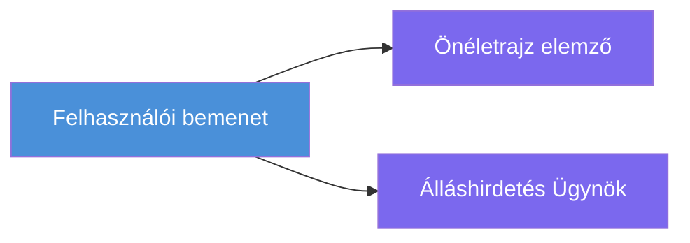
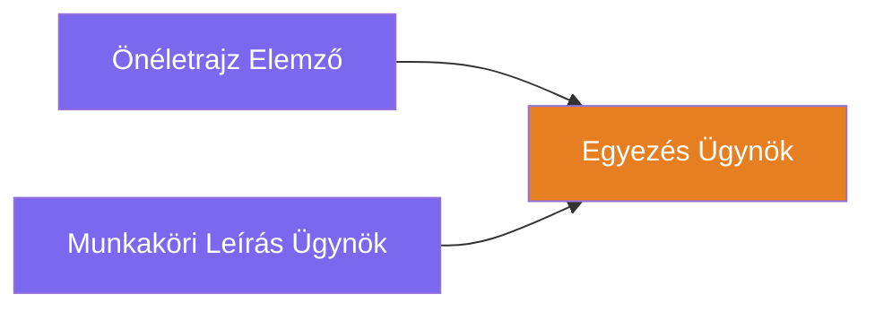
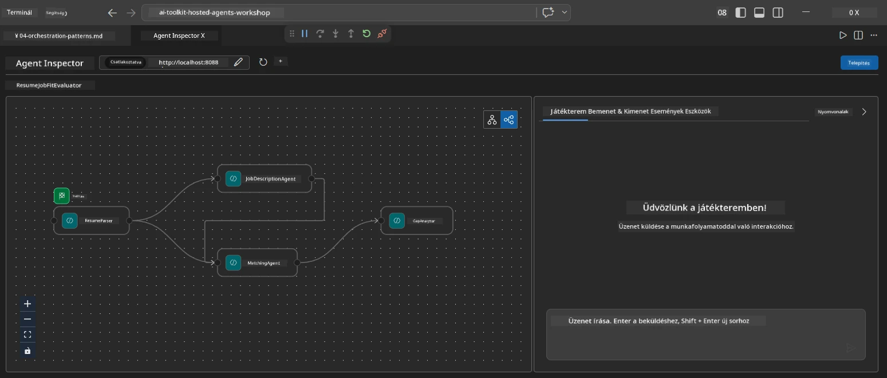
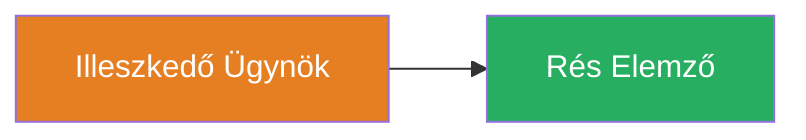
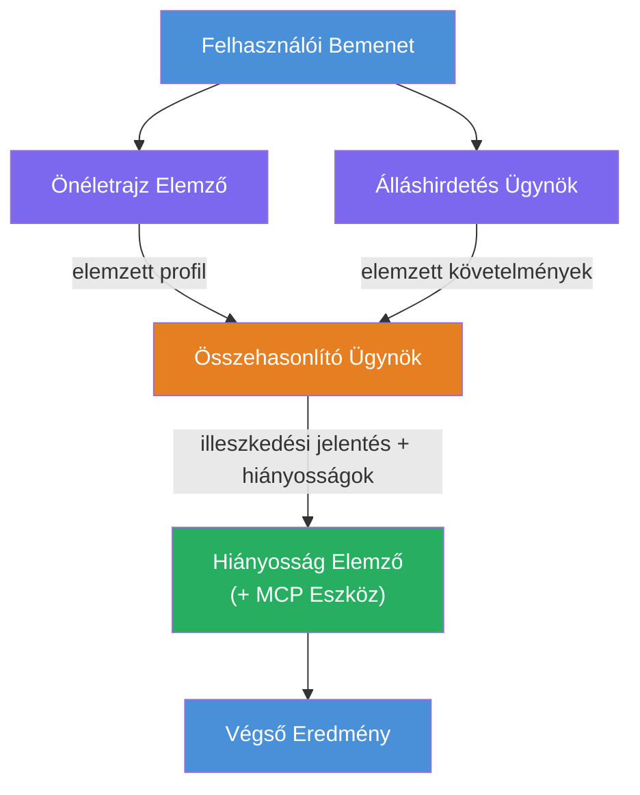
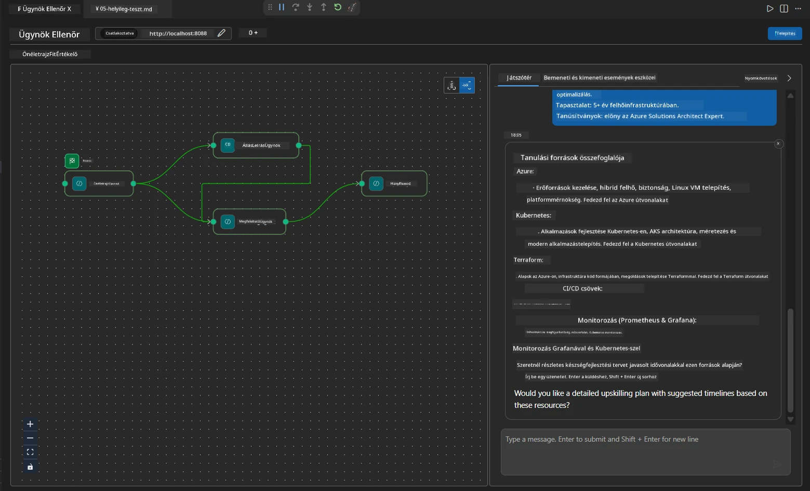

# Modul 4 - Orchestration minták

Ebben a modulban megismered a Resume Job Fit Evaluator által használt orchestration mintákat, valamint megtanulod, hogyan olvass, módosíts és bővítsd a munkafolyamat gráfot. E minták megértése elengedhetetlen az adatfolyam hibáinak hibakereséséhez és saját [többügynökös munkafolyamatok](https://learn.microsoft.com/agent-framework/workflows/) építéséhez.

---

## Minta 1: Fan-out (párhuzamos elágazás)

A munkafolyamat első mintája a **fan-out** – egyetlen bemenet egyszerre több ügynökhöz kerül elküldésre.


Kódban ez így történik, mert a `resume_parser` az a `start_executor` – először ő kapja meg a felhasználói üzenetet. Mivel mind a `jd_agent`, mind a `matching_agent` élekkel rendelkezik a `resume_parser`-től, a keretrendszer elküldi a `resume_parser` kimenetét mindkét ügynöknek:

```python
.add_edge(resume_parser, jd_agent)         # ResumeParser kimenet → JD Agent
.add_edge(resume_parser, matching_agent)   # ResumeParser kimenet → MatchingAgent
```

**Miért működik ez:** A ResumeParser és a JD Agent ugyanannak a bemenetnek különböző aspektusait dolgozzák fel. Párhuzamos futtatásuk csökkenti az összes késleltetést a szekvenciális futtatáshoz képest.

### Mikor használjuk a fan-out mintát

| Használati eset | Példa |
|----------|---------|
| Függőleges alfeladatok | Önéletrajz feldolgozása vs. álláshirdetés feldolgozása |
| Redundancia / szavazás | Két ügynök elemzi ugyanazt az adatot, egy harmadik választja ki a legjobb választ |
| Többformátumú kimenet | Egy ügynök szöveget generál, egy másik strukturált JSON-t |

---

## Minta 2: Fan-in (aggregáció)

A második minta a **fan-in** – több ügynök kimenetét összegyűjtik és egyetlen következő ügynöknek továbbítják.


Kódban:

```python
.add_edge(resume_parser, matching_agent)   # ResumeParser kimenet → MatchingAgent
.add_edge(jd_agent, matching_agent)        # JD Agent kimenet → MatchingAgent
```

**Kulcsfontosságú viselkedés:** Ha egy ügynöknek **két vagy több bejövő éle van**, a keretrendszer automatikusan megvárja, hogy **minden** felfelé irányuló ügynök befejezze a munkáját, mielőtt elindítja a következő ügynököt. A MatchingAgent csak akkor indul el, ha a ResumeParser és a JD Agent is végeztek.

### Amit a MatchingAgent kap

A keretrendszer összefűzi az összes felfelé áramló ügynök kimenetét. A MatchingAgent bemenete így néz ki:

```
[ResumeParser output]
---
Candidate Profile:
  Name: Jane Doe
  Technical Skills: Python, Azure, Kubernetes, ...
  ...

[JobDescriptionAgent output]
---
Role Overview: Senior Cloud Engineer
Required Skills: Python, Azure, Terraform, ...
...
```

> **Megjegyzés:** A pontos összefűzés formátuma a keretrendszer verziójától függ. Az ügynök utasításait úgy kell megírni, hogy kezeljék mind a strukturált, mind a strukturálatlan felsőbb szintű kimenetet.



---

## Minta 3: Szekvenciális lánc

A harmadik minta a **szekvenciális láncolás** – egy ügynök kimenete közvetlenül a következő bemenetévé válik.


Kódban:

```python
.add_edge(matching_agent, gap_analyzer)    # MatchingAgent kimenet → GapAnalyzer
```

Ez a legegyszerűbb minta. A GapAnalyzer megkapja a MatchingAgent illeszkedési pontszámát, az egyező/hiányzó készségeket és a hiányosságokat. Ezután meghívja az [MCP eszközt](https://learn.microsoft.com/azure/foundry/agents/how-to/tools/model-context-protocol) minden hiányossághoz, hogy lekérje a Microsoft Learn forrásokat.

---

## A teljes gráf

A három minta kombinálása adja a teljes munkafolyamatot:


### Végrehajtási idővonal

```mermaid
gantt
    title Ügynök Végrehajtási Idővonal
    dateFormat X
    axisFormat %s

    section Párhuzamos
    Önéletrajz Elemző    :rp, 0, 3
    Álláshirdetés Ügynök :jd, 0, 2

    section Szekvenciális
    Párosító Ügynök      :ma, 3, 5
    Hiányzó Elemző       :ga, 5, 9
```


> A teljes falióra idő körülbelül `max(ResumeParser, JD Agent) + MatchingAgent + GapAnalyzer`. A GapAnalyzer általában a leglassabb, mert több MCP eszközhívást hajt végre (egyet minden hiányosságra).

---

## A WorkflowBuilder kód olvasása

Íme a teljes `create_workflow()` függvény a `main.py`-ból, megjegyzésekkel ellátva:

```python
def create_workflow(resume_parser, jd_agent, matching_agent, gap_analyzer):
    workflow = (
        WorkflowBuilder(
            name="ResumeJobFitEvaluator",

            # Az első ügynök, aki megkapja a felhasználói bemenetet
            start_executor=resume_parser,

            # Az az ügynök vagy ügynökök, akiknek a kimenete válik a végleges válasszá
            output_executors=[gap_analyzer],
        )
        # Szétosztás: A ResumeParser kimenete egyszerre jut el a JD Agenthez és a MatchingAgenthez
        .add_edge(resume_parser, jd_agent)
        .add_edge(resume_parser, matching_agent)

        # Egyesítés: A MatchingAgent mind a ResumeParser, mind a JD Agent kimenetére vár
        .add_edge(jd_agent, matching_agent)

        # Szekvenciális: A MatchingAgent kimenete táplálja a GapAnalyzer-t
        .add_edge(matching_agent, gap_analyzer)

        .build()
    )
    return workflow.as_agent()
```

### Élek összefoglaló táblázata

| # | Él | Minta | Hatás |
|---|------|---------|--------|
| 1 | `resume_parser → jd_agent` | Fan-out | A JD Agent megkapja a ResumeParser kimenetét (plusz az eredeti felhasználói bemenetet) |
| 2 | `resume_parser → matching_agent` | Fan-out | A MatchingAgent megkapja a ResumeParser kimenetét |
| 3 | `jd_agent → matching_agent` | Fan-in | A MatchingAgent megkapja a JD Agent kimenetét is (megvárja mindkettőt) |
| 4 | `matching_agent → gap_analyzer` | Szekvenciális | A GapAnalyzer megkapja a megfelelési jelentést + hiányosság-listát |

---

## A gráf módosítása

### Új ügynök hozzáadása

Ha egy ötödik ügynököt szeretnél hozzáadni (pl. egy **InterviewPrepAgent**, amely a hiányosság elemzése alapján interjúkérdéseket generál):

```python
# 1. Instrukciók meghatározása
INTERVIEW_PREP_INSTRUCTIONS = """\
You are the Interview Prep Agent.
Given a gap analysis and fit report, generate 10 targeted interview questions
the candidate should prepare for.
"""

# 2. Az ügynök létrehozása (az async with blokkban)
AzureAIAgentClient(
    project_endpoint=PROJECT_ENDPOINT,
    model_deployment_name=MODEL_DEPLOYMENT_NAME,
    credential=credential,
).as_agent(
    name="InterviewPrepAgent",
    instructions=INTERVIEW_PREP_INSTRUCTIONS,
) as interview_prep,

# 3. Élek hozzáadása a create_workflow() funkcióban
.add_edge(matching_agent, interview_prep)   # fit jelentést fogad
.add_edge(gap_analyzer, interview_prep)     # hibakártyákat is fogad

# 4. output_executors frissítése
output_executors=[interview_prep],  # most a végső ügynök
```

### A végrehajtási sorrend megváltoztatása

Ha azt akarod, hogy a JD Agent **a ResumeParser után** fusson (szekvenciálisan a párhuzamos helyett):

```python
# Eltávolítás: .add_edge(resume_parser, jd_agent)  ← már létezik, megtartani
# Távolítsd el az implicit párhuzamosságot azáltal, hogy a jd_agent közvetlenül nem kap felhasználói bemenetet
# A start_executor először a resume_parser-nek küld, és a jd_agent csak
# a resume_parser kimenetét kapja az élen keresztül. Ez egymásutánivá teszi őket.
```

> **Fontos:** A `start_executor` az egyetlen ügynök, amely megkapja a nyers felhasználói bemenetet. Minden más ügynök a felfelé vezető élektől kap kimenetet. Ha azt szeretnéd, hogy egy ügynök is megkapja a nyers felhasználói bemenetet, akkor annak éle kell hogy vezessen a `start_executor`-ból.

---

## Gyakori gráfhibák

| Hiba | Tünet | Javítás |
|---------|---------|-----|
| Hiányzó él az `output_executors` felé | Az ügynök fut, de a kimenet üres | Biztosítsd, hogy van útvonal a `start_executor`-ból minden `output_executors`-ban lévő ügynökhöz |
| Körkörös függőség | Végtelen ciklus vagy időkorlát | Ellenőrizd, hogy egyik ügynök sem táplál vissza egy felfelé ágú ügynökhöz |
| Ügynök az `output_executors`-ban bejövő él nélkül | Üres kimenet | Adj hozzá legalább egy `add_edge(source, that_agent)`-et |
| Több `output_executors` fan-in nélkül | A kimenetben csak egy ügynök válasza van | Használj egyetlen aggregáló kimeneti ügynököt, vagy fogadj el több kimenetet |
| Hiányzó `start_executor` | `ValueError` fordításkor | Mindig add meg a `start_executor`-t a `WorkflowBuilder()`-ben |

---

## A gráf hibakeresése

### Agent Inspector használata

1. Indítsd el az ügynököt helyileg (F5 vagy terminál – lásd [Modul 5](05-test-locally.md)).
2. Nyisd meg az Agent Inspectort (`Ctrl+Shift+P` → **Foundry Toolkit: Open Agent Inspector**).
3. Küldj tesztüzenetet.
4. Az Inspector válaszpaneljén keresd a **streaming output**-ot – ez mutatja minden ügynök hozzájárulását sorrendben.



### Naplózás használata

Adj hozzá naplózást a `main.py`-hoz az adatfolyam nyomon követéséhez:

```python
import logging
logger = logging.getLogger("resume-job-fit")

# A create_workflow() függvényben, a létrehozás után:
logger.info("Workflow graph built with edges: RP→JD, RP→MA, JD→MA, MA→GA")
```

A szerver naplók mutatják az ügynök végrehajtási sorrendjét és az MCP eszközhívásokat:

```
INFO:resume-job-fit:Starting Resume -> Job Fit Evaluator HTTP server...
INFO:resume-job-fit:Server running on http://localhost:8088
INFO:agent_framework:Executing agent: ResumeParser
INFO:agent_framework:Executing agent: JobDescriptionAgent
INFO:agent_framework:Waiting for upstream agents: ResumeParser, JobDescriptionAgent
INFO:agent_framework:Executing agent: MatchingAgent
INFO:agent_framework:Executing agent: GapAnalyzer
INFO:agent_framework:Tool call: search_microsoft_learn_for_plan(skill="Kubernetes")
POST https://learn.microsoft.com/api/mcp → 200
INFO:agent_framework:Tool call: search_microsoft_learn_for_plan(skill="Terraform")
POST https://learn.microsoft.com/api/mcp → 200
```

---

### Ellenőrző pont

- [ ] Fel tudod ismerni a három orchestration mintát a munkafolyamatban: fan-out, fan-in és szekvenciális lánc
- [ ] Érted, hogy több bejövő éllel rendelkező ügynök megvárja, hogy minden felfelé ágú ügynök befejezze a munkáját
- [ ] El tudod olvasni a `WorkflowBuilder` kódját és meg tudod határozni, hogy melyik `add_edge()` hívás melyik gráfélt reprezentál
- [ ] Érted a végrehajtási idővonalat: először párhuzamos ügynökök futnak, majd aggregáció, végül szekvenciális
- [ ] Tudod, hogyan adj új ügynököt a gráfhoz (utasítások megírása, ügynök létrehozása, élek hozzáadása, kimenet frissítése)
- [ ] Fel tudod ismerni a gyakori gráfhibákat és tüneteiket

---

**Előző:** [03 - Ügynökök és környezet konfigurálása](03-configure-agents.md) · **Következő:** [05 - Helyi tesztelés →](05-test-locally.md)

---

<!-- CO-OP TRANSLATOR DISCLAIMER START -->
**Jogi nyilatkozat**:
Ezt a dokumentumot az AI fordító szolgáltatás [Co-op Translator](https://github.com/Azure/co-op-translator) használatával fordítottuk le. Bár a pontosságra törekszünk, kérjük, vegye figyelembe, hogy az automatikus fordítások tartalmazhatnak hibákat vagy pontatlanságokat. Az eredeti dokumentum a saját nyelvén tekintendő hivatalos forrásnak. Kritikus információk esetén professzionális emberi fordítást javaslunk. Nem vállalunk felelősséget a fordítás használatából eredő félreértésekért vagy téves értelmezésekért.
<!-- CO-OP TRANSLATOR DISCLAIMER END -->