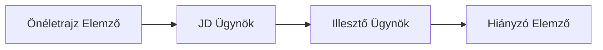
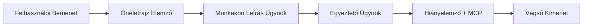

# 4. modul - Orkesztrációs minták

⏱️ ~10 perc

Ebben a modulban felfedezheted az Orkesztrációs mintákat a Resume Job Fit Evaluatorban, és megtanulod, hogyan olvashatod, módosíthatod és bővítheted a munkafolyamat gráfját. Ezeknek a mintáknak a megértése elengedhetetlen az adatfolyam problémák hibakereséséhez és a saját [többügynökös munkafolyamataid](https://learn.microsoft.com/agent-framework/workflows/) létrehozásához.

---

## 1. minta: Szekvenciális lánc

A munkafolyamat alapvető mintája a **szekvenciális lánc** – minden ügynök kimenete közvetlenül a következőhöz kerül.


```mermaid
flowchart LR
    RP[Önéletrajz Elemző] --> JD[JD Ügynök]
    JD --> MA[Illesztő Ügynök]
    MA --> GA[Hiányzó Elemző]
```

Kódban minden `add_edge()` hívás egy lépést hoz létre a láncban:

```python
.add_edge(resume_executor, jd_executor)       # ResumeParser kimenet → JD Agent
.add_edge(jd_executor, matching_executor)     # JD Agent kimenet → MatchingAgent
.add_edge(matching_executor, gap_executor)    # MatchingAgent kimenet → GapAnalyzer
```

> **Miért szekvenciális, nem fan-out/fan-in?** A `WorkflowBuilder` a bejövő éleknél **VAGY-szemantikát** használ: egy downstream végrehajtó indul, amint **bármelyik** elődje befejeződik. Ha a `matching_executor`-nak két bejövő éle lenne (mind a `resume_executor`, mind a `jd_executor` felől), kétszer indulna – egyszer, amikor a ResumeParser befejeződik, és másodszor, amikor a JD Agent befejeződik – így a GapAnalyzer is kétszer futna, és a kimenet kétszer jelenne meg. A szekvenciális csővezeték ezt teljesen elkerüli.

## 2. minta: Tartalom továbbítása

Mivel `context_mode="last_agent"` azt jelenti, hogy minden végrehajtó csak a **közvetlen elődjének kimenetét látja**, a szekvenciális láncban az ügynököknek kifejezetten továbbítaniuk kell azokat az adatokat, amelyeket a downstream ügynökök igényelnek.

Ebben a munkafolyamatban:
- A **ResumeParser** szó szerint átmásolja a JD-t a `[JOB DESCRIPTION PASS-THROUGH]` mezőbe (így a JD Agent megtalálhatja).
- A **JD Agent** szó szerint átmásolja a `[PARSED RESUME]`-t a `[PARSED RESUME PASS-THROUGH]` mezőbe (így a MatchingAgent összehasonlíthatja mindkét profilt).

```
ResumeParser output
└─ [PARSED RESUME]               ← extracted by JD Agent
└─ [JOB DESCRIPTION PASS-THROUGH] ← extracted by JD Agent

JD Agent output
└─ [JD REQUIREMENTS]             ← extracted by MatchingAgent
└─ [PARSED RESUME PASS-THROUGH]  ← extracted by MatchingAgent
```

Minden továbbítandó szakaszt **szó szerint** kell másolni – az összefoglalás vagy átírás megtöri a downstream ügynök működését, amely attól függ.

---

## A teljes gráf

A szekvenciális lánc és a tartalom továbbítása minták kombinálásával születik meg a teljes munkafolyamat:


```mermaid
flowchart LR
    U[Felhasználói Bemenet] --> RP[Önéletrajz Elemző]
    RP --> JD[Munkaköri Leírás Ügynök]
    JD --> MA[Egyeztető Ügynök]
    MA --> GA[Hiányelemző + MCP]
    GA --> O[Végső Kimenet]
```

Az Agent Inspector ugyanezt a gráfszerkezetet mutatja, amikor az ügynök helyileg fut. Lásd a [5. modul - Helyi tesztelés](05-test-locally.md) képernyőképeit.

---

## A WorkflowBuilder kód olvasása

A teljes `create_workflow()` függvény a [`PersonalCareerCopilot/main.py`](../../../../../workshop/lab02-multi-agent/PersonalCareerCopilot/main.py) fájlban található. A három `add_edge()` hívás felépíti a szekvenciális csővezetéket:

| # | Él | Hatás |
|---|------|--------|
| 1 | `resume_executor → jd_executor` | A JD Agent megkapja a `[PARSED RESUME]` + `[JOB DESCRIPTION PASS-THROUGH]` adatokat |
| 2 | `jd_executor → matching_executor` | A MatchingAgent megkapja a `[JD REQUIREMENTS]` + `[PARSED RESUME PASS-THROUGH]` adatokat |
| 3 | `matching_executor → gap_executor` | A GapAnalyzer megkapja a fit riportot + a hiánysorozatot |

---

## A gráf módosítása

### Új ügynök hozzáadása

Ha egy ötödik ügynököt szeretnénk hozzáadni (például egy **InterviewPrepAgent**-et a GapAnalyzer után):

1. Definiálj egy `INTERVIEW_PREP_INSTRUCTIONS` konstans értéket.
2. Hozz létre `Agent` + `AgentExecutor` objektumokat (azonos mintázattal, mint a meglévő négy).
3. Adj hozzá `.add_edge(gap_executor, interview_exec)` hívást a `WorkflowBuilder`-hez.
4. Frissítsd az `output_executors=[interview_exec]` beállítást.

> **Fontos:** A `start_executor` az egyetlen ügynök, amely nyers felhasználói bemenetet kap. Minden más ügynök az upstream élből kapott kimenetet dolgozza fel.

---

## Gyakori gráb hibák

| Hiba | Tünet | Javítás |
|---------|---------|-----|
| Hiányzó él az `output_executors` felé | Az ügynök lefut, de a kimenet üres | Győződj meg arról, hogy vezet út a `start_executor`-tól minden `output_executors` ügynökig |
| Körkörös függőség | Végtelen ciklus vagy időtúllépés | Ellenőrizd, hogy egyik ügynök sem táplál vissza egy upstream ügynökbe |
| `output_executors`-ban lévő ügynök bejövő él nélkül | Üres kimenet | Adj legalább egy `add_edge(forrás, az_ügynök)` hívást |
| Több `output_executors` végrehajtó fan-in nélkül | A kimenet csak egy ügynök válaszát tartalmazza | Használj egyetlen kimeneti ügynököt, amely összegzi, vagy fogadj több kimenetet |
| Hiányzó `start_executor` | `ValueError` építéskor | Mindig add meg a `start_executor`-t a `WorkflowBuilder()`-ben |

---

## A gráf hibakeresése

### Agent Inspector használata

1. Indítsd el az ügynököt helyileg F5-tel.
2. Nyisd meg az Agent Inspectort (`Ctrl+Shift+P` → **Foundry Toolkit: Open Agent Inspector**).
3. Küldj egy teszt üzenetet.
4. Az Inspector válaszüzenet paneljén keresd a **streaming kimenetet** - ez sorrendben mutatja az egyes ügynökök hozzájárulását.


### Naplózás használata

Adj hozzá naplózást a `main.py`-hez az adatfolyam követéséhez:

```python
import logging
logger = logging.getLogger("resume-job-fit")

# A main()-ban, a munkafolyamat felépítése után:
logger.info("Workflow graph built with edges: RP→JD, JD→MA, MA→GA")
```

A szerver naplók mutatják az ügynökök végrehajtási sorrendjét és az MCP eszköz hívásokat:

```
INFO:agent_framework:Executing agent: ResumeParser
INFO:agent_framework:Executing agent: JobDescriptionAgent
INFO:agent_framework:Executing agent: MatchingAgent
INFO:agent_framework:Executing agent: GapAnalyzer
INFO:agent_framework:Tool call: search_microsoft_learn_for_plan(skill="Kubernetes")
POST https://learn.microsoft.com/api/mcp → 200
INFO:agent_framework:Tool call: search_microsoft_learn_for_plan(skill="Terraform")
POST https://learn.microsoft.com/api/mcp → 200
```

---

### Ellenőrzőpont

- [ ] Képes vagy felismerni a két orkesztrációs mintát a munkafolyamatban: szekvenciális lánc és tartalom továbbítása
- [ ] Megérted, hogy miért kell `context_mode="last_agent"` esetén kifejezetten továbbítani az adatokat az ügynökök között
- [ ] El tudod olvasni a `WorkflowBuilder` kódját, és össze tudod kapcsolni minden `add_edge()` hívást a vizuális gráffal
- [ ] Tudod, hogyan adj hozzá egy új ügynököt a csővezeték végéhez
- [ ] Fel tudod ismerni a gyakori gráf hibákat és azok tüneteit

---

**Előző:** [03 - Ügynökök és környezet konfigurálása](03-configure-agents.md) · **Következő:** [05 - Helyi tesztelés →](05-test-locally.md)

---

<!-- CO-OP TRANSLATOR DISCLAIMER START -->
**Jogi nyilatkozat**:
Ez a dokumentum az AI fordítási szolgáltatás, a [Co-op Translator](https://github.com/Azure/co-op-translator) segítségével készült. Bár az pontosságra törekszünk, kérjük, vegye figyelembe, hogy az automatikus fordítások hibákat vagy pontatlanságokat tartalmazhatnak. Az eredeti dokumentum az anyanyelvén tekintendő hiteles forrásnak. Fontos információk esetén professzionális emberi fordítást javasolunk. Nem vállalunk felelősséget semmilyen félreértésért vagy téves értelmezésért, amely ebből a fordításból ered.
<!-- CO-OP TRANSLATOR DISCLAIMER END -->