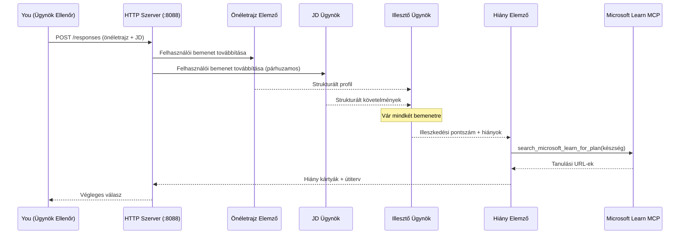
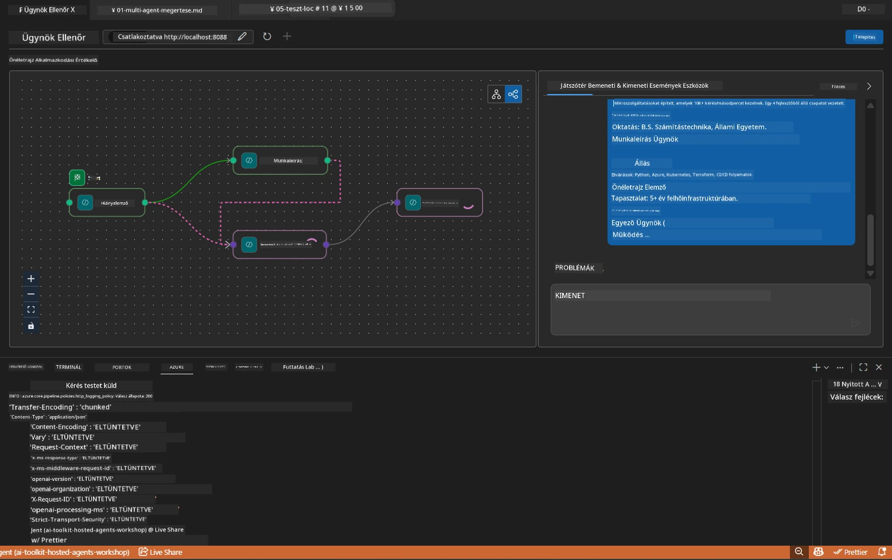

# Modul 5 - Helyi tesztelés (Többügynökös)

Ebben a modulban helyben futtatod a többügynökös munkafolyamatot, teszteled az Agent Inspectorral, és ellenőrzöd, hogy mind a négy ügynök és az MCP eszköz helyesen működik-e, mielőtt a Foundryba telepítenéd.

### Mi történik a helyi tesztfutás során


---

## 1. lépés: Az ügynök szerver elindítása

### A lehetőség: VS Code feladat használata (ajánlott)

1. Nyomd meg a `Ctrl+Shift+P` → gépeld be a **Tasks: Run Task** parancsot → válaszd a **Run Lab02 HTTP Server** opciót.
2. A feladat elindítja a szervert debugpy-vel a `5679` porton, az ügynök pedig a `8088` porton fut.
3. Várd meg, amíg a kimenet megjeleníti ezt:

```
INFO:resume-job-fit:Starting Resume -> Job Fit Evaluator HTTP server...
INFO:resume-job-fit:Server running on http://localhost:8088
```

### B lehetőség: Terminálból kézzel

```powershell
cd workshop\lab02-multi-agent\PersonalCareerCopilot
```

Aktiváld a virtuális környezetet:

**PowerShell (Windows):**
```powershell
.\.venv\Scripts\Activate.ps1
```

**macOS/Linux:**
```bash
source .venv/bin/activate
```

Indítsd el a szervert:

```powershell
python -m debugpy --listen 127.0.0.1:5679 -m agentdev run main.py --verbose --port 8088
```

### C lehetőség: F5 (debug módban)

1. Nyomd meg az `F5`-öt vagy menj a **Run and Debug** (Ctrl+Shift+D) nézetre.
2. Válaszd ki a lenyíló menüből a **Lab02 - Multi-Agent** indítási konfigurációt.
3. A szerver teljes töréspont támogatással indul.

> **Tipp:** A debug mód lehetővé teszi, hogy töréspontokat állíts be a `search_microsoft_learn_for_plan()` függvényen belül, hogy vizsgáld az MCP válaszokat, vagy az ügynöki utasításokban, hogy lásd, mihez jut minden ügynök.

---

## 2. lépés: Agent Inspector megnyitása

1. Nyomd meg a `Ctrl+Shift+P` → gépeld be, hogy **Foundry Toolkit: Open Agent Inspector**.
2. Az Agent Inspector megnyílik a böngésző egy lapján a `http://localhost:5679` címen.
3. Az ügynök felületét kell látnod, amely készen áll az üzenetek fogadására.

> **Ha az Agent Inspector nem nyílik meg:** Győződj meg róla, hogy a szerver teljesen elindult (lásd a "Server running" logot). Ha a 5679-es port foglalt, nézd meg a [8. modul - Hibaelhárítás](08-troubleshooting.md) részt.

---

## 3. lépés: Smoke tesztek futtatása

Ez a három teszt sorrendben fusson le. Mindegyik egyre több részt vizsgál a munkafolyamatban.

### 1. teszt: Alap önéletrajz + munkaköri leírás

Illeszd be a következőt az Agent Inspectorba:

```
Resume:
Jane Doe
Senior Software Engineer with 5 years of experience in Python, Django, and AWS.
Built microservices handling 10K+ requests/second. Led a team of 4 developers.
Certifications: AWS Solutions Architect Associate.
Education: B.S. Computer Science, State University.

Job Description:
Senior Cloud Engineer at Contoso Ltd.
Required: Python, Azure, Kubernetes, Terraform, CI/CD pipelines.
Preferred: Go, monitoring (Prometheus/Grafana), cost optimization.
Experience: 5+ years in cloud infrastructure.
Certifications: Azure Solutions Architect Expert preferred.
```

**Várt kimenet felépítés:**

A válasznak a négy ügynök kimenetét kell sorrendben tartalmaznia:

1. **Önéletrajz elemző kimenete** - struktúrált jelöltprofil kategóriákba csoportosított készségekkel
2. **JD ügynök kimenete** - strukturált követelmények, elvárt és előnyös készségek elkülönítve
3. **Matching ügynök kimenete** - illeszkedési pontszám (0-100) részletezéssel, illesztett készségek, hiányzó készségek, különbségek
4. **Gap Analyzer kimenete** - egyéni hiányosságkártyák minden hiányzó készséghez Microsoft Learn URL-ekkel



### Mit ellenőrizzünk az 1. tesztben

| Ellenőrzés | Várt eredmény | Átment? |
|------------|---------------|---------|
| A válasz tartalmaz illeszkedési pontszámot | 0-100 között szám részletezéssel | |
| Illesztett készségek felsorolva | Python, CI/CD (részleges), stb. | |
| Hiányzó készségek felsorolva | Azure, Kubernetes, Terraform, stb. | |
| Hiányosságkártyák minden hiányzó készséghez | Egy kártya/készség | |
| Microsoft Learn URL-ek jelen vannak | Valódi `learn.microsoft.com` linkek | |
| Nincs hibaüzenet a válaszban | Tiszta, strukturált kimenet | |

### 2. teszt: MCP eszköz futtatásának ellenőrzése

Az 1. teszt futása közben nézd meg a **szerver terminált** MCP naplóbejegyzések miatt:

```
GET https://learn.microsoft.com/api/mcp → 405 (Method Not Allowed)
POST https://learn.microsoft.com/api/mcp → 200
DELETE https://learn.microsoft.com/api/mcp → 405 (Method Not Allowed)
```

| Napló bejegyzés | Jelentés | Várt? |
|-----------------|----------|-------|
| `GET ... → 405` | MCP kliens GET próbálkozás inicializáció során | Igen - normális |
| `POST ... → 200` | Valódi eszköz hívás a Microsoft Learn MCP szerverre | Igen - ez a tényleges hívás |
| `DELETE ... → 405` | MCP kliens DELETE próbálkozás lezáráskor | Igen - normális |
| `POST ... → 4xx/5xx` | Eszköz hívás hibás | Nem - lásd [Hibaelhárítás](08-troubleshooting.md) |

> **Fontos:** A `GET 405` és `DELETE 405` sorok **elvárt működés**. Csak a `POST` hívások nem 200-as válasza esetén kell aggódni.

### 3. teszt: Szélsőséges eset - magas illeszkedésű jelölt

Illessz be egy önéletrajzot, amely szorosan illeszkedik a JD-hez, hogy ellenőrizd, a GapAnalyzer hogyan kezeli a magas pontszámú helyzeteket:

```
Resume:
Alex Chen
Senior Cloud Engineer with 7 years of experience.
Skills: Python, Azure (AKS, Functions, DevOps), Kubernetes, Terraform, CI/CD (GitHub Actions, Azure Pipelines), Go, Prometheus, Grafana, cost optimization.
Certifications: Azure Solutions Architect Expert, Azure DevOps Engineer Expert.
Led infrastructure migration to Azure for 3 enterprise clients.
Education: M.S. Computer Science, Tech University.

Job Description:
Senior Cloud Engineer at Contoso Ltd.
Required: Python, Azure, Kubernetes, Terraform, CI/CD pipelines.
Preferred: Go, monitoring (Prometheus/Grafana), cost optimization.
Experience: 5+ years in cloud infrastructure.
Certifications: Azure Solutions Architect Expert preferred.
```

**Várt viselkedés:**
- Illeszkedési pontszám legyen **80+** (a legtöbb készség illeszkedik)
- A hiányosságkártyák inkább a csiszolásra/interjúra felkészítésre fókuszálnak az alapozó tudás helyett
- A GapAnalyzer utasításai így szólnak: "Ha az illeszkedés >= 80, a csiszolás/interjúra való felkészítés legyen a fókusz"

---

## 4. lépés: A kimenet teljességének ellenőrzése

A tesztek lefuttatása után ellenőrizd, hogy a kimenet megfelel-e az alábbi kritériumoknak:

### Kimenet felépítésének ellenőrzőlista

| Rész | Ügynök | Jelen van? |
|------|--------|------------|
| Jelöltprofil | Önéletrajz elemző | |
| Műszaki készségek (csoportosítva) | Önéletrajz elemző | |
| Szerep áttekintése | JD ügynök | |
| Kötelező vs. előnyös készségek | JD ügynök | |
| Illeszkedési pontszám részletezéssel | Matching ügynök | |
| Illesztett / hiányzó / részleges készségek | Matching ügynök | |
| Hiányosságkártya minden hiányzó készséghez | Gap Analyzer | |
| Microsoft Learn URL-ek a hiányosságkártyákban | Gap Analyzer (MCP) | |
| Tanulási sorrend (számozva) | Gap Analyzer | |
| Idővonal összefoglaló | Gap Analyzer | |

### Gyakori problémák ezen a ponton

| Probléma | Ok | Megoldás |
|----------|----|----------|
| Csak 1 hiányosságkártya van (a többi le van vágva) | Hiányzik a CRITIKUS blokk a GapAnalyzer utasításokból | Add hozzá a `CRITICAL:` bekezdést a `GAP_ANALYZER_INSTRUCTIONS`-hoz - lásd [3. modul](03-configure-agents.md) |
| Nincsenek Microsoft Learn URL-ek | MCP végpont nem elérhető | Ellenőrizd az internetkapcsolatot. Győződj meg, hogy a `.env` fájlban a `MICROSOFT_LEARN_MCP_ENDPOINT` értéke `https://learn.microsoft.com/api/mcp` |
| Üres válasz | `PROJECT_ENDPOINT` vagy `MODEL_DEPLOYMENT_NAME` nincs beállítva | Ellenőrizd a `.env` fájl értékeit. Futtasd a terminálban az `echo $env:PROJECT_ENDPOINT` parancsot |
| Illeszkedési pontszám 0 vagy hiányzik | A MatchingAgent nem kapott adatot a forrástól | Ellenőrizd, hogy a `create_workflow()` tartalmazza az `add_edge(resume_parser, matching_agent)` és `add_edge(jd_agent, matching_agent)` kapcsolatokat |
| Az ügynök elindul, de azonnal leáll | Import hiba vagy hiányzó függőség | Futass újra `pip install -r requirements.txt` parancsot. Nézd meg a terminált hibaüzenetekért |
| `validate_configuration` hiba | Hiányzó környezeti változók | Hozz létre `.env` fájlt a `PROJECT_ENDPOINT=<your-endpoint>` és `MODEL_DEPLOYMENT_NAME=<your-model>` értékekkel |

---

## 5. lépés: Tesztelés saját adatokkal (opcionális)

Próbáld ki, hogy beillesztesz egy saját önéletrajzot és egy valós munkaköri leírást. Ez segít ellenőrizni:

- Az ügynökök kezelik a különböző önéletrajz formátumokat (időrendi, funkcionális, hibrid)
- A JD ügynök kezeli a különféle JD stílusokat (felsorolás, bekezdések, strukturált)
- Az MCP eszköz releváns forrásokat ad vissza valódi készségekhez
- A hiányosságkártyák személyre szabottak a te egyéni hátteredhez

> **Adatvédelmi megjegyzés:** Helyi teszteléskor az adataid a gépeden maradnak, és csak az Azure OpenAI telepítésed felé küldi el őket. A workshop infrastruktúrája nem naplózza vagy tárolja azokat. Használhatsz helykitöltő neveket, ha szeretnéd (pl. "Jane Doe" a valós neved helyett).

---

### Állomás

- [ ] A szerver sikeresen elindult a `8088` porton (a naplóban megjelenik a "Server running" üzenet)
- [ ] Agent Inspector megnyílt és csatlakozott az ügynökhöz
- [ ] 1. teszt: Teljes válasz illeszkedési pontszámmal, illesztett/hiányzó készségekkel, hiányosságkártyákkal és Microsoft Learn URL-ekkel
- [ ] 2. teszt: MCP naplók mutatják a `POST ... → 200` sorokat (az eszköz hívások sikeresek)
- [ ] 3. teszt: Magas illeszkedésű jelölt 80+ pontszámot kap csiszolásra fókuszáló ajánlásokkal
- [ ] Minden hiányosságkártya jelen van (egy kártya minden hiányzó készséghez, nincs levágva)
- [ ] Nincsenek hibák vagy stack trace-ek a szerver terminálban

---

**Előző:** [04 - Szolgáltatás-orchestration minták](04-orchestration-patterns.md) · **Következő:** [06 - Telepítés a Foundryba →](06-deploy-to-foundry.md)

---

<!-- CO-OP TRANSLATOR DISCLAIMER START -->
**Felelősségkizárás**:  
Ezt a dokumentumot az AI fordító szolgáltatás, a [Co-op Translator](https://github.com/Azure/co-op-translator) használatával fordítottuk. Bár igyekszünk a pontosságra, kérjük, vegye figyelembe, hogy az automatikus fordítások tartalmazhatnak hibákat vagy pontatlanságokat. Az eredeti dokumentum anyanyelvű változata tekintendő hiteles forrásnak. Kritikus információk esetén professzionális emberi fordítást javasolunk. Nem vállalunk felelősséget a fordítás használatából eredő félreértésekért vagy félreértelmezésekért.
<!-- CO-OP TRANSLATOR DISCLAIMER END -->