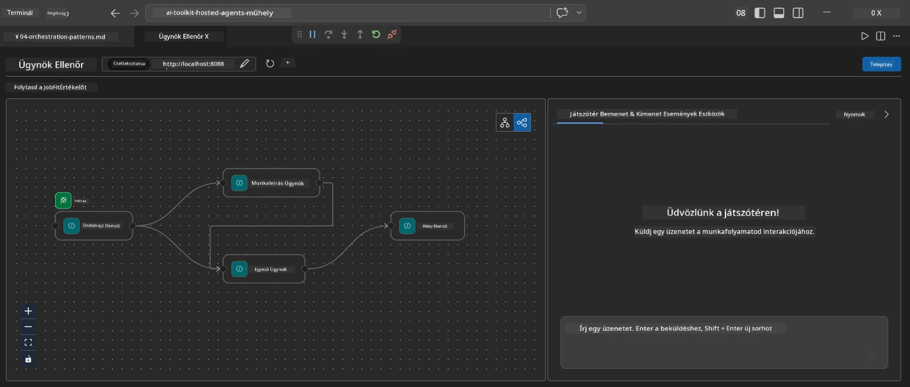
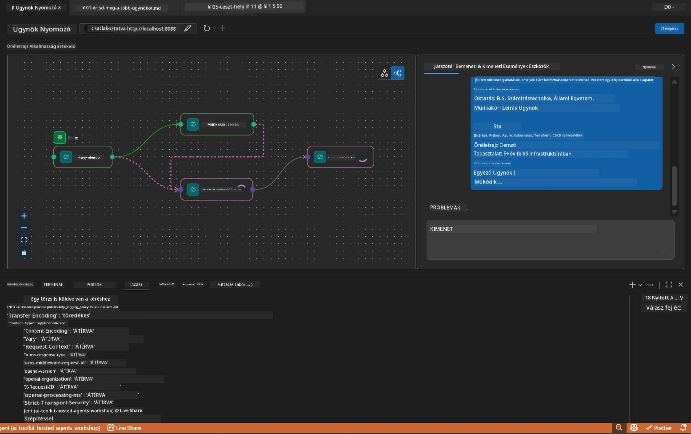
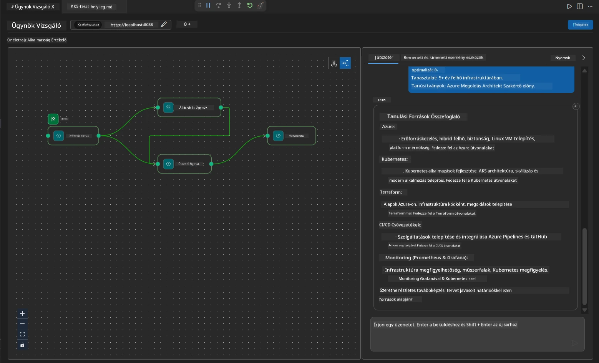

# 5. modul – Helyi tesztelés

⏱️ ~15 perc

Ebben a modulban helyben futtatod a többügynökös munkafolyamatot, teszteled az Agent Inspectort, és ellenőrzöd, hogy mind a négy ügynök és az MCP eszköz helyesen működik-e a telepítés előtt.

---

## 1. lépés: Indítsd el az ügynök szervert

### A lehetőség: VS Code feladat használata (ajánlott)

1. Nyisd meg a `workshop/lab02-multi-agent/PersonalCareerCopilot/` mappát VS Code könyvtárként.
2. Nyomd meg a `Ctrl+Shift+P` → írd be **Tasks: Run Task** → válaszd ki a **Run Agent HTTP Server**-t.
3. A feladat elindítja a szervert a debugpy csatlakoztatásával a `5679` porton, és az ügynököt a `8088` porton.
4. Várj, amíg a kimenet megjeleníti:

```
INFO:resume-job-fit:Starting Resume -> Job Fit Evaluator HTTP server...
INFO:resume-job-fit:Server running on http://localhost:8088
```

### B lehetőség: F5 használata (debug mód)

1. Nyomd meg az `F5` gombot → válaszd a **Debug Local Agent HTTP Server**-t.
2. A szerver teljes töréspont támogatással indul – hasznos az MCP válaszok vagy az ügynök kimenetek vizsgálatához.

---

## 2. lépés: Nyisd meg az Agent Inspectort

1. Nyomd meg a `Ctrl+Shift+P` → írd be **Foundry Toolkit: Open Agent Inspector**.
2. Az Agent Inspector megnyílik egy VS Code panelként, amely a `http://localhost:8088`-hez csatlakozik.
3. Látnod kell az ügynök felületet, készen az üzenetek fogadására.



> **Ha az Agent Inspector nem nyílik meg:** Győződj meg róla, hogy a szerver teljesen elindult (látod a "Server running" naplót). Ha a 5679-es port foglalt, lásd [8. modul – Hibakeresés](08-troubleshooting.md).

---

## 2b. lépés: (Opcionális) Nyisd meg a Workflow Visualizert

A Foundry Toolkit tartalmaz egy valós idejű **Workflow Visualizer**-t, amely megmutatja, hogyan lépnek interakcióba az ügynökök a gráf végrehajtása közben. Ez különösen hasznos a többügynökös hibakereséshez.

1. Nyomd meg a `Ctrl+Shift+P` → írd be **Foundry Toolkit: Open Visualizer for Hosted Agents**.
2. Egy új VS Code fül nyílik meg, amely a végrehajtás élő gráfját mutatja.
3. Amint üzeneteket küldesz az Agent Inspectorban, a visualizer automatikusan frissül – a zöld csomópontok a befejezett ügynököket jelzik, az animált élek pedig az adatok áramlását mutatják közöttük.

> **Portütközés:** Ha a visualizer port már foglalt, módosítsd a VS Code beállításaiban → **Extensions** → **Microsoft Foundry Configuration** → **Hosted Agents: Visualizer Port**.

---

## 3. lépés: Futtasd a smoke teszteket

Futtasd le ezt a három tesztet sorrendben. Mindegyik egyre több részt vizsgál a munkafolyamatból.

### Teszt 1: Alap önéletrajz + álláshirdetés

Illeszd be az alábbi szöveget az Agent Inspectorba:

```
Resume:
Jane Doe
Senior Software Engineer with 5 years of experience in Python, Django, and AWS.
Built microservices handling 10K+ requests/second. Led a team of 4 developers.
Certifications: AWS Solutions Architect Associate.
Education: B.S. Computer Science, State University.

Job Description:
Senior Cloud Engineer at Contoso Ltd.
Required: Python, Azure, Kubernetes, Terraform, CI/CD pipelines.
Preferred: Go, monitoring (Prometheus/Grafana), cost optimization.
Experience: 5+ years in cloud infrastructure.
Certifications: Azure Solutions Architect Expert preferred.
```

**Várt kimeneti struktúra:**

A válasznak sorban kell tartalmaznia a négy ügynök kimenetét:

1. **Önéletrajz elemző kimenete** – Két címkézett szekció: `[PARSED RESUME]` (jelölt profil csoportosított készségekkel) és `[JOB DESCRIPTION PASS-THROUGH]` (szó szerint vett álláshirdetés szöveg, ami a JD Agentnek szól)
2. **JD Agent kimenete** – Strukturált követelmények elkülönített szükséges és előnyös készségekkel
3. **Matching Agent kimenete** – Illeszkedési pontszám (0-100) bontással, egyező készségek, hiányzó készségek, hiányosságok
4. **Gap Analyzer kimenete** – Egyedi hiányosság kártyák minden hiányzó készséghez, Microsoft Learn URL-ekkel





### Amit a 1. tesztben ellenőrizz

| Ellenőrzés | Elvárt | Rendben? |
|-------|----------|-------|
| A válasz tartalmaz illeszkedési pontszámot | 0-100 közötti szám bontással | |
| Az egyező készségek listázva vannak | Python, CI/CD (részleges), stb. | |
| A hiányzó készségek listázva vannak | Azure, Kubernetes, Terraform, stb. | |
| Minden hiányzó készséghez van hiányosság kártya | Egy kártya készségenként | |
| Microsoft Learn URL-ek szerepelnek | Valódi `learn.microsoft.com` linkek | |
| Nincs hibajelzés a válaszban | Tiszta, strukturált kimenet | |

### Teszt 2: Szélső eset – magas pontszámú jelölt

Illessz be egy olyan önéletrajzot, amely közel áll az álláshirdetéshez, hogy ellenőrizd, a GapAnalyzer hogyan kezeli a magas pontszámú eseteket:

```
Resume:
Alex Chen
Senior Cloud Engineer with 7 years of experience.
Skills: Python, Azure (AKS, Functions, DevOps), Kubernetes, Terraform, CI/CD (GitHub Actions, Azure Pipelines), Go, Prometheus, Grafana, cost optimization.
Certifications: Azure Solutions Architect Expert, Azure DevOps Engineer Expert.
Led infrastructure migration to Azure for 3 enterprise clients.
Education: M.S. Computer Science, Tech University.

Job Description:
Senior Cloud Engineer at Contoso Ltd.
Required: Python, Azure, Kubernetes, Terraform, CI/CD pipelines.
Preferred: Go, monitoring (Prometheus/Grafana), cost optimization.
Experience: 5+ years in cloud infrastructure.
Certifications: Azure Solutions Architect Expert preferred.
```

**Várt viselkedés:**
- Az illeszkedési pontszámnak **80+** kell lennie (a legtöbb készség egyezik)
- A hiányosság kártyáknak inkább a csiszolásra/interjúra való felkészülésre kell koncentrálniuk, nem az alapvető tanulásra
- A GapAnalyzer utasításai között szerepel: "Ha fit >= 80, fókuszálj a csiszolásra/interjúra való felkészülésre"

---

## 4. lépés: Teszteld a saját adataiddal (opcionális)

Próbáld meg beilleszteni a saját önéletrajzodat és egy valós álláshirdetést. Ez segít ellenőrizni:

- Az ügynökök kezelik a különböző önéletrajz formátumokat (időrendi, funkcionális, hibrid)
- A JD Agent különböző álláshirdetés stílusokat kezel (felsorolás, bekezdések, strukturált)
- Az MCP eszköz releváns erőforrásokat ad valós készségekhez
- A hiányosság kártyák személyre szabottak a te háttéredhez

> **Adatvédelem - A út (Foundry felhő):** Az önéletrajz és az álláshirdetés szövege az Azure OpenAI példányodnak megy ki feldolgozásra. Nem naplózza vagy tárolja a workshop infrastruktúra. Használj helyettesítő neveket (pl. „Jane Doe”), ha szeretnéd.
>
> **Adatvédelem - B út (Foundry helyi):** Mind a négy ügynök elemzése kizárólag a te eszközödön fut. Az önéletrajzod és az álláshirdetés szövege **soha nem hagyja el a gépedet**. Az egyetlen kimenő hívás az MCP eszköz erőforrásokat kér a `https://learn.microsoft.com/api/mcp` címen; ez a lekérdezés csak a készség nevét tartalmazza, nem a személyes adataidat.

---

### Ellenőrzőpont

- [ ] A szerver sikeresen elindult a `8088` porton (naplóban "Server running" látható)
- [ ] Az Agent Inspector megnyílt és csatlakozott az ügynökhöz
- [ ] 1. teszt: Teljes válasz illeszkedési pontszámmal, egyező/hiányzó készségekkel, hiányosság kártyákkal és Microsoft Learn URL-ekkel
- [ ] 2. teszt: Magas pontszámú jelölt 80+ ponttal, csiszolásra fókuszáló ajánlásokkal
- [ ] Minden hiányosság kártya megvan (egy kártya hiányzó készségenként, nincs levágva)
- [ ] Nincs hiba vagy stack trace a szerver terminálban

---

**Előző:** [04 - Orkesztrációs minták](04-orchestration-patterns.md) · **Következő:** [06 - Telepítés a Foundryba →](06-deploy-to-foundry.md)

---

<!-- CO-OP TRANSLATOR DISCLAIMER START -->
**Jogi nyilatkozat**:
Ez a dokumentum az AI fordítási szolgáltatás, a [Co-op Translator](https://github.com/Azure/co-op-translator) segítségével készült. Bár az pontosságra törekszünk, kérjük, vegye figyelembe, hogy az automatikus fordítások hibákat vagy pontatlanságokat tartalmazhatnak. Az eredeti dokumentum az anyanyelvén tekintendő hiteles forrásnak. Fontos információk esetén professzionális emberi fordítást javasolunk. Nem vállalunk felelősséget semmilyen félreértésért vagy téves értelmezésért, amely ebből a fordításból ered.
<!-- CO-OP TRANSLATOR DISCLAIMER END -->