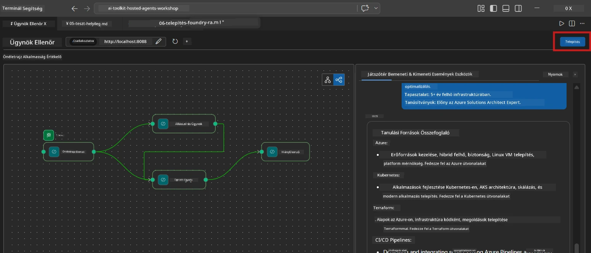
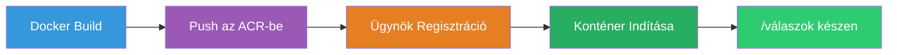
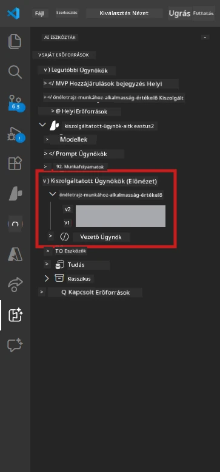

# 6. modul - Telepítés a Foundry Agent Service-ben

Ebben a modulban a helyileg tesztelt többügynökös munkafolyamatodat a [Microsoft Foundry](https://learn.microsoft.com/azure/foundry/agents/concepts/hosted-agents) platformra, mint **Hosted Agent** (Tárgyalt ügynök) telepíted. A telepítési folyamat egy Docker konténerképet épít, amelyet azután feltölt az [Azure Container Registry-be (ACR)](https://learn.microsoft.com/azure/container-registry/container-registry-intro), majd létrehoz egy tárgyalt ügynök verziót a [Foundry Agent Service-ben](https://learn.microsoft.com/azure/foundry/agents/how-to/publish-agent).

> **Fő különbség a 01-es laborhoz képest:** A telepítési folyamat azonos. A Foundry a többügynökös munkafolyamatodat egyetlen tárgyalt ügynökként kezeli – a bonyolultság a konténer belsejében van, de a telepítési felület ugyanaz, a `/responses` végpont.

---

## Előfeltételek ellenőrzése

A telepítés előtt ellenőrizd az alábbiakat:

1. **Az ügynök helyi smoke tesztjei sikeresek:**
   - Elvégezted az összes 3 tesztet a [5. modulban](05-test-locally.md), és a munkafolyamat teljes kimenetet adott GAP kártyákkal és Microsoft Learn URL-ekkel.

2. **Rendelkezel az [Azure AI User](https://learn.microsoft.com/azure/foundry/concepts/rbac-foundry) szerepkörrel:**
   - A [01-es labor 2. moduljában](../../lab01-single-agent/docs/02-create-foundry-project.md) került hozzárendelésre. Ellenőrizd:
   - [Azure Portal](https://portal.azure.com) → a Foundry **projekt** erőforrás → **Hozzáférés-vezérlés (IAM)** → **Szerepkör-hozzárendelések** → győződj meg róla, hogy a **[Azure AI User](https://aka.ms/foundry-ext-project-role)** szerepkör szerepel a fiókodnál.

3. **Be vagy jelentkezve Azure-ba a VS Code-ban:**
   - Nézd meg a bal alsó sarokban az Accounts ikont. A fiókazonosítódnak láthatónak kell lennie.

4. **Az `agent.yaml` helyes értékeket tartalmaz:**
   - Nyisd meg a `PersonalCareerCopilot/agent.yaml` fájlt és ellenőrizd:
     ```yaml
     environment_variables:
       - name: PROJECT_ENDPOINT
         value: ${PROJECT_ENDPOINT}
       - name: MODEL_DEPLOYMENT_NAME
         value: ${MODEL_DEPLOYMENT_NAME}
     ```
   - Ezek egyezzenek azokkal a környezeti változókkal, amelyeket a `main.py` olvas be.

5. **A `requirements.txt` helyes verziókat tartalmaz:**
   ```
   agent-framework-azure-ai==1.0.0rc3
   agent-framework-core==1.0.0rc3
   azure-ai-agentserver-agentframework==1.0.0b16
   azure-ai-agentserver-core==1.0.0b16
   debugpy
   agent-dev-cli --pre
   ```

---

## 1. lépés: A telepítés indítása

### A lehetőség: Telepítés az Agent Inspectorból (ajánlott)

Ha az ügynök az F5-tel fut az Agent Inspector nyitva tartása mellett:

1. Nézd meg az Agent Inspector panel **jobb felső sarkát**.
2. Kattints a **Deploy** gombra (felhő ikon felfelé mutató nyíllal ↑).
3. Megnyílik a telepítési varázsló.



### B lehetőség: Telepítés a Command Palette-ből

1. Nyomd meg a `Ctrl+Shift+P` billentyűkombinációt a **Command Palette** megnyitásához.
2. Írd be: **Microsoft Foundry: Deploy Hosted Agent** és válaszd ki.
3. Megnyílik a telepítési varázsló.

---

## 2. lépés: A telepítés konfigurálása

### 2.1 A célprojekt kiválasztása

1. Egy legördülő listából válaszd ki a Foundry projektjeidet.
2. Válaszd ki azt a projektet, amelyet a workshop során használtál (például `workshop-agents`).

### 2.2 A konténer ügynök fájl kiválasztása

1. Kiválasztásra kerül az ügynök belépési pontja.
2. Navigálj a `workshop/lab02-multi-agent/PersonalCareerCopilot/` mappába, és válaszd a **`main.py`** fájlt.

### 2.3 Erőforrások konfigurálása

| Beállítás | Ajánlott érték | Megjegyzések |
|---------|------------------|-------|
| **CPU** | `0.25` | Alapértelmezett. A többügynökös munkafolyamatok nem igényelnek több CPU-t, mivel a modell hívások I/O-kötöttek |
| **Memória** | `0.5Gi` | Alapértelmezett. Növeld `1Gi`-re, ha nagy adatfeldolgozó eszközöket adsz hozzá |

---

## 3. lépés: Megerősítés és telepítés

1. A varázsló megjeleníti a telepítés összefoglalóját.
2. Nézd át és kattints a **Megerősítés és telepítés** gombra.
3. Kövesd a folyamatot a VS Code-ban.

### Mi történik a telepítés során

Nézd a VS Code **Output** panelt (válaszd a "Microsoft Foundry" listát):


1. **Docker build** - A konténert a `Dockerfile` alapján építi:
   ```
   Step 1/6 : FROM python:3.14-slim
   Step 2/6 : WORKDIR /app
   ...
   Successfully built abc123def456
   ```

2. **Docker push** - Feltölti a képet az ACR-be (első telepítéskor 1-3 perc).

3. **Ügynök regisztráció** - A Foundry az `agent.yaml` metaadatok alapján létrehozza a tárgyalt ügynököt. Az ügynök neve `resume-job-fit-evaluator`.

4. **Konténer indítás** - A konténer elindul a Foundry kezelt infrastruktúráján, rendszergazdai azonosítóval.

> **Az első telepítés lassabb** (a Docker minden réteget feltölt). A későbbi telepítések újrahasznosítják a tárolt rétegeket és gyorsabbak.

### Többügynökös sajátosságok

- **Mind a négy ügynök egy konténerben van.** A Foundry egyetlen tárgyalt ügynöknek tekinti. A WorkflowBuilder gráf belül fut.
- **Az MCP hívások kilépnek a konténerből.** A konténernek internetes hozzáférésre van szüksége a `https://learn.microsoft.com/api/mcp` eléréséhez. A Foundry kezelt infrastruktúrája ezt alapértelmezetten biztosítja.
- **[Managed Identity](https://learn.microsoft.com/python/api/overview/azure/identity-readme#managed-identity-support).** A tárgyalt környezetben a `main.py`-ben a `get_credential()` visszaadja a `ManagedIdentityCredential()`-t (mivel a `MSI_ENDPOINT` be van állítva). Ez automatikus.

---

## 4. lépés: A telepítés állapotának ellenőrzése

1. Nyisd meg a **Microsoft Foundry** oldalsávot (kattints a Foundry ikonra az Activity Bar-ban).
2. Bontsd ki a **Hosted Agents (Preview)** a projekted alatt.
3. Keresd meg a **resume-job-fit-evaluator**-t (vagy az általad választott ügynök nevét).
4. Kattints az ügynök nevére → bontsd ki a verziókat (pl. `v1`).
5. Kattints a verzióra → ellenőrizd a **Konténer részletek** → **Állapot** mezőt:



| Állapot | Jelentés |
|--------|---------|
| **Elindítva / Fut** | A konténer fut, az ügynök készen áll |
| **Függőben** | A konténer indul (várj 30-60 másodpercet) |
| **Sikertelen** | A konténer indítása nem sikerült (ellenőrizd a naplókat – lásd lent) |

> **A többügynökös indulás hosszabb időt vesz igénybe,** mint az egyszemélyes, mert a konténer indításkor 4 ügynök példányt hoz létre. A "Függőben" akár 2 percig is normális.

---

## Gyakori telepítési hibák és megoldások

### Hiba 1: Hozzáférés megtagadva - `agents/write`

```
Error: lacks the required data action 
Microsoft.CognitiveServices/accounts/AIServices/agents/write
```

**Javítás:** Rendeld hozzá az **[Azure AI User](https://learn.microsoft.com/azure/foundry/concepts/rbac-foundry)** szerepkört a **projekt** szinten. A részletes lépéseket a [8. modul - Hibakeresés](08-troubleshooting.md) tartalmazza.

### Hiba 2: Docker nem fut

```
Error: Docker build failed / Cannot connect to Docker daemon
```

**Javítás:**
1. Indítsd el a Docker Desktop-ot.
2. Várd meg, míg megjelenik a "Docker Desktop is running" üzenet.
3. Ellenőrizd: `docker info`
4. **Windows:** Győződj meg róla, hogy a Docker Desktop beállításaiban az WSL 2 backend engedélyezve van.
5. Próbáld újra.

### Hiba 3: pip telepítés meghiúsul a Docker build alatt

```
Error: Could not find a version that satisfies the requirement agent-dev-cli
```

**Javítás:** A `--pre` kapcsolót a `requirements.txt`-ben a Docker másként kezeli. Győződj meg róla, hogy a `requirements.txt` tartalmazza:
```
agent-dev-cli --pre
```

Ha a Docker még mindig hibázik, hozz létre egy `pip.conf` fájlt, vagy add át a `--pre`-t build argumentumként. Lásd a [8. modul](08-troubleshooting.md).

### Hiba 4: MCP eszköz meghibásodik a tárgyalt ügynökben

Ha a Gap Analyzer nem generál Microsoft Learn URL-eket telepítés után:

**Ok:** A hálózati házirend blokkolhatja a konténerből kiinduló HTTPS forgalmat.

**Javítás:**
1. Ez általában nem probléma a Foundry alapértelmezett konfigurációjával.
2. Ha mégis előfordul, ellenőrizd, hogy a Foundry projekt virtuális hálózatában van-e NSG, amely blokkolja a kimenő HTTPS-t.
3. Az MCP eszköz beépített fallback URL-ekkel rendelkezik, így az ügynök továbbra is fog kimenetet produkálni (élő URL-ek nélkül).

---

### Ellenőrző pont

- [ ] A telepítési parancs hibamentesen lefutott a VS Code-ban
- [ ] Az ügynök megjelent a **Hosted Agents (Preview)** alatt a Foundry oldalsávon
- [ ] Az ügynök neve `resume-job-fit-evaluator` (vagy a választott név)
- [ ] A konténer állapota **Elindítva** vagy **Fut**
- [ ] (Ha voltak hibák) Azonosítottad a hibát, alkalmaztad a javítást, és sikeresen újratelepítettél

---

**Előző:** [05 - Helyi teszt](05-test-locally.md) · **Következő:** [07 - Ellenőrzés a Playground-ban →](07-verify-in-playground.md)

---

<!-- CO-OP TRANSLATOR DISCLAIMER START -->
**Jogi nyilatkozat**:  
Ez a dokumentum az AI fordító szolgáltatás, a [Co-op Translator](https://github.com/Azure/co-op-translator) használatával készült. Bár igyekszünk a pontosságra, kérjük, vegye figyelembe, hogy az automatikus fordítások hibákat vagy pontatlanságokat tartalmazhatnak. Az eredeti dokumentum anyanyelvű változata tekintendő hivatalos forrásnak. Kritikus információk esetén szakmai emberi fordítást javaslunk. Nem vállalunk felelősséget a fordítás használatából eredő félreértésekért vagy félreértelmezésekért.
<!-- CO-OP TRANSLATOR DISCLAIMER END -->