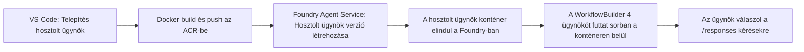
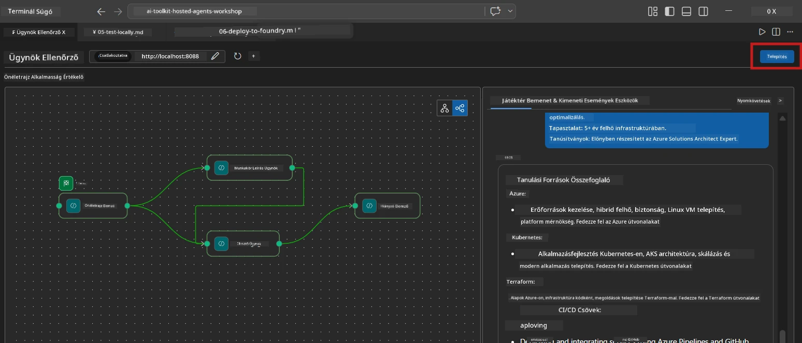
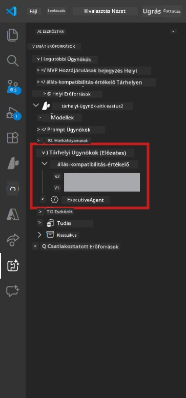

# Modul 6 - Telepítés Foundry Agent Service-be

⏱️ ~10 perc

Ebben a modulban a helyben tesztelt többügynökös munkafolyamatot telepíted a [Microsoft Foundry](https://learn.microsoft.com/azure/foundry/agents/concepts/hosted-agents) szolgáltatásba **Hostolt Ügynökként**. A telepítési folyamat létrehoz egy Docker konténer képfájlt, feltölti az [Azure Container Registry (ACR)](https://learn.microsoft.com/azure/container-registry/container-registry-intro) szolgáltatásba, majd létrehoz egy hostolt ügynök verziót a [Foundry Agent Service](https://learn.microsoft.com/azure/foundry/agents/how-to/publish-agent) rendszeren belül.

> **Fontos különbség az 01-es laborhoz képest:** A telepítési folyamat megegyezik. A Foundry a többügynökös munkafolyamatot egyetlen hostolt ügynökként kezeli - a bonyolultság a konténer belsejében van, de a telepítési felület ugyanaz, a `/responses` végpont.

### Telepítési folyamat


```mermaid
flowchart LR
    A[VS Code: Telepítés hosztolt ügynök] --> B[Docker build és push az ACR-be]
    B --> C[Foundry Agent Service: Hosztolt ügynök verzió létrehozása]
    C --> D[A hosztolt ügynök konténer elindul a Foundry-ban]
    D --> E[A WorkflowBuilder 4 ügynököt futtat sorban a konténeren belül]
    E --> F[Az ügynök válaszol a /responses kérésekre]
```

---

## Előfeltételek ellenőrzése

A telepítés előtt ellenőrizd az alábbiakat:

1. **Az ügynök helyi smoke teszteken megy át:**
   - Teljesítetted mind a 3 tesztet a [5. modulban](05-test-locally.md) és a munkafolyamat teljes kimenetet eredményezett köztes kártyákkal és Microsoft Learn URL-ekkel.

2. **Rendelkezel a [Foundry User](https://learn.microsoft.com/azure/foundry/concepts/rbac-foundry) szereppel** (a telepítéshez minimum a **Foundry Project Manager** jogosultság kell a projekt szinten):

   > **Megjegyzés:** A Foundry RBAC szerepköröket nemrég átnevezték - a **Foundry User**, **Foundry Owner** és **Foundry Project Manager** korábban Azure AI User, Azure AI Owner, és Azure AI Project Manager nevet viselt. A szerepkör azonosítók és jogosultságok változatlanok.

   - Ellenőrizd a [Azure Portálon](https://portal.azure.com) → a Foundry **projekt** erőforráson → **Hozzáférés-vezérlés (IAM)** → **Szerepkör hozzárendelések** → ott szerepel-e a **Foundry User** (vagy magasabb) a fiókodra vonatkozóan.

3. **Be vagy jelentkezve az Azure-ba a VS Code-ban:**
   - Nézd meg az alsó-bal oldalon az Accounts ikont a VS Code-ban. A fióknevednek láthatónak kell lennie.

4. **`agent.yaml` helyes értékeket tartalmaz:**
   - Nyisd meg a `PersonalCareerCopilot/agent.yaml` fájlt, és ellenőrizd:
     ```yaml
     environment_variables:
       - name: AZURE_AI_MODEL_DEPLOYMENT_NAME
         value: ${AZURE_AI_MODEL_DEPLOYMENT_NAME}
     ```
   - A `FOUNDRY_PROJECT_ENDPOINT` **nem** szerepel itt - ezt a Foundry futásidőben injektálja. Csak az `AZURE_AI_MODEL_DEPLOYMENT_NAME` deklarálása szükséges.

5. **`requirements.txt` helyes verziókat tartalmaz:**
   ```
   agent-framework-foundry
   agent-framework-foundry-hosting
   mcp<2,>=1.24.0
   debugpy
   ```

---

## 1. lépés: Indítsd el a telepítést

### A lehetőség: Telepítés az Agent Inspectorból (ajánlott)

Ha az ügynök F5-tel fut, miközben az Agent Inspector meg van nyitva:

1. Nézd meg az Agent Inspector panel **jobb felső sarkát**.
2. Kattints a **Deploy** gombra (felhő ikon felfelé mutató nyíllal ↑).
3. Kinyílik a telepítési varázsló.



### B lehetőség: Telepítés a Command Palette-ből

1. Nyomd meg a `Ctrl+Shift+P` billentyűket a **Command Palette** megnyitásához.
2. Írd be: **Foundry Toolkit: Deploy Hosted Agent** és válaszd ki.
3. Megnyílik a telepítési varázsló.

---

## 2. lépés: Konfiguráld a telepítést

### 2.1 Válaszd ki a célt projektet

1. Egy legördülő menüben látod a Foundry projektjeidet.
2. Válaszd ki azt a projektet, amelyet a workshop során használtál (pl. `workshop-agents`).

### 2.2 Válaszd ki a konténer ügynök fájlját

1. Kiválasztásra kerül az ügynök belépési pontja.
2. Navigálj a `workshop/lab02-multi-agent/PersonalCareerCopilot/` könyvtárba, és válaszd ki a **`main.py`** fájlt.

### 2.3 Konfiguráld az erőforrásokat

| Beállítás | Ajánlott érték | Megjegyzések |
|---------|------------------|-------------|
| **Telepítési mód** | **Konténer** (ajánlott) vagy **Kód** | A konténer létrehoz egy Docker képfájlt; a Kód ZIP-ként tölti fel a forrást (előzetes) |
| **Konténer regisztráció** | **Alapértelmezett ACR** | A Foundry egyet létrehoz és kezel helyetted |
| **CPU** | `0.25` | Alapértelmezett. A többügynökös munkafolyamatok nem igényelnek több CPU-t, mert a modellhívások I/O-kötöttek |
| **Memória** | `0.5Gi` | Alapértelmezett. Növeld `1Gi`-re, ha nagy adatfeldolgozó eszközöket adsz hozzá |

---

## 3. lépés: Erősítsd meg és telepítsd

1. A varázsló összefoglalót mutat a telepítésről.
2. Nézd át és kattints a **Megerősítés és Telepítés** gombra.
3. Kövesd a haladást a VS Code-ban.

### Mi történik a telepítés során

Kövesd a VS Code **Kimenet** paneljét (válaszd a "Microsoft Foundry" legördülő menüt):

1. **Docker build** - Elkészíti a konténert a `Dockerfile` alapján
   ```
   Step 1/6 : FROM python:3.12-slim
   Step 2/6 : WORKDIR /app
   ...
   Successfully built abc123def456
   ```

2. **Docker push** - Feltölti a képfájlt az ACR-be (az első telepítés 1-3 perc)

3. **Ügynök regisztráció** - A Foundry létrehoz egy hostolt ügynököt az `agent.yaml` metaadatok alapján. Az ügynök neve `resume-job-fit-evaluator`.

4. **Konténer indítása** - A konténer a Foundry kezelt infrastruktúrájában indul el, rendszer által kezelt identitással.

> **Az első telepítés lassabb** (a Docker feltölti az összes réteget). A következő telepítések a gyorsítótárazott rétegeket használják, így gyorsabbak.

### Többügynökös specifikus megjegyzések

- **Mind a négy ügynök egyetlen konténerben van.** A Foundry egyetlen hostolt ügynöknek látja. A WorkflowBuilder gráf belsőleg fut.
- **MCP hívások kimenő irányba mennek.** A konténernek internetkapcsolatra van szüksége, hogy elérje a `https://learn.microsoft.com/api/mcp` címet. A Foundry kezelt infrastruktúrája ezt alapértelmezettként biztosítja.
- **[Kezelt identitás](https://learn.microsoft.com/azure/foundry/agents/concepts/agent-identity).** A Foundry automatikusan létrehoz egy **minden hostolt ügynökhöz dedikált Entra identitást** telepítéskor. A hostolt környezetben a `DefaultAzureCredential` automatikusan erre az ügynök identitásra oldódik fel - nincs szükség manuális kezelői identitás konfigurációra.

---

## 4. lépés: Ellenőrizd a telepítés állapotát

1. Nyisd meg a **Microsoft Foundry** oldalsávot (kattints a Foundry ikonra az Activity Bar-on).
2. Bontsd ki a **Hosted Agents (Preview)** szekciót a projekted alatt.
3. Keresd meg a **resume-job-fit-evaluator** (vagy a saját ügynököd nevét).
4. Kattints az ügynök nevére → bontsd ki a verziókat (pl. `v1`).
5. Kattints a verzióra → ellenőrizd a **Konténer részletek** → **Állapot** mezőt:



| Állapot | Jelentés |
|--------|---------|
| **active** | Az ügynök fut és készen áll a kérések fogadására |
| **creating** | A konténer indul (várj 30–60 másodpercet) |
| **failed** | A konténer nem indult el (ellenőrizd a naplókat - lásd alább) |

> **Megjegyzés:** A VS Code oldalsáv címkéként "Fut" vagy "Indult" jelenhet meg, miközben az API a `active`/`creating` értékeket használja. Mindkettő ugyanazt az állapotot jelenti.

> **A többügynökös indítás tovább tart**, mint az együgynökös, mert a konténer indításkor 4 ügynök példányt hoz létre. A `creating` állapot akár 2 percig is normális.

---

## Gyakori telepítési hibák és javításuk

### Hiba 1: Jogosultság megtagadva - `agents/write`

```
Error: lacks the required data action 
Microsoft.CognitiveServices/accounts/AIServices/agents/write
```

**Javítás:** Rendeld hozzá a **[Foundry User](https://learn.microsoft.com/azure/foundry/concepts/rbac-foundry)** szerepet (korábban **Azure AI User**) a **projekt** szinten. Lépésről lépésre útmutatót találsz a [8. modul - Hibakeresés](08-troubleshooting.md) dokumentumban.

### Hiba 2: Docker nem fut

```
Error: Docker build failed / Cannot connect to Docker daemon
```

**Javítás:**
1. Indítsd el a Docker Desktop-ot.
2. Várj, amíg megjelenik a "Docker Desktop fut" üzenet.
3. Ellenőrizd a parancsot: `docker info`
4. **Windows esetén:** Győződj meg róla, hogy a Docker Desktop beállításaiban engedélyezve van a WSL 2 backend.
5. Próbáld újra.

### Hiba 3: pip install sikertelen a Docker build alatt

```
Error: Could not find a version that satisfies the requirement agent-framework-foundry
```

**Javítás:** Ellenőrizd, hogy a `requirements.txt` megfelel:
```
agent-framework-foundry
agent-framework-foundry-hosting
mcp<2,>=1.24.0
debugpy
```

Ha a build még mindig sikertelen, lehetséges, hogy a Docker hálózat blokkolja a PyPI-t. Ellenőrizd a proxy beállításokat a `docker info` paranccsal.

### Hiba 4: MCP eszköz hibája a hostolt ügynökben

Ha a Gap Analyzer leáll azzal, hogy nem ad Microsoft Learn URL-eket a telepítés után:

**Ok:** A hálózati szabályzat blokkolhatja a kimenő HTTPS forgalmat a konténerből.

**Javítás:**
1. Ez általában nem probléma a Foundry alapértelmezett beállításaiban.
2. Ha előfordul, ellenőrizd, hogy nincs-e NSG a Foundry projekt virtuális hálózatán, amely blokkolja a kimenő HTTPS-t.
3. Az MCP eszköz rendelkezik beépített tartalék URL-ekkel, így az ügynök akkor is fog kimenetet adni (élő URL-ek nélkül).

---

### Ellenőrző pont

- [ ] A telepítési parancs hiba nélkül lefutott a VS Code-ban
- [ ] Az ügynök megjelenik a Foundry oldalsáv **Hosted Agents (Preview)** listájában
- [ ] Az ügynök neve `resume-job-fit-evaluator` (vagy a választott név)
- [ ] A konténer állapota **Indult** vagy **Fut**
- [ ] (Hiba esetén) Azonosítottad a hibát, alkalmaztad a javítást és sikeresen újból telepítetted

---

**Előző:** [05 - Helyi tesztelés](05-test-locally.md) · **Következő:** [07 - Ellenőrzés a Playground-ban →](07-verify-in-playground.md)

---

<!-- CO-OP TRANSLATOR DISCLAIMER START -->
**Jogi nyilatkozat**:
Ez a dokumentum az AI fordítási szolgáltatás, a [Co-op Translator](https://github.com/Azure/co-op-translator) segítségével készült. Bár az pontosságra törekszünk, kérjük, vegye figyelembe, hogy az automatikus fordítások hibákat vagy pontatlanságokat tartalmazhatnak. Az eredeti dokumentum az anyanyelvén tekintendő hiteles forrásnak. Fontos információk esetén professzionális emberi fordítást javasolunk. Nem vállalunk felelősséget semmilyen félreértésért vagy téves értelmezésért, amely ebből a fordításból ered.
<!-- CO-OP TRANSLATOR DISCLAIMER END -->