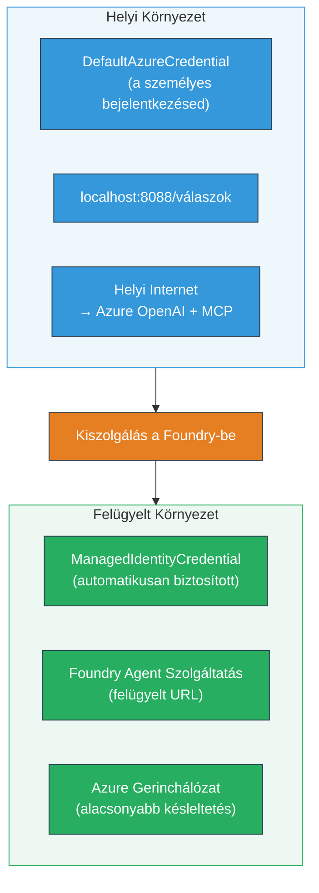

# Modul 7 - Ellenőrzés a Játékteremben

Ebben a modulban mind a **VS Code**, mind a **[Foundry Portal](https://ai.azure.com)** felületén teszteli a telepített többügynökös munkafolyamatát, megerősítve, hogy az ügynök viselkedése megegyezik a helyi teszteléssel.

---

## Miért ellenőrizni telepítés után?

A többügynökös munkafolyamata helyileg tökéletesen futott, akkor miért tesztelni újra? A hosztolt környezet több szempontból is eltér:


| Különbség | Helyi | Hosztolt |
|-----------|-------|----------|
| **Azonosító** | [`DefaultAzureCredential`](https://learn.microsoft.com/azure/developer/python/sdk/authentication/credential-chains#defaultazurecredential-overview) (személyes bejelentkezés) | [`ManagedIdentityCredential`](https://learn.microsoft.com/python/api/overview/azure/identity-readme#managed-identity-support) (automatikusan biztosított) |
| **Végpont** | `http://localhost:8088/responses` | [Foundry Agent Service](https://learn.microsoft.com/azure/foundry/agents/concepts/hosted-agents) végpont (kezelt URL) |
| **Hálózat** | Helyi gép → Azure OpenAI + MCP kimenet | Azure gerinchálózat (alacsonyabb késleltetés a szolgáltatások között) |
| **MCP kapcsolódás** | Helyi internet → `learn.microsoft.com/api/mcp` | Konténer kimenet → `learn.microsoft.com/api/mcp` |

Ha bármely környezeti változó hibásan van beállítva, az RBAC eltér, vagy az MCP kimenet blokkolva van, itt fogja észrevenni.

---

## A lehetőség: Tesztelés a VS Code Játékteremben (ajánlott elsőként)

A [Foundry bővítmény](https://marketplace.visualstudio.com/items?itemName=TeamsDevApp.vscode-ai-foundry) tartalmaz egy integrált Játéktermet, amely lehetővé teszi, hogy a telepített ügynökkel kommunikáljon anélkül, hogy elhagyná a VS Code-ot.

### 1. lépés: Navigáljon a hosztolt ügynökhöz

1. Kattintson a **Microsoft Foundry** ikonra a VS Code **Tevékenységsávjában** (bal oldali sáv) a Foundry panel megnyitásához.
2. Bontsa ki a kapcsolódó projektet (pl. `workshop-agents`).
3. Bontsa ki a **Hosztolt Ügynökök (Előnézet)** részt.
4. Látnia kell az ügynök nevét (pl. `resume-job-fit-evaluator`).

### 2. lépés: Válasszon verziót

1. Kattintson az ügynök nevére a verziók kibontásához.
2. Kattintson arra a verzióra, amelyet telepített (pl. `v1`).
3. Megnyílik egy **részlet panel**, amely megjeleníti a Konténer részleteit.
4. Ellenőrizze, hogy az állapot **Started** vagy **Running** legyen.

### 3. lépés: Nyissa meg a Játéktermet

1. A részlet panelen kattintson a **Playground** gombra (vagy kattintson jobb gombbal a verzióra → **Open in Playground**).
2. Egy beszélgetési felület nyílik meg egy VS Code fülön.

### 4. lépés: Futtassa a gyors teszteket

Használja ugyanazokat a 3 tesztet az [5. modulból](05-test-locally.md). Gépelje be mindegyik üzenetet a Játékterem bemeneti mezőjébe, majd nyomja meg a **Send** (vagy **Enter**) gombot.

#### Teszt 1 - Teljes önéletrajz + munkaköri leírás (alapfolyamat)

Illessze be az 5. modul 1. tesztjéből a teljes önéletrajz + munkaköri leírás promptot (Jane Doe + Senior Cloud Engineer a Contoso Ltd-nél).

**Várt eredmény:**
- Illeszkedési pontszám részletes lebontással (100 pontos skála)
- Egyező képességek rész
- Hiányzó képességek rész
- **Egy hiányzó képességhez egy hézagkártya** Microsoft Learn URL-ekkel
- Tanulási ütemterv idővonal szerint

#### Teszt 2 - Gyors rövid teszt (minimális bevitel)

```
RESUME: 3 years Python developer, knows Django and PostgreSQL, no cloud experience.

JOB: Cloud DevOps Engineer requiring AWS, Kubernetes, Terraform, CI/CD. 5 years needed.
```

**Várt eredmény:**
- Alacsonyabb illeszkedési pontszám (< 40)
- Őszinte értékelés lépcsőzetes tanulási úttal
- Több hézagkártya (AWS, Kubernetes, Terraform, CI/CD, tapasztalati hiány)

#### Teszt 3 - Magas illeszkedésű jelölt

```
RESUME:
10 years Azure Cloud Architect. AZ-305 certified. Expert in AKS, Terraform, Azure DevOps, 
Azure Functions, Helm, Prometheus, Grafana, Python, Go. Led platform team of 8.

JOB:
Senior Cloud Engineer. Required: AKS, Terraform, Azure DevOps, Python. Preferred: Helm, Go.
5+ years experience. AZ-305 preferred.
```

**Várt eredmény:**
- Magas illeszkedési pontszám (≥ 80)
- Fókusz az interjúra való felkészülésen és csiszoláson
- Kevés vagy egyáltalán nincs hézagkártya
- Rövid idővonal a felkészülésre

### 5. lépés: Hasonlítsa össze a helyi eredményekkel

Nyissa meg jegyzeteit vagy a 5. modulból mentett böngészőfület a helyi válaszokkal. Minden tesztnél vizsgálja:

- Van-e a válasznak azonos **struktúrája** (illeszkedési pontszám, hézagkártyák, ütemterv)?
- Követi-e ugyanazt az **értékelési rendszert** (100 pontos bontás)?
- Tartalmaznak-e a hézagkártyák továbbra is **Microsoft Learn URL-eket**?
- Van-e **egy kártya minden hiányzó képességhez** (nem csonkolt)?

> **Apró megfogalmazásbeli eltérések normálisak** – a modell nem determinisztikus. A struktúrára, az értékelés következetességére és az MCP eszköz használatára fókuszáljon.

---

## B lehetőség: Tesztelés a Foundry Portálon

A [Foundry Portál](https://ai.azure.com) webalapú játéktermet biztosít, ami hasznos lehet csapattagokkal vagy érdekelt felekkel való megosztáshoz.

### 1. lépés: Nyissa meg a Foundry Portált

1. Nyissa meg böngészőjét, és navigáljon a [https://ai.azure.com](https://ai.azure.com) címre.
2. Jelentkezzen be ugyanazzal az Azure fiókkal, amelyet a workshop során használt.

### 2. lépés: Navigáljon a projektjéhez

1. A kezdőlapon keresse a **Legutóbbi projektek** részt a bal oldali sávban.
2. Kattintson a projekt nevére (pl. `workshop-agents`).
3. Ha nem látja, kattintson az **Összes projekt** elemre, és keresse meg.

### 3. lépés: Keresse meg a telepített ügynököt

1. A projekt bal oldali navigációjában kattintson a **Build** → **Agents** menüpontra (vagy keresse az **Agents** szekciót).
2. Egy ügynökök listája jelenik meg. Keresse meg a telepített ügynököt (pl. `resume-job-fit-evaluator`).
3. Kattintson az ügynök nevére a részletek megnyitásához.

### 4. lépés: Nyissa meg a Játéktermet

1. Az ügynök részletező oldalán nézzen a felső eszköztárra.
2. Kattintson az **Open in playground** (vagy **Try in playground**) gombra.
3. Megnyílik a beszélgetési felület.

### 5. lépés: Futtassa ugyanazokat a gyors teszteket

Ismételje meg az összes 3 tesztet a fenti VS Code Játékterem szakaszból. Hasonlítsa össze a válaszokat a helyi eredményekkel (5. modul) és a VS Code Játékterem eredményeivel (A lehetőség fent).

---

## Többügynökös specifikus ellenőrzés

Az alapvető helyességen túl ellenőrizze ezeket a többügynökös specifikus viselkedéseket:

### MCP eszköz végrehajtás

| Ellenőrzés | Hogyan ellenőrizze | Sikerkritérium |
|------------|--------------------|----------------|
| MCP hívások sikeresek | A hézagkártyák tartalmaznak `learn.microsoft.com` URL-eket | Valódi URL-ek, nem helyettesítő üzenetek |
| Többszörös MCP hívások | Minden magas/közepes prioritású hézaghoz vannak források | Nem csak az első hézagkártya |
| MCP helyettesítés működik | Ha hiányoznak URL-ek, ellenőrizze a helyettesítő szöveget | Az ügynök továbbra is létrehoz hézagkártyákat (URL-lel vagy nélküle) |

### Ügynök koordináció

| Ellenőrzés | Hogyan ellenőrizze | Sikerkritérium |
|------------|--------------------|----------------|
| Mind a 4 ügynök futott | A kimenet tartalmaz illeszkedési pontszámot ÉS hézagkártyákat | A pontszám a MatchingAgent-től, a kártyák a GapAnalyzer-tól jönnek |
| Párhuzamos feldobás | A válaszidő megfelelő (< 2 perc) | Ha > 3 perc, párhuzamos végrehajtás valószínűleg nem működik |
| Adatfolyam integritás | A hézagkártyák hivatkoznak a matching riportban szereplő képességekre | Nincsenek hallucinált képességek, melyek nincsenek benne a munkaköri leírásban |

---

## Értékelési rubrika

Ezt a rubrikát használja a hosztolt viselkedés értékeléséhez a többügynökös munkafolyamatában:

| # | Kritérium | Sikerkritérium | Teljesült? |
|---|-----------|----------------|------------|
| 1 | **Funkcionális helyesség** | Az ügynök válaszol az önéletrajz + munkaköri leírás kérésre illeszkedési pontszámmal és hézag elemzéssel | |
| 2 | **Értékelés következetessége** | Az illeszkedési pontszám 100 pontos skálát és részletes lebontást használ | |
| 3 | **Hézagkártyák teljessége** | Egy kártya minden hiányzó képességhez (nem csonkolt vagy összevonva) | |
| 4 | **MCP eszköz integráció** | A hézagkártyák valós Microsoft Learn URL-eket tartalmaznak | |
| 5 | **Szerkezeti következetesség** | A kimenet szerkezete megegyezik a helyi és hosztolt futtatás között | |
| 6 | **Válaszidő** | A hosztolt ügynök 2 percen belül válaszol a teljes értékelésre | |
| 7 | **Hibamentesség** | Nincsenek HTTP 500 hibák, időtúllépések vagy üres válaszok | |

> Az „átment” azt jelenti, hogy mind a 7 kritérium teljesül mindhárom gyors tesztnél legalább az egyik játékteremben (VS Code vagy Portál).

---

## Játékterem problémák elhárítása

| Tünet | Valószínű ok | Javítás |
|--------|--------------|---------|
| Nem tölt be a játékterem | A konténer állapota nem "Started" | Menjen vissza a [6. modulhoz](06-deploy-to-foundry.md), ellenőrizze a telepítés állapotát. Ha "Pending", várjon |
| Az ügynök üres választ ad | Modell telepítés neve nem egyezik | Ellenőrizze az `agent.yaml` → `environment_variables` → `MODEL_DEPLOYMENT_NAME` egyezését a telepített modellel |
| Az ügynök hibát jelez | [RBAC](https://learn.microsoft.com/azure/foundry/concepts/rbac-foundry) jogosultság hiányzik | Adjon hozzá **[Azure AI User](https://aka.ms/foundry-ext-project-role)** jogosultságot projekt szinten |
| Nincsenek Microsoft Learn URL-ek a hézagkártyákon | MCP kimenet blokkolva vagy MCP kiszolgáló nem elérhető | Ellenőrizze, hogy a konténer eléri-e a `learn.microsoft.com` webhelyet. Lásd [8. modul](08-troubleshooting.md) |
| Csak 1 hézagkártya van (csonkolt) | A GapAnalyzer utasításai hiányoznak a "CRITICAL" blokk | Tekintse át a [3. modul, 2.4 lépését](03-configure-agents.md) |
| Az illeszkedési pontszám nagyon eltér a helyitől | Másik modell vagy utasítás lett telepítve | Hasonlítsa össze az `agent.yaml` környezeti változóit a helyi `.env` fájllal. Ha kell, telepítse újra |
| „Agent not found” a Portálon | A telepítés még propagálódik vagy sikertelen | Várjon 2 percet, frissítse az oldalt. Ha még nincs, telepítse újra a [6. modulból](06-deploy-to-foundry.md) |

---

### Ellenőrzőpont

- [ ] Az ügynököt tesztelte a VS Code Játékteremben – mindhárom gyors teszt sikeres volt
- [ ] Az ügynököt tesztelte a [Foundry Portál](https://ai.azure.com) Játékterében – mindhárom gyors teszt sikeres volt
- [ ] A válaszok szerkezetileg megfelelnek a helyi tesztelésnek (illeszkedési pontszám, hézagkártyák, ütemterv)
- [ ] Microsoft Learn URL-ek jelen vannak a hézagkártyákon (MCP eszköz működik a hosztolt környezetben)
- [ ] Egy hézagkártya minden hiányzó képességhez (nincs csonkolás)
- [ ] Nincsenek hibák vagy időtúllépések a tesztelés során
- [ ] Kitöltötte az értékelési rubrikát (mind a 7 kritérium teljesült)

---

**Előző:** [06 - Telepítés a Foundryba](06-deploy-to-foundry.md) · **Következő:** [08 - Hibakeresés →](08-troubleshooting.md)

---

<!-- CO-OP TRANSLATOR DISCLAIMER START -->
**Jogi nyilatkozat**:  
Ez a dokumentum az [Co-op Translator](https://github.com/Azure/co-op-translator) AI fordító szolgáltatással készült. Bár a pontosságra törekszünk, kérjük, vegye figyelembe, hogy az automatikus fordítások hibákat vagy pontatlanságokat tartalmazhatnak. Az eredeti, anyanyelvi dokumentum tekintendő hivatalos forrásnak. Kritikus információk esetén professzionális, emberi fordítást javaslunk. Nem vállalunk felelősséget az ebből a fordításból eredő félreértésekért vagy hibás értelmezésekért.
<!-- CO-OP TRANSLATOR DISCLAIMER END -->