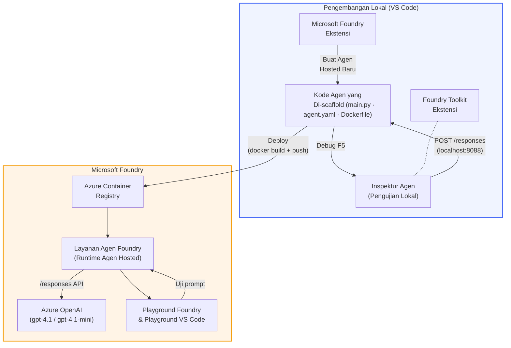

# Foundry Toolkit + Foundry Hosted Agents Workshop

[](https://www.python.org/)
[](https://github.com/microsoft/agents)
[](https://learn.microsoft.com/azure/ai-foundry/agents/concepts/hosted-agents/)
[](https://ai.azure.com/)
[](https://learn.microsoft.com/azure/ai-services/openai/)
[](https://learn.microsoft.com/cli/azure/install-azure-cli)
[](https://learn.microsoft.com/azure/developer/azure-developer-cli/install-azd)
[](https://www.docker.com/)
[](https://marketplace.visualstudio.com/items?itemName=ms-windows-ai-studio.windows-ai-studio)
[](LICENSE)

Bangun, uji, dan terapkan agen AI ke **Microsoft Foundry Agent Service** sebagai **Hosted Agents** - sepenuhnya dari VS Code menggunakan **Microsoft Foundry extension** dan **Foundry Toolkit**.

> **Hosted Agents saat ini dalam pratinjau.** Wilayah yang didukung terbatas - lihat [ketersediaan wilayah](https://learn.microsoft.com/azure/foundry/agents/concepts/hosted-agents#region-availability).

> Folder `agent/` di dalam setiap lab **secara otomatis dibuat** oleh ekstensi Foundry - Anda kemudian menyesuaikan kode, menguji secara lokal, dan menerapkan.

<!-- CO-OP TRANSLATOR LANGUAGES TABLE START -->
[Arabic](../ar/README.md) | [Bengali](../bn/README.md) | [Bulgarian](../bg/README.md) | [Burmese (Myanmar)](../my/README.md) | [Chinese (Simplified)](../zh-CN/README.md) | [Chinese (Traditional, Hong Kong)](../zh-HK/README.md) | [Chinese (Traditional, Macau)](../zh-MO/README.md) | [Chinese (Traditional, Taiwan)](../zh-TW/README.md) | [Croatian](../hr/README.md) | [Czech](../cs/README.md) | [Danish](../da/README.md) | [Dutch](../nl/README.md) | [Estonian](../et/README.md) | [Finnish](../fi/README.md) | [French](../fr/README.md) | [German](../de/README.md) | [Greek](../el/README.md) | [Hebrew](../he/README.md) | [Hindi](../hi/README.md) | [Hungarian](../hu/README.md) | [Indonesian](./README.md) | [Italian](../it/README.md) | [Japanese](../ja/README.md) | [Kannada](../kn/README.md) | [Khmer](../km/README.md) | [Korean](../ko/README.md) | [Lithuanian](../lt/README.md) | [Malay](../ms/README.md) | [Malayalam](../ml/README.md) | [Marathi](../mr/README.md) | [Nepali](../ne/README.md) | [Nigerian Pidgin](../pcm/README.md) | [Norwegian](../no/README.md) | [Persian (Farsi)](../fa/README.md) | [Polish](../pl/README.md) | [Portuguese (Brazil)](../pt-BR/README.md) | [Portuguese (Portugal)](../pt-PT/README.md) | [Punjabi (Gurmukhi)](../pa/README.md) | [Romanian](../ro/README.md) | [Russian](../ru/README.md) | [Serbian (Cyrillic)](../sr/README.md) | [Slovak](../sk/README.md) | [Slovenian](../sl/README.md) | [Spanish](../es/README.md) | [Swahili](../sw/README.md) | [Swedish](../sv/README.md) | [Tagalog (Filipino)](../tl/README.md) | [Tamil](../ta/README.md) | [Telugu](../te/README.md) | [Thai](../th/README.md) | [Turkish](../tr/README.md) | [Ukrainian](../uk/README.md) | [Urdu](../ur/README.md) | [Vietnamese](../vi/README.md)

> **Lebih suka Clone Secara Lokal?**
>
> Repositori ini menyertakan lebih dari 50 terjemahan bahasa yang secara signifikan meningkatkan ukuran unduhan. Untuk mengkloning tanpa terjemahan, gunakan sparse checkout:
>
> **Bash / macOS / Linux:**
> ```bash
> git clone --filter=blob:none --sparse https://github.com/microsoft-foundry/Foundry_Toolkit_for_VSCode_Lab.git
> cd Foundry_Toolkit_for_VSCode_Lab
> git sparse-checkout set --no-cone '/*' '!translations' '!translated_images'
> ```
>
> **CMD (Windows):**
> ```cmd
> git clone --filter=blob:none --sparse https://github.com/microsoft-foundry/Foundry_Toolkit_for_VSCode_Lab.git
> cd Foundry_Toolkit_for_VSCode_Lab
> git sparse-checkout set --no-cone "/*" "!translations" "!translated_images"
> ```
>
> Ini memberi Anda semua yang Anda butuhkan untuk menyelesaikan kursus dengan unduhan yang jauh lebih cepat.
<!-- CO-OP TRANSLATOR LANGUAGES TABLE END -->

---

## Arsitektur


**Alur:** Ekstensi Foundry membuat kerangka agen → Anda sesuaikan kode & instruksi → uji secara lokal dengan Agent Inspector → terapkan ke Foundry (gambar Docker didorong ke ACR) → verifikasi di Playground.

---

## Apa yang akan Anda bangun

| Lab | Deskripsi | Status |
|-----|-------------|--------|
| **Lab 01 - Agen Tunggal** | Bangun **"Explain Like I'm an Executive" Agent**, uji secara lokal, dan terapkan ke Foundry | ✅ Tersedia |
| **Lab 02 - Alur Kerja Multi-Agen** | Bangun **"Resume → Job Fit Evaluator"** - 4 agen berkolaborasi untuk menilai kecocokan resume dan menghasilkan roadmap pembelajaran | ✅ Tersedia |

---

## Temui Executive Agent

Dalam workshop ini Anda akan membangun **"Explain Like I'm an Executive" Agent** - agen AI yang mengubah jargon teknis rumit menjadi ringkasan siap rapat dewan yang tenang. Karena sejujurnya, tidak ada yang di C-suite ingin mendengar tentang "kehabisan thread pool yang disebabkan oleh panggilan sinkron yang diperkenalkan di v3.2."

Saya membangun agen ini setelah terlalu banyak insiden di mana post-mortem yang saya buat dengan sempurna mendapat respons: *"Jadi... apakah situs webnya mati atau tidak?"*

### Cara kerjanya

Anda memberinya pembaruan teknis. Ia mengembalikan ringkasan eksekutif - tiga poin utama, tanpa jargon, tanpa jejak stack, tanpa kecemasan eksistensial. Hanya **apa yang terjadi**, **dampak bisnis**, dan **langkah selanjutnya**.

### Lihat dalam aksi

**Anda berkata:**
> "API latency meningkat karena kehabisan thread pool yang disebabkan oleh panggilan sinkron yang diperkenalkan di v3.2."

**Agen menjawab:**

> **Ringkasan Eksekutif:**
> - **Apa yang terjadi:** Setelah rilis terbaru, sistem melambat.
> - **Dampak bisnis:** Beberapa pengguna mengalami penundaan saat menggunakan layanan.
> - **Langkah selanjutnya:** Perubahan sudah dibatalkan dan perbaikan sedang disiapkan sebelum diterapkan ulang.

### Kenapa agen ini?

Ini adalah agen sederhana dengan tujuan tunggal - sempurna untuk mempelajari alur kerja agen hosted dari awal hingga akhir tanpa tersesat dalam rantai alat yang kompleks. Dan sejujurnya? Setiap tim rekayasa bisa menggunakan satu dari ini.

---

## Struktur workshop

```
📂 Foundry_Toolkit_for_VSCode_Lab/
├── 📄 README.md                      ← You are here
├── 📂 ExecutiveAgent/                ← Standalone hosted agent project
│   ├── agent.yaml
│   ├── Dockerfile
│   ├── main.py
│   └── requirements.txt
└── 📂 workshop/
    ├── 📂 lab01-single-agent/        ← Full lab: docs + agent code
    │   ├── README.md                 ← Hands-on lab instructions
    │   ├── 📂 docs/                  ← Step-by-step tutorial modules
    │   │   ├── 00-prerequisites.md
    │   │   ├── 01-install-foundry-toolkit.md
    │   │   ├── 02-create-foundry-project.md
    │   │   ├── 03-create-hosted-agent.md
    │   │   ├── 04-configure-and-code.md
    │   │   ├── 05-test-locally.md
    │   │   ├── 06-deploy-to-foundry.md
    │   │   ├── 07-verify-in-playground.md
    │   │   └── 08-troubleshooting.md
    │   └── 📂 agent/                 ← Reference solution (auto-scaffolded by Foundry extension)
    │       ├── agent.yaml
    │       ├── Dockerfile
    │       ├── main.py
    │       └── requirements.txt
    └── 📂 lab02-multi-agent/         ← Resume → Job Fit Evaluator
        ├── README.md                 ← Hands-on lab instructions (end-to-end)
        ├── 📂 docs/                  ← Step-by-step tutorial modules
        │   ├── 00-prerequisites.md
        │   ├── 01-understand-multi-agent.md
        │   ├── 02-scaffold-multi-agent.md
        │   ├── 03-configure-agents.md
        │   ├── 04-orchestration-patterns.md
        │   ├── 05-test-locally.md
        │   ├── 06-deploy-to-foundry.md
        │   ├── 07-verify-in-playground.md
        │   └── 08-troubleshooting.md
        └── 📂 PersonalCareerCopilot/ ← Reference solution (multi-agent workflow)
            ├── agent.yaml
            ├── Dockerfile
            ├── main.py
            └── requirements.txt
```

> **Catatan:** Folder `agent/` di dalam setiap lab adalah apa yang dihasilkan oleh **Microsoft Foundry extension** ketika Anda menjalankan `Microsoft Foundry: Create a New Hosted Agent` dari Command Palette. File-file ini kemudian disesuaikan dengan instruksi, alat, dan konfigurasi agen Anda. Lab 01 membimbing Anda untuk membuat ulang ini dari awal.

---

## Memulai

### 1. Clone repositori

```bash
git clone https://github.com/microsoft-foundry/Foundry_Toolkit_for_VSCode_Lab.git
cd Foundry_Toolkit_for_VSCode_Lab
```

### 2. Siapkan lingkungan virtual Python

```bash
python -m venv venv
```

Aktifkan:

- **Windows (PowerShell):**
  ```powershell
  .\venv\Scripts\Activate.ps1
  ```

- **macOS / Linux:**
  ```bash
  source venv/bin/activate
  ```

### 3. Instal dependensi

```bash
pip install -r workshop/lab01-single-agent/agent/requirements.txt
```

### 4. Konfigurasi variabel lingkungan

Salin file `.env` contoh di dalam folder agent dan isi dengan nilai Anda:

```bash
cp workshop/lab01-single-agent/agent/.env.example workshop/lab01-single-agent/agent/.env
```

Edit `workshop/lab01-single-agent/agent/.env`:

```env
AZURE_AI_PROJECT_ENDPOINT=https://<your-account>.services.ai.azure.com/api/projects/<your-project>
MODEL_DEPLOYMENT_NAME=<your-model-deployment-name>
```

### 5. Ikuti lab workshop

Setiap lab bersifat mandiri dengan modulnya sendiri. Mulai dengan **Lab 01** untuk mempelajari dasar-dasarnya, kemudian lanjut ke **Lab 02** untuk alur kerja multi-agen.

#### Lab 01 - Agen Tunggal ([instruksi lengkap](workshop/lab01-single-agent/README.md))

| # | Modul | Tautan |
|---|--------|--------|
| 1 | Baca prasyarat | [00-prerequisites.md](workshop/lab01-single-agent/docs/00-prerequisites.md) |
| 2 | Instal Foundry Toolkit & ekstensi Foundry | [01-install-foundry-toolkit.md](workshop/lab01-single-agent/docs/01-install-foundry-toolkit.md) |
| 3 | Buat proyek Foundry | [02-create-foundry-project.md](workshop/lab01-single-agent/docs/02-create-foundry-project.md) |
| 4 | Buat hosted agent | [03-create-hosted-agent.md](workshop/lab01-single-agent/docs/03-create-hosted-agent.md) |
| 5 | Konfigurasi instruksi & lingkungan | [04-configure-and-code.md](workshop/lab01-single-agent/docs/04-configure-and-code.md) |
| 6 | Uji secara lokal | [05-test-locally.md](workshop/lab01-single-agent/docs/05-test-locally.md) |
| 7 | Terapkan ke Foundry | [06-deploy-to-foundry.md](workshop/lab01-single-agent/docs/06-deploy-to-foundry.md) |
| 8 | Verifikasi di playground | [07-verify-in-playground.md](workshop/lab01-single-agent/docs/07-verify-in-playground.md) |
| 9 | Pemecahan masalah | [08-troubleshooting.md](workshop/lab01-single-agent/docs/08-troubleshooting.md) |

#### Lab 02 - Alur Kerja Multi-Agen ([instruksi lengkap](workshop/lab02-multi-agent/README.md))

| # | Modul | Tautan |
|---|--------|--------|
| 1 | Prasyarat (Lab 02) | [00-prerequisites.md](workshop/lab02-multi-agent/docs/00-prerequisites.md) |
| 2 | Pahami arsitektur multi-agen | [01-understand-multi-agent.md](workshop/lab02-multi-agent/docs/01-understand-multi-agent.md) |
| 3 | Buat kerangka proyek multi-agen | [02-scaffold-multi-agent.md](workshop/lab02-multi-agent/docs/02-scaffold-multi-agent.md) |
| 4 | Konfigurasi agen & lingkungan | [03-configure-agents.md](workshop/lab02-multi-agent/docs/03-configure-agents.md) |
| 5 | Pola orkestrasi | [04-orchestration-patterns.md](workshop/lab02-multi-agent/docs/04-orchestration-patterns.md) |
| 6 | Uji secara lokal (multi-agen) | [05-test-locally.md](workshop/lab02-multi-agent/docs/05-test-locally.md) |
| 7 | Deploy ke Foundry | [06-deploy-to-foundry.md](workshop/lab02-multi-agent/docs/06-deploy-to-foundry.md) |
| 8 | Verifikasi di playground | [07-verify-in-playground.md](workshop/lab02-multi-agent/docs/07-verify-in-playground.md) |
| 9 | Pemecahan masalah (multi-agent) | [08-troubleshooting.md](workshop/lab02-multi-agent/docs/08-troubleshooting.md) |

---

## Pemelihara

<table>
<tr>
    <td align="center"><a href="https://github.com/ShivamGoyal03">
        <br />
        <sub><b>Shivam Goyal</b></sub>
    </a><br />
    </td>
</tr>
</table>

---

## Izin yang diperlukan (referensi cepat)

| Skenario | Peran yang diperlukan |
|----------|----------------------|
| Membuat proyek Foundry baru | **Azure AI Owner** pada sumber daya Foundry |
| Deploy ke proyek yang sudah ada (sumber daya baru) | **Azure AI Owner** + **Contributor** pada langganan |
| Deploy ke proyek yang sepenuhnya dikonfigurasi | **Reader** pada akun + **Azure AI User** pada proyek |

> **Penting:** Peran Azure `Owner` dan `Contributor` hanya mencakup izin *manajemen*, bukan izin *pengembangan* (aksi data). Anda memerlukan **Azure AI User** atau **Azure AI Owner** untuk membangun dan men-deploy agen.

---

## Referensi

- [Quickstart: Deploy agent hosted pertama Anda (VS Code)](https://learn.microsoft.com/azure/foundry/agents/quickstarts/quickstart-hosted-agent)
- [Apa itu hosted agents?](https://learn.microsoft.com/azure/foundry/agents/concepts/hosted-agents)
- [Buat alur kerja hosted agent di VS Code](https://learn.microsoft.com/azure/foundry/agents/how-to/vs-code-agents-workflow-pro-code)
- [Deploy hosted agent](https://learn.microsoft.com/azure/foundry/agents/how-to/deploy-hosted-agent)
- [RBAC untuk Microsoft Foundry](https://learn.microsoft.com/azure/foundry/concepts/rbac-foundry)
- [Contoh Agent Review Arsitektur](https://github.com/Azure-Samples/agent-architecture-review-sample) - Hosted agent dunia nyata dengan alat MCP, diagram Excalidraw, dan dual deployment

---

## Lisensi

[MIT](../../LICENSE)

---

<!-- CO-OP TRANSLATOR DISCLAIMER START -->
**Penafian**:  
Dokumen ini telah diterjemahkan menggunakan layanan terjemahan AI [Co-op Translator](https://github.com/Azure/co-op-translator). Meskipun kami berupaya untuk akurasi, harap diingat bahwa terjemahan otomatis mungkin mengandung kesalahan atau ketidakakuratan. Dokumen asli dalam bahasa aslinya harus dianggap sebagai sumber yang sahih. Untuk informasi penting, disarankan menggunakan terjemahan profesional oleh manusia. Kami tidak bertanggung jawab atas kesalahpahaman atau penafsiran yang timbul dari penggunaan terjemahan ini.
<!-- CO-OP TRANSLATOR DISCLAIMER END -->