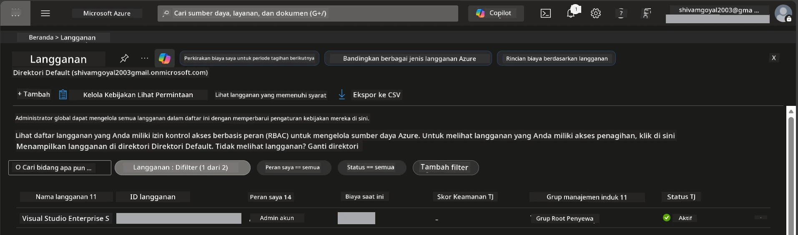

# Modul 0 - Prasyarat

Sebelum memulai workshop, pastikan Anda memiliki alat, akses, dan lingkungan berikut siap. Ikuti setiap langkah di bawah ini - jangan lompat ke depan.

---

## 1. Akun & langganan Azure

### 1.1 Buat atau verifikasi langganan Azure Anda

1. Buka browser dan navigasikan ke [https://azure.microsoft.com/free/](https://azure.microsoft.com/free/).
2. Jika Anda belum memiliki akun Azure, klik **Start free** dan ikuti alur pendaftaran. Anda memerlukan akun Microsoft (atau buat satu) dan kartu kredit untuk verifikasi identitas.
3. Jika Anda sudah memiliki akun, masuk di [https://portal.azure.com](https://portal.azure.com).
4. Di Portal, klik bilah **Subscriptions** di navigasi kiri (atau cari "Subscriptions" di bilah pencarian atas).
5. Verifikasi Anda melihat setidaknya satu langganan **Active**. Catat **Subscription ID** - Anda akan membutuhkannya nanti.



### 1.2 Pahami peran RBAC yang diperlukan

[Hosted Agent](https://learn.microsoft.com/azure/foundry/agents/concepts/hosted-agents) deployment memerlukan izin **data action** yang tidak termasuk dalam peran Azure `Owner` dan `Contributor` standar. Anda memerlukan salah satu dari kombinasi [peran berikut](https://learn.microsoft.com/azure/foundry/concepts/rbac-foundry#built-in-roles):

| Skenario | Peran yang diperlukan | Tempat penugasan |
|----------|----------------------|------------------|
| Membuat proyek Foundry baru | **Azure AI Owner** pada resource Foundry | Resource Foundry di Azure Portal |
| Deploy ke proyek yang ada (resource baru) | **Azure AI Owner** + **Contributor** pada langganan | Langganan + resource Foundry |
| Deploy ke proyek yang telah dikonfigurasi sepenuhnya | **Reader** pada akun + **Azure AI User** pada proyek | Akun + Proyek di Azure Portal |

> **Poin penting:** Peran Azure `Owner` dan `Contributor` hanya mencakup izin *manajemen* (operasi ARM). Anda memerlukan [**Azure AI User**](https://learn.microsoft.com/azure/foundry/concepts/rbac-foundry#built-in-roles) (atau lebih tinggi) untuk *data action* seperti `agents/write` yang dibutuhkan untuk membuat dan mendeploy agen. Anda akan menetapkan peran ini di [Modul 2](02-create-foundry-project.md).

---

## 2. Instal alat lokal

Pasang setiap alat di bawah ini. Setelah menginstal, verifikasi dengan menjalankan perintah pemeriksaan.

### 2.1 Visual Studio Code

1. Pergi ke [https://code.visualstudio.com/](https://code.visualstudio.com/).
2. Unduh installer sesuai OS Anda (Windows/macOS/Linux).
3. Jalankan installer dengan pengaturan default.
4. Buka VS Code untuk memastikan aplikasi terbuka.

### 2.2 Python 3.10+

1. Pergi ke [https://www.python.org/downloads/](https://www.python.org/downloads/).
2. Unduh Python 3.10 atau versi lebih baru (3.12+ direkomendasikan).
3. **Windows:** Saat instalasi, centang **"Add Python to PATH"** pada layar pertama.
4. Buka terminal dan verifikasi:

   ```powershell
   python --version
   ```

   Output yang diharapkan: `Python 3.10.x` atau lebih tinggi.

### 2.3 Azure CLI

1. Pergi ke [https://learn.microsoft.com/cli/azure/install-azure-cli](https://learn.microsoft.com/cli/azure/install-azure-cli).
2. Ikuti instruksi instalasi untuk OS Anda.
3. Verifikasi:

   ```powershell
   az --version
   ```

   Diharapkan: `azure-cli 2.80.0` atau lebih tinggi.

4. Masuk:

   ```powershell
   az login
   ```

### 2.4 Azure Developer CLI (azd)

1. Pergi ke [https://learn.microsoft.com/azure/developer/azure-developer-cli/install-azd](https://learn.microsoft.com/azure/developer/azure-developer-cli/install-azd).
2. Ikuti instruksi instalasi untuk OS Anda. Di Windows:

   ```powershell
   winget install microsoft.azd
   ```

3. Verifikasi:

   ```powershell
   azd version
   ```

   Diharapkan: `azd version 1.x.x` atau lebih tinggi.

4. Masuk:

   ```powershell
   azd auth login
   ```

### 2.5 Docker Desktop (opsional)

Docker hanya diperlukan jika Anda ingin membangun dan menguji image container secara lokal sebelum deploy. Ekstensi Foundry menangani build container secara otomatis saat deploy.

1. Pergi ke [https://docs.docker.com/get-docker/](https://docs.docker.com/get-docker/).
2. Unduh dan instal Docker Desktop untuk OS Anda.
3. **Windows:** Pastikan backend WSL 2 sudah dipilih saat instalasi.
4. Mulai Docker Desktop dan tunggu ikon di system tray menunjukkan **"Docker Desktop is running"**.
5. Buka terminal dan verifikasi:

   ```powershell
   docker info
   ```

   Ini harus menampilkan info sistem Docker tanpa kesalahan. Jika Anda melihat `Cannot connect to the Docker daemon`, tunggu beberapa detik lagi agar Docker benar-benar mulai.

---

## 3. Pasang ekstensi VS Code

Anda membutuhkan tiga ekstensi. Pasang sebelum workshop dimulai.

### 3.1 Microsoft Foundry untuk VS Code

1. Buka VS Code.
2. Tekan `Ctrl+Shift+X` untuk membuka panel Ekstensi.
3. Di kotak pencarian, ketik **"Microsoft Foundry"**.
4. Temukan **Microsoft Foundry for Visual Studio Code** (penerbit: Microsoft, ID: `TeamsDevApp.vscode-ai-foundry`).
5. Klik **Install**.
6. Setelah instalasi, Anda akan melihat ikon **Microsoft Foundry** muncul di Activity Bar (sidebar kiri).

### 3.2 Foundry Toolkit

1. Di panel Ekstensi (`Ctrl+Shift+X`), cari **"Foundry Toolkit"**.
2. Temukan **Foundry Toolkit** (penerbit: Microsoft, ID: `ms-windows-ai-studio.windows-ai-studio`).
3. Klik **Install**.
4. Ikon **Foundry Toolkit** akan muncul di Activity Bar.

### 3.3 Python

1. Di panel Ekstensi, cari **"Python"**.
2. Temukan **Python** (penerbit: Microsoft, ID: `ms-python.python`).
3. Klik **Install**.

---

## 4. Masuk ke Azure dari VS Code

[Microsoft Agent Framework](https://learn.microsoft.com/agent-framework/overview/) menggunakan [`DefaultAzureCredential`](https://learn.microsoft.com/azure/developer/python/sdk/authentication/credential-chains#defaultazurecredential-overview) untuk otentikasi. Anda harus masuk ke Azure di VS Code.

### 4.1 Masuk melalui VS Code

1. Lihat di sudut kiri bawah VS Code dan klik ikon **Accounts** (siluet orang).
2. Klik **Sign in to use Microsoft Foundry** (atau **Sign in with Azure**).
3. Jendela browser akan terbuka - masuk dengan akun Azure yang punya akses ke langganan Anda.
4. Kembali ke VS Code. Anda akan melihat nama akun Anda di kiri bawah.

### 4.2 (Opsional) Masuk via Azure CLI

Jika Anda memasang Azure CLI dan lebih suka autentikasi berbasis CLI:

```powershell
az login
```

Ini membuka browser untuk masuk. Setelah masuk, setel langganan yang benar:

```powershell
az account set --subscription "<your-subscription-id>"
```

Verifikasi:

```powershell
az account show --query "{name:name, id:id, state:state}" --output table
```

Anda harus melihat nama langganan, ID, dan status = `Enabled`.

### 4.3 (Alternatif) Otentikasi principal layanan

Untuk CI/CD atau lingkungan bersama, setel variabel lingkungan ini sebagai gantinya:

```powershell
$env:AZURE_TENANT_ID = "<your-tenant-id>"
$env:AZURE_CLIENT_ID = "<your-client-id>"
$env:AZURE_CLIENT_SECRET = "<your-client-secret>"
```

---

## 5. Batasan preview

Sebelum melanjutkan, ketahui keterbatasan saat ini:

- [**Hosted Agents**](https://learn.microsoft.com/azure/foundry/agents/concepts/hosted-agents) saat ini dalam **preview publik** - tidak direkomendasikan untuk beban kerja produksi.
- **Wilayah yang didukung terbatas** - periksa [ketersediaan wilayah](https://learn.microsoft.com/azure/foundry/agents/concepts/hosted-agents#region-availability) sebelum membuat resource. Jika Anda memilih wilayah yang tidak didukung, deployment akan gagal.
- Paket `azure-ai-agentserver-agentframework` masih versi prarilis (`1.0.0b16`) - API dapat berubah.
- Batas skala: hosted agents mendukung 0-5 replika (termasuk scale-to-zero).

---

## 6. Daftar periksa pra-penerbangan

Jalankan semua item di bawah ini. Jika ada langkah yang gagal, kembali dan perbaiki sebelum melanjutkan.

- [ ] VS Code terbuka tanpa error
- [ ] Python 3.10+ ada di PATH Anda (`python --version` mencetak `3.10.x` atau lebih tinggi)
- [ ] Azure CLI terpasang (`az --version` mencetak `2.80.0` atau lebih tinggi)
- [ ] Azure Developer CLI terpasang (`azd version` mencetak info versi)
- [ ] Ekstensi Microsoft Foundry terpasang (ikon terlihat di Activity Bar)
- [ ] Ekstensi Foundry Toolkit terpasang (ikon terlihat di Activity Bar)
- [ ] Ekstensi Python terpasang
- [ ] Anda sudah masuk ke Azure di VS Code (periksa ikon Accounts, kiri bawah)
- [ ] `az account show` mengembalikan langganan Anda
- [ ] (Opsional) Docker Desktop berjalan (`docker info` mengembalikan info sistem tanpa kesalahan)

### Titik pemeriksaan

Buka Activity Bar di VS Code dan pastikan Anda bisa melihat tampilan sidebar **Foundry Toolkit** dan **Microsoft Foundry**. Klik masing-masing untuk memastikan mereka memuat tanpa error.

---

**Selanjutnya:** [01 - Install Foundry Toolkit & Foundry Extension →](01-install-foundry-toolkit.md)

---

<!-- CO-OP TRANSLATOR DISCLAIMER START -->
**Penafian**:  
Dokumen ini telah diterjemahkan menggunakan layanan terjemahan AI [Co-op Translator](https://github.com/Azure/co-op-translator). Meskipun kami berupaya untuk akurasi, harap diketahui bahwa terjemahan otomatis mungkin mengandung kesalahan atau ketidakakuratan. Dokumen asli dalam bahasa aslinya harus dianggap sebagai sumber yang otoritatif. Untuk informasi penting, disarankan menggunakan terjemahan profesional oleh manusia. Kami tidak bertanggung jawab atas kesalahpahaman atau penafsiran yang keliru yang timbul dari penggunaan terjemahan ini.
<!-- CO-OP TRANSLATOR DISCLAIMER END -->