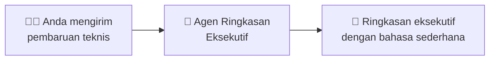

# Modul 0 - Pendahuluan

⏱️ ~10 menit

> [!WARNING]
> **Pratinjau & Keterbatasan:** [Hosted Agents](https://learn.microsoft.com/azure/foundry/agents/concepts/hosted-agents) saat ini dalam **pratinjau publik** - tidak direkomendasikan untuk beban kerja produksi. Perhatikan hal-hal berikut:
> - **Wilayah yang didukung terbatas** - periksa [ketersediaan wilayah](https://learn.microsoft.com/azure/foundry/agents/concepts/hosted-agents#region-availability) sebelum membuat sumber daya. Jika Anda memilih wilayah yang tidak didukung, penyebaran akan gagal.
> - Paket `azure-ai-agentserver-agentframework` masih pre-release - API dapat berubah antar versi.
> - Batas skala: hosted agents mendukung 0–5 replika (termasuk skala ke nol).
> - Beberapa fitur yang ditampilkan dalam lokakarya ini mungkin berubah saat layanan menuju GA.

## Apa yang akan Anda buat

Dalam lokakarya ini, Anda akan membuat agen **"Jelaskan Seperti Saya Eksekutif"** - agen AI hosted yang mengambil pembaruan teknis kompleks dan menulis ulang sebagai ringkasan eksekutif dalam bahasa Inggris yang sederhana.

```mermaid
flowchart LR
    A["🧑‍💻 Anda mengirim\npembaruan teknis"] --> B["🤖 Agen Ringkasan\nEksekutif"]
    B --> C["📝 Ringkasan eksekutif\ndengan bahasa sederhana"]
```

**Agen ini menggunakan:**
- **Microsoft Agent Framework** - untuk logika dan struktur agen
- **Foundry Toolkit untuk VS Code** - untuk membuat kerangka kerja, menguji secara lokal, dan menyebarkan
- **Model AI** (misalnya, `gpt-4.1-mini/gpt-5-mini`) - untuk menghasilkan ringkasan

Pada akhir lab ini, Anda akan memiliki agen yang berfungsi yang dapat Anda uji secara lokal melalui Agent Inspector, dan opsional menyebarkannya ke cloud.

---

## Apa itu hosted agents?

**Hosted agent** adalah agen AI yang berjalan sebagai layanan terkelola di Microsoft Foundry. Alih-alih mengelola infrastruktur sendiri, Anda mengemas kode agen Anda dalam sebuah container dan Foundry menangani penskalaan, hosting, dan mengekspose melalui endpoint HTTP standar.

| Konsep | Artinya |
|---------|--------------|
| **Agen** | Kode Python Anda yang menerima pesan pengguna, memanggil model AI, dan mengembalikan respons terstruktur |
| **Hosted** | Foundry menjalankan container Anda untuk Anda - tidak ada VM, tidak ada Kubernetes, tidak ada infrastruktur yang harus dikelola |
| **Protokol respons** | API HTTP standar (`POST /responses`) yang dapat dipanggil klien untuk berinteraksi dengan agen Anda |
| **Agent Inspector** | UI pengujian lokal (terintegrasi di Foundry Toolkit) yang memungkinkan Anda mengobrol dengan agen sebelum menyebarkan |

Dalam lokakarya ini, Anda akan mulai dari nol hingga agen fully hosted - atau berhenti di pengujian lokal jika Anda mau.

---

## Pilih jalur Anda

> ⚠️ **Pilih satu jalur sebelum melanjutkan.** Pilihan Anda menentukan alat yang harus diinstal dan modul mana yang berlaku. Anda bisa beralih dari Jalur B → Jalur A nanti jika Anda mendapatkan langganan.

<strong>🅰️ Jalur A - Azure cloud (memerlukan langganan Azure)</strong>

| | Rincian |
|---|---|
| **Untuk siapa?** | Anda memiliki langganan Azure aktif dan dapat membuat sumber daya Foundry |
| **Model** | Azure OpenAI melalui Foundry (misalnya, `gpt-4.1-mini/gpt-5-mini`) |
| **Modul yang dibahas** | Semua modul (00–07) |
| **Menyebarkan ke cloud?** | ✅ Ya - penyebaran end-to-end penuh |

<strong>🅱️ Jalur B - Lokal / free-tier (tidak perlu langganan Azure)</strong>

| | Rincian |
|---|---|
| **Untuk siapa?** | MVP, pelajar, atau siapa saja tanpa akses Azure |
| **Model** | **Foundry Local** (gratis, berjalan di mesin Anda) |
| **Modul yang dibahas** | Modul 00–04 (lewati penyebaran & verifikasi cloud) |
| **Menyebarkan ke cloud?** | ❌ Tidak - hanya pengujian lokal via Agent Inspector |

---

## Semua jalur: Alat yang dibutuhkan

Instal setiap alat di bawah ini. Setelah instalasi, pastikan berfungsi dengan menjalankan perintah pemeriksaan.

| # | Alat | Versi | Instalasi | Verifikasi (Output yang Diharapkan) |
|---|------|---------|---------|---------------------------|
| 1 | **Visual Studio Code** | Terbaru | [code.visualstudio.com](https://code.visualstudio.com/) | Membuka tanpa error |
| 2 | **Python** | 3.12 atau lebih tinggi | [python.org/downloads](https://www.python.org/downloads/) | `python --version` $\rightarrow$ `Python 3.12.x` |
| 3 | **Foundry Toolkit for VS Code** | Terbaru | Extension ID: `ms-windows-ai-studio.windows-ai-studio` | Ikon Foundry di Bilah Aktivitas |
| 4 | **Ekstensi Python untuk VS Code** | Terbaru | Extension ID: `ms-python.python` | Terpasang di panel Ekstensi |

> [!TIP]
> **Tips profesional untuk instalasi:**
> - **PATH Python (Windows):** Selalu centang **"Add Python to PATH"** di layar pertama penginstal Python. Tanpa ini, `python` tidak akan dikenali di terminal Anda.
> - **Beberapa versi Python:** Jika Anda memiliki Python 3.10 dan 3.12 terpasang, gunakan `python3.12 -m venv .venv` untuk memastikan versi yang benar digunakan untuk lingkungan virtual Anda.
> - **Docker WSL 2 (Windows):** Saat instalasi Docker Desktop, pastikan backend **WSL 2** dipilih. Docker dengan Hyper-V lebih lambat dan dapat menyebabkan masalah dengan build container Foundry.
> - **Docker tidak mulai?** Tunggu 30–60 detik setelah meluncurkan Docker Desktop. Jalankan `docker info` - jika Anda melihat "Cannot connect to the Docker daemon," Docker masih dalam proses inisialisasi.
> - **Ekstensi VS Code tidak muncul?** Setelah memasang ekstensi, muat ulang jendela: `Ctrl+Shift+P` → `Developer: Reload Window`.

> **Pengguna Windows:** Periksa **"Add Python to PATH"** selama instalasi Python.

**Selanjutnya:** [01 - Setup →](01-setup.md)

---

<!-- CO-OP TRANSLATOR DISCLAIMER START -->
**Penafian**:
Dokumen ini telah diterjemahkan menggunakan layanan terjemahan AI [Co-op Translator](https://github.com/Azure/co-op-translator). Meskipun kami berupaya untuk mencapai akurasi, harap diketahui bahwa terjemahan otomatis mungkin mengandung kesalahan atau ketidakakuratan. Dokumen asli dalam bahasa aslinya harus dianggap sebagai sumber yang sah. Untuk informasi penting, disarankan menggunakan terjemahan profesional oleh manusia. Kami tidak bertanggung jawab atas kesalahpahaman atau penafsiran yang keliru yang timbul dari penggunaan terjemahan ini.
<!-- CO-OP TRANSLATOR DISCLAIMER END -->