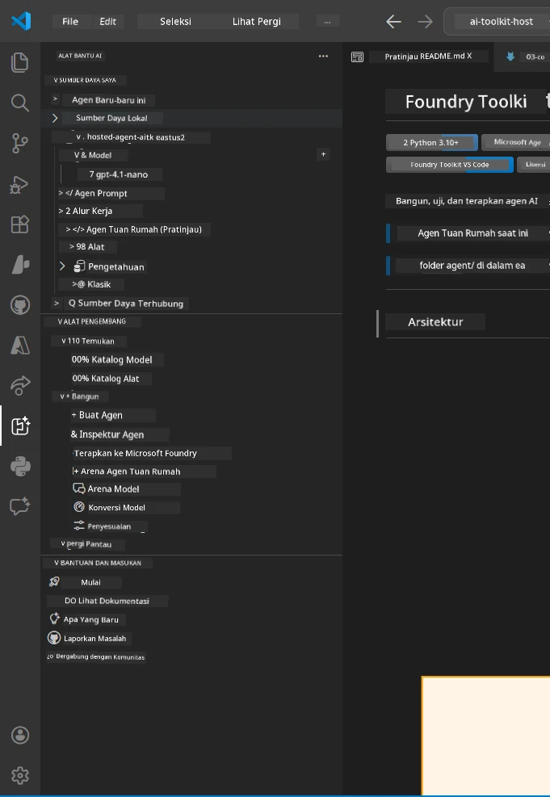
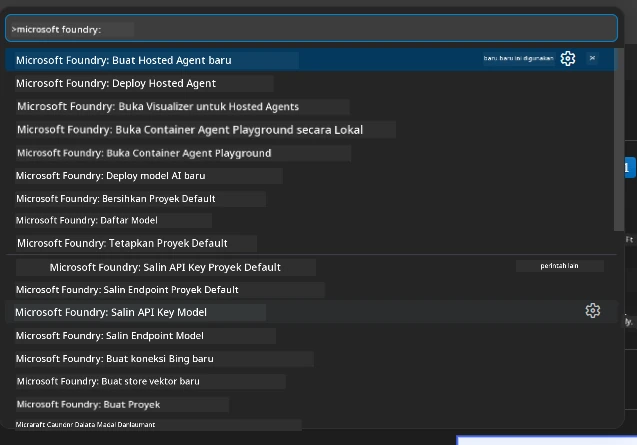

# Modul 1 - Instal Foundry Toolkit & Foundry Extension

Modul ini memandu Anda melalui instalasi dan verifikasi dua ekstensi VS Code utama untuk workshop ini. Jika Anda sudah menginstalnya selama [Modul 0](00-prerequisites.md), gunakan modul ini untuk memverifikasi bahwa keduanya bekerja dengan benar.

---

## Langkah 1: Instal Ekstensi Microsoft Foundry

Ekstensi **Microsoft Foundry for VS Code** adalah alat utama Anda untuk membuat proyek Foundry, menyebarkan model, membuat agen hosted, dan menyebarkan langsung dari VS Code.

1. Buka VS Code.
2. Tekan `Ctrl+Shift+X` untuk membuka panel **Extensions**.
3. Di kotak pencarian di atas, ketik: **Microsoft Foundry**
4. Cari hasil dengan judul **Microsoft Foundry for Visual Studio Code**.
   - Penerbit: **Microsoft**
   - Extension ID: `TeamsDevApp.vscode-ai-foundry`
5. Klik tombol **Install**.
6. Tunggu hingga instalasi selesai (Anda akan melihat indikator kemajuan kecil).
7. Setelah instalasi, lihat **Activity Bar** (bar ikon vertikal di sisi kiri VS Code). Anda harus melihat ikon baru **Microsoft Foundry** (terlihat seperti berlian/ikon AI).
8. Klik ikon **Microsoft Foundry** untuk membuka tampilan sidebar-nya. Anda harus melihat bagian untuk:
   - **Resources** (atau Proyek)
   - **Agents**
   - **Models**

> **Jika ikon tidak muncul:** Coba muat ulang VS Code (`Ctrl+Shift+P` → `Developer: Reload Window`).

---

## Langkah 2: Instal Ekstensi Foundry Toolkit

Ekstensi **Foundry Toolkit** menyediakan [**Agent Inspector**](https://learn.microsoft.com/azure/foundry/agents/how-to/vs-code-agents-workflow-pro-code) - antarmuka visual untuk menguji dan debug agen secara lokal - serta playground, manajemen model, dan alat evaluasi.

1. Di panel Extensions (`Ctrl+Shift+X`), kosongkan kotak pencarian dan ketik: **Foundry Toolkit**
2. Temukan **Foundry Toolkit** di hasil pencarian.
   - Penerbit: **Microsoft**
   - Extension ID: `ms-windows-ai-studio.windows-ai-studio`
3. Klik **Install**.
4. Setelah instalasi, ikon **Foundry Toolkit** muncul di Activity Bar (terlihat seperti ikon robot/berkilau).
5. Klik ikon **Foundry Toolkit** untuk membuka tampilan sidebar-nya. Anda harus melihat layar sambutan Foundry Toolkit dengan opsi untuk:
   - **Models**
   - **Playground**
   - **Agents**

---

## Langkah 3: Verifikasi kedua ekstensi berfungsi

### 3.1 Verifikasi Ekstensi Microsoft Foundry

1. Klik ikon **Microsoft Foundry** di Activity Bar.
2. Jika Anda sudah masuk ke Azure (dari Modul 0), Anda harus melihat daftar proyek Anda di bawah **Resources**.
3. Jika diminta untuk masuk, klik **Sign in** dan ikuti proses autentikasi.
4. Pastikan Anda dapat melihat sidebar tanpa kesalahan.

### 3.2 Verifikasi Ekstensi Foundry Toolkit

1. Klik ikon **Foundry Toolkit** di Activity Bar.
2. Pastikan tampilan sambutan atau panel utama terbuka tanpa kesalahan.
3. Anda belum perlu mengonfigurasi apa pun - kita akan menggunakan Agent Inspector di [Modul 5](05-test-locally.md).

### 3.3 Verifikasi melalui Command Palette

1. Tekan `Ctrl+Shift+P` untuk membuka Command Palette.
2. Ketik **"Microsoft Foundry"** - Anda harus melihat perintah seperti:
   - `Microsoft Foundry: Create a New Hosted Agent`
   - `Microsoft Foundry: Deploy Hosted Agent`
   - `Microsoft Foundry: Open Model Catalog`
3. Tekan `Escape` untuk menutup Command Palette.
4. Buka kembali Command Palette dan ketik **"Foundry Toolkit"** - Anda harus melihat perintah seperti:
   - `Foundry Toolkit: Open Agent Inspector`

> Jika Anda tidak melihat perintah-perintah ini, ekstensi mungkin tidak terpasang dengan benar. Coba uninstall lalu install kembali.

---

## Fungsi ekstensi ini dalam workshop ini

| Ekstensi | Fungsinya | Kapan digunakan |
|-----------|-------------|-------------------|
| **Microsoft Foundry for VS Code** | Membuat proyek Foundry, menyebarkan model, **membuat [hosted agents](https://learn.microsoft.com/azure/foundry/agents/concepts/hosted-agents)** (otomatis membuat `agent.yaml`, `main.py`, `Dockerfile`, `requirements.txt`), menyebarkan ke [Foundry Agent Service](https://learn.microsoft.com/azure/foundry/agents/overview) | Modul 2, 3, 6, 7 |
| **Foundry Toolkit** | Agent Inspector untuk pengujian/debug lokal, UI playground, manajemen model | Modul 5, 7 |

> **Ekstensi Foundry adalah alat paling penting di workshop ini.** Ia menangani siklus hidup secara end-to-end: buat → konfigurasi → deploy → verifikasi. Foundry Toolkit melengkapi dengan menyediakan Agent Inspector visual untuk pengujian lokal.

---

### Pengecekan

- [ ] Ikon Microsoft Foundry terlihat di Activity Bar
- [ ] Mengkliknya membuka sidebar tanpa kesalahan
- [ ] Ikon Foundry Toolkit terlihat di Activity Bar
- [ ] Mengkliknya membuka sidebar tanpa kesalahan
- [ ] `Ctrl+Shift+P` → mengetik "Microsoft Foundry" menampilkan perintah yang tersedia
- [ ] `Ctrl+Shift+P` → mengetik "Foundry Toolkit" menampilkan perintah yang tersedia

---

**Sebelumnya:** [00 - Prasyarat](00-prerequisites.md) · **Selanjutnya:** [02 - Membuat Proyek Foundry →](02-create-foundry-project.md)

---

<!-- CO-OP TRANSLATOR DISCLAIMER START -->
**Penafian**:  
Dokumen ini telah diterjemahkan menggunakan layanan terjemahan AI [Co-op Translator](https://github.com/Azure/co-op-translator). Meskipun kami berupaya untuk akurasi, harap diperhatikan bahwa terjemahan otomatis mungkin mengandung kesalahan atau ketidakakuratan. Dokumen asli dalam bahasa aslinya harus dianggap sebagai sumber yang berwenang. Untuk informasi penting, disarankan menggunakan terjemahan profesional oleh manusia. Kami tidak bertanggung jawab atas kesalahpahaman atau penafsiran yang salah yang timbul dari penggunaan terjemahan ini.
<!-- CO-OP TRANSLATOR DISCLAIMER END -->