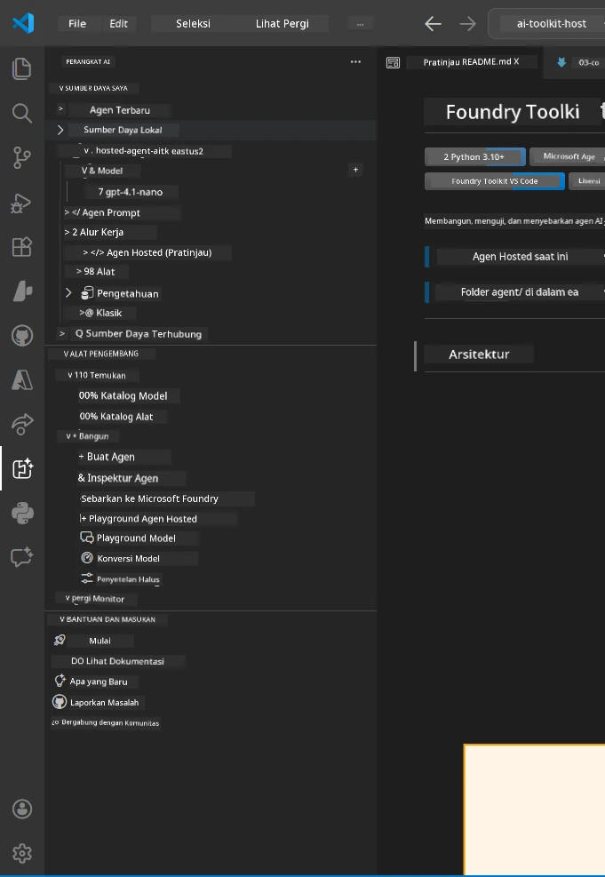
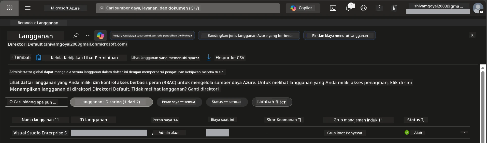
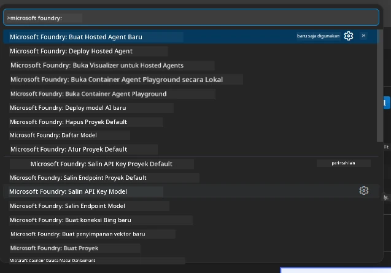
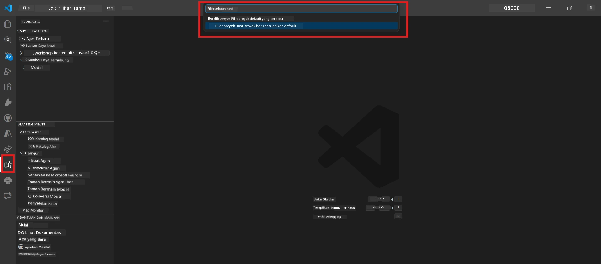
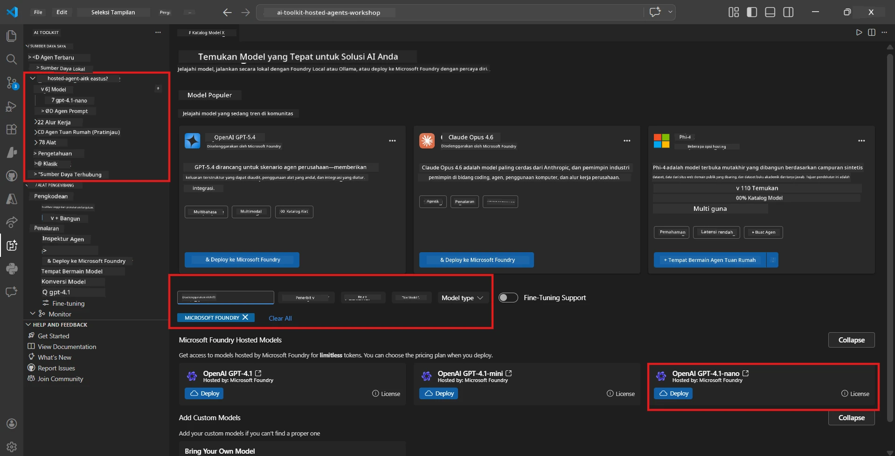
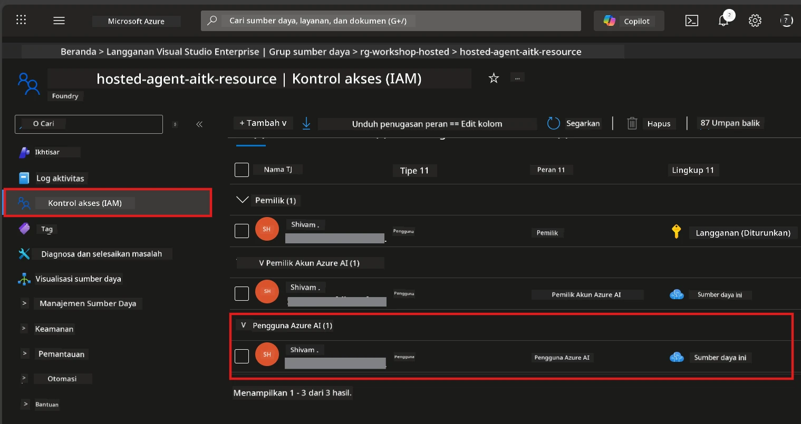

# Setup: Ekstensi, Proyek & Model

⏱️ ~15 menit

Dalam modul ini, Anda menginstal dan memverifikasi ekstensi Foundry Toolkit, membuat (atau menghubungkan ke) proyek Foundry, dan menerapkan model yang akan digunakan agen Anda.

## Langkah 1: Instal Foundry Toolkit

**Foundry Toolkit untuk VS Code** adalah ekstensi utama untuk lokakarya ini. Ini menyediakan pembuatan proyek, penerapan model, kerangka kerja agen, pengujian lokal (Agent Inspector), dan penerapan cloud - semua dari VS Code.

1. Buka VS Code lalu tekan `Ctrl+Shift+X` untuk membuka panel **Extensions**.
2. Cari **Foundry Toolkit**.
3. Instal **Foundry Toolkit for VS Code** (Publisher: Microsoft, ID: `ms-windows-ai-studio.windows-ai-studio`).
4. Setelah instalasi, ikon **Foundry Toolkit** muncul di Activity Bar (sidebar kiri).

> *Catatan: Activity Bar mungkin menampilkan "AI TOOLKIT" di versi ekstensi yang lebih lama. Fungsionalitasnya identik.*



## Langkah 2: Siapkan berdasarkan akses Anda

> **Pilih jalur Anda:** Perluas bagian di bawah ini yang sesuai dengan pengaturan Anda. Anda hanya perlu menyelesaikan **satu** jalur.

<details>
<summary><strong>🅰️ Jalur A - Cloud Azure (memerlukan langganan Azure)</strong></summary>

### Azure CLI

1. Instal dari [learn.microsoft.com/cli/azure/install-azure-cli](https://learn.microsoft.com/cli/azure/install-azure-cli).
2. Verifikasi: `az --version` (harapkan 2.80.0+).
3. Masuk: `az login`

### Opsi Autentikasi

[Microsoft Agent Framework](https://learn.microsoft.com/agent-framework/overview/) menggunakan [`DefaultAzureCredential`](https://learn.microsoft.com/azure/developer/python/sdk/authentication/credential-chains#defaultazurecredential-overview) yang mencoba beberapa metode autentikasi secara berurutan. Pilih yang sesuai dengan lingkungan Anda:

#### Opsi 1: Akun VS Code (direkomendasikan untuk lokakarya)
1. Klik ikon **Accounts** (siluet orang) di kiri bawah VS Code.
2. Pilih **Sign in to use Microsoft Foundry** (atau **Sign in with Azure**).
3. Browser terbuka - masuk dengan akun Azure yang memiliki akses ke langganan Anda.
4. Kembali ke VS Code. Anda harus melihat nama akun Anda di kiri bawah.

#### Opsi 2: Azure CLI
```bash
az login
az account set --subscription "<your-subscription-id>"
```

#### Opsi 3: Service Principal (Enterprise/CI)
Untuk lingkungan terbatas atau pipeline CI/CD, atur variabel lingkungan ini di file `.env` Anda:
```env
AZURE_TENANT_ID=<your-tenant-id>
AZURE_CLIENT_ID=<your-client-id>
AZURE_CLIENT_SECRET=<your-client-secret>
```

> **Cara kerja `DefaultAzureCredential`:** Ia mencoba variabel lingkungan terlebih dahulu, kemudian managed identity, lalu sign-in VS Code, kemudian Azure CLI - dan menggunakan yang berhasil pertama kali. Lihat [dokumentasi rantai kredensial](https://learn.microsoft.com/azure/developer/python/sdk/authentication/credential-chains#defaultazurecredential-overview).

### Azure Developer CLI (azd)

1. Instal: `winget install microsoft.azd` (Windows) atau lihat [dokumen instalasi](https://learn.microsoft.com/azure/developer/azure-developer-cli/install-azd).
2. Verifikasi: `azd version`
3. Masuk: `azd auth login`

### Docker Desktop (opsional)

Docker hanya dibutuhkan jika Anda ingin membangun kontainer secara lokal. Ekstensi Foundry menangani pembangunan secara otomatis selama penerapan.

1. Instal dari [docs.docker.com/get-docker](https://docs.docker.com/get-docker/).
2. Verifikasi: `docker info`

### Langganan Azure & RBAC

1. Masuk di [portal.azure.com](https://portal.azure.com).
2. Navigasi ke **Subscriptions** dan pastikan setidaknya satu berstatus **Active**.
3. Catat **Subscription ID** Anda - Anda akan membutuhkannya di Modul 01.



#### Tabel Skenario RBAC

[Hosted Agent](https://learn.microsoft.com/azure/foundry/agents/concepts/hosted-agents) penerapan membutuhkan izin **aksi data** yang tidak termasuk dalam peran Azure `Owner` dan `Contributor` standar. Gunakan tabel berikut untuk menentukan peran yang Anda butuhkan:

| Skenario | Peran yang Dibutuhkan | Tempat Menetapkan |
|----------|---------------------|------------------|
| Membuat proyek Foundry baru | **Azure AI Owner** pada sumber daya Foundry | Sumber daya Foundry di Azure Portal |
| Terapkan ke proyek yang ada (sumber daya baru) | **Azure AI Owner** + **Contributor** pada langganan | Langganan + sumber daya Foundry |
| Terapkan ke proyek yang sudah dikonfigurasi penuh | **Reader** pada akun + **Azure AI User** pada proyek | Akun + Proyek di Azure Portal |
| Pengujian lokal saja (tanpa penerapan) | **Azure AI User** pada proyek | Proyek di Azure Portal |

> **Poin penting:** Peran Azure `Owner` dan `Contributor` hanya mencakup izin *manajemen* (operasi ARM). Anda perlu [**Azure AI User**](https://learn.microsoft.com/azure/foundry/concepts/rbac-foundry#built-in-roles) (atau lebih tinggi) untuk *aksi data* seperti `agents/write` yang dibutuhkan untuk membuat dan menerapkan agen.

## Hubungkan atau buat proyek Foundry



1. Tekan `Ctrl+Shift+P` → ketik **Foundry Toolkit: Create Project** → pilih opsi tersebut.
2. Pilih **langganan Azure** Anda dari dropdown.
3. Pilih atau buat **resource group** (misal, `rg-hosted-agents-workshop`).
4. Pilih **wilayah** yang mendukung hosted agents: `East US`, `West US 2`, atau `Sweden Central`. Lihat [ketersediaan wilayah](https://learn.microsoft.com/azure/foundry/agents/concepts/hosted-agents#region-availability).
5. Masukkan nama proyek (misal, `workshop-agents`).
6. Tunggu 2–5 menit untuk provisioning. Notifikasi progres muncul di VS Code.
7. Setelah selesai, proyek Anda muncul di sidebar **Foundry Toolkit** di bawah **MY RESOURCES**.



## Terapkan model & tetapkan RBAC

Agen hosted Anda membutuhkan model AI untuk menghasilkan respons.

#### Matriks Pemilihan Model
Bergantung pada kebutuhan Anda, Anda dapat memilih dari berbagai tingkatan model:

| Model | Terbaik untuk | Biaya | Catatan |
|-------|--------------|-------|---------|
| `gpt-4.1` | Respons berkualitas tinggi dan bernuansa | Lebih tinggi | Hasil terbaik, direkomendasikan untuk pengujian akhir |
| `gpt-4.1-mini/gpt-5-mini` | Iterasi cepat, biaya lebih rendah | Lebih rendah | Baik untuk pengembangan lokakarya dan pengujian cepat |
| `gpt-4.1-nano` | Tugas ringan | Paling rendah | Paling hemat biaya, tapi respons lebih sederhana |

1. Tekan `Ctrl+Shift+P` → **Foundry Toolkit: Open Model Catalog** (atau klik **Model Catalog** di sidebar di bawah DEVELOPER TOOLS → Discover).
2. Cari **gpt-4.1** di katalog.
3. Temukan **OpenAI GPT-4.1-mini** (atau `gpt-5-mini` untuk kualitas lebih baik) dan klik **Deploy**.



4. Dalam konfigurasi penerapan:
   - **Nama penerapan:** Biarkan default atau masukkan nama khusus. **Ingat nama ini.**
   - **Target:** Pilih **Deploy to Foundry Toolkit** → pilih proyek Anda.
5. Klik **Deploy** dan tunggu 1–3 menit.

> **Rekomendasi:** Gunakan `gpt-4.1-mini/gpt-5-mini` untuk lokakarya - cepat, terjangkau, dan menghasilkan hasil yang baik.

### Catat nilai Anda

Setelah penerapan, catat dua nilai ini (Anda akan membutuhkannya di Modul 03):

| Nilai | Tempat Menemukannya |
|-------|---------------------|
| **Endpoint proyek** | Klik proyek Anda di sidebar → tampilan detail menunjukkan URL (misal, `https://<account>.services.ai.azure.com/api/projects/<project>`) |
| **Nama penerapan model** | Perluas proyek → **Models** → nama di samping model yang diterapkan (misal, `gpt-4.1-mini/gpt-5-mini`) |

### Tetapkan peran RBAC

> ⚠️ **Ini adalah langkah yang paling sering terlewat.** Tanpa peran yang benar, penerapan di Modul 05 akan gagal.

#### Peran apa yang saya butuhkan?
Bergantung pada skenario Anda, Anda memerlukan kombinasi peran berikut:

| Skenario | Peran yang Dibutuhkan | Tempat Menetapkan |
|----------|---------------------|------------------|
| Membuat proyek Foundry baru | **Azure AI Owner** pada sumber daya Foundry | Sumber daya Foundry di Azure Portal |
| Terapkan ke proyek yang ada (sumber daya baru) | **Azure AI Owner** + **Contributor** pada langganan | Langganan + sumber daya Foundry |
| Terapkan ke proyek yang sudah dikonfigurasi penuh | **Reader** pada akun + **Azure AI User** pada proyek | Akun + Proyek di Azure Portal |

**Poin penting:** Peran Azure `Owner` dan `Contributor` hanya mencakup izin *manajemen*. Anda perlu **Azure AI User** (atau lebih tinggi) untuk *aksi data* seperti `agents/write` yang dibutuhkan untuk membuat dan menerapkan agen.

1. Buka [portal.azure.com](https://portal.azure.com).
2. Cari nama **proyek Foundry** Anda → klik hasil dengan tipe **"Foundry Toolkit project"** (BUKAN akun induk).
3. Klik **Access control (IAM)** di navigasi kiri.
4. Klik **+ Add** → **Add role assignment**.
5. **Tab Role:** Cari **Azure AI User**, pilih, klik **Next**.
6. **Tab Members:** Pilih **User, group, or service principal** → klik **+ Select members** → cari dan pilih diri Anda → klik **Select**.
7. Klik **Review + assign** → klik lagi **Review + assign**.
8. **Tunggu 1–2 menit** untuk propagasi.

> **Mengapa peran ini?** Azure `Owner`/`Contributor` hanya memberikan izin manajemen. Peran **Azure AI User** memberikan aksi data `agents/write` yang diperlukan untuk membuat dan menerapkan agen. Lihat [dokumentasi RBAC Foundry](https://learn.microsoft.com/azure/foundry/concepts/rbac-foundry#built-in-roles).



</details>

<details>
<summary><strong>🅱️ Jalur B - Lokal / free-tier (tidak perlu langganan Azure)</strong></summary>

### Foundry Local

Foundry Local memungkinkan Anda menjalankan model AI di mesin Anda sendiri - tanpa perlu akun cloud. Anda dapat mengakses model Foundry Local menggunakan Foundry Toolkit melalui katalog model sebagai berikut:

1. Buka ekstensi Foundry Toolkit.
2. Dalam navigasi Foundry Toolkit, pergi ke **Developer Tools** > dan pilih **Model Catalog**
3. Di jendela baru, pilih **local** dari bilah navigasi.
4. Gulir ke bawah ke **Phi 4 Mini,** dan klik tombol **tambah** sebuah pop-up akan muncul menunjukkan model sedang diunduh.
5. Setelah model selesai diunduh, Anda bisa melanjutkan ke langkah berikutnya.

</details>

### ✅ Titik Pemeriksaan


- [ ] `Ctrl+Shift+P` → "Foundry Toolkit" menampilkan perintah yang tersedia
- [ ] Ekstensi Foundry Toolkit terinstal dan sidebar terbuka tanpa error
- [ ] VS Code terbuka dan berjalan dengan benar
- [ ] `python --version` menunjukkan 3.10+
- [ ] Ikon Foundry Toolkit terlihat di Activity Bar VS Code
- [ ] **Jalur A:** `az login` berhasil, langganan aktif
- [ ] **Jalur B:** Foundry Local berjalan (`foundry local status`)
- [ ] **Jalur A:** Proyek Foundry terlihat di sidebar, model diterapkan, peran Azure AI User ditetapkan
- [ ] **Jalur B:** Foundry Local berjalan dengan model
- [ ] Anda telah mencatat **endpoint** dan **nama penerapan model**


**Sebelumnya:** [00 - Prasyarat](00-prerequisites.md) · **Selanjutnya:** [02 - Buat Hosted Agent →](02-create-hosted-agent.md)

---

<!-- CO-OP TRANSLATOR DISCLAIMER START -->
**Penafian**:
Dokumen ini telah diterjemahkan menggunakan layanan terjemahan AI [Co-op Translator](https://github.com/Azure/co-op-translator). Meskipun kami berupaya untuk mencapai akurasi, harap diketahui bahwa terjemahan otomatis mungkin mengandung kesalahan atau ketidakakuratan. Dokumen asli dalam bahasa aslinya harus dianggap sebagai sumber yang sah. Untuk informasi penting, disarankan menggunakan terjemahan profesional oleh manusia. Kami tidak bertanggung jawab atas kesalahpahaman atau penafsiran yang keliru yang timbul dari penggunaan terjemahan ini.
<!-- CO-OP TRANSLATOR DISCLAIMER END -->