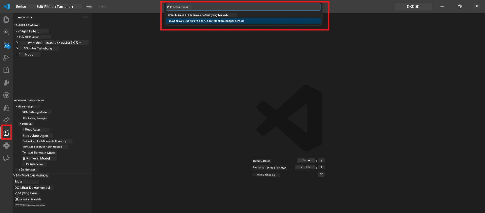
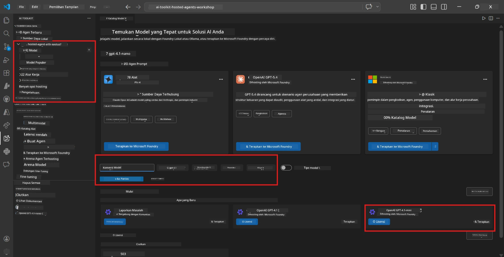
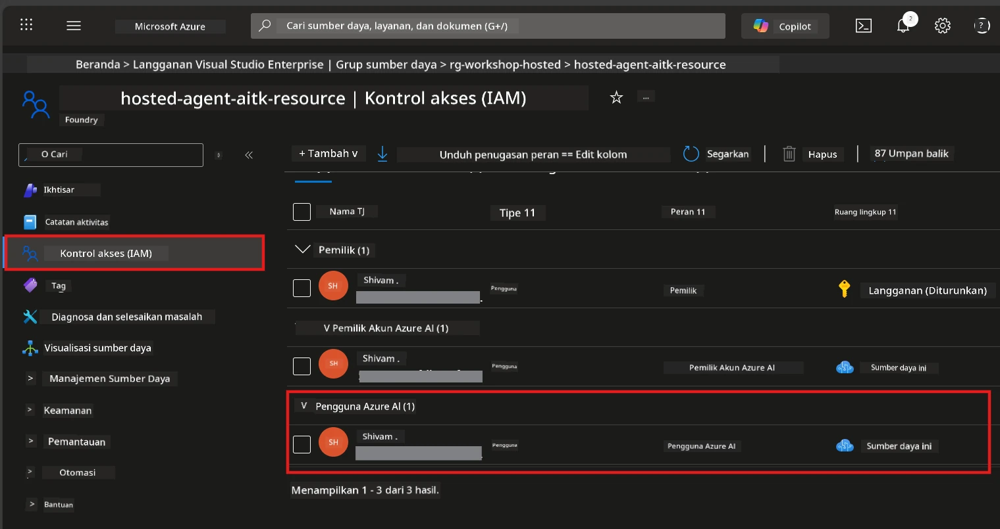

# Modul 2 - Membuat Proyek Foundry & Menerapkan Model

Dalam modul ini, Anda membuat (atau memilih) proyek Microsoft Foundry dan menerapkan model yang akan digunakan agen Anda. Setiap langkah dituliskan secara eksplisit - ikuti urutannya.

> Jika Anda sudah memiliki proyek Foundry dengan model yang diterapkan, lewati ke [Modul 3](03-create-hosted-agent.md).

---

## Langkah 1: Membuat proyek Foundry dari VS Code

Anda akan menggunakan ekstensi Microsoft Foundry untuk membuat proyek tanpa meninggalkan VS Code.

1. Tekan `Ctrl+Shift+P` untuk membuka **Command Palette**.
2. Ketik: **Microsoft Foundry: Create Project** dan pilih.
3. Dropdown muncul - pilih **langganan Azure** Anda dari daftar.
4. Anda akan diminta memilih atau membuat **resource group**:
   - Untuk membuat yang baru: ketik nama (misal, `rg-hosted-agents-workshop`) lalu tekan Enter.
   - Untuk menggunakan yang sudah ada: pilih dari dropdown.
5. Pilih **region**. **Penting:** Pilih region yang mendukung hosted agents. Cek [ketersediaan region](https://learn.microsoft.com/azure/foundry/agents/concepts/hosted-agents#region-availability) - pilihan umum adalah `East US`, `West US 2`, atau `Sweden Central`.
6. Masukkan **nama** untuk proyek Foundry (misal, `workshop-agents`).
7. Tekan Enter dan tunggu penyediaan selesai.

> **Penyediaan memakan waktu 2-5 menit.** Anda akan melihat notifikasi progres di pojok kanan bawah VS Code. Jangan tutup VS Code selama penyediaan.

8. Setelah selesai, sidebar **Microsoft Foundry** akan menampilkan proyek baru Anda di bawah **Resources**.
9. Klik nama proyek untuk memperluas dan pastikan menampilkan bagian seperti **Models + endpoints** dan **Agents**.



### Alternatif: Membuat melalui Portal Foundry

Jika Anda lebih suka menggunakan browser:

1. Buka [https://ai.azure.com](https://ai.azure.com) dan masuk.
2. Klik **Create project** di halaman utama.
3. Masukkan nama proyek, pilih langganan, resource group, dan region.
4. Klik **Create** dan tunggu proses penyediaan.
5. Setelah dibuat, kembali ke VS Code - proyek akan muncul di sidebar Foundry setelah refresh (klik ikon refresh).

---

## Langkah 2: Menerapkan model

[Agen hosted Anda](https://learn.microsoft.com/azure/foundry/agents/concepts/hosted-agents) membutuhkan model Azure OpenAI untuk menghasilkan respons. Anda akan [menerapkan satu sekarang](https://learn.microsoft.com/azure/ai-foundry/openai/how-to/create-resource#deploy-a-model).

1. Tekan `Ctrl+Shift+P` untuk membuka **Command Palette**.
2. Ketik: **Microsoft Foundry: Open [Model Catalog](https://learn.microsoft.com/azure/ai-foundry/openai/concepts/models)** dan pilih.
3. Tampilan Model Catalog terbuka di VS Code. Jelajahi atau gunakan bar pencarian untuk menemukan **gpt-4.1**.
4. Klik kartu model **gpt-4.1** (atau `gpt-4.1-mini` jika Anda ingin biaya lebih rendah).
5. Klik **Deploy**.


6. Pada konfigurasi penerapan:
   - **Deployment name**: Biarkan default (misal, `gpt-4.1`) atau masukkan nama khusus. **Ingat nama ini** - akan digunakan di Modul 4.
   - **Target**: Pilih **Deploy to Microsoft Foundry** dan pilih proyek yang baru dibuat.
7. Klik **Deploy** dan tunggu penerapan selesai (1-3 menit).

### Memilih model

| Model | Cocok untuk | Biaya | Catatan |
|-------|-------------|-------|---------|
| `gpt-4.1` | Respons berkualitas tinggi dan nuansa | Lebih tinggi | Hasil terbaik, disarankan untuk pengujian akhir |
| `gpt-4.1-mini` | Iterasi cepat, biaya rendah | Lebih rendah | Baik untuk pengembangan workshop dan pengujian cepat |
| `gpt-4.1-nano` | Tugas ringan | Paling rendah | Paling hemat biaya, tapi respons lebih sederhana |

> **Rekomendasi untuk workshop ini:** Gunakan `gpt-4.1-mini` untuk pengembangan dan pengujian. Cepat, murah, dan menghasilkan hasil baik untuk latihan.

### Verifikasi penerapan model

1. Di sidebar **Microsoft Foundry**, perluas proyek Anda.
2. Lihat bagian **Models + endpoints** (atau bagian serupa).
3. Anda harus melihat model yang diterapkan (misal, `gpt-4.1-mini`) dengan status **Succeeded** atau **Active**.
4. Klik pada penerapan model untuk melihat detailnya.
5. **Catat** dua nilai berikut - akan dibutuhkan di Modul 4:

   | Pengaturan | Lokasi | Contoh nilai |
   |------------|--------|--------------|
   | **Project endpoint** | Klik nama proyek di sidebar Foundry. URL endpoint tampil di tampilan detail. | `https://<account>.services.ai.azure.com/api/projects/<project>` |
   | **Model deployment name** | Nama yang tampil di sebelah model yang diterapkan. | `gpt-4.1-mini` |

---

## Langkah 3: Tetapkan peran RBAC yang dibutuhkan

Ini adalah **langkah yang paling sering terlewat**. Tanpa peran yang tepat, penerapan di Modul 6 akan gagal dengan kesalahan izin.

### 3.1 Tetapkan peran Azure AI User ke diri sendiri

1. Buka browser dan akses [https://portal.azure.com](https://portal.azure.com).
2. Di bilah pencarian atas, ketik nama **proyek Foundry** Anda lalu klik di hasil.
   - **Penting:** Pastikan Anda masuk ke sumber daya **proyek** ("Microsoft Foundry project"), **bukan** sumber daya akun/hub induk.
3. Di navigasi kiri proyek, klik **Access control (IAM)**.
4. Klik tombol **+ Add** di atas → pilih **Add role assignment**.
5. Di tab **Role**, cari [**Azure AI User**](https://learn.microsoft.com/azure/foundry/concepts/rbac-foundry#built-in-roles) dan pilih. Klik **Next**.
6. Di tab **Members**:
   - Pilih **User, group, or service principal**.
   - Klik **+ Select members**.
   - Cari nama atau email Anda, pilih, lalu klik **Select**.
7. Klik **Review + assign** → kemudian klik lagi **Review + assign** untuk mengonfirmasi.



### 3.2 (Opsional) Tetapkan peran Azure AI Developer

Jika Anda perlu membuat sumber daya tambahan dalam proyek atau mengelola penerapan secara pemrograman:

1. Ulangi langkah di atas, tapi pada langkah 5 pilih **Azure AI Developer**.
2. Tetapkan ini di tingkat **Foundry resource (akun)**, bukan hanya proyek.

### 3.3 Verifikasi penetapan peran Anda

1. Di halaman **Access control (IAM)** proyek, klik tab **Role assignments**.
2. Cari nama Anda.
3. Anda harus melihat setidaknya **Azure AI User** untuk lingkup proyek.

> **Mengapa ini penting:** Peran [`Azure AI User`](https://learn.microsoft.com/azure/foundry/concepts/rbac-foundry#built-in-roles) memberikan aksi data `Microsoft.CognitiveServices/accounts/AIServices/agents/write`. Tanpanya, Anda akan melihat kesalahan ini saat penerapan:
>
> ```
> Error: lacks the required data action 
> Microsoft.CognitiveServices/accounts/AIServices/agents/write 
> to perform POST /api/projects/{projectName}/assistants operation.
> ```
>
> Lihat [Modul 8 - Pemecahan Masalah](08-troubleshooting.md) untuk detail lebih lanjut.

---

### Titik pemeriksaan

- [ ] Proyek Foundry sudah ada dan terlihat di sidebar Microsoft Foundry di VS Code
- [ ] Setidaknya satu model telah diterapkan (misal, `gpt-4.1-mini`) dengan status **Succeeded**
- [ ] Anda sudah mencatat URL **project endpoint** dan **model deployment name**
- [ ] Anda memiliki peran **Azure AI User** yang ditetapkan di tingkat **proyek** (verifikasi di Azure Portal → IAM → Role assignments)
- [ ] Proyek berada di [region yang didukung](https://learn.microsoft.com/azure/foundry/agents/concepts/hosted-agents#region-availability) untuk hosted agents

---

**Sebelumnya:** [01 - Install Foundry Toolkit](01-install-foundry-toolkit.md) · **Selanjutnya:** [03 - Create a Hosted Agent →](03-create-hosted-agent.md)

---

<!-- CO-OP TRANSLATOR DISCLAIMER START -->
**Penafian**:  
Dokumen ini telah diterjemahkan menggunakan layanan terjemahan AI [Co-op Translator](https://github.com/Azure/co-op-translator). Meskipun kami berupaya untuk keakuratan, harap diketahui bahwa terjemahan otomatis mungkin mengandung kesalahan atau ketidakakuratan. Dokumen asli dalam bahasa aslinya harus dianggap sebagai sumber yang otoritatif. Untuk informasi penting, disarankan menggunakan terjemahan profesional oleh manusia. Kami tidak bertanggung jawab atas kesalahpahaman atau salah tafsir yang timbul dari penggunaan terjemahan ini.
<!-- CO-OP TRANSLATOR DISCLAIMER END -->