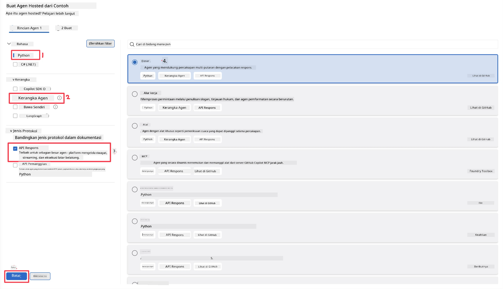
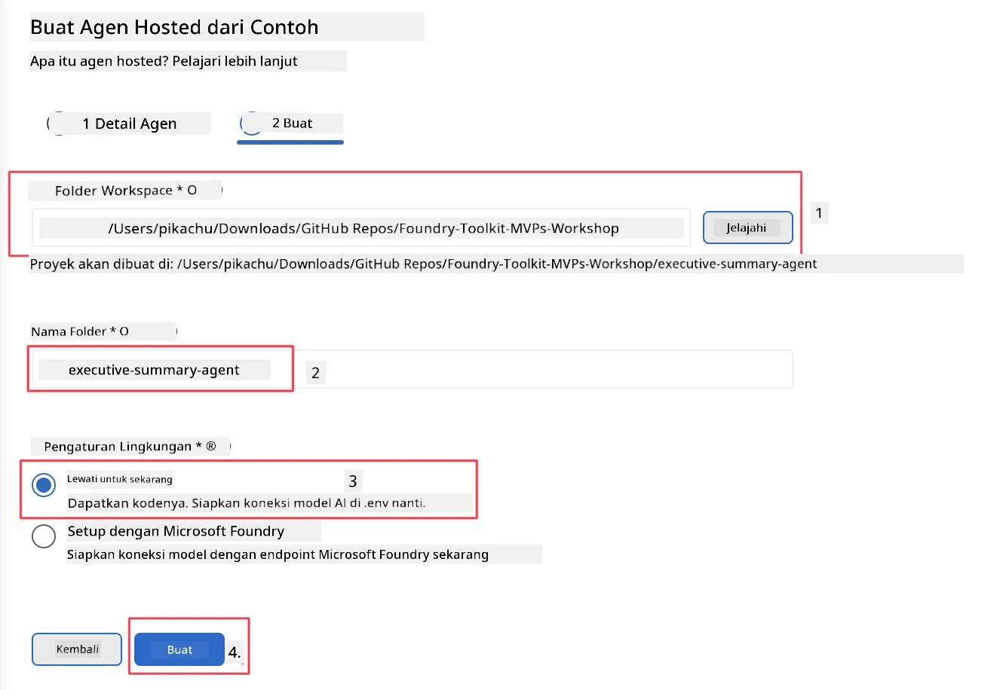

# Modul 2 - Membuat Agen Hosted Baru

⏱️ ~5 menit

Dalam modul ini, Anda menggunakan Foundry Toolkit untuk **membuat kerangka proyek agen hosted**. Kerangka ini menghasilkan struktur proyek lengkap - `agent.yaml`, `main.py`, `Dockerfile`, `requirements.txt`, dan konfigurasi debug VS Code - sehingga Anda dapat fokus pada penyesuaian perilaku agen.

> **Konsep utama:** Folder `agent/` dalam lab ini adalah contoh apa yang dihasilkan oleh Foundry Toolkit. Anda tidak menulis file-file ini dari awal.

### Alur wizard scaffold

```mermaid
flowchart LR
    A["Command Palette:
    Create new Hosted Agent"] --> B["Language:
    Python"]
    B --> C["API type:
    Response API"]
    C --> D["Template:
    Basic - Agent Framework"]
    D --> E["Pilih model"]
    E --> F["Workspace folder
    & agent name"]
    F --> G["Proyek yang dihasilkan"]

    style A fill:#4A90D9,color:#fff
    style B fill:#7B68EE,color:#fff
    style C fill:#7B68EE,color:#fff
    style D fill:#7B68EE,color:#fff
    style E fill:#7B68EE,color:#fff
    style F fill:#7B68EE,color:#fff
    style G fill:#27AE60,color:#fff
```



---

## Langkah 1: Buka wizard Create Hosted Agent

1. Tekan `Ctrl+Shift+P` untuk membuka **Command Palette**.
2. Ketik: **Foundry Toolkit: Create new Hosted Agent** dan pilih.

> **Alternatif: Buat melalui Foundry Portal**
> Jika Anda lebih suka browser, Anda dapat membuat proyek Anda di [https://ai.azure.com](https://ai.azure.com). Setelah proyek dibuat, kembali ke VS Code dan gunakan sidebar **Foundry Toolkit** untuk menghubungkannya.

> **Alternatif:** Klik ikon **+** di sebelah **Hosted Agents (Preview)** di sidebar Foundry Toolkit.

## Langkah 2: Pilih pengaturan



1. Pada bagian navigasi/pilihan kiri, pilih hal berikut:

| Menu | Pilihan | Catatan |
|--------|-----------|-------|
| **Language** | Python | C# juga didukung |
| **Framework** | Agent Framework | Titik awal sederhana menggunakan Agent Framework SDK |
| **API type** | Response API | `POST /responses` - percakapan, dengan histori yang dikelola platform |
| **Template** | Basic | Titik awal sederhana menggunakan Agent Framework SDK |

2. Setelah dipilih, klik **Next**



3. Di jendela berikutnya, pilih hal berikut:

| Menu | Pilihan | Catatan |
|--------|-----------|-------|
| **Workspace folder** | Pilih folder target | misalnya, `/workspace/Foundry_Toolkit_for_VSCode_Lab/` atau subfolder di repo ini |
| **Agent name** | Isi nama | misalnya, `executive-summary-agent` |
| **Environment Setup** | lewati pengaturan sekarang |  |

Klik **create** untuk membuat agen kita. Sebuah folder baru akan dibuat dengan nama agen hosted.

## Langkah 3: Periksa proyek yang dihasilkan

Setelah scaffolding selesai, verifikasi Anda melihat file-file ini di Explorer (`Ctrl+Shift+E`):

```
📂 my-agent/
├── .env                ← Environment variables (placeholders)
├── .vscode/
│   ├── launch.json     ← Debug config (F5 → run + Agent Inspector)
│   └── tasks.json      ← VS Code task definitions
├── agent.yaml          ← Agent definition (kind: hosted)
├── Dockerfile          ← Container config for deployment
├── main.py             ← Agent entry point (your main code)
└── requirements.txt    ← Python dependencies
```

### Penjelasan file penting

| File | Fungsi |
|------|---------|
| `agent.yaml` | Mendeklarasikan agen sebagai `kind: hosted`, memetakan variabel lingkungan, mendefinisikan protokol `/responses` |
| `main.py` | Membuat `FoundryChatClient` → membungkusnya dalam `Agent` dengan instruksi → melayani via `ResponsesHostServer` di port 8088 |
| `Dockerfile` | Menggunakan `python:3.12-slim`, menginstal dependensi, mengekspos port 8088, menjalankan `main.py` |
| `requirements.txt` | `agent-framework-foundry`, `agent-framework-foundry-hosting`, `mcp`, `debugpy` |

> **Penting:** Buka folder agen yang di-scaffold langsung di VS Code (folder `agent/` itu sendiri) agar `.vscode/launch.json` dan `tasks.json` bekerja dengan benar untuk debugging F5.

---

### ✅ Titik cek

- [ ] Proyek yang di-scaffold dibuat dengan semua file yang diharapkan
- [ ] `agent.yaml` menunjukkan `kind: hosted` dan `protocol: responses`
- [ ] `main.py` mengimpor `Agent`, `FoundryChatClient`, `ResponsesHostServer`
- [ ] Folder agen terbuka di VS Code sebagai root workspace

---

**Sebelumnya:** [01 - Setup](01-setup.md) · **Selanjutnya:** [03 - Configure & Code →](03-configure-and-code.md)

---

<!-- CO-OP TRANSLATOR DISCLAIMER START -->
**Penafian**:
Dokumen ini telah diterjemahkan menggunakan layanan terjemahan AI [Co-op Translator](https://github.com/Azure/co-op-translator). Meskipun kami berupaya untuk mencapai akurasi, harap diketahui bahwa terjemahan otomatis mungkin mengandung kesalahan atau ketidakakuratan. Dokumen asli dalam bahasa aslinya harus dianggap sebagai sumber yang sah. Untuk informasi penting, disarankan menggunakan terjemahan profesional oleh manusia. Kami tidak bertanggung jawab atas kesalahpahaman atau penafsiran yang keliru yang timbul dari penggunaan terjemahan ini.
<!-- CO-OP TRANSLATOR DISCLAIMER END -->