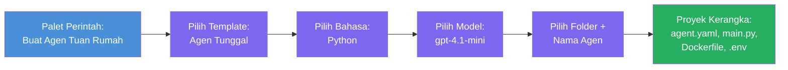

# Modul 3 - Membuat Hosted Agent Baru (Auto-Scaffolded oleh Foundry Extension)

Dalam modul ini, Anda menggunakan ekstensi Microsoft Foundry untuk **membuat [hosted agent](https://learn.microsoft.com/azure/foundry/agents/concepts/hosted-agents) baru**. Ekstensi ini menghasilkan seluruh struktur proyek untuk Anda - termasuk `agent.yaml`, `main.py`, `Dockerfile`, `requirements.txt`, file `.env`, dan konfigurasi debug VS Code. Setelah scaffold selesai, Anda menyesuaikan file-file ini dengan instruksi, alat, dan konfigurasi agen Anda.

> **Konsep kunci:** Folder `agent/` dalam lab ini adalah contoh apa yang dihasilkan oleh ekstensi Foundry ketika Anda menjalankan perintah scaffold ini. Anda tidak menulis file-file ini dari awal - ekstensi yang membuatnya, lalu Anda memodifikasinya.

### Alur wizard scaffold


---

## Langkah 1: Buka wizard Create Hosted Agent

1. Tekan `Ctrl+Shift+P` untuk membuka **Command Palette**.
2. Ketik: **Microsoft Foundry: Create a New Hosted Agent** dan pilih.
3. Wizard pembuatan hosted agent terbuka.

> **Jalur alternatif:** Anda juga bisa membuka wizard ini dari sidebar Microsoft Foundry → klik ikon **+** di samping **Agents** atau klik kanan dan pilih **Create New Hosted Agent**.

---

## Langkah 2: Pilih template

Wizard meminta Anda memilih template. Anda akan melihat opsi seperti:

| Template | Deskripsi | Kapan digunakan |
|----------|-----------|-----------------|
| **Single Agent** | Satu agen dengan model, instruksi, dan alat opsional sendiri | Workshop ini (Lab 01) |
| **Multi-Agent Workflow** | Beberapa agen yang bekerja sama secara berurutan | Lab 02 |

1. Pilih **Single Agent**.
2. Klik **Next** (atau pemilihan berlanjut otomatis).

---

## Langkah 3: Pilih bahasa pemrograman

1. Pilih **Python** (direkomendasikan untuk workshop ini).
2. Klik **Next**.

> **C# juga didukung** jika Anda lebih memilih .NET. Struktur scaffold serupa (menggunakan `Program.cs` bukan `main.py`).

---

## Langkah 4: Pilih model Anda

1. Wizard menampilkan model-model yang sudah diterapkan dalam proyek Foundry Anda (dari Modul 2).
2. Pilih model yang Anda deploy - misalnya **gpt-4.1-mini**.
3. Klik **Next**.

> Jika Anda tidak melihat model apa pun, kembali ke [Modul 2](02-create-foundry-project.md) dan deploy satu dahulu.

---

## Langkah 5: Pilih lokasi folder dan nama agent

1. Dialog file terbuka - pilih **folder tujuan** di mana proyek akan dibuat. Untuk workshop ini:
   - Jika mulai dari awal: pilih folder apa saja (misalnya `C:\Projects\my-agent`)
   - Jika bekerja di dalam repo workshop: buat subfolder baru di bawah `workshop/lab01-single-agent/agent/`
2. Masukkan **nama** untuk hosted agent (misal `executive-summary-agent` atau `my-first-agent`).
3. Klik **Create** (atau tekan Enter).

---

## Langkah 6: Tunggu scaffold selesai

1. VS Code membuka **jendela baru** dengan proyek yang telah di-scaffold.
2. Tunggu beberapa detik hingga proyek sepenuhnya dimuat.
3. Anda akan melihat file-file berikut di panel Explorer (`Ctrl+Shift+E`):

```
📂 my-first-agent/
├── .env                ← Environment variables (auto-generated with placeholders)
├── .vscode/
│   └── launch.json     ← Debug configuration (F5 to run + Agent Inspector)
├── agent.yaml          ← Agent definition (kind: hosted)
├── Dockerfile          ← Container configuration for deployment
├── main.py             ← Agent entry point (your main code file)
└── requirements.txt    ← Python dependencies
```

> **Ini adalah struktur yang sama dengan folder `agent/`** dalam lab ini. Ekstensi Foundry secara otomatis menghasilkan file-file ini - Anda tidak perlu membuatnya secara manual.

> **Catatan workshop:** Dalam repositori workshop ini, folder `.vscode/` ada di **root workspace** (bukan di dalam tiap proyek). Folder ini berisi konfigurasi `launch.json` dan `tasks.json` bersama dengan dua konfigurasi debug - **"Lab01 - Single Agent"** dan **"Lab02 - Multi-Agent"** - masing-masing mengarah ke `cwd` lab yang tepat. Saat Anda menekan F5, pilih konfigurasi sesuai lab yang sedang Anda kerjakan dari dropdown.

---

## Langkah 7: Pahami setiap file yang dihasilkan

Luangkan waktu untuk memeriksa setiap file yang dibuat wizard. Memahami file-file ini penting untuk Modul 4 (kustomisasi).

### 7.1 `agent.yaml` - Definisi agent

Buka `agent.yaml`. Isinya seperti berikut:

```yaml
# yaml-language-server: $schema=https://raw.githubusercontent.com/microsoft/AgentSchema/refs/heads/main/schemas/v1.0/ContainerAgent.yaml

kind: hosted
name: my-first-agent
description: >
  A hosted agent deployed to Microsoft Foundry Agent Service.
metadata:
  authors:
    - Microsoft
  tags:
    - Azure AI AgentServer
    - Microsoft Agent Framework
    - Hosted Agent
protocols:
  - protocol: responses
    version: v1
environment_variables:
  - name: AZURE_AI_PROJECT_ENDPOINT
    value: ${PROJECT_ENDPOINT}
  - name: AZURE_AI_MODEL_DEPLOYMENT_NAME
    value: ${MODEL_DEPLOYMENT_NAME}
dockerfile_path: Dockerfile
resources:
  cpu: '0.25'
  memory: 0.5Gi
```

**Kolom penting:**

| Kolom | Tujuan |
|-------|--------|
| `kind: hosted` | Menyatakan ini adalah hosted agent (berbasis container, di-deploy ke [Foundry Agent Service](https://learn.microsoft.com/azure/foundry/agents/overview)) |
| `protocols: responses v1` | Agen membuka endpoint HTTP `/responses` yang kompatibel dengan OpenAI |
| `environment_variables` | Memetakan nilai `.env` ke variabel lingkungan container saat deploy |
| `dockerfile_path` | Mengarah ke Dockerfile yang digunakan untuk membangun image container |
| `resources` | Alokasi CPU dan memori untuk container (0.25 CPU, 0.5Gi memori) |

### 7.2 `main.py` - Titik masuk agent

Buka `main.py`. Ini adalah file Python utama tempat logika agent Anda berada. Scaffold mencakup:

```python
from agent_framework.azure import AzureAIAgentClient
from azure.ai.agentserver.agentframework import from_agent_framework
from azure.identity.aio import DefaultAzureCredential
```

**Impor utama:**

| Impor | Tujuan |
|--------|---------|
| `AzureAIAgentClient` | Menghubungkan ke proyek Foundry Anda dan membuat agen lewat `.as_agent()` |
| [`DefaultAzureCredential`](https://learn.microsoft.com/azure/developer/python/sdk/authentication/credential-chains#defaultazurecredential-overview) | Menangani autentikasi (Azure CLI, sign-in VS Code, managed identity, atau service principal) |
| `from_agent_framework` | Membungkus agent sebagai server HTTP yang membuka endpoint `/responses` |

Alur utama adalah:
1. Buat kredensial → buat client → panggil `.as_agent()` untuk mendapatkan agent (async context manager) → bungkus sebagai server → jalankan

### 7.3 `Dockerfile` - Image container

```dockerfile
FROM python:3.14-slim

WORKDIR /app

COPY ./ .

RUN pip install --upgrade pip && \
    if [ -f requirements.txt ]; then \
        pip install -r requirements.txt; \
    else \
        echo "No requirements.txt found" >&2; exit 1; \
    fi

EXPOSE 8088

CMD ["python", "main.py"]
```

**Detail utama:**
- Menggunakan `python:3.14-slim` sebagai base image.
- Menyalin semua file proyek ke `/app`.
- Memperbarui `pip`, menginstal dependensi dari `requirements.txt`, dan gagal cepat jika file tersebut hilang.
- **Membuka port 8088** - ini adalah port yang diperlukan untuk hosted agent. Jangan ubah.
- Memulai agen dengan `python main.py`.

### 7.4 `requirements.txt` - Dependensi

```
agent-framework-azure-ai==1.0.0rc3
agent-framework-core==1.0.0rc3
azure-ai-agentserver-agentframework==1.0.0b16
azure-ai-agentserver-core==1.0.0b16
debugpy
agent-dev-cli
```

| Paket | Tujuan |
|---------|---------|
| `agent-framework-azure-ai` | Integrasi Azure AI untuk Microsoft Agent Framework |
| `agent-framework-core` | Runtime inti untuk membangun agen (termasuk `python-dotenv`) |
| `azure-ai-agentserver-agentframework` | Runtime server hosted agent untuk Foundry Agent Service |
| `azure-ai-agentserver-core` | Abstraksi inti server agent |
| `debugpy` | Dukungan debugging Python (mengizinkan debugging F5 di VS Code) |
| `agent-dev-cli` | CLI pengembangan lokal untuk menguji agent (dipakai oleh konfigurasi debug/run) |

---

## Memahami protokol agent

Hosted agent berkomunikasi melalui protokol **OpenAI Responses API**. Saat berjalan (lokal atau cloud), agent membuka satu endpoint HTTP:

```
POST http://localhost:8088/responses
Content-Type: application/json

{
  "input": "Your prompt here",
  "stream": false
}
```

Foundry Agent Service memanggil endpoint ini untuk mengirim prompt pengguna dan menerima respon agent. Ini adalah protokol yang sama digunakan oleh API OpenAI, sehingga agent Anda kompatibel dengan klien apa pun yang menggunakan format OpenAI Responses.

---

### Checkpoint

- [ ] Wizard scaffold selesai dengan sukses dan **jendela baru VS Code** terbuka
- [ ] Anda bisa melihat semua 5 file: `agent.yaml`, `main.py`, `Dockerfile`, `requirements.txt`, `.env`
- [ ] File `.vscode/launch.json` ada (memungkinkan debugging F5 - dalam workshop ini ada di root workspace dengan konfigurasi spesifik lab)
- [ ] Anda sudah membaca tiap file dan memahami fungsinya
- [ ] Anda mengerti bahwa port `8088` wajib dan endpoint `/responses` adalah protokolnya

---

**Sebelumnya:** [02 - Create Foundry Project](02-create-foundry-project.md) · **Selanjutnya:** [04 - Configure & Code →](04-configure-and-code.md)

---

<!-- CO-OP TRANSLATOR DISCLAIMER START -->
**Penafian**:  
Dokumen ini telah diterjemahkan menggunakan layanan terjemahan AI [Co-op Translator](https://github.com/Azure/co-op-translator). Meskipun kami berupaya untuk mencapai akurasi, harap diketahui bahwa terjemahan otomatis mungkin mengandung kesalahan atau ketidakakuratan. Dokumen asli dalam bahasa aslinya harus dianggap sebagai sumber otoritatif. Untuk informasi penting, disarankan menggunakan terjemahan profesional oleh manusia. Kami tidak bertanggung jawab atas kesalahpahaman atau salah tafsir yang timbul dari penggunaan terjemahan ini.
<!-- CO-OP TRANSLATOR DISCLAIMER END -->