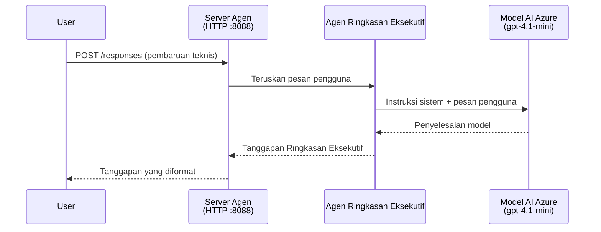
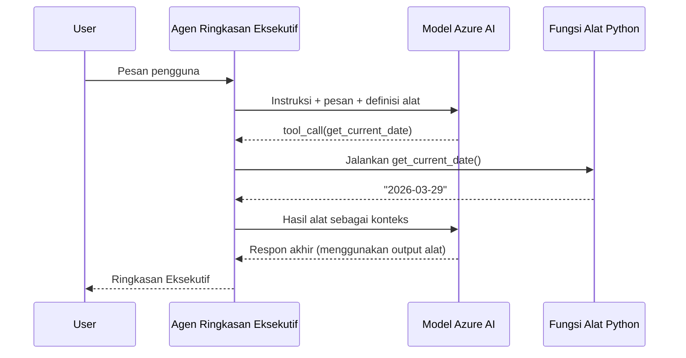

# Modul 4 - Konfigurasi Instruksi, Lingkungan & Instalasi Dependensi

Di modul ini, Anda menyesuaikan file agen auto-scaffolded dari Modul 3. Di sinilah Anda mengubah scaffold generik menjadi **agen** Anda - dengan menulis instruksi, mengatur variabel lingkungan, menambahkan alat secara opsional, dan menginstal dependensi.

> **Pengingat:** Ekstensi Foundry secara otomatis menghasilkan file proyek Anda. Sekarang Anda memodifikasinya. Lihat folder [`agent/`](../../../../../workshop/lab01-single-agent/agent) untuk contoh kerja lengkap agen yang telah disesuaikan.

---

## Bagaimana komponen saling berhubungan

### Siklus permintaan (agen tunggal)


> **Dengan alat:** Jika agen memiliki alat yang terdaftar, model dapat mengembalikan panggilan alat daripada penyelesaian langsung. Kerangka kerja menjalankan alat tersebut secara lokal, memberi hasil kembali ke model, dan model kemudian menghasilkan respons akhir.


---

## Langkah 1: Konfigurasi variabel lingkungan

Scaffold telah membuat file `.env` dengan nilai placeholder. Anda perlu mengisi nilai nyata dari Modul 2.

1. Dalam proyek scaffolded Anda, buka file **`.env`** (terletak di akar proyek).
2. Ganti nilai placeholder dengan detail proyek Foundry sebenarnya:

   ```env
   PROJECT_ENDPOINT=https://<your-account>.services.ai.azure.com/api/projects/<your-project>
   MODEL_DEPLOYMENT_NAME=gpt-4.1-mini
   ```

3. Simpan file.

### Di mana menemukan nilai-nilai ini

| Nilai | Cara menemukan |
|-------|---------------|
| **Project endpoint** | Buka sidebar **Microsoft Foundry** di VS Code → klik proyek Anda → URL endpoint ditampilkan di tampilan detail. Bentuknya seperti `https://<account-name>.services.ai.azure.com/api/projects/<project-name>` |
| **Nama deployment model** | Di sidebar Foundry, perluas proyek Anda → lihat di bawah **Models + endpoints** → nama tercantum di samping model yang diterapkan (misalnya, `gpt-4.1-mini`) |

> **Keamanan:** Jangan pernah meng-commit file `.env` ke version control. File ini sudah termasuk di `.gitignore` secara default. Jika belum, tambahkan:
> ```
> .env
> ```

### Aliran variabel lingkungan

Rantai pemetaan adalah: `.env` → `main.py` (membaca via `os.getenv`) → `agent.yaml` (memetakan ke variabel lingkungan container saat waktu deploy).

Di `main.py`, scaffold membaca nilai-nilai ini seperti berikut:

```python
PROJECT_ENDPOINT = os.getenv("AZURE_AI_PROJECT_ENDPOINT") or os.getenv("PROJECT_ENDPOINT")
MODEL_DEPLOYMENT_NAME = os.getenv("AZURE_AI_MODEL_DEPLOYMENT_NAME", os.getenv("MODEL_DEPLOYMENT_NAME", "gpt-4.1-mini"))
```

Baik `AZURE_AI_PROJECT_ENDPOINT` maupun `PROJECT_ENDPOINT` diterima (sedangkan `agent.yaml` menggunakan prefix `AZURE_AI_*`).

---

## Langkah 2: Tulis instruksi agen

Ini adalah langkah penyesuaian paling penting. Instruksi mendefinisikan kepribadian agen Anda, perilaku, format keluaran, dan batasan keamanan.

1. Buka `main.py` dalam proyek Anda.
2. Temukan string instruksi (scaffold menyertakan instruksi default/generik).
3. Ganti dengan instruksi yang terperinci dan terstruktur.

### Apa yang disertakan instruksi yang baik

| Komponen | Tujuan | Contoh |
|-----------|---------|---------|
| **Peran** | Apa agen itu dan apa yang dilakukannya | "Anda adalah agen ringkasan eksekutif" |
| **Audiens** | Untuk siapa respons ditujukan | "Pemimpin senior dengan latar belakang teknis terbatas" |
| **Definisi input** | Jenis prompt yang ditangani | "Laporan insiden teknis, pembaruan operasional" |
| **Format keluaran** | Struktur tepat respons | "Ringkasan Eksekutif: - Apa yang terjadi: ... - Dampak bisnis: ... - Langkah selanjutnya: ..." |
| **Aturan** | Batasan dan kondisi penolakan | "JANGAN menambahkan informasi di luar yang diberikan" |
| **Keamanan** | Mencegah penyalahgunaan dan halusinasi | "Jika input tidak jelas, minta klarifikasi" |
| **Contoh** | Pasangan input/output untuk mengarahkan perilaku | Sertakan 2-3 contoh dengan input beragam |

### Contoh: Instruksi Agen Ringkasan Eksekutif

Berikut instruksi yang digunakan di `agent/main.py` workshop:

```python
AGENT_INSTRUCTIONS = """You are an "Explain Like I'm an Executive" agent.

Purpose:
Your job is to translate complex technical or operational information into
clear, concise, and outcome-focused summaries that can be easily understood
by non-technical executives.

Audience:
Senior leaders with limited technical background who care about impact,
risk, and what happens next.

What you must do:
- Rephrase the input so it is understandable to a non-technical audience
- Prioritize clarity, brevity, and outcomes over technical accuracy
- Remove technical jargon, logs, metrics, stack traces, and deep root-cause details
- Translate technical causes into simple cause-and-effect statements
- Explicitly call out business impact
- Always include a clear next step or action
- Maintain a neutral, factual, and calm executive tone
- Do NOT add new facts or speculate beyond the input

Standard Output Structure (always use this wording):

Executive Summary:
- What happened: <plain-language description>
- Business impact: <clear, non-technical impact>
- Next step: <clear action or mitigation>

Rules:
- Keep responses under 100 words
- Do NOT add facts beyond the input
- If input is unclear, ask for clarification
"""
```

4. Ganti string instruksi yang ada di `main.py` dengan instruksi kustom Anda.
5. Simpan file.

---

## Langkah 3: (Opsional) Tambahkan alat kustom

Agen yang di-host dapat menjalankan **fungsi Python lokal** sebagai [alat](https://learn.microsoft.com/azure/foundry/agents/concepts/tool-catalog). Ini adalah keuntungan utama agen hosted berbasis kode dibanding agen yang hanya menggunakan prompt - agen Anda dapat menjalankan logika server-side sesuka hati.

### 3.1 Definisikan fungsi alat

Tambahkan fungsi alat di `main.py`:

```python
from agent_framework import tool

@tool
def get_current_date() -> str:
    """Returns the current date in YYYY-MM-DD format."""
    from datetime import date
    return str(date.today())
```

Dekorator `@tool` mengubah fungsi Python standar menjadi alat agen. Docstring menjadi deskripsi alat yang dilihat model.

### 3.2 Daftarkan alat dengan agen

Saat membuat agen melalui context manager `.as_agent()`, berikan alat di parameter `tools`:

```python
async with AzureAIAgentClient(
    project_endpoint=PROJECT_ENDPOINT,
    model_deployment_name=MODEL_DEPLOYMENT_NAME,
    credential=credential,
).as_agent(
    name="my-agent",
    instructions=AGENT_INSTRUCTIONS,
    tools=[get_current_date],
) as agent:
    server = from_agent_framework(agent)
    await server.run_async()
```

### 3.3 Cara kerja panggilan alat

1. Pengguna mengirim prompt.
2. Model memutuskan apakah alat diperlukan (berdasarkan prompt, instruksi, dan deskripsi alat).
3. Jika alat diperlukan, framework memanggil fungsi Python Anda secara lokal (dalam container).
4. Nilai kembali alat dikirim ke model sebagai konteks.
5. Model menghasilkan respons akhir.

> **Alat dijalankan di server** - mereka berjalan di dalam container Anda, bukan di browser pengguna atau model. Ini berarti Anda bisa mengakses database, API, sistem file, atau perpustakaan Python apa pun.

---

## Langkah 4: Buat dan aktifkan lingkungan virtual

Sebelum instalasi dependensi, buat lingkungan Python yang terisolasi.

### 4.1 Buat lingkungan virtual

Buka terminal di VS Code (`` Ctrl+` ``) dan jalankan:

```powershell
python -m venv .venv
```

Ini membuat folder `.venv` di direktori proyek Anda.

### 4.2 Aktifkan lingkungan virtual

**PowerShell (Windows):**

```powershell
.\.venv\Scripts\Activate.ps1
```

**Command Prompt (Windows):**

```cmd
.venv\Scripts\activate.bat
```

**macOS/Linux (Bash):**

```bash
source .venv/bin/activate
```

Anda harus melihat `(.venv)` muncul di awal prompt terminal, menandakan lingkungan virtual telah aktif.

### 4.3 Instal dependensi

Dengan lingkungan virtual aktif, instal paket yang diperlukan:

```powershell
pip install -r requirements.txt
```

Ini menginstal:

| Paket | Tujuan |
|---------|---------|
| `agent-framework-azure-ai==1.0.0rc3` | Integrasi Azure AI untuk [Microsoft Agent Framework](https://learn.microsoft.com/agent-framework/overview/) |
| `agent-framework-core==1.0.0rc3` | Runtime inti untuk membangun agen (termasuk `python-dotenv`) |
| `azure-ai-agentserver-agentframework==1.0.0b16` | Runtime server agen hosted untuk [Foundry Agent Service](https://learn.microsoft.com/azure/foundry/agents/overview) |
| `azure-ai-agentserver-core==1.0.0b16` | Abstraksi inti server agen |
| `debugpy` | Debugging Python (mengaktifkan debugging F5 di VS Code) |
| `agent-dev-cli` | CLI pengembangan lokal untuk menguji agen |

### 4.4 Verifikasi instalasi

```powershell
pip list | Select-String "agent-framework|agentserver"
```

Output yang diharapkan:
```
agent-framework-azure-ai   1.0.0rc3
agent-framework-core       1.0.0rc3
azure-ai-agentserver-agentframework 1.0.0b16
azure-ai-agentserver-core  1.0.0b16
```

---

## Langkah 5: Verifikasi autentikasi

Agen menggunakan [`DefaultAzureCredential`](https://learn.microsoft.com/azure/developer/python/sdk/authentication/credential-chains#defaultazurecredential-overview) yang mencoba beberapa metode autentikasi dalam urutan ini:

1. **Variabel lingkungan** - `AZURE_CLIENT_ID`, `AZURE_TENANT_ID`, `AZURE_CLIENT_SECRET` (service principal)
2. **Azure CLI** - mengambil sesi `az login` Anda
3. **VS Code** - menggunakan akun yang Anda masuk ke VS Code
4. **Managed Identity** - digunakan saat berjalan di Azure (pada waktu deploy)

### 5.1 Verifikasi untuk pengembangan lokal

Setidaknya salah satu dari metode ini harus berhasil:

**Opsi A: Azure CLI (direkomendasikan)**

```powershell
az account show --query "{name:name, id:id}" --output table
```

Diharapkan: Menampilkan nama dan ID subscription Anda.

**Opsi B: Masuk ke VS Code**

1. Lihat di pojok kiri bawah VS Code untuk ikon **Accounts**.
2. Jika Anda melihat nama akun Anda, Anda sudah terautentikasi.
3. Jika tidak, klik ikon → **Sign in to use Microsoft Foundry**.

**Opsi C: Service principal (untuk CI/CD)**

```powershell
$env:AZURE_TENANT_ID = "<your-tenant-id>"
$env:AZURE_CLIENT_ID = "<your-client-id>"
$env:AZURE_CLIENT_SECRET = "<your-client-secret>"
```

### 5.2 Masalah autentikasi umum

Jika Anda masuk ke beberapa akun Azure, pastikan subscription yang benar dipilih:

```powershell
az account set --subscription "<your-subscription-id>"
```

---

### Titik pemeriksaan

- [ ] File `.env` berisi `PROJECT_ENDPOINT` dan `MODEL_DEPLOYMENT_NAME` yang valid (bukan placeholder)
- [ ] Instruksi agen telah disesuaikan di `main.py` - mendefinisikan peran, audiens, format keluaran, aturan, dan batasan keamanan
- [ ] (Opsional) Alat kustom telah didefinisikan dan didaftarkan
- [ ] Lingkungan virtual dibuat dan diaktifkan (`(.venv)` terlihat di prompt terminal)
- [ ] `pip install -r requirements.txt` selesai tanpa error
- [ ] `pip list | Select-String "azure-ai-agentserver"` menunjukkan paket telah terpasang
- [ ] Autentikasi valid - `az account show` mengembalikan subscription Anda ATAU Anda sudah masuk ke VS Code

---

**Sebelumnya:** [03 - Buat Agen Hosted](03-create-hosted-agent.md) · **Selanjutnya:** [05 - Uji Secara Lokal →](05-test-locally.md)

---

<!-- CO-OP TRANSLATOR DISCLAIMER START -->
**Penafian**:
Dokumen ini telah diterjemahkan menggunakan layanan terjemahan AI [Co-op Translator](https://github.com/Azure/co-op-translator). Meskipun kami berupaya untuk akurasi, harap diperhatikan bahwa terjemahan otomatis mungkin mengandung kesalahan atau ketidakakuratan. Dokumen asli dalam bahasa aslinya harus dianggap sebagai sumber yang otoritatif. Untuk informasi penting, disarankan terjemahan profesional oleh manusia. Kami tidak bertanggung jawab atas kesalahpahaman atau salah tafsir yang timbul dari penggunaan terjemahan ini.
<!-- CO-OP TRANSLATOR DISCLAIMER END -->