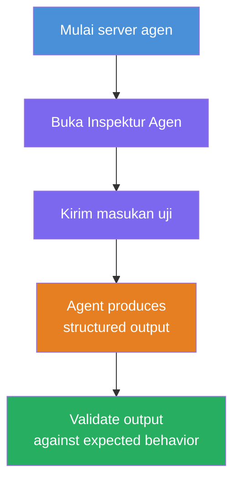
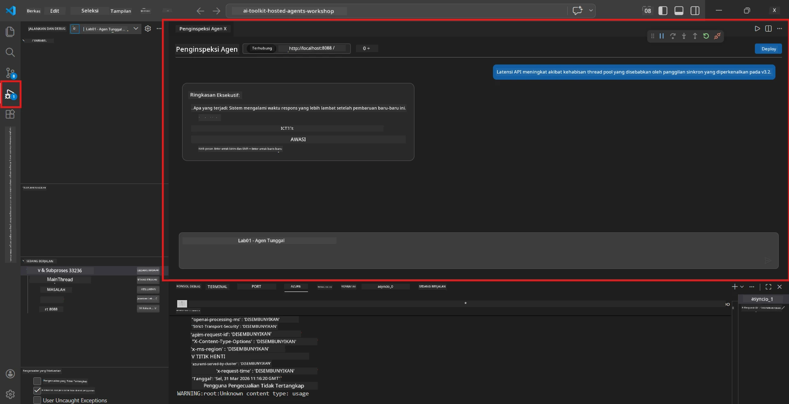
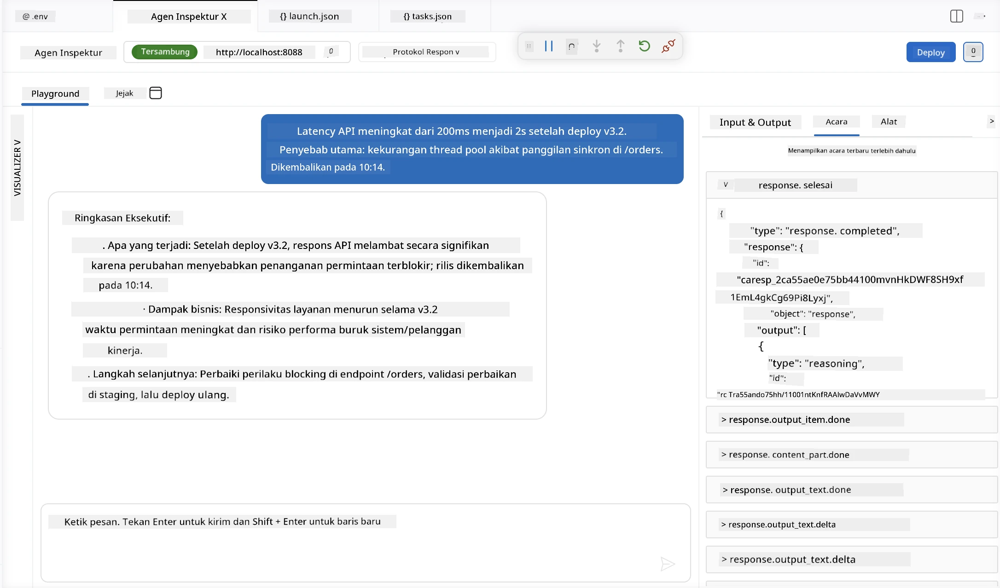

# Modul 4 - Uji Secara Lokal

⏱️ ~10 menit

Dalam modul ini, Anda menjalankan agen Anda secara lokal dan memvalidasi apakah itu berfungsi dengan benar menggunakan **tes fungsional jalur bahagia**. Anda akan menggunakan Agent Inspector (UI visual) atau panggilan HTTP langsung untuk mengonfirmasi agen menghasilkan respons yang terstruktur dan akurat.

### Alur pengujian lokal



---

## Opsi 1: Tekan F5 - Debug dengan Agent Inspector (direkomendasikan)

### Mulai debugger

1. Buka folder **executive-summary-agent/** langsung di VS Code (`File → Open Folder`).
2. Buka panel **Run and Debug** (`Ctrl+Shift+D`).
3. Pilih **Debug Local Agent Server** dari menu dropdown.
4. Tekan **F5** (atau klik ▶ Start Debugging).

> ⚠️ **Penting: Pilih Interpreter Python Anda**
> Jika Anda mendapatkan "ModuleNotFoundError" atau debugger gagal mulai, Anda harus memberi tahu VS Code untuk menggunakan environment virtual Anda:
  > 1. Tekan `Ctrl+Shift+P` $\rightarrow$ ketik **Python: Select Interpreter**.
  > 2. Pilih interpreter yang berada di folder `.venv` proyek Anda (misalnya, `.\.venv\Scripts\python.exe` di Windows).
  > 3. Mulai ulang sesi debug.
> Jika Anda masih mendapatkan kesalahan, perbarui secara manual file `tasks.json` sebagai berikut:
  > 1. Arahkan ke file `.vscode/tasks.json`
  > 2. Cari perintah dengan label: `Run Agent/Workflow HTTP Server`
  > 3. Perbarui nilai perintah sebagai berikut: `"value": "${workspaceFolder}/.venv/bin/python",`

### Apa yang terjadi

1. Server HTTP mulai di `http://localhost:8088/responses`.
2. Panel **Agent Inspector** terbuka secara otomatis - sebuah antarmuka chat visual untuk pengujian.
3. Breakpoint diaktifkan di `main.py`.

Pantau Terminal untuk:
```
Starting executive summary hosted agent
Executive agent server running on http://localhost:8088
```

> **Jika Agent Inspector tidak terbuka:** Tekan `Ctrl+Shift+P` → **Foundry Toolkit: Open Agent Inspector**.



> *Tangkapan layar mungkin menunjukkan merek 'AI TOOLKIT' yang lebih lama dari versi ekstensi sebelumnya.*

---

## Opsi 2: Uji melalui Terminal (alternatif)

Mulai agen di satu terminal, kirim permintaan dari terminal lain:

```bash
# Terminal 1: Mulai agen
cd executive-summary-agent/
source .venv/bin/activate
python main.py
```

```bash
# Terminal 2: Kirim tes (curl)
curl -sS -X POST http://localhost:8088/responses \
  -H "Content-Type: application/json" \
  -d '{"input": "The API latency increased due to thread pool exhaustion caused by sync calls in v3.2.", "stream": false}'
```

---

## Tes skenario: Validasi fungsional jalur bahagia

Jalankan **ketiga** skenario di bawah ini. Ini memvalidasi bahwa agen Anda menghasilkan output yang benar dan terstruktur untuk input yang realistis.



### Skenario 1: Insiden TI - Lonjakan latensi API

**Input:**
```
The API latency increased from 200ms to 2s after deploying v3.2.
Root cause: thread pool starvation from synchronous calls in /orders.
Rolled back at 10:14.
```

**Perilaku yang diharapkan:**
- ✅ Mengikuti struktur "Executive Summary" (Apa yang terjadi / Dampak bisnis / Langkah berikutnya)
- ✅ Tidak ada jargon teknis (tidak ada "thread pool", tidak ada "/orders", tidak ada "v3.2")
- ✅ Menyatakan secara jelas dampak bisnis (misalnya, pengguna mengalami penundaan)
- ✅ Termasuk langkah berikutnya (misalnya, perbaikan diterapkan, pemantauan dilakukan)

---

### Skenario 2: Jalur Data - Gagal ETL

**Input:**
```
The nightly ETL job failed because the upstream schema changed. APAC dashboards show missing data.
```

**Perilaku yang diharapkan:**
- ✅ Merangkum kegagalan penyegaran data dalam bahasa sederhana
- ✅ Menyebutkan dampak pada dashboard APAC
- ✅ Menyertakan langkah remediasi berikutnya
- ✅ TIDAK menyebut "ETL", "skema", atau istilah teknis lainnya

---

### Skenario 3: Keamanan - Kredensial yang terekspos

**Input:**
```
Static analysis flagged a hardcoded secret in the repository.
The secret may have been exposed in commit history.
```

**Perilaku yang diharapkan:**
- ✅ Menjelaskan masalah kredensial/keamanan dalam bahasa yang dapat dipahami eksekutif
- ✅ Menyebutkan risiko potensial (akses tidak sah)
- ✅ Menyatakan tindakan remediasi (rotasi kredensial, audit)
- ✅ TIDAK menyertakan istilah seperti "analisis statis", "riwayat commit", atau "hardcoded"

---

## Kriteria validasi

Untuk setiap skenario, periksa:

| # | Kriteria | Kondisi lulus |
|---|----------|---------------|
| 1 | **Struktur** | Respons menggunakan format "Executive Summary" dengan ketiga poin peluru |
| 2 | **Bahasa sederhana** | Tidak ada jargon teknis yang tidak dipahami eksekutif |
| 3 | **Akurasi** | Ringkasan mencerminkan input - tidak ada detail dibuat-buat |
| 4 | **Singkat** | Respons di bawah 100 kata |
| 5 | **Langkah berikutnya** | Dinyatakan tindakan atau mitigasi yang jelas |

---

## Tips debugging

| Masalah | Perbaikan |
|-------|-----|
| Agen tidak mulai | Periksa nilai `.env`, pastikan venv diaktifkan, jalankan `pip install -r requirements.txt` |
| Respons kosong atau generik | Tinjau instruksi di `main.py` - pastikan format output ditentukan |
| Respons mengandung jargon | Perkuat aturan "hapus istilah teknis" dalam instruksi |
| Agent Inspector tidak terbuka | `Ctrl+Shift+P` → **Foundry Toolkit: Open Agent Inspector** |
| Kesalahan model di Terminal | Verifikasi `AZURE_AI_MODEL_DEPLOYMENT_NAME` cocok persis (sensitif huruf) |

---

### ✅ Titik pemeriksaan

- [ ] Agen mulai secara lokal tanpa kesalahan
- [ ] Agent Inspector terbuka dan menampilkan antarmuka chat (jika menggunakan F5)
- [ ] **Skenario 1** (insiden TI) - Executive Summary terstruktur, tanpa jargon
- [ ] **Skenario 2** (jalur data) - ringkasan relevan dengan dampak bisnis
- [ ] **Skenario 3** (peringatan keamanan) - komunikasi risiko yang sesuai
- [ ] Semua respons mengikuti struktur output yang ditentukan

> **Simpan respons Anda** (salin atau tangkapan layar) - Anda akan membandingkannya dengan hasil cloud di Modul 06.

---

**Sebelumnya:** [03 - Configure & Code](03-configure-and-code.md) · **Berikutnya:** [05 - Deploy to Foundry →](05-deploy-to-foundry.md)

---

<!-- CO-OP TRANSLATOR DISCLAIMER START -->
**Penafian**:
Dokumen ini telah diterjemahkan menggunakan layanan terjemahan AI [Co-op Translator](https://github.com/Azure/co-op-translator). Meskipun kami berupaya untuk mencapai akurasi, harap diketahui bahwa terjemahan otomatis mungkin mengandung kesalahan atau ketidakakuratan. Dokumen asli dalam bahasa aslinya harus dianggap sebagai sumber yang sah. Untuk informasi penting, disarankan menggunakan terjemahan profesional oleh manusia. Kami tidak bertanggung jawab atas kesalahpahaman atau penafsiran yang keliru yang timbul dari penggunaan terjemahan ini.
<!-- CO-OP TRANSLATOR DISCLAIMER END -->