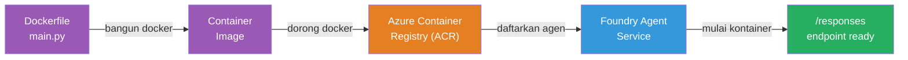
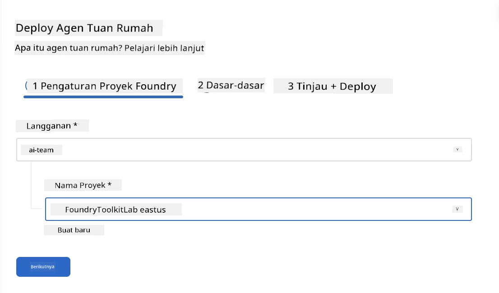
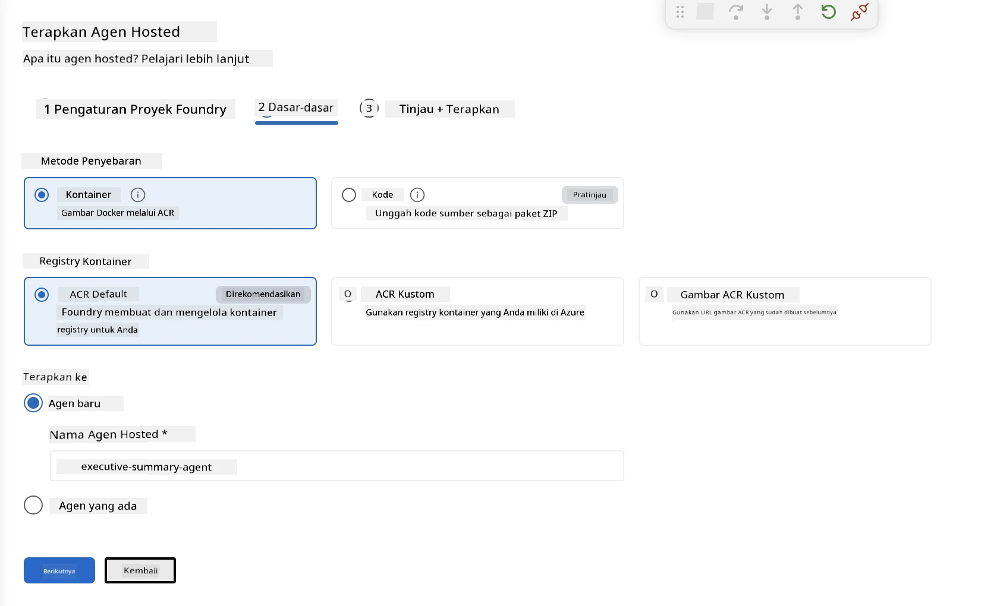
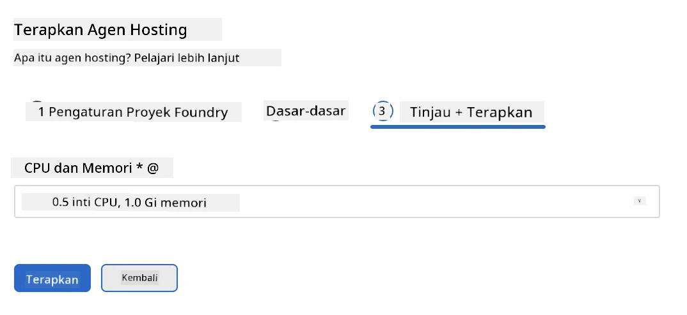
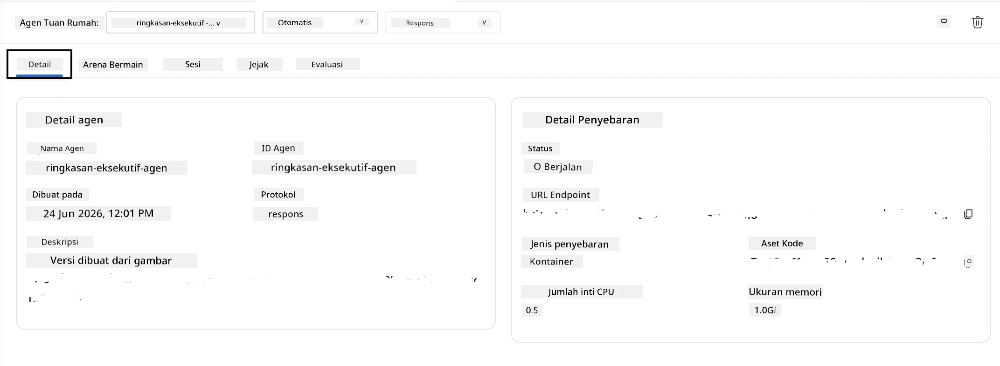

# Modul 5 - Deploy ke Foundry Agent Service

⏱️ ~10 menit

> ⚠️ **Pengguna Jalur B:** Modul ini memerlukan langganan Foundry. Jika Anda menggunakan Foundry Lokal, lewati ke [Modul 07 - Ringkasan](07-summary.md). Anda telah berhasil menyelesaikan alur kerja pengembangan lokal!

Dalam modul ini, Anda menerapkan agen yang telah diuji secara lokal ke Microsoft Foundry sebagai **Hosted Agent**. Penerapan membangun image container, mendorongnya ke Azure Container Registry, dan memulai agen dalam infrastruktur yang dikelola Foundry.

### Pipeline penerapan

---

## Pemeriksaan prasyarat

Sebelum menerapkan, verifikasi:

- [ ] Agen lulus semua 3 skenario lokal dari [Modul 04](04-test-locally.md)
- [ ] Anda memiliki peran **Azure AI User** pada tingkat proyek ([Modul 01, Menetapkan RBAC](01-setup.md#deploy-a-model--assign-rbac))
- [ ] Anda sudah masuk ke Azure di VS Code (ikon Akun menunjukkan nama Anda)

---

## Langkah 1: Mulai penerapan

### Opsi A: Deploy dari Agent Inspector (direkomendasikan)

Jika Agent Inspector terbuka (dari pengujian):
1. Klik tombol **Deploy** di pojok kanan atas (ikon awan ↑).

### Opsi B: Deploy dari Command Palette

1. Tekan `Ctrl+Shift+P` → **Foundry Toolkit: Deploy Hosted Agent**.

---

## Langkah 2: Konfigurasikan penerapan

Wizard akan menanyakan Anda untuk:

| Permintaan | Pilihan |
|--------|-----------|
| **Langganan** | Langganan Azure Anda |
| **Proyek target** | Proyek Foundry Anda (misal, `workshop-agents`) |

Klik **next** untuk mengonfigurasi agen Anda.

| Permintaan | Pilihan |
|--------|-----------|
| **Metode penerapan** | Container |
| **Container registry** | **ACR Default** (Microsoft Foundry membuat dan mengelola satu untuk Anda) |
| **Deploy ke** | Agen Baru (nama, `executive-summary-agent`) |

Klik **next** untuk meninjau dan menerapkan agen Anda.

| Permintaan | Pilihan |
|--------|-----------|
| **CPU dan memori** | **0.25 core CPU, 0.5 Gi memori** (cukup untuk workshop) |

---

## Langkah 3: Deploy dan pantau

1. Klik **Deploy**.
2. Amati panel **Output** (pilih **Microsoft Foundry** dari dropdown).
3. Proses penerapan menjalani tahap-tahap ini:
   - **Docker build** - membangun container dari Dockerfile Anda
   - **Docker push** - mendorong image ke ACR (1–3 menit pada deploy pertama)
   - **Registrasi agen** - membuat agen hosted di Foundry
   - **Container start** - memulai dengan identitas yang dikelola sistem

4. Saat selesai, sebuah notifikasi muncul:
   > **my-agent berhasil diterapkan.** `Lihat log` `Jalankan agen`

5. Klik **Jalankan agen** untuk membuka Agent Playground.

### Nilai status penerapan

| Status | Arti |
|--------|---------|
| **Running** | Container siap, agen merespon |
| **Pending** | Container sedang mulai - tunggu 30–60 detik |
| **Failed** | Periksa log (lihat pemecahan masalah di bawah) |

---

## Kesalahan penerapan umum

| Kesalahan | Penyebab utama | Solusi |
|-------|-----------|-----|
| `agents/write` izin ditolak | Tidak memiliki peran **Azure AI User** pada tingkat proyek | [Modul 01, Menetapkan RBAC](01-setup.md#deploy-a-model--assign-rbac) |
| Docker tidak berjalan | Docker Desktop belum dimulai | Mulai Docker Desktop → verifikasi `docker info` |
| Otorisasi ACR | Identitas terkelola tidak bisa menarik image | Lihat [Modul 08 - Pemecahan Masalah](08-troubleshooting.md) |

---

### ✅ Titik pemeriksaan

- [ ] Penerapan selesai tanpa kesalahan
- [ ] Agen muncul di bawah **Hosted Agents (Pratinjau)** di sidebar Foundry
- [ ] Status container menunjukkan **Running**
- [ ] Tab Agent Playground terbuka menampilkan detail agen dan URL endpoint

---

**Sebelumnya:** [04 - Uji Secara Lokal](04-test-locally.md) · **Selanjutnya:** [06 - Verifikasi di Playground →](06-verify-in-playground.md)

---

<!-- CO-OP TRANSLATOR DISCLAIMER START -->
**Penafian**:
Dokumen ini telah diterjemahkan menggunakan layanan terjemahan AI [Co-op Translator](https://github.com/Azure/co-op-translator). Meskipun kami berupaya untuk mencapai akurasi, harap diketahui bahwa terjemahan otomatis mungkin mengandung kesalahan atau ketidakakuratan. Dokumen asli dalam bahasa aslinya harus dianggap sebagai sumber yang sah. Untuk informasi penting, disarankan menggunakan terjemahan profesional oleh manusia. Kami tidak bertanggung jawab atas kesalahpahaman atau penafsiran yang keliru yang timbul dari penggunaan terjemahan ini.
<!-- CO-OP TRANSLATOR DISCLAIMER END -->