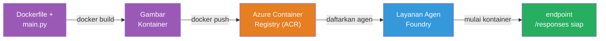
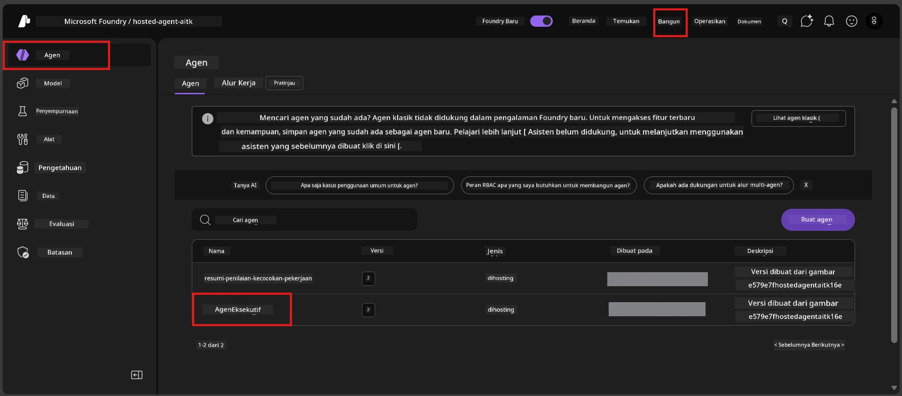

# Modul 6 - Deploy ke Foundry Agent Service

Dalam modul ini, Anda melakukan deploy agen yang telah diuji secara lokal ke Microsoft Foundry sebagai [**Hosted Agent**](https://learn.microsoft.com/azure/foundry/agents/concepts/hosted-agents). Proses deploy membangun image container Docker dari proyek Anda, mendorongnya ke [Azure Container Registry (ACR)](https://learn.microsoft.com/azure/container-registry/container-registry-intro), dan membuat versi agen hosted di [Foundry Agent Service](https://learn.microsoft.com/azure/foundry/agents/overview).

### Pipeline deployment


---

## Pemeriksaan Prasyarat

Sebelum melakukan deploy, verifikasi setiap item berikut. Melewati ini adalah penyebab paling umum kegagalan deployment.

1. **Agen lulus tes smoke lokal:**
   - Anda telah menyelesaikan semua 4 tes di [Modul 5](05-test-locally.md) dan agen merespon dengan benar.

2. **Anda memiliki peran [Azure AI User](https://learn.microsoft.com/azure/foundry/concepts/rbac-foundry#built-in-roles):**
   - Ini ditugaskan di [Modul 2, Langkah 3](02-create-foundry-project.md). Jika Anda ragu, verifikasi sekarang:
   - Azure Portal → sumber daya **proyek** Foundry Anda → **Access control (IAM)** → tab **Role assignments** → cari nama Anda → konfirmasi **Azure AI User** tercantum.

3. **Anda sudah masuk ke Azure di VS Code:**
   - Periksa ikon Akun di kiri bawah VS Code. Nama akun Anda harus terlihat.

4. **(Opsional) Docker Desktop sedang berjalan:**
   - Docker hanya dibutuhkan jika ekstensi Foundry meminta build lokal. Dalam sebagian besar kasus, ekstensi menangani build container secara otomatis saat deploy.
   - Jika Anda memiliki Docker terpasang, verifikasi sedang berjalan: `docker info`

---

## Langkah 1: Mulai deployment

Anda memiliki dua cara untuk deploy - keduanya menghasilkan hasil yang sama.

### Opsi A: Deploy dari Agent Inspector (disarankan)

Jika Anda menjalankan agen dengan debugger (F5) dan Agent Inspector terbuka:

1. Lihat di **pojok kanan atas** panel Agent Inspector.
2. Klik tombol **Deploy** (ikon awan dengan panah ke atas ↑).
3. Wizard deployment terbuka.

### Opsi B: Deploy dari Command Palette

1. Tekan `Ctrl+Shift+P` untuk membuka **Command Palette**.
2. Ketik: **Microsoft Foundry: Deploy Hosted Agent** dan pilih.
3. Wizard deployment terbuka.

---

## Langkah 2: Konfigurasi deployment

Wizard deployment memandu Anda konfigurasi. Isi setiap prompt:

### 2.1 Pilih proyek target

1. Dropdown menampilkan proyek Foundry Anda.
2. Pilih proyek yang Anda buat di Modul 2 (misal, `workshop-agents`).

### 2.2 Pilih file agen container

1. Anda akan diminta memilih titik masuk agen.
2. Pilih **`main.py`** (Python) - ini adalah file yang digunakan wizard untuk mengidentifikasi proyek agen Anda.

### 2.3 Konfigurasi sumber daya

| Pengaturan | Nilai yang disarankan | Catatan |
|---------|------------------|-------|
| **CPU** | `0.25` | Default, cukup untuk workshop. Tingkatkan untuk beban kerja produksi |
| **Memory** | `0.5Gi` | Default, cukup untuk workshop |

Ini sesuai dengan nilai di `agent.yaml`. Anda dapat menggunakan nilai default.

---

## Langkah 3: Konfirmasi dan deploy

1. Wizard menunjukkan ringkasan deployment dengan:
   - Nama proyek target
   - Nama agen (dari `agent.yaml`)
   - File container dan sumber daya
2. Tinjau ringkasan lalu klik **Confirm and Deploy** (atau **Deploy**).
3. Pantau progres di VS Code.

### Apa yang terjadi selama deployment (langkah demi langkah)

Deployment adalah proses multi-langkah. Pantau panel **Output** VS Code (pilih "Microsoft Foundry" dari dropdown) untuk mengikuti:

1. **Docker build** - VS Code membangun image container Docker dari `Dockerfile` Anda. Anda akan melihat pesan layer Docker:
   ```
   Step 1/6 : FROM python:<version>-slim
   Step 2/6 : WORKDIR /app
   ...
   Successfully built abc123def456
   ```

2. **Docker push** - Image didorong ke **Azure Container Registry (ACR)** terkait dengan proyek Foundry Anda. Ini bisa memakan waktu 1-3 menit pada deploy pertama (base image >100MB).

3. **Pendaftaran agen** - Foundry Agent Service membuat agen hosted baru (atau versi baru jika agen sudah ada). Metadata agen dari `agent.yaml` digunakan.

4. **Start container** - Container dijalankan di infrastruktur yang dikelola Foundry. Platform menetapkan [identitas yang dikelola sistem](https://learn.microsoft.com/azure/foundry/agents/concepts/agent-identity) dan mengekspos endpoint `/responses`.

> **Deploy pertama lebih lambat** (Docker perlu mendorong semua layer). Deploy berikutnya lebih cepat karena Docker menyimpan cache layer yang tidak berubah.

---

## Langkah 4: Verifikasi status deployment

Setelah perintah deployment selesai:

1. Buka sidebar **Microsoft Foundry** dengan mengklik ikon Foundry di Activity Bar.
2. Perluas bagian **Hosted Agents (Preview)** di bawah proyek Anda.
3. Anda harus melihat nama agen Anda (misal, `ExecutiveAgent` atau nama dari `agent.yaml`).
4. **Klik nama agen** untuk memperluasnya.
5. Anda akan melihat satu atau lebih **versi** (misal, `v1`).
6. Klik versi untuk melihat **Detail Container**.
7. Periksa kolom **Status**:

   | Status | Arti |
   |--------|---------|
   | **Started** atau **Running** | Container berjalan dan agen siap |
   | **Pending** | Container sedang memulai (tunggu 30-60 detik) |
   | **Failed** | Container gagal mulai (cek log - lihat pemecahan masalah di bawah) |



> **Jika Anda melihat "Pending" lebih dari 2 menit:** Container mungkin sedang menarik base image. Tunggu lebih lama. Jika terus pending, cek log container.

---

## Kesalahan umum saat deployment dan cara memperbaiki

### Kesalahan 1: Permission denied - `agents/write`

```
Error: lacks the required data action 
Microsoft.CognitiveServices/accounts/AIServices/agents/write 
to perform POST /api/projects/{projectName}/assistants operation.
```

**Penyebab utama:** Anda tidak memiliki peran `Azure AI User` pada tingkat **proyek**.

**Langkah perbaikan:**

1. Buka [https://portal.azure.com](https://portal.azure.com).
2. Di bilah pencarian, ketik nama **proyek** Foundry Anda dan klik.
   - **Kritikal:** Pastikan Anda membuka sumber daya **proyek** (tipe: "Microsoft Foundry project"), BUKAN sumber daya induk akun/hub.
3. Di navigasi kiri, klik **Access control (IAM)**.
4. Klik **+ Add** → **Add role assignment**.
5. Di tab **Role**, cari dan pilih [**Azure AI User**](https://learn.microsoft.com/azure/foundry/concepts/rbac-foundry#built-in-roles). Klik **Next**.
6. Di tab **Members**, pilih **User, group, or service principal**.
7. Klik **+ Select members**, cari nama/email Anda, pilih diri Anda, klik **Select**.
8. Klik **Review + assign** → lagi klik **Review + assign**.
9. Tunggu 1-2 menit agar penugasan peran berlaku.
10. **Coba deploy ulang** dari Langkah 1.

> Peran harus pada cakupan **proyek**, bukan hanya tingkat akun. Ini adalah penyebab nomor 1 kegagalan deploy.

### Kesalahan 2: Docker tidak berjalan

```
Error: Docker build failed / Cannot connect to Docker daemon
```

**Perbaikan:**
1. Jalankan Docker Desktop (temukan di menu Start atau system tray).
2. Tunggu hingga menunjukkan "Docker Desktop is running" (30-60 detik).
3. Verifikasi dengan perintah: `docker info` di terminal.
4. **Khusus Windows:** Pastikan backend WSL 2 aktif di pengaturan Docker Desktop → **General** → **Use the WSL 2 based engine**.
5. Coba deploy ulang.

### Kesalahan 3: ACR authorization - `AcrPullUnauthorized`

```
Error: AcrPullUnauthorized
```

**Penyebab utama:** Identitas terkelola proyek Foundry tidak memiliki akses pull ke registry container.

**Perbaikan:**
1. Di Azure Portal, navigasi ke **[Container Registry](https://learn.microsoft.com/azure/container-registry/container-registry-intro)** Anda (ada di grup sumber daya yang sama dengan proyek Foundry).
2. Buka **Access control (IAM)** → **Add** → **Add role assignment**.
3. Pilih peran **[AcrPull](https://learn.microsoft.com/azure/container-registry/container-registry-roles)**.
4. Di bagian Members, pilih **Managed identity** → cari identitas terkelola proyek Foundry.
5. Klik **Review + assign**.

> Ini biasanya diatur otomatis oleh ekstensi Foundry. Jika Anda melihat kesalahan ini, mungkin setup otomatis gagal.

### Kesalahan 4: Container platform mismatch (Apple Silicon)

Jika deploy dari Mac Apple Silicon (M1/M2/M3), container harus dibangun untuk `linux/amd64`:

```bash
docker build --platform linux/amd64 -t myagent:v1 .
```

> Ekstensi Foundry menangani ini otomatis untuk sebagian besar pengguna.

---

### Titik pemeriksaan

- [ ] Perintah deployment selesai tanpa error di VS Code
- [ ] Agen muncul di bawah **Hosted Agents (Preview)** di sidebar Foundry
- [ ] Anda mengklik agen → memilih versi → melihat **Detail Container**
- [ ] Status container menunjukkan **Started** atau **Running**
- [ ] (Jika terjadi error) Anda mengidentifikasi kesalahan, menerapkan perbaikan, dan melakukan deploy ulang dengan sukses

---

**Sebelumnya:** [05 - Test Locally](05-test-locally.md) · **Selanjutnya:** [07 - Verify in Playground →](07-verify-in-playground.md)

---

<!-- CO-OP TRANSLATOR DISCLAIMER START -->
**Penafian**:  
Dokumen ini telah diterjemahkan menggunakan layanan terjemahan AI [Co-op Translator](https://github.com/Azure/co-op-translator). Meskipun kami berusaha untuk akurasi, harap diketahui bahwa terjemahan otomatis mungkin mengandung kesalahan atau ketidakakuratan. Dokumen asli dalam bahasa aslinya harus dianggap sebagai sumber yang sah. Untuk informasi penting, disarankan menggunakan jasa penerjemah profesional manusia. Kami tidak bertanggung jawab atas kesalahpahaman atau salah tafsir yang timbul dari penggunaan terjemahan ini.
<!-- CO-OP TRANSLATOR DISCLAIMER END -->