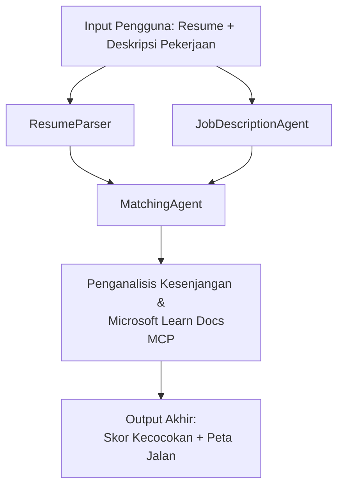

# PersonalCareerCopilot - Resume → Evaluator Kesesuaian Pekerjaan

Alur kerja multi-agen yang mengevaluasi seberapa baik resume cocok dengan deskripsi pekerjaan, lalu menghasilkan roadmap pembelajaran yang dipersonalisasi untuk menutup kesenjangan.

---

## Agen

| Agen | Peran | Alat |
|-------|------|-------|
| **ResumeParser** | Mengekstrak keterampilan terstruktur, pengalaman, sertifikasi dari teks resume | - |
| **JobDescriptionAgent** | Mengekstrak keterampilan yang dibutuhkan/diutamakan, pengalaman, sertifikasi dari JD | - |
| **MatchingAgent** | Membandingkan profil vs persyaratan → skor kecocokan (0-100) + keterampilan yang cocok/hilang | - |
| **GapAnalyzer** | Membangun roadmap pembelajaran yang dipersonalisasi dengan sumber daya Microsoft Learn | `search_microsoft_learn_for_plan` (MCP) |

## Alur Kerja


---

## Mulai cepat

### 1. Siapkan lingkungan

```powershell
cd workshop\lab02-multi-agent\PersonalCareerCopilot
python -m venv .venv
.\.venv\Scripts\Activate.ps1          # Windows PowerShell
# source .venv/bin/activate            # macOS / Linux
pip install -r requirements.txt
```

### 2. Konfigurasikan kredensial

Salin file env contoh dan isi detail proyek Foundry Anda:

```powershell
cp .env.example .env
```

Edit `.env`:

```env
PROJECT_ENDPOINT=https://<your-account>.services.ai.azure.com/api/projects/<your-project>
MODEL_DEPLOYMENT_NAME=gpt-4.1-mini
```

| Nilai | Tempat menemukannya |
|-------|--------------------|
| `PROJECT_ENDPOINT` | Sidebar Microsoft Foundry di VS Code → klik kanan proyek Anda → **Copy Project Endpoint** |
| `MODEL_DEPLOYMENT_NAME` | Sidebar Foundry → perluas proyek → **Models + endpoints** → nama deployment |

### 3. Jalankan secara lokal

```powershell
python -m debugpy --listen 127.0.0.1:5679 -m agentdev run main.py --verbose --port 8088
```

Atau gunakan tugas VS Code: `Ctrl+Shift+P` → **Tasks: Run Task** → **Run Lab02 HTTP Server**.

### 4. Uji dengan Agent Inspector

Buka Agent Inspector: `Ctrl+Shift+P` → **Foundry Toolkit: Open Agent Inspector**.

Tempel prompt uji ini:

```
Resume:
Jane Doe
Senior Software Engineer with 5 years of experience in Python, Django, and AWS.
Built microservices handling 10K+ requests/second. Led a team of 4 developers.
Certifications: AWS Solutions Architect Associate.
Education: B.S. Computer Science, State University.

Job Description:
Senior Cloud Engineer at Contoso Ltd.
Required: Python, Azure, Kubernetes, Terraform, CI/CD pipelines.
Preferred: Go, monitoring (Prometheus/Grafana), cost optimization.
Experience: 5+ years in cloud infrastructure.
Certifications: Azure Solutions Architect Expert preferred.
```

**Diharapkan:** Skor kecocokan (0-100), keterampilan yang cocok/hilang, dan roadmap pembelajaran yang dipersonalisasi dengan URL Microsoft Learn.

### 5. Deploy ke Foundry

`Ctrl+Shift+P` → **Microsoft Foundry: Deploy Hosted Agent** → pilih proyek Anda → konfirmasi.

---

## Struktur Proyek

```
PersonalCareerCopilot/
├── .env.example        ← Template for environment variables
├── .env                ← Your credentials (git-ignored)
├── agent.yaml          ← Hosted agent definition (name, resources, env vars)
├── Dockerfile          ← Container image for Foundry deployment
├── main.py             ← 4-agent workflow (instructions, MCP tool, WorkflowBuilder)
└── requirements.txt    ← Python dependencies
```

## File kunci

### `agent.yaml`

Mendefinisikan hosted agent untuk Layanan Agen Foundry:
- `kind: hosted` - berjalan sebagai kontainer terkelola
- `protocols: [responses v1]` - mengekspos endpoint HTTP `/responses`
- `environment_variables` - `PROJECT_ENDPOINT` dan `MODEL_DEPLOYMENT_NAME` disuntikkan saat deploy

### `main.py`

Berisi:
- **Instruksi Agen** - empat konstanta `*_INSTRUCTIONS`, satu untuk setiap agen
- **Alat MCP** - `search_microsoft_learn_for_plan()` memanggil `https://learn.microsoft.com/api/mcp` melalui Streamable HTTP
- **Pembuatan agen** - `create_agents()` context manager menggunakan `AzureAIAgentClient.as_agent()`
- **Grafik alur kerja** - `create_workflow()` menggunakan `WorkflowBuilder` untuk menghubungkan agen dengan pola fan-out/fan-in/sekuensial
- **Startup server** - `from_agent_framework(agent).run_async()` pada port 8088

### `requirements.txt`

| Paket | Versi | Tujuan |
|---------|---------|---------|
| `agent-framework-azure-ai` | `1.0.0rc3` | Integrasi Azure AI untuk Microsoft Agent Framework |
| `agent-framework-core` | `1.0.0rc3` | Runtime inti (termasuk WorkflowBuilder) |
| `azure-ai-agentserver-agentframework` | `1.0.0b16` | Runtime server hosted agent |
| `azure-ai-agentserver-core` | `1.0.0b16` | Abstraksi inti server agen |
| `debugpy` | terbaru | Debugging Python (F5 di VS Code) |
| `agent-dev-cli` | `--pre` | CLI dev lokal + backend Agent Inspector |

---

## Pemecahan Masalah

| Masalah | Solusi |
|-------|-----|
| `RuntimeError: Missing required environment variable(s)` | Buat `.env` dengan `PROJECT_ENDPOINT` dan `MODEL_DEPLOYMENT_NAME` |
| `ModuleNotFoundError: No module named 'agent_framework'` | Aktifkan venv dan jalankan `pip install -r requirements.txt` |
| Tidak ada URL Microsoft Learn di output | Periksa koneksi internet ke `https://learn.microsoft.com/api/mcp` |
| Hanya 1 kartu kesenjangan (terpotong) | Verifikasi `GAP_ANALYZER_INSTRUCTIONS` mencakup blok `CRITICAL:` |
| Port 8088 sedang digunakan | Matikan server lain: `netstat -ano \| findstr :8088` |

Untuk pemecahan masalah lebih detail, lihat [Modul 8 - Pemecahan Masalah](../docs/08-troubleshooting.md).

---

**Panduan lengkap:** [Lab 02 Docs](../docs/README.md) · **Kembali ke:** [Lab 02 README](../README.md) · [Beranda Workshop](../../../README.md)

---

<!-- CO-OP TRANSLATOR DISCLAIMER START -->
**Penafian**:
Dokumen ini telah diterjemahkan menggunakan layanan terjemahan AI [Co-op Translator](https://github.com/Azure/co-op-translator). Meskipun kami berupaya untuk akurasi, harap diperhatikan bahwa terjemahan otomatis mungkin mengandung kesalahan atau ketidakakuratan. Dokumen asli dalam bahasa aslinya harus dianggap sebagai sumber yang otoritatif. Untuk informasi penting, disarankan menggunakan terjemahan profesional oleh manusia. Kami tidak bertanggung jawab atas kesalahpahaman atau penafsiran yang keliru yang timbul dari penggunaan terjemahan ini.
<!-- CO-OP TRANSLATOR DISCLAIMER END -->