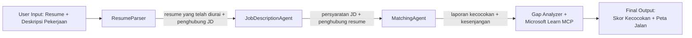

# PersonalCareerCopilot - Evaluator Kecocokan Resume → Pekerjaan

Aplikasi multi-agen berfokus workflow yang mengevaluasi seberapa cocok resume dengan deskripsi pekerjaan, kemudian menghasilkan roadmap pembelajaran yang dipersonalisasi untuk menutup kesenjangan.

---

## Agen

| Agent | Peran | Alat |
|-------|-------|-------|
| **ResumeParser** | Mengekstrak keterampilan terstruktur, pengalaman, sertifikasi dari teks resume | - |
| **JobDescriptionAgent** | Mengekstrak keterampilan, pengalaman, sertifikasi yang diperlukan/diinginkan dari JD | - |
| **MatchingAgent** | Membandingkan profil vs persyaratan → skor kecocokan (0-100) + keterampilan yang cocok/hilang | - |
| **GapAnalyzer** | Membangun roadmap pembelajaran yang dipersonalisasi dengan sumber daya Microsoft Learn | `search_microsoft_learn_for_plan` (MCP) |

## Alur Kerja


```mermaid
flowchart LR
    UserInput["User Input: Resume + Deskripsi Pekerjaan"] --> ResumeParser
    ResumeParser -- "resume yang telah diurai + penghubung JD" --> JobDescriptionAgent
    JobDescriptionAgent -- "persyaratan JD + penghubung resume" --> MatchingAgent
    MatchingAgent -- "laporan kecocokan + kesenjangan" --> GapAnalyzerMCP["Gap Analyzer +\nMicrosoft Learn MCP"]
    GapAnalyzerMCP --> FinalOutput["Final Output:\nSkor Kecocokan + Peta Jalan"]
```

---

## Mulai cepat

### 1. Siapkan lingkungan

Folder ini adalah implementasi referensi untuk kerangka kerja Lab 02 berbasis workflow. File `main.py` nya menggunakan blok prompt yang sudah ada plus `WorkflowBuilder` untuk menghubungkan keempat agen bersama-sama.

```powershell
cd workshop\lab02-multi-agent\PersonalCareerCopilot
python -m venv .venv
.\.venv\Scripts\Activate.ps1          # Windows PowerShell
# source .venv/bin/activate            # macOS / Linux
pip install -r requirements.txt
```

### 2. Konfigurasikan kredensial

Buat file `.env` di folder ini:

```powershell
copy .env .env.bak 2>$null; echo $null > .env
```

Edit `.env`:

```env
FOUNDRY_PROJECT_ENDPOINT=https://<your-account>.services.ai.azure.com/api/projects/<your-project>
AZURE_AI_MODEL_DEPLOYMENT_NAME=gpt-4.1-mini
```

| Nilai | Tempat menemukannya |
|--------|---------------------|
| `FOUNDRY_PROJECT_ENDPOINT` | Sidebar Foundry Toolkit → klik kanan proyek Anda → **Copy Project Endpoint** |
| `AZURE_AI_MODEL_DEPLOYMENT_NAME` | Sidebar Foundry → perluas proyek → **Models + endpoints** → nama deployment |

### 3. Jalankan secara lokal

```powershell
python -m debugpy --listen 127.0.0.1:5679 main.py --port 8088
```

Atau gunakan task VS Code: `Ctrl+Shift+P` → **Tasks: Run Task** → **Run Agent HTTP Server**.

Untuk debugging dengan F5, gunakan **Debug Local Agent HTTP Server**.

### 4. Uji dengan Agent Inspector

Buka Agent Inspector: `Ctrl+Shift+P` → **Foundry Toolkit: Open Agent Inspector**.

Tempel prompt pengujian ini:

```
Resume:
Jane Doe
Senior Software Engineer with 5 years of experience in Python, Django, and AWS.
Built microservices handling 10K+ requests/second. Led a team of 4 developers.
Certifications: AWS Solutions Architect Associate.
Education: B.S. Computer Science, State University.

Job Description:
Senior Cloud Engineer at Contoso Ltd.
Required: Python, Azure, Kubernetes, Terraform, CI/CD pipelines.
Preferred: Go, monitoring (Prometheus/Grafana), cost optimization.
Experience: 5+ years in cloud infrastructure.
Certifications: Azure Solutions Architect Expert preferred.
```

**Harapan:** Skor kecocokan (0-100), keterampilan yang cocok/hilang, dan roadmap pembelajaran yang dipersonalisasi dengan URL Microsoft Learn.

### 5. Deploy ke Foundry

`Ctrl+Shift+P` → **Foundry Toolkit: Deploy Hosted Agent** → pilih proyek Anda → konfirmasi.

---

## Struktur Proyek

```
PersonalCareerCopilot/
├── .env                ← Your credentials (git-ignored)
├── agent.yaml          ← Hosted agent definition (name, resources, env vars)
├── Dockerfile          ← Container image for Foundry deployment
├── main.py             ← 4-agent workflow (instructions, MCP tool, WorkflowBuilder)
└── requirements.txt    ← Python dependencies
```

## File kunci

### `agent.yaml`

Mendefinisikan agen hosted untuk Foundry Agent Service:
- `kind: hosted` - dijalankan sebagai container terkelola
- `protocols` - protokol `responses` dengan `version: 1.0.0`, mengekspos endpoint HTTP `/responses`
- `environment_variables` - `AZURE_AI_MODEL_DEPLOYMENT_NAME` dideklarasikan di sini; `FOUNDRY_PROJECT_ENDPOINT` disuntikkan otomatis saat deploy

### `main.py`

Berisi:
- **Instruksi Agen** - empat konstanta `*_INSTRUCTIONS`, satu per agen
- **Alat MCP** - `search_microsoft_learn_for_plan()` memanggil `https://learn.microsoft.com/api/mcp` via Streamable HTTP
- **Pembuatan Agen** - empat instance `Agent()` + `AgentExecutor()` yang berbagi satu `FoundryChatClient`
- **Grafik Alur Kerja** - `WorkflowBuilder` menghubungkan agen sebagai pipeline berurutan: ResumeParser → JD Agent → MatchingAgent → GapAnalyzer
- **Startup server** - `ResponsesHostServer` berjalan di port 8088

### `requirements.txt`

| Paket | Tujuan |
|--------|---------|
| `agent-framework-foundry` | Runtime inti: `Agent`, `AgentExecutor`, `WorkflowBuilder`, `@tool`, `FoundryChatClient` |
| `agent-framework-foundry-hosting` | `ResponsesHostServer` + integrasi hosting Foundry |
| `mcp<2,>=1.24.0` | Klien MCP untuk GapAnalyzer (`streamable_http_client`) |
| `debugpy` | Debugging Python (F5 di VS Code) |

---

## Pemecahan Masalah

| Masalah | Perbaikan |
|--------|----------|
| `KeyError: 'FOUNDRY_PROJECT_ENDPOINT'` atau `KeyError: 'AZURE_AI_MODEL_DEPLOYMENT_NAME'` | Buat `.env` dengan `FOUNDRY_PROJECT_ENDPOINT` dan `AZURE_AI_MODEL_DEPLOYMENT_NAME` diatur |
| `ModuleNotFoundError: No module named 'agent_framework'` | Aktifkan venv dan jalankan `pip install -r requirements.txt` |
| Tidak ada URL Microsoft Learn di output | Periksa koneksi internet ke `https://learn.microsoft.com/api/mcp` |
| Hanya 1 kartu gap (terpotong) | Verifikasi `GAP_ANALYZER_INSTRUCTIONS` menyertakan blok `CRITICAL:` |
| Port 8088 sudah digunakan | Hentikan server lain: `netstat -ano \| findstr :8088` |

Untuk pemecahan masalah secara rinci, lihat [Modul 8 - Pemecahan Masalah](../docs/08-troubleshooting.md).

---

**Panduan lengkap:** [Dokumen Lab 02](../docs/README.md) · **Kembali ke:** [README Lab 02](../README.md) · [Beranda Workshop](../../../README.md)

---

<!-- CO-OP TRANSLATOR DISCLAIMER START -->
**Penafian**:
Dokumen ini telah diterjemahkan menggunakan layanan terjemahan AI [Co-op Translator](https://github.com/Azure/co-op-translator). Meskipun kami berupaya untuk mencapai akurasi, harap diketahui bahwa terjemahan otomatis mungkin mengandung kesalahan atau ketidakakuratan. Dokumen asli dalam bahasa aslinya harus dianggap sebagai sumber yang sah. Untuk informasi penting, disarankan menggunakan terjemahan profesional oleh manusia. Kami tidak bertanggung jawab atas kesalahpahaman atau penafsiran yang keliru yang timbul dari penggunaan terjemahan ini.
<!-- CO-OP TRANSLATOR DISCLAIMER END -->