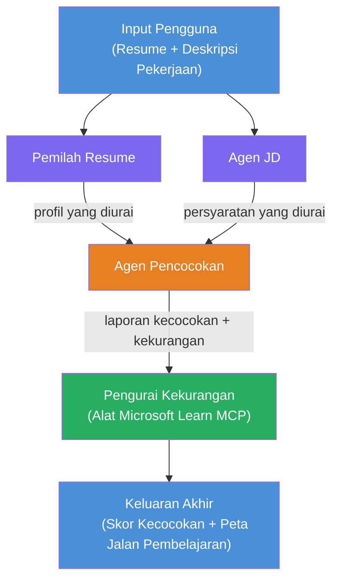

# Lab 02 - Alur Kerja Multi-Agen: Resume → Evaluator Kecocokan Pekerjaan

---

## Apa yang akan Anda bangun

Sebuah **Evaluator Kecocokan Resume → Pekerjaan** - alur kerja multi-agen di mana empat agen khusus bekerja sama untuk mengevaluasi seberapa baik resume kandidat sesuai dengan deskripsi pekerjaan, lalu menghasilkan roadmap pembelajaran yang dipersonalisasi untuk menutup kekurangan tersebut.

### Agen-agen tersebut

| Agen | Peran |
|-------|------|
| **Resume Parser** | Mengekstrak keterampilan terstruktur, pengalaman, sertifikasi dari teks resume |
| **Job Description Agent** | Mengekstrak keterampilan yang dibutuhkan/lebih disukai, pengalaman, sertifikasi dari JD |
| **Matching Agent** | Membandingkan profil vs persyaratan → skor kecocokan (0-100) + keterampilan yang cocok/hilang |
| **Gap Analyzer** | Membuat roadmap pembelajaran yang dipersonalisasi dengan sumber daya, jadwal waktu, dan proyek cepat selesai |

### Alur demo

Unggah **resume + deskripsi pekerjaan** → dapatkan **skor kecocokan + keterampilan yang hilang** → terima **roadmap pembelajaran yang dipersonalisasi**.

### Arsitektur alur kerja

> Ungu = agen paralel | Oranye = titik agregasi | Hijau = agen akhir dengan alat. Lihat [Modul 1 - Memahami Arsitektur](docs/01-understand-multi-agent.md) dan [Modul 4 - Pola Orkestrasi](docs/04-orchestration-patterns.md) untuk diagram rinci dan aliran data.

### Topik yang dibahas

- Membuat alur kerja multi-agen menggunakan **WorkflowBuilder**
- Mendefinisikan peran agen dan alur orkestrasi (paralel + berurutan)
- Pola komunikasi antar agen
- Pengujian lokal dengan Agent Inspector
- Menerapkan alur kerja multi-agen ke Foundry Agent Service

---

## Prasyarat

Selesaikan Lab 01 terlebih dahulu:

- [Lab 01 - Agen Tunggal](../lab01-single-agent/README.md)

---

## Memulai

Lihat petunjuk setup lengkap, walkthrough kode, dan perintah pengujian di:

- [Dokumen Lab 2 - Prasyarat](docs/00-prerequisites.md)
- [Dokumen Lab 2 - Jalur Pembelajaran Lengkap](docs/README.md)
- [Panduan menjalankan PersonalCareerCopilot](PersonalCareerCopilot/README.md)

## Pola orkestrasi (alternatif agentik)

Lab 2 mencakup alur default **paralel → agregator → perencana**, dan dokumen juga menjelaskan pola alternatif untuk menunjukkan perilaku agentik yang lebih kuat:

- **Fan-out/Fan-in dengan konsensus berbobot**
- **Review/pengkritik sebelum roadmap akhir**
- **Router kondisional** (pemilihan jalur berdasarkan skor kecocokan dan keterampilan yang hilang)

Lihat [docs/04-orchestration-patterns.md](docs/04-orchestration-patterns.md).

---

**Sebelumnya:** [Lab 01 - Agen Tunggal](../lab01-single-agent/README.md) · **Kembali ke:** [Beranda Workshop](../../README.md)

---

<!-- CO-OP TRANSLATOR DISCLAIMER START -->
**Penafian**:  
Dokumen ini telah diterjemahkan menggunakan layanan terjemahan AI [Co-op Translator](https://github.com/Azure/co-op-translator). Meskipun kami berusaha untuk akurasi, harap diketahui bahwa terjemahan otomatis mungkin mengandung kesalahan atau ketidakakuratan. Dokumen asli dalam bahasa aslinya harus dianggap sebagai sumber otoritatif. Untuk informasi penting, disarankan menggunakan terjemahan profesional oleh manusia. Kami tidak bertanggung jawab atas kesalahpahaman atau kesalahan interpretasi yang timbul dari penggunaan terjemahan ini.
<!-- CO-OP TRANSLATOR DISCLAIMER END -->