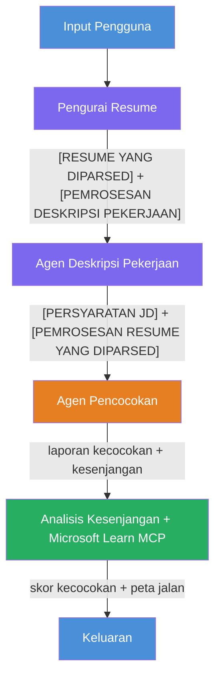

# Lab 02 - Alur Kerja Multi-Agen: Evaluator Kecocokan Resume → Pekerjaan

## Ikhtisar

Dalam lab praktik ini, Anda akan membangun **aplikasi multi-agen berbasis alur kerja** menggunakan Foundry Toolkit di VS Code dan menerapkannya ke Microsoft Foundry Agent Service.

**Apa yang akan Anda bangun:** sebuah Evaluator Kecocokan Resume → Pekerjaan yang mengurai resume dan deskripsi pekerjaan, menilai kecocokan, dan menghasilkan roadmap pembelajaran yang dipersonalisasi menggunakan sumber daya Microsoft Learn.

---

## Arsitektur

```mermaid
flowchart TD
    A["Input Pengguna"] --> B["Pengurai Resume"]
    B -->|"[RESUME YANG DIPARSED] + [PEMROSESAN DESKRIPSI PEKERJAAN]"| C["Agen Deskripsi Pekerjaan"]
    C -->|"[PERSYARATAN JD] + [PEMROSESAN RESUME YANG DIPARSED]"| D["Agen Pencocokan"]
    D -->|laporan kecocokan + kesenjangan| E["Analisis Kesenjangan + Microsoft Learn MCP"]
    E -->|skor kecocokan + peta jalan| F["Keluaran"]

    style A fill:#4A90D9,color:#fff
    style B fill:#7B68EE,color:#fff
    style C fill:#7B68EE,color:#fff
    style D fill:#E67E22,color:#fff
    style E fill:#27AE60,color:#fff
    style F fill:#4A90D9,color:#fff
```

**Cara kerjanya:**
1. Pengguna menempelkan resume dan deskripsi pekerjaan.
2. **ResumeParser** mengurai resume dan menyalin JD secara verbatim ke bagian `[JOB DESCRIPTION PASS-THROUGH]`.
3. **JD Agent** mengekstrak persyaratan terstruktur dari pass-through, kemudian meneruskan `[PARSED RESUME]` sebagai `[PARSED RESUME PASS-THROUGH]`.
4. **MatchingAgent** membandingkan `[PARSED RESUME PASS-THROUGH]` dengan `[JD REQUIREMENTS]` dan menghasilkan skor kecocokan.
5. **GapAnalyzer** mengubah kekurangan menjadi roadmap praktis dan mengambil tautan Microsoft Learn nyata melalui MCP.

---

## Prasyarat

Selesaikan Lab 01 terlebih dahulu:

- [Lab 01 - Agen Tunggal](../lab01-single-agent/README.md)

---

## Bagian 1: Baca modul-modul secara berurutan

Lihat jalur pembelajaran lengkap di:

- [Dokumentasi Lab 2 - Prasyarat](docs/00-prerequisites.md)
- [Dokumentasi Lab 2 - Jalur Pembelajaran Lengkap](docs/README.md)
- [Panduan menjalankan PersonalCareerCopilot](PersonalCareerCopilot/README.md)

---

## Bagian 2: Bangun dan uji alur kerja

1. Gunakan wizard Foundry Toolkit untuk membuat proyek berbasis alur kerja.
2. Salin blok prompt dan grafik alur kerja dari `PersonalCareerCopilot/main.py` ke dalam workspace Anda.
3. Jalankan secara lokal dengan Agent Inspector dan verifikasi semua empat agen plus alat MCP.
4. Terapkan agen yang dihosting ke Foundry ketika pengujian lokal lulus.

---

## Pola Orkestrasi

Lab 02 mencakup alur default **fan-out → fan-in → berurutan**, dan dokumentasi juga mendeskripsikan pola orkestrasi alternatif untuk eksperimen.

- **Fan-out/Fan-in dengan konsensus berbobot**
- **Review/pengoreksi sebelum roadmap final**
- **Router kondisional** berdasarkan skor kecocokan dan keterampilan yang hilang

Lihat [docs/04-orchestration-patterns.md](docs/04-orchestration-patterns.md).

---

**Sebelumnya:** [Lab 01 - Agen Tunggal](../lab01-single-agent/README.md) · **Kembali ke:** [Beranda Workshop](../../README.md)

---

<!-- CO-OP TRANSLATOR DISCLAIMER START -->
**Penafian**:
Dokumen ini telah diterjemahkan menggunakan layanan terjemahan AI [Co-op Translator](https://github.com/Azure/co-op-translator). Meskipun kami berupaya untuk mencapai akurasi, harap diketahui bahwa terjemahan otomatis mungkin mengandung kesalahan atau ketidakakuratan. Dokumen asli dalam bahasa aslinya harus dianggap sebagai sumber yang sah. Untuk informasi penting, disarankan menggunakan terjemahan profesional oleh manusia. Kami tidak bertanggung jawab atas kesalahpahaman atau penafsiran yang keliru yang timbul dari penggunaan terjemahan ini.
<!-- CO-OP TRANSLATOR DISCLAIMER END -->