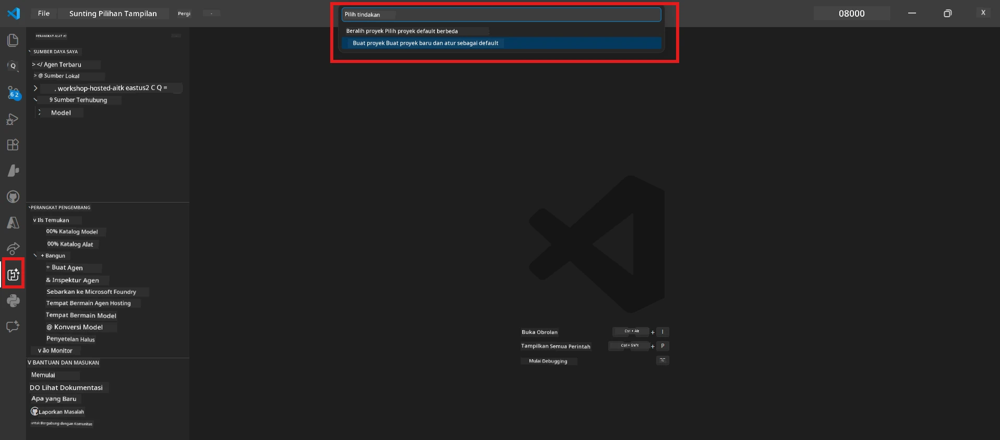

# Module 0 - Prasyarat

Sebelum memulai Lab 02, pastikan Anda telah menyelesaikan hal-hal berikut. Lab ini dibangun langsung dari Lab 01 - jangan dilewati.

---

## 1. Selesaikan Lab 01

Lab 02 mengasumsikan Anda sudah:

- [x] Menyelesaikan semua 8 modul dari [Lab 01 - Single Agent](../../lab01-single-agent/README.md)
- [x] Berhasil menerapkan satu agen ke Foundry Agent Service
- [x] Memverifikasi agen bekerja di Agent Inspector lokal dan Foundry Playground

Jika Anda belum menyelesaikan Lab 01, kembali dan selesaikan sekarang: [Dokumentasi Lab 01](../../lab01-single-agent/docs/00-prerequisites.md)

---

## 2. Verifikasi pengaturan yang ada

Semua alat dari Lab 01 harusnya masih terpasang dan berfungsi. Jalankan pemeriksaan cepat ini:

### 2.1 Azure CLI

```powershell
az account show --query "{name:name, id:id}" --output table
```

Diharapkan: Menampilkan nama dan ID langganan Anda. Jika gagal, jalankan [`az login`](https://learn.microsoft.com/cli/azure/authenticate-azure-cli-interactively).

### 2.2 Ekstensi VS Code

1. Tekan `Ctrl+Shift+P` → ketik **"Microsoft Foundry"** → pastikan Anda melihat perintah (misalnya, `Microsoft Foundry: Create a New Hosted Agent`).
2. Tekan `Ctrl+Shift+P` → ketik **"Foundry Toolkit"** → pastikan Anda melihat perintah (misalnya, `Foundry Toolkit: Open Agent Inspector`).

### 2.3 Proyek & model Foundry

1. Klik ikon **Microsoft Foundry** di Bar Aktivitas VS Code.
2. Pastikan proyek Anda terdaftar (misalnya, `workshop-agents`).
3. Perluas proyek → verifikasi terdapat model yang sudah diterapkan (misalnya, `gpt-4.1-mini`) dengan status **Succeeded**.

> **Jika penerapan model Anda sudah kedaluwarsa:** Beberapa penerapan gratis otomatis kedaluwarsa. Terapkan ulang dari [Model Catalog](https://learn.microsoft.com/azure/foundry/foundry-models/concepts/models-sold-directly-by-azure) (`Ctrl+Shift+P` → **Microsoft Foundry: Open Model Catalog**).



### 2.4 Peran RBAC

Pastikan Anda memiliki **Azure AI User** pada proyek Foundry Anda:

1. [Portal Azure](https://portal.azure.com) → sumber daya **proyek** Foundry Anda → **Access control (IAM)** → tab **[Role assignments](https://learn.microsoft.com/azure/foundry/concepts/rbac-foundry)**.
2. Cari nama Anda → pastikan **[Azure AI User](https://aka.ms/foundry-ext-project-role)** terdaftar.

---

## 3. Pahami konsep multi-agen (baru untuk Lab 02)

Lab 02 memperkenalkan konsep yang tidak dibahas di Lab 01. Bacalah bagian ini sebelum melanjutkan:

### 3.1 Apa itu workflow multi-agen?

Alih-alih satu agen menangani semuanya, **workflow multi-agen** membagi pekerjaan ke banyak agen khusus. Setiap agen memiliki:

- **instruksi** sendiri (prompt sistem)
- **peran** sendiri (tanggung jawabnya)
- **alat** opsional (fungsi yang bisa dipanggil)

Para agen berkomunikasi melalui **graf orkestrasi** yang menentukan bagaimana data mengalir di antara mereka.

### 3.2 WorkflowBuilder

Kelas [`WorkflowBuilder`](https://learn.microsoft.com/agent-framework/workflows/agents-in-workflows) dari `agent_framework` adalah komponen SDK yang menghubungkan agen-agen bersama:

```python
from agent_framework import WorkflowBuilder

workflow = (
    WorkflowBuilder(
        name="MyWorkflow",
        start_executor=agent_a,
        output_executors=[agent_d],
    )
    .add_edge(agent_a, agent_b)
    .add_edge(agent_a, agent_c)
    .add_edge(agent_b, agent_d)
    .add_edge(agent_c, agent_d)
    .build()
)
```

- **`start_executor`** - Agen pertama yang menerima input pengguna
- **`output_executors`** - Agen yang outputnya menjadi respons akhir
- **`add_edge(source, target)`** - Menentukan bahwa `target` menerima output dari `source`

### 3.3 Alat MCP (Model Context Protocol)

Lab 02 menggunakan **alat MCP** yang memanggil API Microsoft Learn untuk mengambil sumber belajar. [MCP (Model Context Protocol)](https://modelcontextprotocol.io/introduction) adalah protokol terstandarisasi untuk menghubungkan model AI ke sumber data dan alat eksternal.

| Istilah | Definisi |
|------|-----------|
| **server MCP** | Layanan yang menyediakan alat/sumber daya melalui [protokol MCP](https://learn.microsoft.com/azure/foundry/agents/how-to/tools/model-context-protocol) |
| **klien MCP** | Kode agen Anda yang terhubung ke server MCP dan memanggil alatnya |
| **[Streamable HTTP](https://learn.microsoft.com/agent-framework/agents/tools/hosted-mcp-tools)** | Metode transportasi yang digunakan untuk berkomunikasi dengan server MCP |

### 3.4 Perbedaan Lab 02 dengan Lab 01

| Aspek | Lab 01 (Single Agent) | Lab 02 (Multi-Agent) |
|--------|----------------------|---------------------|
| Agen | 1 | 4 (peran khusus) |
| Orkestrasi | Tidak ada | WorkflowBuilder (paralel + berurutan) |
| Alat | Fungsi opsional `@tool` | Alat MCP (panggilan API eksternal) |
| Kompleksitas | Prompt sederhana → respons | Resume + JD → skor kecocokan → roadmap |
| Aliran konteks | Langsung | Serah terima antar agen |

---

## 4. Struktur repositori workshop untuk Lab 02

Pastikan Anda tahu di mana file Lab 02 berada:

```
workshop/
└── lab02-multi-agent/
    ├── README.md                       ← Lab overview
    ├── docs/                           ← You are here
    │   ├── README.md                   ← Learning path index
    │   ├── 00-prerequisites.md         ← This file
    │   ├── 01-understand-multi-agent.md
    │   ├── ...
    │   └── 08-troubleshooting.md
    └── PersonalCareerCopilot/          ← The agent project
        ├── agent.yaml                  ← Agent definition
        ├── main.py                     ← 4-agent workflow code
        ├── Dockerfile                  ← Container configuration
        └── requirements.txt            ← Python dependencies
```

---

### Titik pemeriksaan

- [ ] Lab 01 sudah selesai seluruhnya (8 modul, agen diterapkan dan diverifikasi)
- [ ] `az account show` mengembalikan langganan Anda
- [ ] Ekstensi Microsoft Foundry dan Foundry Toolkit telah terpasang dan merespons
- [ ] Proyek Foundry memiliki model yang diterapkan (misalnya, `gpt-4.1-mini`)
- [ ] Anda memiliki peran **Azure AI User** pada proyek
- [ ] Anda telah membaca seksi konsep multi-agen di atas dan memahami WorkflowBuilder, MCP, dan orkestrasi agen

---

**Selanjutnya:** [01 - Pahami Arsitektur Multi-Agen →](01-understand-multi-agent.md)

---

<!-- CO-OP TRANSLATOR DISCLAIMER START -->
**Penafian**:  
Dokumen ini telah diterjemahkan menggunakan layanan terjemahan AI [Co-op Translator](https://github.com/Azure/co-op-translator). Meskipun kami berusaha mencapai akurasi, harap diperhatikan bahwa terjemahan otomatis mungkin mengandung kesalahan atau ketidaktepatan. Dokumen asli dalam bahasa aslinya harus dianggap sebagai sumber yang sah. Untuk informasi penting, disarankan menggunakan terjemahan profesional oleh manusia. Kami tidak bertanggung jawab atas kesalahpahaman atau interpretasi yang salah yang timbul dari penggunaan terjemahan ini.
<!-- CO-OP TRANSLATOR DISCLAIMER END -->