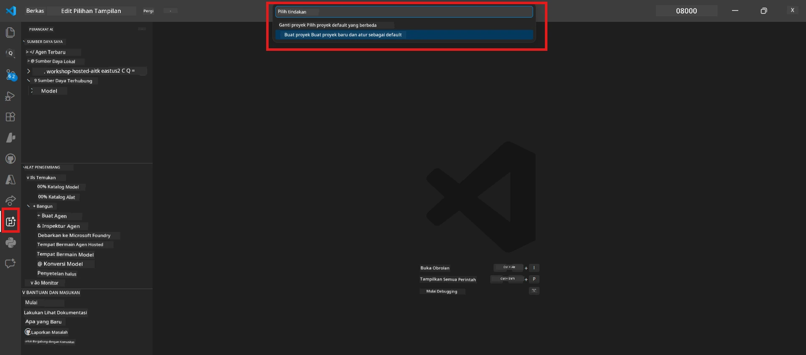

# Modul 0 - Pengantar

⏱️ ~10 menit

> [!WARNING]
> **Pratinjau & Keterbatasan:** [Hosted Agents](https://learn.microsoft.com/azure/foundry/agents/concepts/hosted-agents) saat ini dalam **pratinjau publik** - tidak disarankan untuk beban kerja produksi. Beberapa fitur yang ditunjukkan dalam lokakarya ini mungkin berubah seiring layanan menuju GA.

## Apa yang akan Anda bangun

Dalam lab ini, Anda memperluas kemampuan agen tunggal dari Lab 01 untuk membangun **alur kerja multi-agen** - Evaluator Kecocokan Job dari Resume.

Anda menyalin sebuah **resume** dan **deskripsi pekerjaan**. Empat agen spesialis memproses input secara berurutan, lalu mengembalikan:
- Skor kecocokan (0–100 dengan rincian skor)
- Daftar kesenjangan keterampilan dan sertifikasi
- Peta pembelajaran yang dipersonalisasi dengan tautan Microsoft Learn nyata untuk setiap kesenjangan

**Alur kerja menggunakan:**
- **Microsoft Agent Framework** - `WorkflowBuilder` untuk orkestrasi pipeline berurutan
- **Foundry Toolkit untuk VS Code** - membuat kerangka, pengujian lokal, penerapan
- **Model AI** (misal, `gpt-4.1-mini`) - digunakan oleh keempat agen
- **Server Microsoft Learn MCP** - menyediakan tautan sumber pembelajaran nyata untuk setiap kesenjangan keterampilan

---

## Pilih jalur Anda

> ⚠️ **Lanjutkan dengan jalur yang sama yang Anda gunakan di Lab 01.**

<details open>
<summary><strong>🅰️ Jalur A - Azure cloud (memerlukan langganan Azure)</strong></summary>

| | Detail |
|---|---|
| **Untuk siapa ini?** | Anda telah menyelesaikan Lab 01 menggunakan langganan Azure |
| **Model** | Azure OpenAI via Foundry (misal, `gpt-4.1-mini`) |
| **Modul yang dibahas** | Semua modul (00–09) |
| **Deploy ke cloud?** | ✅ Ya - penerapan end-to-end penuh |

</details>

<details open>
<summary><strong>🅱️ Jalur B - Foundry Lokal (tidak memerlukan langganan Azure)</strong></summary>

| | Detail |
|---|---|
| **Untuk siapa ini?** | Anda telah menyelesaikan Lab 01 menggunakan Foundry Lokal |
| **Model** | Foundry Lokal (gratis, berjalan di mesin Anda) |
| **Modul yang dibahas** | Modul 00–05 (lewati 06–07 - penerapan & verifikasi cloud) |
| **Deploy ke cloud?** | ❌ Tidak - hanya pengujian lokal melalui Agent Inspector |

</details>

---

## Pemeriksaan Lab 01

Lab 02 dibangun langsung di Lab 01. Selesaikan Lab 01 terlebih dahulu sebelum memulai di sini.

Belum melakukan Lab 01? Mulai di sini: [Lab 01 - Pengantar](../../lab01-single-agent/docs/00-prerequisites.md)

<details open>
<summary><strong>🅰️ Jalur A - Azure cloud</strong></summary>

```powershell
az account show --query "{name:name, id:id}" --output table
```

Jika ini gagal, jalankan `az login`. Lalu verifikasi di VS Code:

1. `Ctrl+Shift+P` → ketik **Foundry Toolkit** → pastikan perintah muncul.
2. Klik ikon **Foundry Toolkit** → proyek dan model yang diterapkan menunjukkan **Berhasil**.



> **RBAC:** Anda menetapkan **Foundry User** di Lab 01. Jika perlu menetapkannya kembali, lihat [Lab 01, Modul 1](../../lab01-single-agent/docs/01-setup.md#deploy-a-model--assign-rbac). Peran ini sebelumnya bernama **Azure AI User** - dengan izin yang sama.

</details>

<details open>
<summary><strong>🅱️ Jalur B - Foundry Lokal</strong></summary>

```powershell
Invoke-WebRequest -Uri "http://localhost:5273/v1/health" -UseBasicParsing | Select-Object StatusCode
```

Diharapkan: `StatusCode: 200`. Jika tidak, mulai ulang Foundry Lokal dari sidebar Foundry Toolkit.

> Semua inferensi berjalan di mesin Anda. Satu-satunya panggilan keluar adalah alat MCP ke `https://learn.microsoft.com/api/mcp`.

</details>

---

## Apa yang baru di Lab 02

| | Lab 01 | Lab 02 |
|--|--------|--------|
| Agen | 1 | 4 (berantai dengan WorkflowBuilder) |
| Template scaffold | Dasar - Agent Framework | Alur Kerja - Agent Framework |
| Paket baru | - | `mcp` |
| Orkestrasi | Agen percakapan tunggal | Pipeline berurutan (WorkflowBuilder) |
| Alat baru | - | `search_microsoft_learn_for_plan` (MCP) |

---

**Selanjutnya:** [01 - Memahami Arsitektur →](01-understand-multi-agent.md)

---

<!-- CO-OP TRANSLATOR DISCLAIMER START -->
**Penafian**:
Dokumen ini telah diterjemahkan menggunakan layanan terjemahan AI [Co-op Translator](https://github.com/Azure/co-op-translator). Meskipun kami berupaya untuk mencapai akurasi, harap diketahui bahwa terjemahan otomatis mungkin mengandung kesalahan atau ketidakakuratan. Dokumen asli dalam bahasa aslinya harus dianggap sebagai sumber yang sah. Untuk informasi penting, disarankan menggunakan terjemahan profesional oleh manusia. Kami tidak bertanggung jawab atas kesalahpahaman atau penafsiran yang keliru yang timbul dari penggunaan terjemahan ini.
<!-- CO-OP TRANSLATOR DISCLAIMER END -->