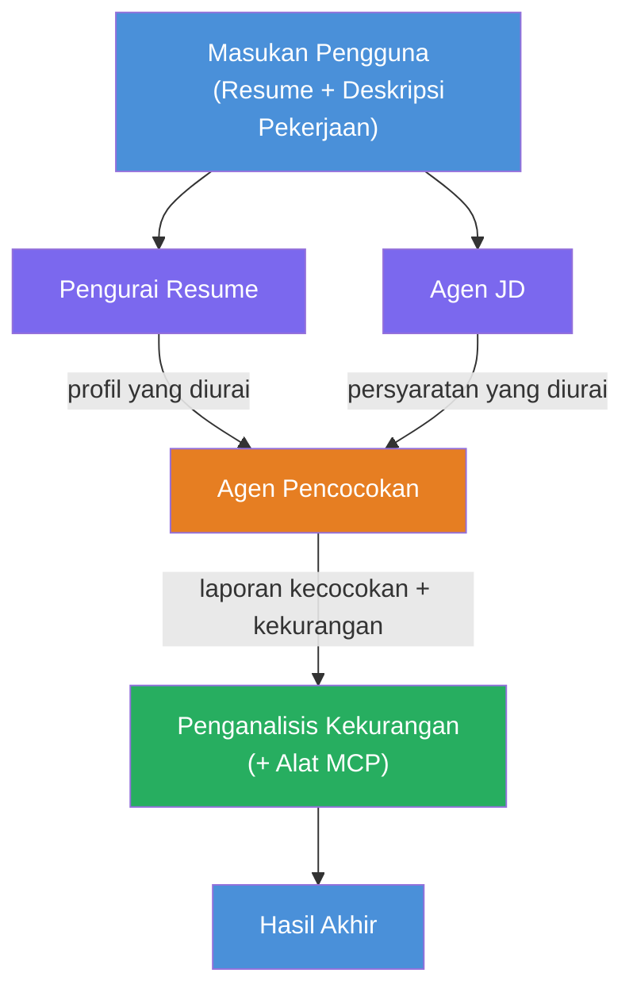
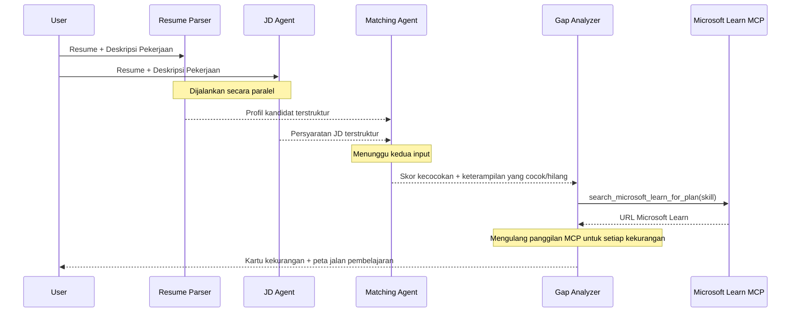
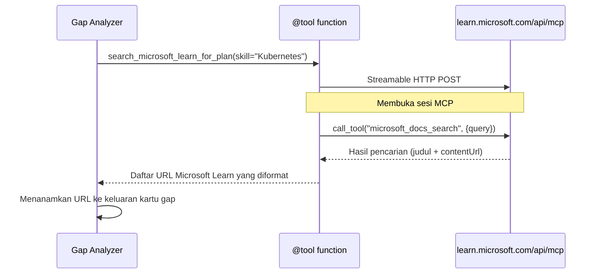

# Modul 1 - Memahami Arsitektur Multi-Agen

Dalam modul ini, Anda mempelajari arsitektur Resume → Job Fit Evaluator sebelum menulis kode apapun. Memahami grafik orkestrasi, peran agen, dan aliran data sangat penting untuk debugging dan pengembangan [alur kerja multi-agen](https://learn.microsoft.com/azure/architecture/ai-ml/idea/multiple-agent-workflow-automation).

---

## Masalah yang diselesaikan ini

Mencocokkan resume dengan deskripsi pekerjaan melibatkan beberapa keterampilan berbeda:

1. **Parsing** - Mengekstrak data terstruktur dari teks tidak terstruktur (resume)
2. **Analisis** - Mengekstrak persyaratan dari deskripsi pekerjaan
3. **Perbandingan** - Memberi skor kesesuaian antara keduanya
4. **Perencanaan** - Membangun peta pembelajaran untuk menutup kekurangan

Satu agen yang melakukan keempat tugas dalam satu prompt sering menghasilkan:
- Ekstraksi yang tidak lengkap (terburu-buru melakukan parsing agar cepat ke skor)
- Penilaian dangkal (tidak ada rincian berbasis bukti)
- Peta pembelajaran generik (tidak disesuaikan dengan kekurangan spesifik)

Dengan membagi menjadi **empat agen spesialis**, masing-masing fokus pada tugasnya dengan instruksi khusus, menghasilkan output berkualitas lebih tinggi di setiap tahap.

---

## Empat agen

Setiap agen adalah agen penuh [Microsoft Foundry](https://learn.microsoft.com/azure/foundry/agents/concepts/hosted-agents) yang dibuat melalui `AzureAIAgentClient.as_agent()`. Mereka menggunakan deployment model yang sama tetapi memiliki instruksi dan (opsional) alat yang berbeda.

| # | Nama Agen | Peran | Input | Output |
|---|-----------|------|-------|--------|
| 1 | **ResumeParser** | Mengekstrak profil terstruktur dari teks resume | Teks resume mentah (dari pengguna) | Profil Kandidat, Keterampilan Teknis, Keterampilan Lunak, Sertifikasi, Pengalaman Domain, Prestasi |
| 2 | **JobDescriptionAgent** | Mengekstrak persyaratan terstruktur dari JD | Teks JD mentah (dari pengguna, diteruskan via ResumeParser) | Ringkasan Peran, Keterampilan Wajib, Keterampilan Preferensi, Pengalaman, Sertifikasi, Pendidikan, Tanggung Jawab |
| 3 | **MatchingAgent** | Menghitung skor kesesuaian berbasis bukti | Output dari ResumeParser + JobDescriptionAgent | Skor Kesesuaian (0-100 dengan rincian), Keterampilan yang Sesuai, Keterampilan yang Hilang, Kekurangan |
| 4 | **GapAnalyzer** | Membangun peta pembelajaran personal | Output dari MatchingAgent | Kartu kekurangan (per keterampilan), Urutan Pembelajaran, Garis Waktu, Sumber Daya dari Microsoft Learn |

---

## Grafik orkestrasi

Alur kerja menggunakan **parallel fan-out** diikuti oleh **agregasi berurutan**:


> **Legenda:** Ungu = agen paralel, Oranye = titik agregasi, Hijau = agen akhir dengan alat

### Cara aliran data


1. **Pengguna mengirimkan** pesan yang berisi resume dan deskripsi pekerjaan.
2. **ResumeParser** menerima input lengkap pengguna dan mengekstrak profil kandidat terstruktur.
3. **JobDescriptionAgent** menerima input pengguna secara paralel dan mengekstrak persyaratan terstruktur.
4. **MatchingAgent** menerima output dari **ResumeParser dan JobDescriptionAgent** (kerangka menunggu keduanya selesai sebelum menjalankan MatchingAgent).
5. **GapAnalyzer** menerima output MatchingAgent dan memanggil **alat Microsoft Learn MCP** untuk mengambil sumber belajar nyata untuk setiap kekurangan.
6. **Output akhir** adalah respons GapAnalyzer, yang mencakup skor kesesuaian, kartu kekurangan, dan peta pembelajaran lengkap.

### Mengapa parallel fan-out penting

ResumeParser dan JobDescriptionAgent berjalan **secara paralel** karena keduanya tidak saling bergantung. Ini:
- Mengurangi total latensi (keduanya berjalan simultan, bukan berurutan)
- Merupakan pemisahan alami (parsing resume vs. parsing JD adalah tugas independen)
- Menunjukkan pola umum multi-agen: **fan-out → agregasi → aksi**

---

## WorkflowBuilder dalam kode

Berikut cara grafik di atas dipetakan ke panggilan API [`WorkflowBuilder`](https://learn.microsoft.com/agent-framework/workflows/agents-in-workflows) dalam `main.py`:

```python
from agent_framework import WorkflowBuilder

workflow = (
    WorkflowBuilder(
        name="ResumeJobFitEvaluator",
        start_executor=resume_parser,       # Agen pertama yang menerima input pengguna
        output_executors=[gap_analyzer],     # Agen terakhir yang outputnya dikembalikan
    )
    .add_edge(resume_parser, jd_agent)      # ResumeParser → JobDescriptionAgent
    .add_edge(resume_parser, matching_agent) # ResumeParser → MatchingAgent
    .add_edge(jd_agent, matching_agent)      # JobDescriptionAgent → MatchingAgent
    .add_edge(matching_agent, gap_analyzer)  # MatchingAgent → GapAnalyzer
    .build()
)
```

**Memahami edge:**

| Edge | Artinya |
|------|---------|
| `resume_parser → jd_agent` | Agen JD menerima output ResumeParser |
| `resume_parser → matching_agent` | MatchingAgent menerima output ResumeParser |
| `jd_agent → matching_agent` | MatchingAgent juga menerima output Agen JD (menunggu keduanya) |
| `matching_agent → gap_analyzer` | GapAnalyzer menerima output MatchingAgent |

Karena `matching_agent` memiliki **dua edge masuk** (`resume_parser` dan `jd_agent`), kerangka secara otomatis menunggu keduanya selesai sebelum menjalankan Matching Agent.

---

## Alat MCP

Agen GapAnalyzer memiliki satu alat: `search_microsoft_learn_for_plan`. Ini adalah **[alat MCP](https://learn.microsoft.com/agent-framework/agents/tools/hosted-mcp-tools)** yang memanggil API Microsoft Learn untuk mengambil sumber belajar terkurasi.

### Cara kerjanya

```python
@tool
async def search_microsoft_learn_for_plan(
    skill: str, role: str = "", max_results: int = 5
) -> str:
    """Search Microsoft Learn MCP and return curated official links."""
    # Terhubung ke https://learn.microsoft.com/api/mcp melalui HTTP yang dapat distram
    # Memanggil alat 'microsoft_docs_search' di server MCP
    # Mengembalikan daftar URL Microsoft Learn yang diformat
```

### Alur panggilan MCP


1. GapAnalyzer memutuskan perlu sumber belajar untuk keterampilan (misal, "Kubernetes")
2. Kerangka memanggil `search_microsoft_learn_for_plan(skill="Kubernetes")`
3. Fungsi membuka koneksi [Streamable HTTP](https://learn.microsoft.com/agent-framework/agents/tools/hosted-mcp-tools) ke `https://learn.microsoft.com/api/mcp`
4. Memanggil alat `microsoft_docs_search` pada [server MCP](https://learn.microsoft.com/azure/foundry/agents/how-to/tools/model-context-protocol)
5. Server MCP mengembalikan hasil pencarian (judul + URL)
6. Fungsi memformat hasil dan mengembalikannya sebagai string
7. GapAnalyzer menggunakan URL yang dikembalikan dalam output kartu kekurangannya

### Log MCP yang diharapkan

Saat alat dijalankan, Anda akan melihat catatan log seperti:

```
GET https://learn.microsoft.com/api/mcp → 405 (Method Not Allowed)
POST https://learn.microsoft.com/api/mcp → 200
DELETE https://learn.microsoft.com/api/mcp → 405 (Method Not Allowed)
```

**Ini normal.** Klien MCP melakukan probe dengan GET dan DELETE saat inisialisasi - yang mengembalikan 405 adalah perilaku yang diharapkan. Panggilan alat yang sesungguhnya menggunakan POST dan mengembalikan 200. Hanya perlu dikhawatirkan jika panggilan POST gagal.

---

## Pola pembuatan agen

Setiap agen dibuat menggunakan **[`AzureAIAgentClient.as_agent()`](https://learn.microsoft.com/python/api/overview/azure/ai-agents-readme) async context manager**. Ini adalah pola Foundry SDK untuk membuat agen yang secara otomatis dibersihkan:

```python
async with (
    get_credential() as credential,
    AzureAIAgentClient(
        project_endpoint=PROJECT_ENDPOINT,
        model_deployment_name=MODEL_DEPLOYMENT_NAME,
        credential=credential,
    ).as_agent(
        name="ResumeParser",
        instructions=RESUME_PARSER_INSTRUCTIONS,
    ) as resume_parser,
    # ... ulangi untuk setiap agen ...
):
    # Keempat agen ada di sini
    workflow = create_workflow(resume_parser, jd_agent, matching_agent, gap_analyzer)
```

**Poin penting:**
- Setiap agen mendapatkan instance `AzureAIAgentClient` sendiri (SDK mengharuskan nama agen dibatasi pada klien)
- Semua agen berbagi `credential`, `PROJECT_ENDPOINT`, dan `MODEL_DEPLOYMENT_NAME` yang sama
- Blok `async with` memastikan semua agen dibersihkan saat server dimatikan
- GapAnalyzer juga menerima `tools=[search_microsoft_learn_for_plan]`

---

## Startup server

Setelah membuat agen dan membangun alur kerja, server dimulai:

```python
from azure.ai.agentserver.agentframework import from_agent_framework

agent = create_workflow(resume_parser, jd_agent, matching_agent, gap_analyzer)
await from_agent_framework(agent).run_async()
```

`from_agent_framework()` membungkus alur kerja sebagai server HTTP yang mengekspos endpoint `/responses` pada port 8088. Ini pola yang sama dengan Lab 01, tetapi "agen"-nya kini adalah seluruh [grafik alur kerja](https://learn.microsoft.com/agent-framework/workflows/as-agents).

---

### Checkpoint

- [ ] Anda memahami arsitektur 4 agen dan peran masing-masing agen
- [ ] Anda dapat melacak alur data: Pengguna → ResumeParser → (paralel) Agen JD + MatchingAgent → GapAnalyzer → Output
- [ ] Anda memahami mengapa MatchingAgent menunggu ResumeParser dan Agen JD (dua edge masuk)
- [ ] Anda memahami alat MCP: apa yang dilakukan, bagaimana dipanggil, dan bahwa log GET 405 adalah normal
- [ ] Anda memahami pola `AzureAIAgentClient.as_agent()` dan mengapa setiap agen memiliki instance klien sendiri
- [ ] Anda dapat membaca kode `WorkflowBuilder` dan memetakannya ke grafik visual

---

**Sebelumnya:** [00 - Prasyarat](00-prerequisites.md) · **Berikutnya:** [02 - Membangun Proyek Multi-Agen →](02-scaffold-multi-agent.md)

---

<!-- CO-OP TRANSLATOR DISCLAIMER START -->
**Penafian**:  
Dokumen ini telah diterjemahkan menggunakan layanan terjemahan AI [Co-op Translator](https://github.com/Azure/co-op-translator). Meskipun kami berupaya untuk akurasi, harap diperhatikan bahwa terjemahan otomatis mungkin mengandung kesalahan atau ketidakakuratan. Dokumen asli dalam bahasa aslinya harus dianggap sebagai sumber yang sahih. Untuk informasi penting, disarankan menggunakan terjemahan profesional oleh manusia. Kami tidak bertanggung jawab atas kesalahpahaman atau kesalahan tafsir yang timbul dari penggunaan terjemahan ini.
<!-- CO-OP TRANSLATOR DISCLAIMER END -->