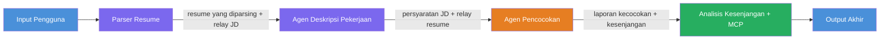

# Modul 1 - Memahami Arsitektur

⏱️ ~5 menit

Sebelum menulis kode apa pun, berikut gambaran cepat tentang apa yang Anda bangun dan bagaimana cara kerjanya.

---

## Apa yang Anda bangun

Anda menempelkan **resume** dan **deskripsi pekerjaan**. Alur kerja mengembalikan:

- Skor kecocokan (0–100 dengan rincian)
- Daftar kekurangan keterampilan dan sertifikasi
- Peta jalan pembelajaran yang dipersonalisasi dengan tautan Microsoft Learn untuk setiap kekurangan

---

## Empat agen

Satu agen yang mencoba mengurai, menilai, dan merencanakan sekaligus cenderung terburu-buru dan menghasilkan output yang dangkal. Membagi pekerjaan menjadi empat agen khusus memberikan hasil yang lebih baik:

| Agen | Apa yang dilakukannya |
|-------|-------------|
| **ResumeParser** | Mengurai resume; menyalin JD secara verbatim ke dalam `[JOB DESCRIPTION PASS-THROUGH]` untuk agen selanjutnya |
| **JobDescriptionAgent** | Mengambil persyaratan JD dari pass-through; meneruskan `[PARSED RESUME]` ke depan sebagai `[PARSED RESUME PASS-THROUGH]` |
| **MatchingAgent** | Membandingkan kedua bagian yang diberi label; menghasilkan skor kecocokan 0–100 dan daftar kekurangan |
| **GapAnalyzer** | Membuat peta jalan pembelajaran; mencari Microsoft Learn untuk setiap kekurangan |

---

## Grafik orkestrasi

Alur kerja adalah **pipeline berurutan** - setiap agen meneruskan outputnya ke berikutnya:


```mermaid
flowchart LR
    A["Input Pengguna"] --> B["Parser Resume"]
    B -- "resume yang diparsing + relay JD" --> C["Agen Deskripsi Pekerjaan"]
    C -- "persyaratan JD + relay resume" --> D["Agen Pencocokan"]
    D -- "laporan kecocokan + kesenjangan" --> E["Analisis Kesenjangan + MCP"]
    E --> F["Output Akhir"]

    style A fill:#4A90D9,color:#fff
    style B fill:#7B68EE,color:#fff
    style C fill:#7B68EE,color:#fff
    style D fill:#E67E22,color:#fff
    style E fill:#27AE60,color:#fff
    style F fill:#4A90D9,color:#fff
```

1. **ResumeParser** menerima input pengguna, mengurai resume, dan menyalin JD ke dalam `[JOB DESCRIPTION PASS-THROUGH]`.
2. **JD Agent** mengambil persyaratan terstruktur dan meneruskan `[PARSED RESUME PASS-THROUGH]` ke depan.
3. **MatchingAgent** membandingkan kedua bagian dan menghasilkan skor kecocokan serta daftar kekurangan.
4. **GapAnalyzer** membuat peta jalan dan memanggil alat MCP Microsoft Learn untuk setiap kekurangan.

---

## Bagaimana ini dipetakan ke kode

Dalam `main.py`, Anda mendeskripsikan grafik ini dengan `WorkflowBuilder`:

```python
workflow_agent = (
    WorkflowBuilder(
        start_executor=resume_executor,       # agen pertama yang menerima input pengguna
        output_executors=[gap_executor],      # agen terakhir - keluaran ini adalah respons
    )
    .add_edge(resume_executor, jd_executor)       # ResumeParser → Agen JD
    .add_edge(jd_executor, matching_executor)     # Agen JD → MatchingAgent
    .add_edge(matching_executor, gap_executor)    # MatchingAgent → GapAnalyzer
    .build()
    .as_agent()
)
```

Setiap `Agent` dibungkus dalam `AgentExecutor`. Pemanggilan `add_edge()` mendefinisikan pipeline yang benar-benar berurutan - setiap agen hanya menerima output dari pendahulunya secara langsung.

> `context_mode="last_agent"` berarti setiap eksekutor hanya melihat output dari pendahulu langsungnya. ResumeParser dan JD Agent meneruskan data ke depan dalam bagian yang berlabel sehingga setiap agen berikutnya memiliki tepat apa yang dibutuhkan.

---

## Alat MCP

GapAnalyzer memiliki satu alat: `search_microsoft_learn_for_plan`. Ini terhubung ke `https://learn.microsoft.com/api/mcp` dan mengembalikan tautan Microsoft Learn nyata untuk setiap kekurangan keterampilan.

Saat alat dijalankan Anda akan melihat log ini - semua diharapkan:

```
GET  https://learn.microsoft.com/api/mcp → 405   ← connection probe, normal
POST https://learn.microsoft.com/api/mcp → 200   ← actual tool call
DELETE https://learn.microsoft.com/api/mcp → 405 ← cleanup probe, normal
```

Hanya khawatir jika `POST` mengembalikan kesalahan.

---

**Sebelumnya:** [00 - Prasyarat](00-prerequisites.md) · **Berikutnya:** [02 - Mengatur Proyek →](02-scaffold-multi-agent.md)

---

<!-- CO-OP TRANSLATOR DISCLAIMER START -->
**Penafian**:
Dokumen ini telah diterjemahkan menggunakan layanan terjemahan AI [Co-op Translator](https://github.com/Azure/co-op-translator). Meskipun kami berupaya untuk mencapai akurasi, harap diketahui bahwa terjemahan otomatis mungkin mengandung kesalahan atau ketidakakuratan. Dokumen asli dalam bahasa aslinya harus dianggap sebagai sumber yang sah. Untuk informasi penting, disarankan menggunakan terjemahan profesional oleh manusia. Kami tidak bertanggung jawab atas kesalahpahaman atau penafsiran yang keliru yang timbul dari penggunaan terjemahan ini.
<!-- CO-OP TRANSLATOR DISCLAIMER END -->