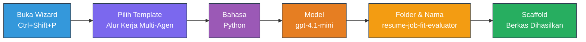
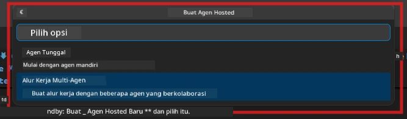

# Module 2 - Membuat Kerangka Proyek Multi-Agen

Dalam modul ini, Anda menggunakan [ekstensi Microsoft Foundry](https://marketplace.visualstudio.com/items?itemName=TeamsDevApp.vscode-ai-foundry) untuk **membuat kerangka proyek alur kerja multi-agen**. Ekstensi ini menghasilkan seluruh struktur proyek - `agent.yaml`, `main.py`, `Dockerfile`, `requirements.txt`, `.env`, dan konfigurasi debug. Anda kemudian menyesuaikan file-file ini di Modul 3 dan 4.

> **Catatan:** Folder `PersonalCareerCopilot/` dalam lab ini adalah contoh lengkap dan berfungsi dari proyek multi-agen yang disesuaikan. Anda bisa membuat proyek baru (disarankan untuk pembelajaran) atau mempelajari kode yang sudah ada secara langsung.

---

## Langkah 1: Buka wizard Create Hosted Agent


1. Tekan `Ctrl+Shift+P` untuk membuka **Command Palette**.
2. Ketik: **Microsoft Foundry: Create a New Hosted Agent** dan pilih.
3. Wizard pembuatan hosted agent terbuka.

> **Alternatif:** Klik ikon **Microsoft Foundry** di Activity Bar → klik ikon **+** di samping **Agents** → **Create New Hosted Agent**.

---

## Langkah 2: Pilih template Multi-Agent Workflow

Wizard akan meminta Anda memilih template:

| Template | Deskripsi | Kapan digunakan |
|----------|-----------|-----------------|
| Single Agent | Satu agen dengan instruksi dan alat opsional | Lab 01 |
| **Multi-Agent Workflow** | Beberapa agen yang berkolaborasi melalui WorkflowBuilder | **Lab ini (Lab 02)** |

1. Pilih **Multi-Agent Workflow**.
2. Klik **Next**.



---

## Langkah 3: Pilih bahasa pemrograman

1. Pilih **Python**.
2. Klik **Next**.

---

## Langkah 4: Pilih model Anda

1. Wizard menampilkan model-model yang diterapkan dalam proyek Foundry Anda.
2. Pilih model yang sama dengan yang Anda gunakan di Lab 01 (misalnya, **gpt-4.1-mini**).
3. Klik **Next**.

> **Tip:** [`gpt-4.1-mini`](https://learn.microsoft.com/azure/foundry/foundry-models/concepts/models-sold-directly-by-azure#gpt-41-series) direkomendasikan untuk pengembangan - cepat, murah, dan baik dalam menangani alur kerja multi-agen. Beralih ke `gpt-4.1` untuk penyebaran produksi akhir jika menginginkan keluaran berkualitas lebih tinggi.

---

## Langkah 5: Pilih lokasi folder dan nama agen

1. Dialog file terbuka. Pilih folder target:
   - Jika mengikuti repo workshop: navigasikan ke `workshop/lab02-multi-agent/` dan buat subfolder baru
   - Jika memulai proyek baru: pilih folder mana pun
2. Masukkan **nama** untuk hosted agent (misalnya, `resume-job-fit-evaluator`).
3. Klik **Create**.

---

## Langkah 6: Tunggu proses scaffolding selesai

1. VS Code membuka jendela baru (atau jendela saat ini diperbarui) dengan proyek yang sudah dibentuk.
2. Anda akan melihat struktur file ini:

```
resume-job-fit-evaluator/
├── .env                ← Environment variables (placeholders)
├── .vscode/
│   └── launch.json     ← Debug configuration
├── agent.yaml          ← Agent definition (kind: hosted)
├── Dockerfile          ← Container configuration
├── main.py             ← Multi-agent workflow code (scaffold)
└── requirements.txt    ← Python dependencies
```

> **Catatan workshop:** Dalam repositori workshop, folder `.vscode/` berada di **root workspace** dengan `launch.json` dan `tasks.json` yang digunakan bersama. Konfigurasi debug untuk Lab 01 dan Lab 02 kedua-duanya termasuk. Saat Anda menekan F5, pilih **"Lab02 - Multi-Agent"** dari dropdown.

---

## Langkah 7: Pahami file scaffold (khusus multi-agen)

Scaffold multi-agen berbeda dengan scaffold single-agen dalam beberapa hal utama:

### 7.1 `agent.yaml` - Definisi agen

```yaml
kind: hosted
name: resume-job-fit-evaluator
description: >
  A multi-agent workflow that evaluates resume-to-job fit.
metadata:
  authors:
    - Microsoft
  tags:
    - Multi-Agent Workflow
    - Resume Evaluator
protocols:
  - protocol: responses
    version: v1
environment_variables:
  - name: PROJECT_ENDPOINT
    value: ${PROJECT_ENDPOINT}
  - name: MODEL_DEPLOYMENT_NAME
    value: ${MODEL_DEPLOYMENT_NAME}
```

**Perbedaan utama dari Lab 01:** Bagian `environment_variables` mungkin termasuk variabel tambahan untuk endpoint MCP atau konfigurasi alat lain. `name` dan `description` mencerminkan kasus penggunaan multi-agen.

### 7.2 `main.py` - Kode alur kerja multi-agen

Scaffold mencakup:
- **Beberapa string instruksi agen** (satu konstanta per agen)
- **Beberapa context manager [`AzureAIAgentClient.as_agent()`](https://learn.microsoft.com/python/api/overview/azure/ai-agents-readme)** (satu per agen)
- **[`WorkflowBuilder`](https://learn.microsoft.com/agent-framework/workflows/agents-in-workflows)** untuk menghubungkan para agen
- **`from_agent_framework()`** untuk menyajikan alur kerja sebagai endpoint HTTP

```python
from agent_framework import WorkflowBuilder, tool
from agent_framework.azure import AzureAIAgentClient
from azure.ai.agentserver.agentframework import from_agent_framework
```

Impor tambahan [`WorkflowBuilder`](https://learn.microsoft.com/agent-framework/workflows/agents-in-workflows) adalah hal baru dibandingkan Lab 01.

### 7.3 `requirements.txt` - Dependensi tambahan

Proyek multi-agen menggunakan paket dasar yang sama seperti Lab 01, ditambah paket terkait MCP:

```
agent-framework-azure-ai==1.0.0rc3
agent-framework-core==1.0.0rc3
azure-ai-agentserver-agentframework==1.0.0b16
azure-ai-agentserver-core==1.0.0b16
debugpy
agent-dev-cli --pre
```

> **Catatan versi penting:** Paket `agent-dev-cli` membutuhkan flag `--pre` di `requirements.txt` untuk menginstal versi preview terbaru. Ini diperlukan agar Agent Inspector kompatibel dengan `agent-framework-core==1.0.0rc3`. Lihat [Module 8 - Troubleshooting](08-troubleshooting.md) untuk detail versi.

| Paket | Versi | Tujuan |
|---------|---------|---------|
| [`agent-framework-azure-ai`](https://learn.microsoft.com/agent-framework/overview/) | `1.0.0rc3` | Integrasi Azure AI untuk [Microsoft Agent Framework](https://github.com/microsoft/agent-framework) |
| [`agent-framework-core`](https://learn.microsoft.com/agent-framework/overview/) | `1.0.0rc3` | Runtime inti (termasuk WorkflowBuilder) |
| `azure-ai-agentserver-agentframework` | `1.0.0b16` | Runtime server hosted agent |
| `azure-ai-agentserver-core` | `1.0.0b16` | Abstraksi core server agen |
| `debugpy` | terbaru | Debugging Python (F5 di VS Code) |
| `agent-dev-cli` | `--pre` | CLI pengembangan lokal + backend Agent Inspector |

### 7.4 `Dockerfile` - Sama seperti Lab 01

Dockerfile identik dengan Lab 01 - menyalin file, menginstal dependensi dari `requirements.txt`, mengekspos port 8088, dan menjalankan `python main.py`.

```dockerfile
FROM python:3.14-slim
WORKDIR /app
COPY ./ .
RUN pip install --upgrade pip && \
    if [ -f requirements.txt ]; then \
        pip install -r requirements.txt; \
    else \
      echo "No requirements.txt found" >&2; exit 1; \
    fi
EXPOSE 8088
CMD ["python", "main.py"]
```

---

### Checkpoint

- [ ] Wizard scaffolding selesai → struktur proyek baru terlihat
- [ ] Anda dapat melihat semua file: `agent.yaml`, `main.py`, `Dockerfile`, `requirements.txt`, `.env`
- [ ] `main.py` menyertakan impor `WorkflowBuilder` (memastikan template multi-agen yang dipilih)
- [ ] `requirements.txt` mencakup `agent-framework-core` dan `agent-framework-azure-ai`
- [ ] Anda memahami bagaimana scaffold multi-agen berbeda dari scaffold single-agen (beberapa agen, WorkflowBuilder, alat MCP)

---

**Sebelumnya:** [01 - Memahami Arsitektur Multi-Agen](01-understand-multi-agent.md) · **Berikutnya:** [03 - Konfigurasi Agen & Lingkungan →](03-configure-agents.md)

---

<!-- CO-OP TRANSLATOR DISCLAIMER START -->
**Pernyataan Penafian**:  
Dokumen ini telah diterjemahkan menggunakan layanan terjemahan AI [Co-op Translator](https://github.com/Azure/co-op-translator). Meskipun kami berusaha untuk keakuratan, harap ketahui bahwa terjemahan otomatis mungkin mengandung kesalahan atau ketidaktepatan. Dokumen asli dalam bahasa aslinya harus dianggap sebagai sumber otoritatif. Untuk informasi penting, disarankan menggunakan terjemahan profesional oleh manusia. Kami tidak bertanggung jawab atas kesalahpahaman atau salah tafsir yang timbul dari penggunaan terjemahan ini.
<!-- CO-OP TRANSLATOR DISCLAIMER END -->