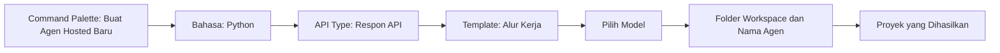
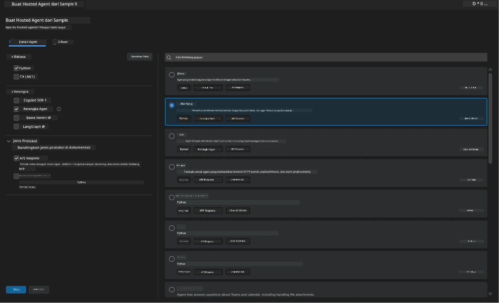
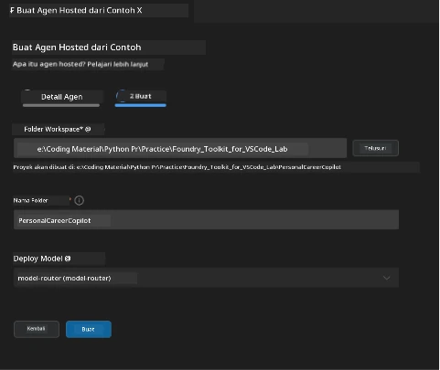

# Modul 2 - Membangun Kerangka Proyek Multi-Agen

⏱️ ~5 menit

Dalam modul ini, Anda menggunakan [Foundry Toolkit untuk VS Code](https://aka.ms/foundrytk) untuk **membangun kerangka proyek multi-agen**. Wizard menghasilkan `agent.yaml`, `main.py`, `Dockerfile`, `requirements.txt`, `.env`, dan konfigurasi debug VS Code - sehingga Anda dapat fokus pada penyambungan alur kerja 4-agen di Modul 3.

> **Konsep utama:** Kerangka ini adalah stub kerja dengan satu agen. Anda mengganti logika placeholder dengan grafik `WorkflowBuilder` di Modul 3. Anda tidak menulis kode boilerplate dari awal.

> **Implementasi referensi:** [`PersonalCareerCopilot/`](../../../../../workshop/lab02-multi-agent/PersonalCareerCopilot) adalah contoh kerja lengkap. Gunakan untuk membandingkan pekerjaan Anda saat berjalan.

### Alur wizard kerangka


```mermaid
flowchart LR
    A[Command Palette: Buat Agen Hosted Baru] --> B[Bahasa: Python]
    B --> C[API Type: Respon API]
    C --> D[Template: Alur Kerja]
    D --> E[Pilih Model]
    E --> F[Folder Workspace dan Nama Agen]
    F --> G[Proyek yang Dihasilkan]
```

---

## Langkah 1: Buka wizard Buat Hosted Agent

1. Tekan `Ctrl+Shift+P` untuk membuka **Command Palette**.
2. Ketik: **Foundry Toolkit: Create a New Hosted Agent** dan pilih.
3. Wizard terbuka pada tab **Agent Details**.

> **Alternatif:** Klik ikon **Foundry Toolkit** di Activity Bar → klik ikon **+** di samping **Hosted Agents** → **Create New Hosted Agent**.

---

## Langkah 2: Pilih pengaturan



1. Pada bagian navigasi/pilihan di kiri pilih sebagai berikut:

| Menu | Pilihan | Catatan |
|--------|-----------|-------|
| **Language** | Python | C# (.NET) juga didukung |
| **Framework** | Agent Framework | Menyediakan `Agent`, `AgentExecutor`, `WorkflowBuilder` |
| **API type** | Response API | `POST /responses` - riwayat dikelola platform, dukungan streaming |
| **Template** | **Workflows** | Memproses permintaan melalui beberapa agen secara berurutan |

2. Setelah dipilih, klik **Next**



3. Pada jendela berikut, pilih sebagai berikut:

| Menu | Pilihan | Catatan |
|--------|-----------|-------|
| **Workspace folder** | Telusuri folder target | misal, `workshop/lab02-multi-agent/` di repo ini |
| **Agent name** | `PersonalCareerCopilot` | Ini menjadi nama direktori proyek |
| **Model Deployment** | Pilih model yang dideploy | misal, `gpt-4.1-mini` dari Lab 01 |

4. Klik **Create** untuk membangun kerangka proyek. VS Code akan menghasilkan file dan membuka foldernya.

> **Tips:** [`gpt-4.1-mini`](https://learn.microsoft.com/azure/foundry/foundry-models/concepts/models-sold-directly-by-azure#gpt-41-series) menyeimbangkan kecepatan dan kualitas dengan baik untuk pengembangan multi-agen.

---

## Langkah 3: Periksa proyek yang dihasilkan

Setelah pembangunan kerangka selesai, pastikan Anda melihat file-file ini di Explorer (`Ctrl+Shift+E`):

```
📂 <your-agent-name>/
├── .azdignore          ← Files excluded from Azure Developer CLI deployments
├── .dockerignore       ← Files excluded from Docker builds
├── .env                ← Environment variables (placeholders - fill in Module 3)
├── .vscode/
│   ├── launch.json     ← Debug config (F5 → run + Agent Inspector)
│   └── tasks.json      ← VS Code task definitions
├── agent.yaml          ← Agent definition (kind: hosted, protocol: responses)
├── Dockerfile          ← Container config for deployment
├── main.py             ← Stub agent entry point (replace with WorkflowBuilder in Module 3)
└── requirements.txt    ← Python dependencies
```

> **Penting:** Buka folder kerangka ini langsung di VS Code agar `.vscode/launch.json` dan `tasks.json` diterapkan dengan benar saat debug F5.

### Penjelasan file utama

| File | Tujuan |
|------|---------|
| `agent.yaml` | Mendeklarasikan `kind: hosted`, memetakan variabel lingkungan, mendefinisikan protokol `/responses` |
| `main.py` | Stub: satu `FoundryChatClient` → `Agent` → `ResponsesHostServer`. Anda ganti dengan 4 agen + `WorkflowBuilder` di Modul 3 |
| `Dockerfile` | `python:3.12-slim`, menginstal `requirements.txt`, membuka port 8088, menjalankan `python main.py` |
| `requirements.txt` | `agent-framework-foundry`, `agent-framework-foundry-hosting`, `mcp<2,>=1.24.0`, `debugpy` |

> **Referensi:** Lihat [`PersonalCareerCopilot/agent.yaml`](../../../../../workshop/lab02-multi-agent/PersonalCareerCopilot/agent.yaml) dan [`PersonalCareerCopilot/requirements.txt`](../../../../../workshop/lab02-multi-agent/PersonalCareerCopilot/requirements.txt) untuk isi lengkap yang dihasilkan.

---

### ✅ Titik pemeriksaan

- [ ] Wizard kerangka selesai - folder proyek baru terlihat di Explorer
- [ ] Semua file yang diharapkan ada: `agent.yaml`, `main.py`, `Dockerfile`, `requirements.txt`, `.env`
- [ ] `agent.yaml` menunjukkan `kind: hosted` dan `protocol: responses`
- [ ] `main.py` mengimpor `Agent`, `FoundryChatClient`, `ResponsesHostServer`
- [ ] Folder kerangka dibuka sebagai root workspace di VS Code
- [ ] Anda mengerti `main.py` adalah stub - `WorkflowBuilder` ditambahkan di Modul 3

---

**Sebelumnya:** [01 - Memahami Arsitektur Multi-Agen](01-understand-multi-agent.md) · **Berikutnya:** [03 - Konfigurasi Agen & Lingkungan →](03-configure-agents.md)

---

<!-- CO-OP TRANSLATOR DISCLAIMER START -->
**Penafian**:
Dokumen ini telah diterjemahkan menggunakan layanan terjemahan AI [Co-op Translator](https://github.com/Azure/co-op-translator). Meskipun kami berupaya untuk mencapai akurasi, harap diketahui bahwa terjemahan otomatis mungkin mengandung kesalahan atau ketidakakuratan. Dokumen asli dalam bahasa aslinya harus dianggap sebagai sumber yang sah. Untuk informasi penting, disarankan menggunakan terjemahan profesional oleh manusia. Kami tidak bertanggung jawab atas kesalahpahaman atau penafsiran yang keliru yang timbul dari penggunaan terjemahan ini.
<!-- CO-OP TRANSLATOR DISCLAIMER END -->