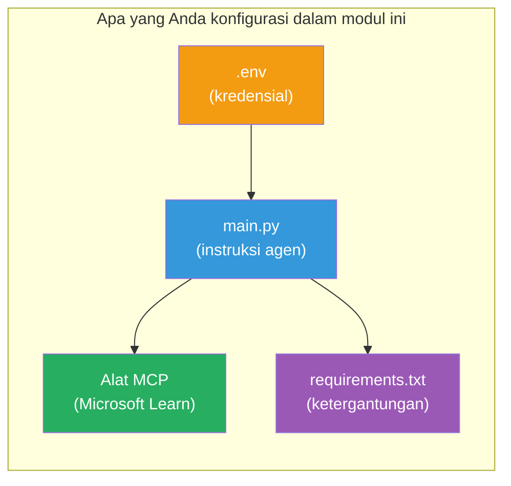

# Modul 3 - Konfigurasikan Agen, Alat MCP & Lingkungan

Dalam modul ini, Anda akan menyesuaikan proyek multi-agen yang telah dibuat kerangkanya. Anda akan menulis instruksi untuk keempat agen, mengatur alat MCP untuk Microsoft Learn, mengonfigurasi variabel lingkungan, dan menginstal dependensi.


> **Referensi:** Kode kerja lengkap ada di [`PersonalCareerCopilot/main.py`](../../../../../workshop/lab02-multi-agent/PersonalCareerCopilot/main.py). Gunakan sebagai referensi saat membangun milik Anda sendiri.

---

## Langkah 1: Konfigurasikan variabel lingkungan

1. Buka file **`.env`** di akar proyek Anda.
2. Isi detail proyek Foundry Anda:

   ```env
   PROJECT_ENDPOINT=https://<your-account>.services.ai.azure.com/api/projects/<your-project>
   MODEL_DEPLOYMENT_NAME=gpt-4.1-mini
   ```

3. Simpan file.

### Di mana menemukan nilai-nilai ini

| Nilai | Cara menemukannya |
|-------|------------------|
| **Endpoint proyek** | Sidebar Microsoft Foundry → klik proyek Anda → URL endpoint di tampilan detail |
| **Nama penyebaran model** | Sidebar Foundry → perluas proyek → **Models + endpoints** → nama di samping model yang disebarkan |

> **Keamanan:** Jangan pernah meng-commit `.env` ke kontrol versi. Tambahkan ke `.gitignore` jika belum ada.

### Pemetaan variabel lingkungan

`main.py` multi-agen membaca nama variabel lingkungan standar dan khusus workshop:

```python
PROJECT_ENDPOINT = os.getenv("AZURE_AI_PROJECT_ENDPOINT") or os.getenv("PROJECT_ENDPOINT")
MODEL_DEPLOYMENT_NAME = os.getenv(
    "AZURE_AI_MODEL_DEPLOYMENT_NAME",
    os.getenv("MODEL_DEPLOYMENT_NAME", "gpt-4.1-mini"),
)
MICROSOFT_LEARN_MCP_ENDPOINT = os.getenv(
    "MICROSOFT_LEARN_MCP_ENDPOINT", "https://learn.microsoft.com/api/mcp"
)
```

Endpoint MCP memiliki default yang masuk akal - Anda tidak perlu mengaturnya di `.env` kecuali ingin menimpanya.

---

## Langkah 2: Tulis instruksi agen

Ini adalah langkah paling krusial. Setiap agen membutuhkan instruksi yang dirancang dengan hati-hati yang menentukan perannya, format keluaran, dan aturan. Buka `main.py` dan buat (atau modifikasi) konstanta instruksi.

### 2.1 Agen Parser Resume

```python
RESUME_PARSER_INSTRUCTIONS = """\
You are the Resume Parser.
Extract resume text into a compact, structured profile for downstream matching.

Output exactly these sections:
1) Candidate Profile
2) Technical Skills (grouped categories)
3) Soft Skills
4) Certifications & Awards
5) Domain Experience
6) Notable Achievements

Rules:
- Use only explicit or strongly implied evidence.
- Do not invent skills, titles, or experience.
- Keep concise bullets; no long paragraphs.
- If input is not a resume, return a short warning and request resume text.
"""
```

**Mengapa bagian-bagian ini?** MatchingAgent membutuhkan data terstruktur untuk penilaian. Bagian yang konsisten membuat penyerahan data antar agen dapat diandalkan.

### 2.2 Agen Deskripsi Pekerjaan

```python
JOB_DESCRIPTION_INSTRUCTIONS = """\
You are the Job Description Analyst.
Extract a structured requirement profile from a JD.

Output exactly these sections:
1) Role Overview
2) Required Skills
3) Preferred Skills
4) Experience Required
5) Certifications Required
6) Education
7) Domain / Industry
8) Key Responsibilities

Rules:
- Keep required vs preferred clearly separated.
- Only use what the JD states; do not invent hidden requirements.
- Flag vague requirements briefly.
- If input is not a JD, return a short warning and request JD text.
"""
```

**Mengapa memisahkan yang dibutuhkan vs yang diutamakan?** MatchingAgent menggunakan bobot berbeda untuk masing-masing (Required Skills = 40 poin, Preferred Skills = 10 poin).

### 2.3 Agen Pencocokan

```python
MATCHING_AGENT_INSTRUCTIONS = """\
You are the Matching Agent.
Compare parsed resume output vs JD output and produce an evidence-based fit report.

Scoring (100 total):
- Required Skills 40
- Experience 25
- Certifications 15
- Preferred Skills 10
- Domain Alignment 10

Output exactly these sections:
1) Fit Score (with breakdown math)
2) Matched Skills
3) Missing Skills
4) Partially Matched
5) Experience Alignment
6) Certification Gaps
7) Overall Assessment

Rules:
- Be objective and evidence-only.
- Keep partial vs missing separate.
- Keep Missing Skills precise; it feeds roadmap planning.
"""
```

**Mengapa penilaian eksplisit?** Penilaian yang dapat direproduksi memungkinkan perbandingan hasil dan debug masalah. Skala 100 poin mudah diinterpretasi pengguna akhir.

### 2.4 Agen Analis Kesenjangan

```python
GAP_ANALYZER_INSTRUCTIONS = """\
You are the Gap Analyzer and Roadmap Planner.
Create a practical upskilling plan from the matching report.

Microsoft Learn MCP usage (required):
- For EVERY High and Medium priority gap, call tool `search_microsoft_learn_for_plan`.
- Use returned Learn links in Suggested Resources.
- Prefer Microsoft Learn for free resources.

CRITICAL: You MUST produce a SEPARATE detailed gap card for EVERY skill listed in
the Missing Skills and Certification Gaps sections of the matching report. Do NOT
skip or combine gaps. Do NOT summarize multiple gaps into one card.

Output format:
1) Personalized Learning Roadmap for [Role Title]
2) One DETAILED card per gap (produce ALL cards, not just the first):
   - Skill
   - Priority (High/Medium/Low)
   - Current Level
   - Target Level
   - Suggested Resources (include Learn URL from tool results)
   - Estimated Time
   - Quick Win Project
3) Recommended Learning Order (numbered list)
4) Timeline Summary (week-by-week)
5) Motivational Note

Rules:
- Produce every gap card before writing the summary sections.
- Keep it specific, realistic, and actionable.
- Tailor to candidate's existing stack.
- If fit >= 80, focus on polish/interview readiness.
- If fit < 40, be honest and provide a staged path.
"""
```

**Mengapa penekanan "CRITICAL"?** Tanpa instruksi eksplisit untuk menghasilkan SEMUA kartu kesenjangan, model cenderung hanya menghasilkan 1-2 kartu dan meringkas sisanya. Blok "CRITICAL" mencegah pemotongan ini.

---

## Langkah 3: Definisikan alat MCP

GapAnalyzer menggunakan alat yang memanggil [server Microsoft Learn MCP](https://learn.microsoft.com/azure/foundry/agents/how-to/tools/model-context-protocol). Tambahkan ini ke `main.py`:

```python
import json
from agent_framework import tool
from mcp.client.session import ClientSession
from mcp.client.streamable_http import streamable_http_client

@tool
async def search_microsoft_learn_for_plan(
    skill: str, role: str = "", max_results: int = 5
) -> str:
    """Search Microsoft Learn MCP and return curated official links for roadmap planning."""
    query = " ".join(part for part in [skill, role, "learning path module"] if part).strip()
    query = query or "job skills learning path"

    try:
        async with streamable_http_client(MICROSOFT_LEARN_MCP_ENDPOINT) as (
            read_stream, write_stream, _,
        ):
            async with ClientSession(read_stream, write_stream) as session:
                await session.initialize()
                result = await session.call_tool(
                    "microsoft_docs_search", {"query": query}
                )

        if not result.content:
            return (
                "No results returned from Microsoft Learn MCP. "
                "Fallback: https://learn.microsoft.com/training/support/catalog-api"
            )

        payload_text = getattr(result.content[0], "text", "")
        data = json.loads(payload_text) if payload_text else {}
        items = data.get("results", [])[:max(1, min(max_results, 10))]

        if not items:
            return f"No direct Microsoft Learn results found for '{skill}'."

        lines = [f"Microsoft Learn resources for '{skill}':"]
        for i, item in enumerate(items, start=1):
            title = item.get("title") or item.get("url") or "Microsoft Learn Resource"
            url = item.get("url") or item.get("link") or ""
            lines.append(f"{i}. {title} - {url}".rstrip(" -"))
        return "\n".join(lines)
    except Exception as ex:
        return (
            f"Microsoft Learn MCP lookup unavailable. Reason: {ex}. "
            "Fallbacks: https://learn.microsoft.com/api/mcp"
        )
```

### Cara kerja alat ini

| Langkah | Apa yang terjadi |
|---------|------------------|
| 1 | GapAnalyzer memutuskan membutuhkan sumber daya untuk skill (misal, "Kubernetes") |
| 2 | Framework memanggil `search_microsoft_learn_for_plan(skill="Kubernetes")` |
| 3 | Fungsi membuka koneksi [Streamable HTTP](https://learn.microsoft.com/agent-framework/agents/tools/hosted-mcp-tools) ke `https://learn.microsoft.com/api/mcp` |
| 4 | Memanggil `microsoft_docs_search` di [server MCP](https://learn.microsoft.com/azure/foundry/agents/how-to/tools/model-context-protocol) |
| 5 | Server MCP mengembalikan hasil pencarian (judul + URL) |
| 6 | Fungsi memformat hasil sebagai daftar bernomor |
| 7 | GapAnalyzer menggabungkan URL ke dalam kartu kesenjangan |

### Dependensi MCP

Perpustakaan klien MCP disertakan secara transitif melalui [`agent-framework-core`](https://learn.microsoft.com/agent-framework/overview/). Anda **tidak** perlu menambahkannya secara terpisah di `requirements.txt`. Jika muncul error impor, periksa:

```powershell
pip list | Select-String "mcp"
```

Yang diharapkan: paket `mcp` terinstal (versi 1.x atau lebih baru).

---

## Langkah 4: Sambungkan agen dan alur kerja

### 4.1 Buat agen dengan context managers

```python
from contextlib import asynccontextmanager

@asynccontextmanager
async def create_agents():
    async with (
        get_credential() as credential,
        AzureAIAgentClient(
            project_endpoint=PROJECT_ENDPOINT,
            model_deployment_name=MODEL_DEPLOYMENT_NAME,
            credential=credential,
        ).as_agent(
            name="ResumeParser",
            instructions=RESUME_PARSER_INSTRUCTIONS,
        ) as resume_parser,
        AzureAIAgentClient(
            project_endpoint=PROJECT_ENDPOINT,
            model_deployment_name=MODEL_DEPLOYMENT_NAME,
            credential=credential,
        ).as_agent(
            name="JobDescriptionAgent",
            instructions=JOB_DESCRIPTION_INSTRUCTIONS,
        ) as jd_agent,
        AzureAIAgentClient(
            project_endpoint=PROJECT_ENDPOINT,
            model_deployment_name=MODEL_DEPLOYMENT_NAME,
            credential=credential,
        ).as_agent(
            name="MatchingAgent",
            instructions=MATCHING_AGENT_INSTRUCTIONS,
        ) as matching_agent,
        AzureAIAgentClient(
            project_endpoint=PROJECT_ENDPOINT,
            model_deployment_name=MODEL_DEPLOYMENT_NAME,
            credential=credential,
        ).as_agent(
            name="GapAnalyzer",
            instructions=GAP_ANALYZER_INSTRUCTIONS,
            tools=[search_microsoft_learn_for_plan],
        ) as gap_analyzer,
    ):
        yield resume_parser, jd_agent, matching_agent, gap_analyzer
```

**Poin penting:**
- Setiap agen memiliki instance `AzureAIAgentClient` **sendiri**
- Hanya GapAnalyzer yang mendapatkan `tools=[search_microsoft_learn_for_plan]`
- `get_credential()` mengembalikan [`ManagedIdentityCredential`](https://learn.microsoft.com/python/api/overview/azure/identity-readme#managed-identity-support) di Azure, [`DefaultAzureCredential`](https://learn.microsoft.com/azure/developer/python/sdk/authentication/credential-chains#defaultazurecredential-overview) secara lokal

### 4.2 Bangun grafik alur kerja

```python
def create_workflow(resume_parser, jd_agent, matching_agent, gap_analyzer):
    workflow = (
        WorkflowBuilder(
            name="ResumeJobFitEvaluator",
            start_executor=resume_parser,
            output_executors=[gap_analyzer],
        )
        .add_edge(resume_parser, jd_agent)
        .add_edge(resume_parser, matching_agent)
        .add_edge(jd_agent, matching_agent)
        .add_edge(matching_agent, gap_analyzer)
        .build()
    )
    return workflow.as_agent()
```

> Lihat [Workflows as Agents](https://learn.microsoft.com/agent-framework/workflows/as-agents) untuk memahami pola `.as_agent()`.

### 4.3 Mulai server

```python
async def main() -> None:
    validate_configuration()
    async with create_agents() as (resume_parser, jd_agent, matching_agent, gap_analyzer):
        agent = create_workflow(resume_parser, jd_agent, matching_agent, gap_analyzer)
        from azure.ai.agentserver.agentframework import from_agent_framework
        await from_agent_framework(agent).run_async()

if __name__ == "__main__":
    asyncio.run(main())
```

---

## Langkah 5: Buat dan aktifkan lingkungan virtual

### 5.1 Buat lingkungan

```powershell
cd workshop\lab02-multi-agent\PersonalCareerCopilot
python -m venv .venv
```

### 5.2 Aktifkan

**PowerShell (Windows):**
```powershell
.\.venv\Scripts\Activate.ps1
```

**macOS/Linux:**
```bash
source .venv/bin/activate
```

### 5.3 Instal dependensi

```powershell
pip install -r requirements.txt
```

> **Catatan:** Baris `agent-dev-cli --pre` dalam `requirements.txt` menjamin versi preview terbaru terinstal. Ini diperlukan untuk kompatibilitas dengan `agent-framework-core==1.0.0rc3`.

### 5.4 Verifikasi instalasi

```powershell
pip list | Select-String "agent-framework|agentserver|agent-dev"
```

Output yang diharapkan:
```
agent-dev-cli                  0.0.1b260316
agent-framework-azure-ai       1.0.0rc3
agent-framework-core            1.0.0rc3
azure-ai-agentserver-agentframework 1.0.0b16
azure-ai-agentserver-core      1.0.0b16
```

> **Jika `agent-dev-cli` menunjukkan versi lama** (misal, `0.0.1b260119`), Agent Inspector akan gagal dengan eror 403/404. Upgrade: `pip install agent-dev-cli --pre --upgrade`

---

## Langkah 6: Verifikasi autentikasi

Jalankan pemeriksaan autentikasi yang sama dari Lab 01:

```powershell
az account show --query "{name:name, id:id}" --output table
```

Jika gagal, jalankan [`az login`](https://learn.microsoft.com/cli/azure/authenticate-azure-cli-interactively).

Untuk alur kerja multi-agen, keempat agen menggunakan kredensial yang sama. Jika autentikasi berhasil untuk satu, berhasil untuk semuanya.

---

### Titik pemeriksaan

- [ ] `.env` memiliki nilai `PROJECT_ENDPOINT` dan `MODEL_DEPLOYMENT_NAME` yang valid
- [ ] Semua 4 konstanta instruksi agen ditentukan dalam `main.py` (ResumeParser, JD Agent, MatchingAgent, GapAnalyzer)
- [ ] Alat MCP `search_microsoft_learn_for_plan` didefinisikan dan didaftarkan ke GapAnalyzer
- [ ] `create_agents()` membuat keempat agen dengan instance `AzureAIAgentClient` masing-masing
- [ ] `create_workflow()` membangun grafik yang benar dengan `WorkflowBuilder`
- [ ] Lingkungan virtual dibuat dan diaktifkan (`(.venv)` terlihat)
- [ ] `pip install -r requirements.txt` selesai tanpa error
- [ ] `pip list` menampilkan semua paket yang diharapkan dengan versi yang tepat (rc3 / b16)
- [ ] `az account show` mengembalikan langganan Anda

---

**Sebelumnya:** [02 - Scaffold Multi-Agent Project](02-scaffold-multi-agent.md) · **Selanjutnya:** [04 - Orchestration Patterns →](04-orchestration-patterns.md)

---

<!-- CO-OP TRANSLATOR DISCLAIMER START -->
**Penafian**:  
Dokumen ini telah diterjemahkan menggunakan layanan terjemahan AI [Co-op Translator](https://github.com/Azure/co-op-translator). Meskipun kami berupaya untuk akurasi, harap diketahui bahwa terjemahan otomatis mungkin mengandung kesalahan atau ketidakakuratan. Dokumen asli dalam bahasa aslinya harus dianggap sebagai sumber yang sahih. Untuk informasi yang penting, disarankan menggunakan terjemahan profesional oleh manusia. Kami tidak bertanggung jawab atas kesalahpahaman atau penafsiran yang keliru yang timbul dari penggunaan terjemahan ini.
<!-- CO-OP TRANSLATOR DISCLAIMER END -->