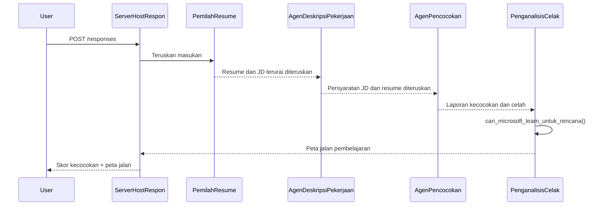

# Modul 3 - Konfigurasi Instruksi, Lingkungan & Instalasi Dependensi

⏱️ ~15 menit

Dalam modul ini, Anda mengubah stub yang telah dibangun menjadi **alur kerja multi-agen Anda** - dengan menetapkan variabel lingkungan, menulis instruksi agen, menambahkan alat MCP, menghubungkan grafik alur kerja, dan menginstal dependensi.

> **Referensi:** Kode kerja lengkap ada di [`PersonalCareerCopilot/main.py`](../../../../../workshop/lab02-multi-agent/PersonalCareerCopilot/main.py). Gunakan sebagai referensi saat membangun grafik alur kerja dan blok prompt Anda sendiri.

---

## Bagaimana keempat agen terhubung bersama


```mermaid
sequenceDiagram
    participant User
    participant Server as ServerHostRespon
    participant RP as PemilahResume
    participant JD as AgenDeskripsiPekerjaan
    participant MA as AgenPencocokan
    participant GA as PenganalisisCelak

    User->>Server: POST /responses
    Server->>RP: Teruskan masukan
    RP-->>JD: Resume dan JD terurai diteruskan
    JD-->>MA: Persyaratan JD dan resume diteruskan
    MA-->>GA: Laporan kecocokan dan celah
    GA->>GA: cari_microsoft_learn_untuk_rencana()
    GA-->>Server: Peta jalan pembelajaran
    Server-->>User: Skor kecocokan + peta jalan
```

---

## Langkah 1: Konfigurasi variabel lingkungan

1. Buka file **`.env`** di akar proyek Anda (dibuat oleh wizard scaffold).
2. Ganti placeholder dengan nilai aktual Anda dari Lab 01.

<details open>
<summary><strong>🅰️ Jalur A - langganan Foundry</strong></summary>

```env
FOUNDRY_PROJECT_ENDPOINT=https://<your-account>.services.ai.azure.com/api/projects/<your-project>
AZURE_AI_MODEL_DEPLOYMENT_NAME=gpt-4.1-mini
```

> **Tempat menemukan nilai:** Lihat [Lab 01, Modul 1](../../lab01-single-agent/docs/01-setup.md#deploy-a-model--assign-rbac).

</details>

<details open>
<summary><strong>🅱️ Jalur B - Foundry Lokal</strong></summary>

```env
FOUNDRY_PROJECT_ENDPOINT=http://localhost:5273/v1
AZURE_AI_MODEL_DEPLOYMENT_NAME=phi-4-mini
```

> Semua inferensi dijalankan di mesin Anda - tidak ada data yang keluar dari perangkat Anda. Jalankan `foundry model list` untuk mengonfirmasi alias model yang tepat. Satu-satunya permintaan keluar adalah panggilan alat MCP ke `https://learn.microsoft.com/api/mcp`.

> **Tempat menemukan nilai:** Lihat [Lab 01, Modul 1 - jalur lokal](../../lab01-single-agent/docs/01-setup.md#step-2-set-up-based-on-your-access).

</details>

> **Keamanan:** Jangan pernah meng-commit `.env` ke kontrol versi. File ini seharusnya sudah ada di `.gitignore`.

---

## Langkah 2: Tulis instruksi agen

Instruksi mendefinisikan peran setiap agen, format keluaran, dan aturan. Buka `main.py` dan definisikan (atau ganti) empat konstanta instruksi - string lengkapnya ada di [`PersonalCareerCopilot/main.py`](../../../../../workshop/lab02-multi-agent/PersonalCareerCopilot/main.py).

### 2.1 `RESUME_PARSER_INSTRUCTIONS`
Menguraikan resume menjadi profil kandidat yang terstruktur **dan** menyalin deskripsi pekerjaan secara verbatim ke dalam `[JOB DESCRIPTION PASS-THROUGH]`. Kedua bagian yang diberi label harus muncul dalam keluaran.

> **Mengapa pass-through?** Dengan `context_mode="last_agent"`, ResumeParser adalah satu-satunya agen yang melihat pesan pengguna asli. Jika tidak menyalin JD ke depan, agen berikutnya tidak akan pernah melihatnya.

### 2.2 `JOB_DESCRIPTION_INSTRUCTIONS`
Membaca `[PARSED RESUME]` dan `[JOB DESCRIPTION PASS-THROUGH]` dari keluaran ResumeParser. Menghasilkan `[JD REQUIREMENTS]` (persyaratan terstruktur) dan `[PARSED RESUME PASS-THROUGH]` (salinan verbatim resume untuk MatchingAgent).

### 2.3 `MATCHING_AGENT_INSTRUCTIONS`
Membaca `[JD REQUIREMENTS]` dan `[PARSED RESUME PASS-THROUGH]`. Menghasilkan laporan kesesuaian yang diberi skor (0–100) dengan perincian matematika, keterampilan yang cocok, keterampilan yang hilang, dan kesesuaian pengalaman.

### 2.4 `GAP_ANALYZER_INSTRUCTIONS`
Membaca laporan kesesuaian. Untuk **setiap** keterampilan yang hilang, memanggil `search_microsoft_learn_for_plan` untuk mengambil sumber daya Microsoft Learn. Menghasilkan satu kartu gap detail per keterampilan plus roadmap pembelajaran minggu demi minggu.

---

## Langkah 3: Tambahkan alat MCP

GapAnalyzer memanggil [server Microsoft Learn MCP](https://learn.microsoft.com/azure/foundry/agents/how-to/tools/model-context-protocol) untuk mengambil sumber daya pembelajaran nyata untuk setiap gap keterampilan. Fungsi lengkap `search_microsoft_learn_for_plan` ada di [`PersonalCareerCopilot/main.py`](../../../../../workshop/lab02-multi-agent/PersonalCareerCopilot/main.py).

Daftarkan alat pada GapAnalyzer saat membuat agen:

```python
gap_analyzer = Agent(
    client=client,
    instructions=GAP_ANALYZER_INSTRUCTIONS,
    name="GapAnalyzer",
    tools=[search_microsoft_learn_for_plan],
)
```

> Lihat [`PersonalCareerCopilot/main.py`](../../../../../workshop/lab02-multi-agent/PersonalCareerCopilot/main.py) untuk grafik `WorkflowBuilder` lengkap dengan `FoundryChatClient`, `AgentExecutor`, dan semua panggilan `add_edge()`.

---

## Langkah 4: Buat lingkungan virtual & instal dependensi

> ⚠️ **Jangan lewatkan langkah ini.** Tanpa dependensi yang terinstal, debugging F5 akan gagal.

### 4.1 Buat lingkungan virtual

```powershell
python -m venv .venv
```

### 4.2 Aktifkan

| OS | Perintah |
|----|----------|
| **Windows (PowerShell)** | `.\.venv\Scripts\Activate.ps1` |
| **Windows (CMD)** | `.venv\Scripts\activate.bat` |
| **macOS / Linux** | `source .venv/bin/activate` |

Anda harus melihat `(.venv)` di prompt terminal Anda.

### 4.3 Instal dependensi

```powershell
pip install -r requirements.txt
```

### 4.4 Verifikasi

```powershell
pip list | Select-String "agent-framework|mcp|debugpy"
```

Yang diharapkan: `agent-framework-foundry`, `agent-framework-foundry-hosting`, `mcp`, dan `debugpy` tercantum.

---

## Langkah 5: Verifikasi otentikasi

<details open>
<summary><strong>🅰️ Jalur A - kredensial Azure</strong></summary>

```powershell
az account show --query "{name:name, id:id}" --output table
```

Jika ini gagal, jalankan [`az login`](https://learn.microsoft.com/cli/azure/authenticate-azure-cli-interactively).

Keempat agen berbagi satu `FoundryChatClient` dan satu `DefaultAzureCredential`. Jika otentikasi berhasil untuk satu, maka berhasil untuk semua.

</details>

<details open>
<summary><strong>🅱️ Jalur B - Foundry Lokal</strong></summary>

Tidak diperlukan otentikasi untuk pengujian lokal.

</details>

---

### ✅ Titik pemeriksaan

> Jangan lanjut ke Modul 04 sampai: **(1)** `(.venv)` terlihat di prompt AND **(2)** `pip install -r requirements.txt` selesai dengan sukses.

- [ ] `.env` memiliki endpoint valid dan nama deployment model (bukan placeholder)
- [ ] Semua 4 konstanta instruksi agen didefinisikan di `main.py` (ResumeParser, JD Agent, MatchingAgent, GapAnalyzer)
- [ ] Fungsi dan pendaftaran alat MCP `search_microsoft_learn_for_plan` pada GapAnalyzer
- [ ] Objek `FoundryChatClient` + 4 `Agent` + 4 `AgentExecutor` dibuat di `main()`
- [ ] `WorkflowBuilder` membangun grafik berurutan yang benar dengan semua 3 panggilan `add_edge()`
- [ ] Lingkungan virtual dibuat dan diaktifkan (`(.venv)` terlihat di prompt)
- [ ] `pip install -r requirements.txt` selesai tanpa error
- [ ] **Jalur A:** `az account show` berhasil ATAU ikon Akun VS Code menunjukkan akun yang masuk

---

**Sebelumnya:** [02 - Scaffold Multi-Agent Project](02-scaffold-multi-agent.md) · **Selanjutnya:** [04 - Pola Orkestrasi →](04-orchestration-patterns.md)

---

<!-- CO-OP TRANSLATOR DISCLAIMER START -->
**Penafian**:
Dokumen ini telah diterjemahkan menggunakan layanan terjemahan AI [Co-op Translator](https://github.com/Azure/co-op-translator). Meskipun kami berupaya untuk mencapai akurasi, harap diketahui bahwa terjemahan otomatis mungkin mengandung kesalahan atau ketidakakuratan. Dokumen asli dalam bahasa aslinya harus dianggap sebagai sumber yang sah. Untuk informasi penting, disarankan menggunakan terjemahan profesional oleh manusia. Kami tidak bertanggung jawab atas kesalahpahaman atau penafsiran yang keliru yang timbul dari penggunaan terjemahan ini.
<!-- CO-OP TRANSLATOR DISCLAIMER END -->