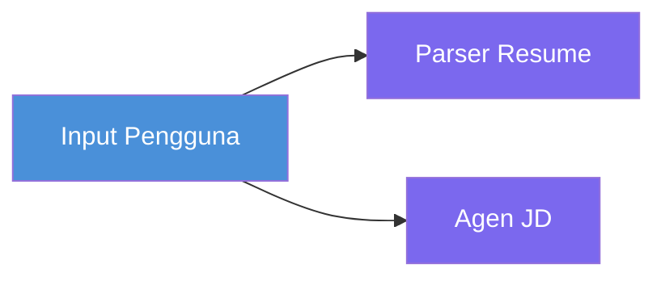
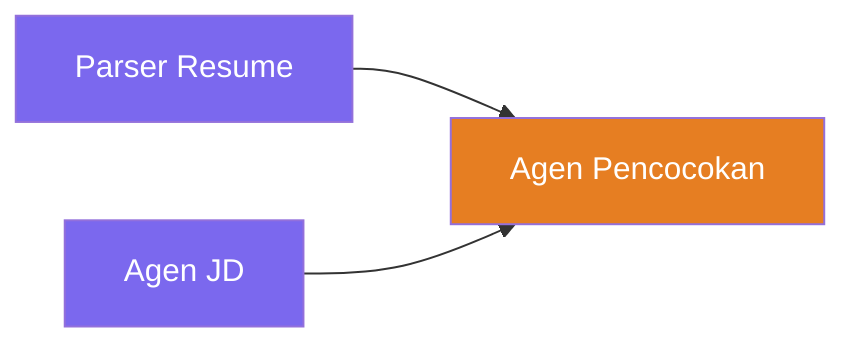
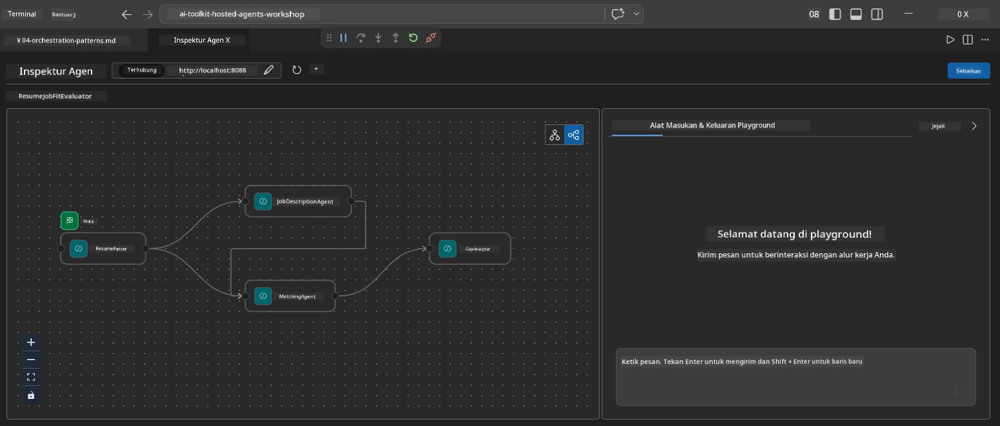
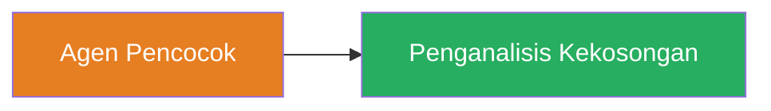
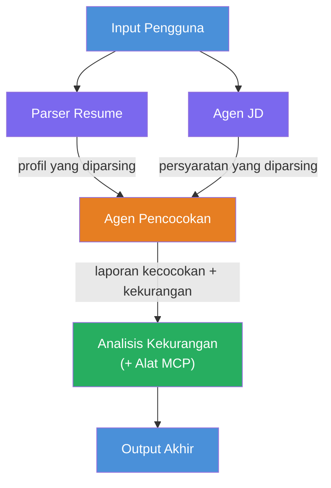
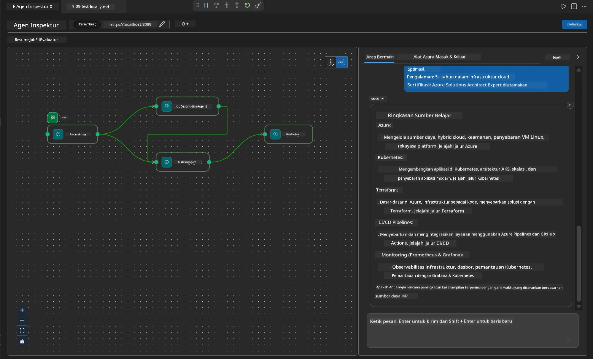

# Modul 4 - Pola Orkestrasi

Dalam modul ini, Anda mengeksplorasi pola orkestrasi yang digunakan dalam Resume Job Fit Evaluator dan belajar cara membaca, memodifikasi, dan memperluas grafik alur kerja. Memahami pola-pola ini penting untuk debugging masalah aliran data dan membangun [alur kerja multi-agen](https://learn.microsoft.com/agent-framework/workflows/) Anda sendiri.

---

## Pola 1: Fan-out (pembagian paralel)

Pola pertama dalam alur kerja adalah **fan-out** - satu input dikirim ke beberapa agen secara bersamaan.


Dalam kode, ini terjadi karena `resume_parser` adalah `start_executor` - ia menerima pesan pengguna terlebih dahulu. Kemudian, karena baik `jd_agent` dan `matching_agent` memiliki sisi tepi dari `resume_parser`, framework mengarahkan output `resume_parser` ke kedua agen tersebut:

```python
.add_edge(resume_parser, jd_agent)         # Output ResumeParser → Agen JD
.add_edge(resume_parser, matching_agent)   # Output ResumeParser → MatchingAgent
```

**Mengapa ini bekerja:** ResumeParser dan JD Agent memproses aspek berbeda dari input yang sama. Menjalankan mereka secara paralel mengurangi total latensi dibandingkan menjalankan secara berurutan.

### Kapan menggunakan fan-out

| Kasus penggunaan | Contoh |
|------------------|--------|
| Subtugas independen | Parsing resume vs. parsing JD |
| Redundansi / voting | Dua agen menganalisis data yang sama, yang ketiga memilih jawaban terbaik |
| Output multi-format | Satu agen menghasilkan teks, agen lain menghasilkan JSON terstruktur |

---

## Pola 2: Fan-in (agregasi)

Pola kedua adalah **fan-in** - beberapa output agen dikumpulkan dan dikirim ke satu agen hilir.


Dalam kode:

```python
.add_edge(resume_parser, matching_agent)   # Output ResumeParser → MatchingAgent
.add_edge(jd_agent, matching_agent)        # Output JD Agent → MatchingAgent
```

**Perilaku kunci:** Ketika sebuah agen memiliki **dua atau lebih sisi tepi masuk**, framework secara otomatis menunggu **semua** agen hulu selesai sebelum menjalankan agen hilir. MatchingAgent tidak mulai hingga ResumeParser dan JD Agent selesai.

### Apa yang diterima MatchingAgent

Framework menggabungkan output dari semua agen hulu. Input MatchingAgent terlihat seperti:

```
[ResumeParser output]
---
Candidate Profile:
  Name: Jane Doe
  Technical Skills: Python, Azure, Kubernetes, ...
  ...

[JobDescriptionAgent output]
---
Role Overview: Senior Cloud Engineer
Required Skills: Python, Azure, Terraform, ...
...
```

> **Catatan:** Format penggabungan tepat bergantung pada versi framework. Instruksi agen harus ditulis untuk menangani output terstruktur dan tidak terstruktur dari hulu.



---

## Pola 3: Rantai berurutan

Pola ketiga adalah **rantai berurutan** - output satu agen langsung mengalir ke agen berikutnya.


Dalam kode:

```python
.add_edge(matching_agent, gap_analyzer)    # Keluaran MatchingAgent → GapAnalyzer
```

Ini adalah pola yang paling sederhana. GapAnalyzer menerima skor fit MatchingAgent, skill yang cocok/hilang, dan celah-celah. Kemudian memanggil [alat MCP](https://learn.microsoft.com/azure/foundry/agents/how-to/tools/model-context-protocol) untuk setiap celah guna mengambil sumber daya Microsoft Learn.

---

## Grafik lengkap

Menggabungkan ketiga pola menghasilkan alur kerja penuh:


### Garis waktu eksekusi

```mermaid
gantt
    title Garis Waktu Eksekusi Agen
    dateFormat X
    axisFormat %s

    section Paralel
    Resume Parser       :rp, 0, 3
    JD Agent            :jd, 0, 2

    section Berurutan
    Matching Agent      :ma, 3, 5
    Gap Analyzer        :ga, 5, 9
```


> Total waktu nyata kira-kira adalah `max(ResumeParser, JD Agent) + MatchingAgent + GapAnalyzer`. GapAnalyzer biasanya paling lambat karena melakukan beberapa panggilan alat MCP (satu per celah).

---

## Membaca kode WorkflowBuilder

Berikut adalah fungsi lengkap `create_workflow()` dari `main.py`, dengan anotasi:

```python
def create_workflow(resume_parser, jd_agent, matching_agent, gap_analyzer):
    workflow = (
        WorkflowBuilder(
            name="ResumeJobFitEvaluator",

            # Agen pertama yang menerima input pengguna
            start_executor=resume_parser,

            # Agen yang hasilnya menjadi respons akhir
            output_executors=[gap_analyzer],
        )
        # Fan-out: Output ResumeParser dikirim ke JD Agent dan MatchingAgent
        .add_edge(resume_parser, jd_agent)
        .add_edge(resume_parser, matching_agent)

        # Fan-in: MatchingAgent menunggu baik ResumeParser maupun JD Agent
        .add_edge(jd_agent, matching_agent)

        # Secuensial: Output MatchingAgent digunakan oleh GapAnalyzer
        .add_edge(matching_agent, gap_analyzer)

        .build()
    )
    return workflow.as_agent()
```

### Tabel ringkasan sisi tepi

| # | Sisi tepi | Pola | Efek |
|---|-----------|-------|-------|
| 1 | `resume_parser → jd_agent` | Fan-out | JD Agent menerima output ResumeParser (plus input pengguna asli) |
| 2 | `resume_parser → matching_agent` | Fan-out | MatchingAgent menerima output ResumeParser |
| 3 | `jd_agent → matching_agent` | Fan-in | MatchingAgent juga menerima output JD Agent (menunggu keduanya) |
| 4 | `matching_agent → gap_analyzer` | Berurutan | GapAnalyzer menerima laporan fit + daftar celah |

---

## Memodifikasi grafik

### Menambahkan agen baru

Untuk menambahkan agen kelima (misal, **InterviewPrepAgent** yang menghasilkan pertanyaan wawancara berdasarkan analisis celah):

```python
# 1. Definisikan instruksi
INTERVIEW_PREP_INSTRUCTIONS = """\
You are the Interview Prep Agent.
Given a gap analysis and fit report, generate 10 targeted interview questions
the candidate should prepare for.
"""

# 2. Buat agen (di dalam blok async with)
AzureAIAgentClient(
    project_endpoint=PROJECT_ENDPOINT,
    model_deployment_name=MODEL_DEPLOYMENT_NAME,
    credential=credential,
).as_agent(
    name="InterviewPrepAgent",
    instructions=INTERVIEW_PREP_INSTRUCTIONS,
) as interview_prep,

# 3. Tambahkan edges di create_workflow()
.add_edge(matching_agent, interview_prep)   # menerima laporan fit
.add_edge(gap_analyzer, interview_prep)     # juga menerima kartu gap

# 4. Perbarui output_executors
output_executors=[interview_prep],  # sekarang agen akhir
```

### Mengubah urutan eksekusi

Untuk membuat JD Agent berjalan **setelah** ResumeParser (berurutan bukan paralel):

```python
# Hapus: .add_edge(resume_parser, jd_agent) ← sudah ada, pertahankan
# Hapus paralel implisit dengan TIDAK membuat jd_agent menerima input pengguna secara langsung
# start_executor mengirim ke resume_parser terlebih dahulu, dan jd_agent hanya mendapatkan
# keluaran resume_parser melalui edge. Ini membuatnya berurutan.
```

> **Penting:** `start_executor` adalah satu-satunya agen yang menerima input pengguna mentah. Semua agen lain menerima output dari sisi tepi hulu mereka. Jika Anda ingin sebuah agen juga menerima input pengguna mentah, agen tersebut harus memiliki sisi tepi dari `start_executor`.

---

## Kesalahan umum grafik

| Kesalahan | Gejala | Perbaikan |
|-----------|---------|----------|
| Sisi tepi hilang ke `output_executors` | Agen berjalan tapi output kosong | Pastikan ada jalur dari `start_executor` ke setiap agen di `output_executors` |
| Ketergantungan siklik | Loop tak berujung atau timeout | Pastikan tidak ada agen yang mengalir balik ke agen hulu |
| Agen di `output_executors` tanpa sisi tepi masuk | Output kosong | Tambahkan paling sedikit satu `add_edge(source, that_agent)` |
| Beberapa `output_executors` tanpa fan-in | Output hanya berisi respons satu agen | Gunakan satu agen output yang mengagregasi, atau terima banyak output |
| `start_executor` hilang | `ValueError` saat build | Selalu tentukan `start_executor` di `WorkflowBuilder()` |

---

## Debugging grafik

### Menggunakan Agent Inspector

1. Jalankan agen secara lokal (F5 atau terminal - lihat [Modul 5](05-test-locally.md)).
2. Buka Agent Inspector (`Ctrl+Shift+P` → **Foundry Toolkit: Open Agent Inspector**).
3. Kirim pesan tes.
4. Di panel respons Inspector, cari **streaming output** - yang menampilkan kontribusi masing-masing agen secara berurutan.



### Menggunakan logging

Tambahkan logging ke `main.py` untuk melacak aliran data:

```python
import logging
logger = logging.getLogger("resume-job-fit")

# Dalam create_workflow(), setelah membangun:
logger.info("Workflow graph built with edges: RP→JD, RP→MA, JD→MA, MA→GA")
```

Log server menunjukkan urutan eksekusi agen dan panggilan alat MCP:

```
INFO:resume-job-fit:Starting Resume -> Job Fit Evaluator HTTP server...
INFO:resume-job-fit:Server running on http://localhost:8088
INFO:agent_framework:Executing agent: ResumeParser
INFO:agent_framework:Executing agent: JobDescriptionAgent
INFO:agent_framework:Waiting for upstream agents: ResumeParser, JobDescriptionAgent
INFO:agent_framework:Executing agent: MatchingAgent
INFO:agent_framework:Executing agent: GapAnalyzer
INFO:agent_framework:Tool call: search_microsoft_learn_for_plan(skill="Kubernetes")
POST https://learn.microsoft.com/api/mcp → 200
INFO:agent_framework:Tool call: search_microsoft_learn_for_plan(skill="Terraform")
POST https://learn.microsoft.com/api/mcp → 200
```

---

### Poin pemeriksaan

- [ ] Anda dapat mengidentifikasi tiga pola orkestrasi dalam alur kerja: fan-out, fan-in, dan rantai berurutan
- [ ] Anda memahami bahwa agen dengan beberapa sisi tepi masuk menunggu semua agen hulu selesai
- [ ] Anda dapat membaca kode `WorkflowBuilder` dan memetakan setiap panggilan `add_edge()` ke grafik visual
- [ ] Anda memahami garis waktu eksekusi: agen paralel berjalan dulu, kemudian agregasi, lalu berurutan
- [ ] Anda tahu cara menambahkan agen baru ke grafik (definisikan instruksi, buat agen, tambahkan sisi tepi, perbarui output)
- [ ] Anda dapat mengidentifikasi kesalahan umum grafik dan gejalanya

---

**Sebelumnya:** [03 - Configure Agents & Environment](03-configure-agents.md) · **Berikutnya:** [05 - Test Locally →](05-test-locally.md)

---

<!-- CO-OP TRANSLATOR DISCLAIMER START -->
**Penafian**:  
Dokumen ini telah diterjemahkan menggunakan layanan terjemahan AI [Co-op Translator](https://github.com/Azure/co-op-translator). Meskipun kami berusaha untuk akurasi, harap diketahui bahwa terjemahan otomatis mungkin mengandung kesalahan atau ketidakakuratan. Dokumen asli dalam bahasa aslinya harus dianggap sebagai sumber otoritatif. Untuk informasi penting, disarankan menggunakan terjemahan profesional oleh manusia. Kami tidak bertanggung jawab atas kesalahpahaman atau penafsiran yang keliru yang timbul dari penggunaan terjemahan ini.
<!-- CO-OP TRANSLATOR DISCLAIMER END -->