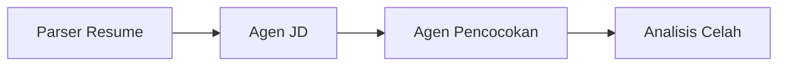
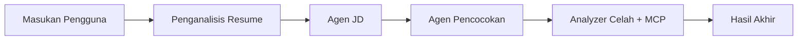

# Modul 4 - Pola Orkestrasi

⏱️ ~10 menit

Dalam modul ini, Anda akan menjelajahi pola orkestrasi yang digunakan dalam Resume Job Fit Evaluator dan belajar cara membaca, memodifikasi, dan memperluas grafik alur kerja. Memahami pola-pola ini sangat penting untuk debugging masalah aliran data dan membangun [alur kerja multi-agen](https://learn.microsoft.com/agent-framework/workflows/) Anda sendiri.

---

## Pola 1: Rantai berurutan

Pola dasar dalam alur kerja adalah **rantai berurutan** - output setiap agen langsung masuk ke agen berikutnya.


```mermaid
flowchart LR
    RP[Parser Resume] --> JD[Agen JD]
    JD --> MA[Agen Pencocokan]
    MA --> GA[Analisis Celah]
```

Dalam kode, setiap panggilan `add_edge()` membuat satu langkah dalam rantai:

```python
.add_edge(resume_executor, jd_executor)       # Output ResumeParser → JD Agent
.add_edge(jd_executor, matching_executor)     # Output JD Agent → MatchingAgent
.add_edge(matching_executor, gap_executor)    # Output MatchingAgent → GapAnalyzer
```

> **Mengapa berurutan, bukan fan-out/fan-in?** `WorkflowBuilder` menggunakan **semantik OR** untuk edges yang masuk: executor hilir akan dijalankan begitu **salah satu** pendahulu selesai. Jika `matching_executor` memiliki dua edge masuk (dari `resume_executor` dan `jd_executor`), ia akan memicu dua kali - satu kali saat ResumeParser selesai dan satu lagi ketika JD Agent selesai - menyebabkan GapAnalyzer juga berjalan dua kali dan output muncul dua kali. Pipeline berurutan menghindari hal ini sepenuhnya.

## Pola 2: Mengirim Konten

Karena `context_mode="last_agent"` berarti setiap executor hanya melihat output dari **pendahulu langsungnya**, agen dalam rantai berurutan harus secara eksplisit meneruskan data yang dibutuhkan agen hilir.

Dalam alur kerja ini:
- **ResumeParser** menyalin JD secara verbatim ke `[JOB DESCRIPTION PASS-THROUGH]` (agar JD Agent dapat menemukannya).
- **JD Agent** menyalin `[PARSED RESUME]` secara verbatim ke `[PARSED RESUME PASS-THROUGH]` (agar MatchingAgent dapat membandingkan kedua profil).

```
ResumeParser output
└─ [PARSED RESUME]               ← extracted by JD Agent
└─ [JOB DESCRIPTION PASS-THROUGH] ← extracted by JD Agent

JD Agent output
└─ [JD REQUIREMENTS]             ← extracted by MatchingAgent
└─ [PARSED RESUME PASS-THROUGH]  ← extracted by MatchingAgent
```

Setiap bagian relay harus disalin **secara verbatim** - merangkum atau memparafrasekannya akan merusak agen hilir yang bergantung padanya.

---

## Grafik lengkap

Menggabungkan pola rantai berurutan dan relay konten menghasilkan alur kerja penuh:


```mermaid
flowchart LR
    U[Masukan Pengguna] --> RP[Penganalisis Resume]
    RP --> JD[Agen JD]
    JD --> MA[Agen Pencocokan]
    MA --> GA[Analyzer Celah + MCP]
    GA --> O[Hasil Akhir]
```

Agent Inspector menunjukkan struktur grafik yang sama ini saat agen berjalan secara lokal. Lihat [Modul 5 - Uji Secara Lokal](05-test-locally.md) untuk tangkapan layar.

---

## Membaca kode WorkflowBuilder

Fungsi lengkap `create_workflow()` ada di [`PersonalCareerCopilot/main.py`](../../../../../workshop/lab02-multi-agent/PersonalCareerCopilot/main.py). Tiga panggilan `add_edge()` membangun pipeline berurutan:

| # | Edge | Efek |
|---|------|--------|
| 1 | `resume_executor → jd_executor` | JD Agent menerima `[PARSED RESUME]` + `[JOB DESCRIPTION PASS-THROUGH]` |
| 2 | `jd_executor → matching_executor` | MatchingAgent menerima `[JD REQUIREMENTS]` + `[PARSED RESUME PASS-THROUGH]` |
| 3 | `matching_executor → gap_executor` | GapAnalyzer menerima laporan kecocokan + daftar celah |

---

## Memodifikasi grafik

### Menambahkan agen baru

Untuk menambahkan agen kelima (misalnya, **InterviewPrepAgent** setelah GapAnalyzer):

1. Definisikan konstanta `INTERVIEW_PREP_INSTRUCTIONS`.
2. Buat objek `Agent` + `AgentExecutor` (pola yang sama seperti empat agen yang sudah ada).
3. Tambahkan `.add_edge(gap_executor, interview_exec)` di `WorkflowBuilder`.
4. Perbarui `output_executors=[interview_exec]`.

> **Penting:** `start_executor` adalah satu-satunya agen yang menerima input user mentah. Semua agen lain menerima output dari edge hulu mereka.

---

## Kesalahan umum pada grafik

| Kesalahan | Gejala | Perbaikan |
|---------|---------|-----|
| Tidak ada edge ke `output_executors` | Agen jalan tapi output kosong | Pastikan ada jalur dari `start_executor` ke setiap agen dalam `output_executors` |
| Ketergantungan melingkar | Loop tak terbatas atau timeout | Periksa agar tidak ada agen yang memberi umpan balik ke agen hulu |
| Agen dalam `output_executors` tanpa edge masuk | Output kosong | Tambahkan setidaknya satu `add_edge(source, that_agent)` |
| Beberapa `output_executors` tanpa fan-in | Output hanya berisi respon satu agen | Gunakan satu agen output yang menggabungkan, atau terima beberapa output |
| Tidak ada `start_executor` | `ValueError` saat build | Selalu tentukan `start_executor` di `WorkflowBuilder()` |

---

## Debugging grafik

### Menggunakan Agent Inspector

1. Mulai agen secara lokal dengan F5.
2. Buka Agent Inspector (`Ctrl+Shift+P` → **Foundry Toolkit: Open Agent Inspector**).
3. Kirim pesan tes.
4. Di panel respon Inspector, cari **output streaming** - ini menunjukkan kontribusi setiap agen secara berurutan.


### Menggunakan logging

Tambahkan logging ke `main.py` untuk melacak aliran data:

```python
import logging
logger = logging.getLogger("resume-job-fit")

# Di main(), setelah membangun workflow:
logger.info("Workflow graph built with edges: RP→JD, JD→MA, MA→GA")
```

Log server menunjukkan urutan eksekusi agen dan panggilan alat MCP:

```
INFO:agent_framework:Executing agent: ResumeParser
INFO:agent_framework:Executing agent: JobDescriptionAgent
INFO:agent_framework:Executing agent: MatchingAgent
INFO:agent_framework:Executing agent: GapAnalyzer
INFO:agent_framework:Tool call: search_microsoft_learn_for_plan(skill="Kubernetes")
POST https://learn.microsoft.com/api/mcp → 200
INFO:agent_framework:Tool call: search_microsoft_learn_for_plan(skill="Terraform")
POST https://learn.microsoft.com/api/mcp → 200
```

---

### Checkpoint

- [ ] Anda dapat mengidentifikasi dua pola orkestrasi dalam alur kerja: rantai berurutan dan relay konten
- [ ] Anda memahami mengapa `context_mode="last_agent"` membutuhkan relay data eksplisit antar agen
- [ ] Anda dapat membaca kode `WorkflowBuilder` dan memetakan setiap panggilan `add_edge()` ke grafik visual
- [ ] Anda tahu cara menambahkan agen baru di akhir pipeline
- [ ] Anda dapat mengidentifikasi kesalahan umum pada grafik dan gejalanya

---

**Sebelumnya:** [03 - Konfigurasi Agen & Lingkungan](03-configure-agents.md) · **Berikutnya:** [05 - Uji Secara Lokal →](05-test-locally.md)

---

<!-- CO-OP TRANSLATOR DISCLAIMER START -->
**Penafian**:
Dokumen ini telah diterjemahkan menggunakan layanan terjemahan AI [Co-op Translator](https://github.com/Azure/co-op-translator). Meskipun kami berupaya untuk mencapai akurasi, harap diketahui bahwa terjemahan otomatis mungkin mengandung kesalahan atau ketidakakuratan. Dokumen asli dalam bahasa aslinya harus dianggap sebagai sumber yang sah. Untuk informasi penting, disarankan menggunakan terjemahan profesional oleh manusia. Kami tidak bertanggung jawab atas kesalahpahaman atau penafsiran yang keliru yang timbul dari penggunaan terjemahan ini.
<!-- CO-OP TRANSLATOR DISCLAIMER END -->