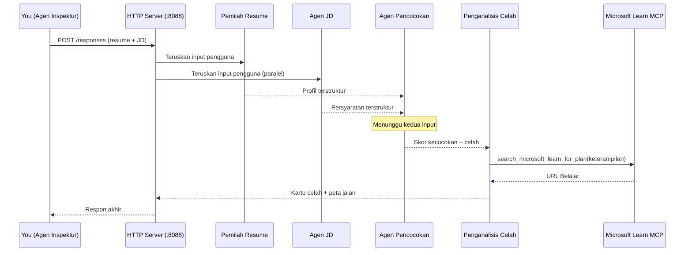
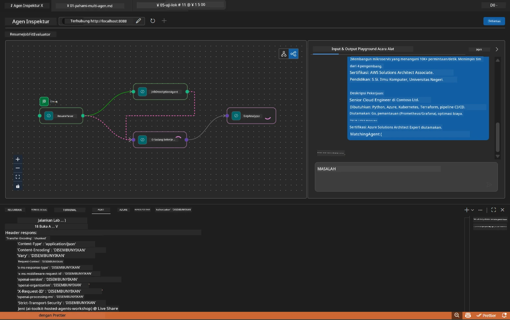

# Modul 5 - Uji Secara Lokal (Multi-Agent)

Dalam modul ini, Anda menjalankan alur kerja multi-agent secara lokal, mengujinya dengan Agent Inspector, dan memverifikasi bahwa keempat agen serta alat MCP berfungsi dengan benar sebelum menerapkan ke Foundry.

### Apa yang terjadi selama pengujian lokal


---

## Langkah 1: Mulai server agen

### Opsi A: Menggunakan tugas VS Code (direkomendasikan)

1. Tekan `Ctrl+Shift+P` → ketik **Tasks: Run Task** → pilih **Run Lab02 HTTP Server**.
2. Tugas ini memulai server dengan debugpy terpasang di port `5679` dan agen di port `8088`.
3. Tunggu hingga keluaran menunjukkan:

```
INFO:resume-job-fit:Starting Resume -> Job Fit Evaluator HTTP server...
INFO:resume-job-fit:Server running on http://localhost:8088
```

### Opsi B: Menggunakan terminal secara manual

```powershell
cd workshop\lab02-multi-agent\PersonalCareerCopilot
```

Aktifkan lingkungan virtual:

**PowerShell (Windows):**
```powershell
.\.venv\Scripts\Activate.ps1
```

**macOS/Linux:**
```bash
source .venv/bin/activate
```

Mulai server:

```powershell
python -m debugpy --listen 127.0.0.1:5679 -m agentdev run main.py --verbose --port 8088
```

### Opsi C: Menggunakan F5 (mode debug)

1. Tekan `F5` atau buka **Run and Debug** (`Ctrl+Shift+D`).
2. Pilih konfigurasi peluncuran **Lab02 - Multi-Agent** dari dropdown.
3. Server dimulai dengan dukungan breakpoint penuh.

> **Tip:** Mode debug memungkinkan Anda mengatur breakpoint di dalam `search_microsoft_learn_for_plan()` untuk memeriksa respons MCP, atau di dalam string instruksi agen untuk melihat apa yang diterima setiap agen.

---

## Langkah 2: Buka Agent Inspector

1. Tekan `Ctrl+Shift+P` → ketik **Foundry Toolkit: Open Agent Inspector**.
2. Agent Inspector terbuka di tab browser di `http://localhost:5679`.
3. Anda harus melihat antarmuka agen siap menerima pesan.

> **Jika Agent Inspector tidak terbuka:** Pastikan server sudah berjalan penuh (Anda melihat log "Server running"). Jika port 5679 sibuk, lihat [Modul 8 - Pemecahan Masalah](08-troubleshooting.md).

---

## Langkah 3: Jalankan pengujian dasar

Jalankan ketiga pengujian ini secara berurutan. Masing-masing menguji progresif alur kerja.

### Pengujian 1: Resume dasar + deskripsi pekerjaan

Tempelkan berikut ini ke dalam Agent Inspector:

```
Resume:
Jane Doe
Senior Software Engineer with 5 years of experience in Python, Django, and AWS.
Built microservices handling 10K+ requests/second. Led a team of 4 developers.
Certifications: AWS Solutions Architect Associate.
Education: B.S. Computer Science, State University.

Job Description:
Senior Cloud Engineer at Contoso Ltd.
Required: Python, Azure, Kubernetes, Terraform, CI/CD pipelines.
Preferred: Go, monitoring (Prometheus/Grafana), cost optimization.
Experience: 5+ years in cloud infrastructure.
Certifications: Azure Solutions Architect Expert preferred.
```

**Struktur keluaran yang diharapkan:**

Respons harus berisi keluaran dari keempat agen secara berurutan:

1. **Keluaran Resume Parser** - Profil kandidat terstruktur dengan keterampilan dikelompokkan berdasarkan kategori
2. **Keluaran JD Agent** - Persyaratan terstruktur dengan keterampilan wajib vs. diutamakan yang dipisahkan
3. **Keluaran Matching Agent** - Skor kecocokan (0-100) dengan rincian, keterampilan yang cocok, keterampilan yang hilang, kesenjangan
4. **Keluaran Gap Analyzer** - Kartu kesenjangan individu untuk setiap keterampilan yang hilang, masing-masing dengan URL Microsoft Learn



### Apa yang perlu diverifikasi pada Pengujian 1

| Periksa | Yang Diharapkan | Lulus? |
|---------|-----------------|--------|
| Respons berisi skor kecocokan | Angka antara 0-100 dengan rincian | |
| Keterampilan yang cocok tercantum | Python, CI/CD (parsial), dll. | |
| Keterampilan yang hilang tercantum | Azure, Kubernetes, Terraform, dll. | |
| Kartu kesenjangan ada untuk setiap keterampilan hilang | Satu kartu per keterampilan | |
| URL Microsoft Learn ada | Tautan nyata `learn.microsoft.com` | |
| Tidak ada pesan kesalahan dalam respons | Keluaran terstruktur bersih | |

### Pengujian 2: Verifikasi eksekusi alat MCP

Saat Pengujian 1 berjalan, periksa **terminal server** untuk entri log MCP:

```
GET https://learn.microsoft.com/api/mcp → 405 (Method Not Allowed)
POST https://learn.microsoft.com/api/mcp → 200
DELETE https://learn.microsoft.com/api/mcp → 405 (Method Not Allowed)
```

| Entri log | Arti | Diharapkan? |
|-----------|-------|-------------|
| `GET ... → 405` | Klien MCP melakukan probe dengan GET saat inisialisasi | Ya - normal |
| `POST ... → 200` | Panggilan alat sebenarnya ke server MCP Microsoft Learn | Ya - ini panggilan nyata |
| `DELETE ... → 405` | Klien MCP melakukan probe dengan DELETE saat pembersihan | Ya - normal |
| `POST ... → 4xx/5xx` | Panggilan alat gagal | Tidak - lihat [Pemecahan Masalah](08-troubleshooting.md) |

> **Poin penting:** Baris `GET 405` dan `DELETE 405` adalah **perilaku yang diharapkan**. Hanya perhatikan jika panggilan `POST` mengembalikan kode status non-200.

### Pengujian 3: Kasus tepi - kandidat dengan kecocokan tinggi

Tempelkan resume yang sangat sesuai dengan JD untuk memverifikasi GapAnalyzer menangani skenario kecocokan tinggi:

```
Resume:
Alex Chen
Senior Cloud Engineer with 7 years of experience.
Skills: Python, Azure (AKS, Functions, DevOps), Kubernetes, Terraform, CI/CD (GitHub Actions, Azure Pipelines), Go, Prometheus, Grafana, cost optimization.
Certifications: Azure Solutions Architect Expert, Azure DevOps Engineer Expert.
Led infrastructure migration to Azure for 3 enterprise clients.
Education: M.S. Computer Science, Tech University.

Job Description:
Senior Cloud Engineer at Contoso Ltd.
Required: Python, Azure, Kubernetes, Terraform, CI/CD pipelines.
Preferred: Go, monitoring (Prometheus/Grafana), cost optimization.
Experience: 5+ years in cloud infrastructure.
Certifications: Azure Solutions Architect Expert preferred.
```

**Perilaku yang diharapkan:**
- Skor kecocokan harus **80+** (kebanyakan keterampilan cocok)
- Kartu kesenjangan harus fokus pada penghalusan/kesiapan wawancara daripada pembelajaran dasar
- Instruksi GapAnalyzer mengatakan: "Jika fit >= 80, fokus pada penghalusan/kesiapan wawancara"

---

## Langkah 4: Verifikasi kelengkapan keluaran

Setelah menjalankan pengujian, verifikasi keluaran memenuhi kriteria berikut:

### Daftar periksa struktur keluaran

| Bagian | Agen | Ada? |
|--------|------|------|
| Profil Kandidat | Resume Parser | |
| Keterampilan Teknis (terkelompok) | Resume Parser | |
| Ikhtisar Peran | JD Agent | |
| Keterampilan Wajib vs. Diutamakan | JD Agent | |
| Skor Kecocokan dengan rincian | Matching Agent | |
| Keterampilan Cocok / Hilang / Parsial | Matching Agent | |
| Kartu kesenjangan per keterampilan hilang | Gap Analyzer | |
| URL Microsoft Learn di kartu kesenjangan | Gap Analyzer (MCP) | |
| Urutan pembelajaran (dinomori) | Gap Analyzer | |
| Ringkasan garis waktu | Gap Analyzer | |

### Masalah umum pada tahap ini

| Masalah | Penyebab | Solusi |
|---------|----------|--------|
| Hanya 1 kartu kesenjangan (yang lain terpotong) | Instruksi GapAnalyzer tanpa blok CRITICAL | Tambahkan paragraf `CRITICAL:` ke `GAP_ANALYZER_INSTRUCTIONS` - lihat [Modul 3](03-configure-agents.md) |
| Tidak ada URL Microsoft Learn | Endpoint MCP tidak dapat dijangkau | Periksa koneksi internet. Verifikasi `MICROSOFT_LEARN_MCP_ENDPOINT` di `.env` adalah `https://learn.microsoft.com/api/mcp` |
| Respons kosong | `PROJECT_ENDPOINT` atau `MODEL_DEPLOYMENT_NAME` tidak disetel | Periksa nilai file `.env`. Jalankan `echo $env:PROJECT_ENDPOINT` di terminal |
| Skor kecocokan 0 atau hilang | MatchingAgent tidak menerima data upstream | Pastikan `add_edge(resume_parser, matching_agent)` dan `add_edge(jd_agent, matching_agent)` ada di `create_workflow()` |
| Agen mulai tapi langsung keluar | Kesalahan impor atau dependensi hilang | Jalankan ulang `pip install -r requirements.txt`. Periksa terminal untuk jejak tumpukan |
| Kesalahan `validate_configuration` | Variabel lingkungan hilang | Buat `.env` dengan `PROJECT_ENDPOINT=<your-endpoint>` dan `MODEL_DEPLOYMENT_NAME=<your-model>` |

---

## Langkah 5: Uji dengan data Anda sendiri (opsional)

Cobalah menempelkan resume Anda sendiri dan deskripsi pekerjaan nyata. Ini membantu memverifikasi:

- Agen menangani format resume yang berbeda (kronologis, fungsional, hibrid)
- Agen JD menangani gaya JD berbeda (poin peluru, paragraf, terstruktur)
- Alat MCP mengembalikan sumber relevan untuk keterampilan nyata
- Kartu kesenjangan dipersonalisasi untuk latar belakang Anda secara spesifik

> **Catatan privasi:** Saat pengujian lokal, data Anda tetap di mesin Anda dan hanya dikirim ke penyebaran Azure OpenAI Anda. Data tidak dicatat atau disimpan oleh infrastruktur workshop. Gunakan nama placeholder jika Anda mau (misalnya, "Jane Doe" daripada nama asli Anda).

---

### Titik pemeriksaan

- [ ] Server berhasil dimulai di port `8088` (log menunjukkan "Server running")
- [ ] Agent Inspector terbuka dan terhubung ke agen
- [ ] Pengujian 1: Respons lengkap dengan skor kecocokan, keterampilan cocok/hilang, kartu kesenjangan, dan URL Microsoft Learn
- [ ] Pengujian 2: Log MCP menunjukkan `POST ... → 200` (panggilan alat berhasil)
- [ ] Pengujian 3: Kandidat dengan kecocokan tinggi mendapatkan skor 80+ dengan rekomendasi fokus penghalusan
- [ ] Semua kartu kesenjangan ada (satu per keterampilan hilang, tanpa terpotong)
- [ ] Tidak ada kesalahan atau jejak tumpukan di terminal server

---

**Sebelumnya:** [04 - Pola Orkestrasi](04-orchestration-patterns.md) · **Selanjutnya:** [06 - Terapkan ke Foundry →](06-deploy-to-foundry.md)

---

<!-- CO-OP TRANSLATOR DISCLAIMER START -->
**Penafian**:  
Dokumen ini telah diterjemahkan menggunakan layanan terjemahan AI [Co-op Translator](https://github.com/Azure/co-op-translator). Meskipun kami berupaya mencapai akurasi, harap diingat bahwa terjemahan otomatis mungkin mengandung kesalahan atau ketidakakuratan. Dokumen asli dalam bahasa aslinya harus dianggap sebagai sumber otoritatif. Untuk informasi yang penting, disarankan menggunakan terjemahan profesional oleh manusia. Kami tidak bertanggung jawab atas kesalahpahaman atau penafsiran yang keliru yang timbul dari penggunaan terjemahan ini.
<!-- CO-OP TRANSLATOR DISCLAIMER END -->