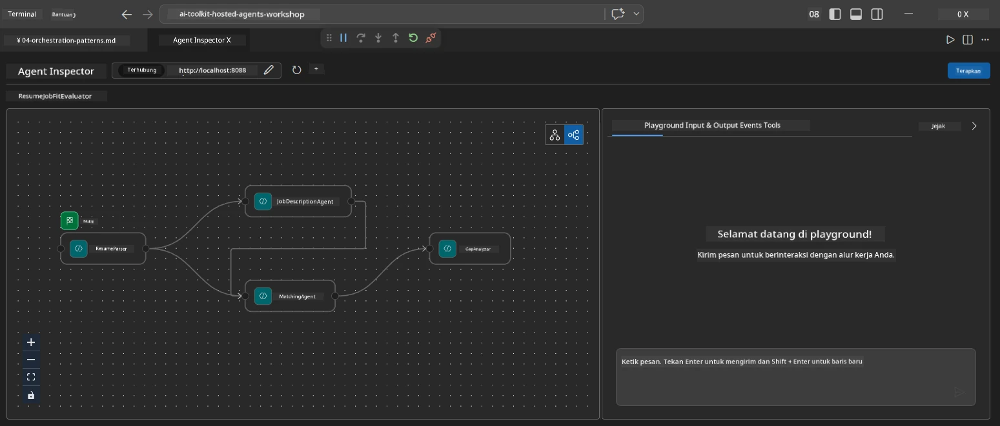
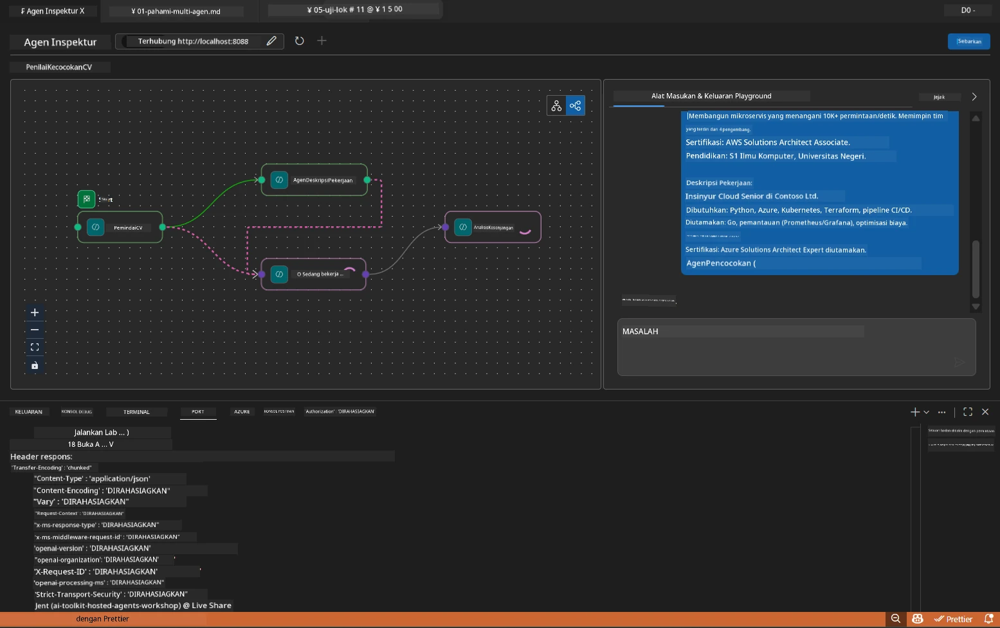
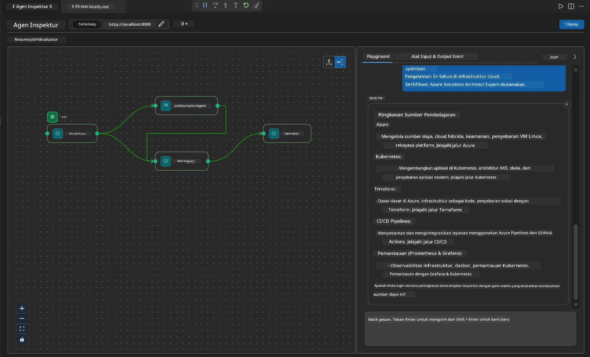

# Modul 5 - Uji Secara Lokal

⏱️ ~15 menit

Dalam modul ini, kamu menjalankan alur kerja multi-agent secara lokal, mengujinya dengan Agent Inspector, dan memverifikasi semuanya empat agen dan alat MCP berfungsi dengan benar sebelum melakukan deployment.

---

## Langkah 1: Mulai server agen

### Opsi A: Menggunakan tugas VS Code (direkomendasikan)

1. Buka `workshop/lab02-multi-agent/PersonalCareerCopilot/` sebagai folder VS Code-mu.
2. Tekan `Ctrl+Shift+P` → ketik **Tasks: Run Task** → pilih **Run Agent HTTP Server**.
3. Tugas ini memulai server dengan debugpy yang terpasang di port `5679` dan agen di port `8088`.
4. Tunggu sampai output menunjukkan:

```
INFO:resume-job-fit:Starting Resume -> Job Fit Evaluator HTTP server...
INFO:resume-job-fit:Server running on http://localhost:8088
```

### Opsi B: Menggunakan F5 (mode debug)

1. Tekan `F5` → pilih **Debug Local Agent HTTP Server**.
2. Server dimulai dengan dukungan breakpoint penuh - berguna untuk memeriksa respons MCP atau output agen.

---

## Langkah 2: Buka Agent Inspector

1. Tekan `Ctrl+Shift+P` → ketik **Foundry Toolkit: Open Agent Inspector**.
2. Agent Inspector terbuka sebagai panel VS Code yang terhubung ke `http://localhost:8088`.
3. Kamu harus melihat antarmuka agen siap menerima pesan.



> **Jika Agent Inspector tidak terbuka:** Pastikan server telah sepenuhnya dimulai (lihat log "Server running"). Jika port 5679 sedang digunakan, lihat [Modul 8 - Pemecahan Masalah](08-troubleshooting.md).

---

## Langkah 2b: (Opsional) Buka Visualizer Alur Kerja

Foundry Toolkit menyertakan **Workflow Visualizer** waktu nyata yang menunjukkan bagaimana agen berinteraksi saat grafik dijalankan. Ini sangat berguna untuk debug multi-agent.

1. Tekan `Ctrl+Shift+P` → ketik **Foundry Toolkit: Open Visualizer for Hosted Agents**.
2. Tab baru di VS Code terbuka dan menunjukkan grafik eksekusi langsung.
3. Saat kamu mengirim pesan di Agent Inspector, visualizer diperbarui otomatis - node hijau menunjukkan agen yang selesai, dan tepi animasi menunjukkan aliran data antar agen.

> **Konflik port:** Jika port visualizer sudah digunakan, ubah di Pengaturan VS Code → **Extensions** → **Microsoft Foundry Configuration** → **Hosted Agents: Visualizer Port**.

---

## Langkah 3: Jalankan pengujian sederhana

Jalankan tiga tes ini berurutan. Masing-masing menguji progresif bagian alur kerja.

### Tes 1: Resume dasar + deskripsi pekerjaan

Tempelkan berikut ini ke Agent Inspector:

```
Resume:
Jane Doe
Senior Software Engineer with 5 years of experience in Python, Django, and AWS.
Built microservices handling 10K+ requests/second. Led a team of 4 developers.
Certifications: AWS Solutions Architect Associate.
Education: B.S. Computer Science, State University.

Job Description:
Senior Cloud Engineer at Contoso Ltd.
Required: Python, Azure, Kubernetes, Terraform, CI/CD pipelines.
Preferred: Go, monitoring (Prometheus/Grafana), cost optimization.
Experience: 5+ years in cloud infrastructure.
Certifications: Azure Solutions Architect Expert preferred.
```

**Struktur output yang diharapkan:**

Respons harus berisi output dari semua empat agen secara berurutan:

1. **Output Resume Parser** - Dua bagian berlabel: `[PARSED RESUME]` (profil kandidat dengan keterampilan yang dikelompokkan) dan `[JOB DESCRIPTION PASS-THROUGH]` (teks JD apa adanya yang dikirim ke JD Agent)
2. **Output JD Agent** - Persyaratan terstruktur dengan keterampilan yang dibutuhkan vs yang diutamakan dipisahkan
3. **Output Matching Agent** - Skor kecocokan (0-100) dengan rincian, keterampilan yang cocok, keterampilan yang hilang, gap
4. **Output Gap Analyzer** - Kartu gap individu untuk setiap keterampilan yang hilang, masing-masing dengan URL Microsoft Learn





### Apa yang harus diverifikasi di Tes 1

| Cek | Yang Diharapkan | Lulus? |
|-------|----------|-------|
| Respons mengandung skor kecocokan | Angka antara 0-100 dengan rincian | |
| Keterampilan yang cocok terdaftar | Python, CI/CD (parsial), dll. | |
| Keterampilan yang hilang terdaftar | Azure, Kubernetes, Terraform, dll. | |
| Kartu gap ada untuk tiap keterampilan yang hilang | Satu kartu per keterampilan | |
| URL Microsoft Learn ada | Tautan nyata `learn.microsoft.com` | |
| Tidak ada pesan kesalahan di respons | Output terstruktur bersih | |

### Tes 2: Kasus tepi - kandidat kecocokan tinggi

Tempelkan resume yang sangat cocok dengan JD untuk memverifikasi GapAnalyzer menangani skenario kecocokan tinggi:

```
Resume:
Alex Chen
Senior Cloud Engineer with 7 years of experience.
Skills: Python, Azure (AKS, Functions, DevOps), Kubernetes, Terraform, CI/CD (GitHub Actions, Azure Pipelines), Go, Prometheus, Grafana, cost optimization.
Certifications: Azure Solutions Architect Expert, Azure DevOps Engineer Expert.
Led infrastructure migration to Azure for 3 enterprise clients.
Education: M.S. Computer Science, Tech University.

Job Description:
Senior Cloud Engineer at Contoso Ltd.
Required: Python, Azure, Kubernetes, Terraform, CI/CD pipelines.
Preferred: Go, monitoring (Prometheus/Grafana), cost optimization.
Experience: 5+ years in cloud infrastructure.
Certifications: Azure Solutions Architect Expert preferred.
```

**Perilaku yang diharapkan:**
- Skor kecocokan harus **80+** (kebanyakan keterampilan cocok)
- Kartu gap harus fokus pada penyempurnaan/kesiapan wawancara daripada pembelajaran dasar
- Instruksi GapAnalyzer mengatakan: "Jika kecocokan >= 80, fokus pada penyempurnaan/kesiapan wawancara"

---

## Langkah 4: Uji dengan data sendiri (opsional)

Cobalah tempelkan resume sendiri dan deskripsi pekerjaan nyata. Ini membantu memverifikasi:

- Agen menangani format resume berbeda (kronologis, fungsional, hybrid)
- JD Agent menangani gaya JD berbeda (poin peluru, paragraf, terstruktur)
- Alat MCP mengembalikan sumber daya relevan untuk keterampilan nyata
- Kartu gap dipersonalisasi sesuai latar belakangmu

> **Privasi - Jalur A (Foundry cloud):** Teks resume dan JD dikirim ke deployment Azure OpenAI-mu untuk inferensi. Ini tidak dicatat atau disimpan oleh infrastruktur workshop. Gunakan nama placeholder (mis. "Jane Doe") jika kamu pilih.
>
> **Privasi - Jalur B (Foundry Local):** Semua empat inferensi agen berjalan sepenuhnya di perangkatmu. Teks resume dan deskripsi pekerjaan **tidak pernah meninggalkan mesinmu**. Satu-satunya pemanggilan keluar adalah alat MCP mengambil sumber daya dari `https://learn.microsoft.com/api/mcp`; query itu hanya berisi nama keterampilan, bukan data pribadimu.

---

### Titik Pemeriksaan

- [ ] Server berhasil dimulai di port `8088` (log menunjukkan "Server running")
- [ ] Agent Inspector terbuka dan terhubung ke agen
- [ ] Tes 1: Respons lengkap dengan skor kecocokan, keterampilan cocok/hilang, kartu gap, dan URL Microsoft Learn
- [ ] Tes 2: Kandidat kecocokan tinggi mendapat skor 80+ dengan rekomendasi fokus penyempurnaan
- [ ] Semua kartu gap ada (satu per keterampilan hilang, tanpa pemotongan)
- [ ] Tidak ada kesalahan atau stack trace di terminal server

---

**Sebelumnya:** [04 - Pola Orkestrasi](04-orchestration-patterns.md) · **Selanjutnya:** [06 - Deploy ke Foundry →](06-deploy-to-foundry.md)

---

<!-- CO-OP TRANSLATOR DISCLAIMER START -->
**Penafian**:
Dokumen ini telah diterjemahkan menggunakan layanan terjemahan AI [Co-op Translator](https://github.com/Azure/co-op-translator). Meskipun kami berupaya untuk mencapai akurasi, harap diketahui bahwa terjemahan otomatis mungkin mengandung kesalahan atau ketidakakuratan. Dokumen asli dalam bahasa aslinya harus dianggap sebagai sumber yang sah. Untuk informasi penting, disarankan menggunakan terjemahan profesional oleh manusia. Kami tidak bertanggung jawab atas kesalahpahaman atau penafsiran yang keliru yang timbul dari penggunaan terjemahan ini.
<!-- CO-OP TRANSLATOR DISCLAIMER END -->