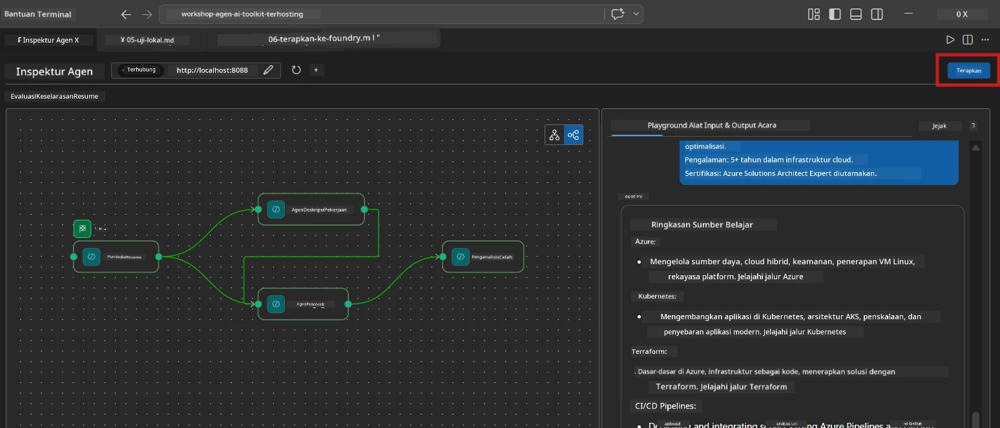
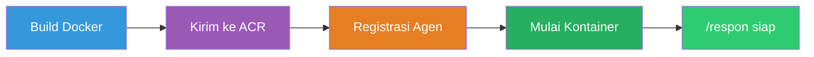
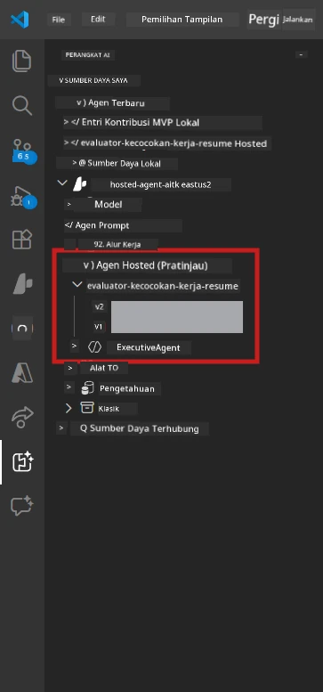

# Modul 6 - Deploy ke Foundry Agent Service

Dalam modul ini, Anda menerapkan workflow multi-agent yang telah diuji secara lokal ke [Microsoft Foundry](https://learn.microsoft.com/azure/foundry/agents/concepts/hosted-agents) sebagai **Hosted Agent**. Proses deployment membangun image container Docker, mendorongnya ke [Azure Container Registry (ACR)](https://learn.microsoft.com/azure/container-registry/container-registry-intro), dan membuat versi hosted agent di [Foundry Agent Service](https://learn.microsoft.com/azure/foundry/agents/how-to/publish-agent).

> **Perbedaan utama dari Lab 01:** Proses deployment identik. Foundry memperlakukan workflow multi-agent Anda sebagai satu hosted agent - kompleksitas ada di dalam container, tetapi permukaan deployment adalah endpoint `/responses` yang sama.

---

## Pemeriksaan Prasyarat

Sebelum melakukan deployment, verifikasi setiap item di bawah ini:

1. **Agent melewati tes awal lokal:**
   - Anda menyelesaikan semua 3 tes di [Modul 5](05-test-locally.md) dan workflow menghasilkan output lengkap dengan gap cards dan URL Microsoft Learn.

2. **Anda memiliki peran [Azure AI User](https://learn.microsoft.com/azure/foundry/concepts/rbac-foundry):**
   - Ditugaskan di [Lab 01, Modul 2](../../lab01-single-agent/docs/02-create-foundry-project.md). Verifikasi:
   - [Azure Portal](https://portal.azure.com) → sumber daya **project** Foundry Anda → **Access control (IAM)** → **Role assignments** → pastikan **[Azure AI User](https://aka.ms/foundry-ext-project-role)** tercantum untuk akun Anda.

3. **Anda masuk ke Azure di VS Code:**
   - Periksa ikon Akun di kiri-bawah VS Code. Nama akun Anda harus terlihat.

4. **`agent.yaml` memiliki nilai yang benar:**
   - Buka `PersonalCareerCopilot/agent.yaml` dan verifikasi:
     ```yaml
     environment_variables:
       - name: PROJECT_ENDPOINT
         value: ${PROJECT_ENDPOINT}
       - name: MODEL_DEPLOYMENT_NAME
         value: ${MODEL_DEPLOYMENT_NAME}
     ```
   - Nilai-nilai ini harus sesuai dengan variabel lingkungan yang dibaca oleh `main.py` Anda.

5. **`requirements.txt` memiliki versi yang benar:**
   ```
   agent-framework-azure-ai==1.0.0rc3
   agent-framework-core==1.0.0rc3
   azure-ai-agentserver-agentframework==1.0.0b16
   azure-ai-agentserver-core==1.0.0b16
   debugpy
   agent-dev-cli --pre
   ```

---

## Langkah 1: Mulai deployment

### Opsi A: Deploy dari Agent Inspector (direkomendasikan)

Jika agent berjalan via F5 dengan Agent Inspector terbuka:

1. Perhatikan **pojok kanan atas** panel Agent Inspector.
2. Klik tombol **Deploy** (ikon awan dengan panah ke atas ↑).
3. Wizard deployment terbuka.



### Opsi B: Deploy dari Command Palette

1. Tekan `Ctrl+Shift+P` untuk membuka **Command Palette**.
2. Ketik: **Microsoft Foundry: Deploy Hosted Agent** dan pilih.
3. Wizard deployment terbuka.

---

## Langkah 2: Konfigurasikan deployment

### 2.1 Pilih project target

1. Dropdown menampilkan project Foundry Anda.
2. Pilih project yang Anda gunakan selama workshop (misal, `workshop-agents`).

### 2.2 Pilih file agent container

1. Anda diminta memilih titik masuk agent.
2. Navigasi ke `workshop/lab02-multi-agent/PersonalCareerCopilot/` dan pilih **`main.py`**.

### 2.3 Konfigurasikan sumber daya

| Pengaturan | Nilai rekomendasi | Catatan |
|------------|-------------------|---------|
| **CPU** | `0.25` | Default. Workflow multi-agent tidak perlu CPU lebih karena panggilan model bersifat I/O-bound |
| **Memory** | `0.5Gi` | Default. Tingkatkan ke `1Gi` jika Anda menambahkan alat pemrosesan data besar |

---

## Langkah 3: Konfirmasi dan deploy

1. Wizard menampilkan ringkasan deployment.
2. Tinjau dan klik **Confirm and Deploy**.
3. Pantau progres di VS Code.

### Apa yang terjadi selama deployment

Pantau panel **Output** di VS Code (pilih dropdown "Microsoft Foundry"):


1. **Docker build** - Membangun container dari `Dockerfile` Anda:
   ```
   Step 1/6 : FROM python:3.14-slim
   Step 2/6 : WORKDIR /app
   ...
   Successfully built abc123def456
   ```

2. **Docker push** - Mendorong image ke ACR (1-3 menit pada deployment pertama).

3. **Registrasi agent** - Foundry membuat hosted agent menggunakan metadata `agent.yaml`. Nama agent adalah `resume-job-fit-evaluator`.

4. **Start container** - Container dimulai di infrastruktur yang dikelola Foundry dengan sebuah identity yang dikelola sistem.

> **Deployment pertama lebih lambat** (Docker mendorong semua lapisan). Deployment berikutnya menggunakan lapisan cache sehingga lebih cepat.

### Catatan spesifik multi-agent

- **Keempat agent berada di satu container.** Foundry melihat satu hosted agent. Graf WorkflowBuilder berjalan secara internal.
- **Panggilan MCP keluar.** Container membutuhkan akses internet ke `https://learn.microsoft.com/api/mcp`. Infrastruktur yang dikelola Foundry menyediakan ini secara default.
- **[Managed Identity](https://learn.microsoft.com/python/api/overview/azure/identity-readme#managed-identity-support).** Di lingkungan hosted, `get_credential()` dalam `main.py` mengembalikan `ManagedIdentityCredential()` (karena `MSI_ENDPOINT` diset). Ini otomatis.

---

## Langkah 4: Verifikasi status deployment

1. Buka sidebar **Microsoft Foundry** (klik ikon Foundry di Activity Bar).
2. Perluas **Hosted Agents (Preview)** di bawah project Anda.
3. Temukan **resume-job-fit-evaluator** (atau nama agent Anda).
4. Klik nama agent → perluas versi (mis. `v1`).
5. Klik versi → periksa **Container Details** → **Status**:



| Status | Arti |
|--------|------|
| **Started** / **Running** | Container berjalan, agent siap |
| **Pending** | Container sedang mulai (tunggu 30-60 detik) |
| **Failed** | Container gagal mulai (periksa log - lihat di bawah) |

> **Startup multi-agent lebih lama** dibanding single-agent karena container membuat 4 instance agent saat startup. "Pending" hingga 2 menit adalah normal.

---

## Kesalahan umum deployment dan perbaikan

### Kesalahan 1: Permission denied - `agents/write`

```
Error: lacks the required data action 
Microsoft.CognitiveServices/accounts/AIServices/agents/write
```

**Perbaikan:** Tetapkan peran **[Azure AI User](https://learn.microsoft.com/azure/foundry/concepts/rbac-foundry)** di tingkat **project**. Lihat [Modul 8 - Troubleshooting](08-troubleshooting.md) untuk instruksi langkah demi langkah.

### Kesalahan 2: Docker tidak berjalan

```
Error: Docker build failed / Cannot connect to Docker daemon
```

**Perbaikan:**
1. Mulai Docker Desktop.
2. Tunggu hingga "Docker Desktop is running".
3. Verifikasi: `docker info`
4. **Windows:** Pastikan backend WSL 2 diaktifkan di pengaturan Docker Desktop.
5. Coba lagi.

### Kesalahan 3: pip install gagal selama Docker build

```
Error: Could not find a version that satisfies the requirement agent-dev-cli
```

**Perbaikan:** Flag `--pre` di `requirements.txt` ditangani berbeda di Docker. Pastikan `requirements.txt` Anda memiliki:
```
agent-dev-cli --pre
```

Jika Docker masih gagal, buat `pip.conf` atau lewati `--pre` melalui argumen build. Lihat [Modul 8](08-troubleshooting.md).

### Kesalahan 4: Alat MCP gagal di hosted agent

Jika Gap Analyzer berhenti menghasilkan URL Microsoft Learn setelah deployment:

**Penyebab:** Kebijakan jaringan mungkin memblokir HTTPS keluar dari container.

**Perbaikan:**
1. Ini biasanya bukan masalah dengan konfigurasi default Foundry.
2. Jika terjadi, periksa apakah jaringan virtual project Foundry memiliki NSG yang memblokir HTTPS keluar.
3. Alat MCP memiliki URL fallback bawaan, jadi agent tetap menghasilkan output (tanpa URL langsung).

---

### Titik Pemeriksaan

- [ ] Perintah deployment selesai tanpa error di VS Code
- [ ] Agent muncul di bawah **Hosted Agents (Preview)** di sidebar Foundry
- [ ] Nama agent adalah `resume-job-fit-evaluator` (atau nama yang Anda pilih)
- [ ] Status container menunjukkan **Started** atau **Running**
- [ ] (Jika ada error) Anda mengidentifikasi error, menerapkan perbaikan, dan berhasil melakukan redeploy

---

**Sebelumnya:** [05 - Test Locally](05-test-locally.md) · **Selanjutnya:** [07 - Verify in Playground →](07-verify-in-playground.md)

---

<!-- CO-OP TRANSLATOR DISCLAIMER START -->
**Penafian**:  
Dokumen ini telah diterjemahkan menggunakan layanan terjemahan AI [Co-op Translator](https://github.com/Azure/co-op-translator). Meskipun kami berusaha untuk akurasi, harap diketahui bahwa terjemahan otomatis mungkin mengandung kesalahan atau ketidakakuratan. Dokumen asli dalam bahasa aslinya harus dianggap sebagai sumber yang sah. Untuk informasi penting, disarankan menggunakan terjemahan profesional oleh penerjemah manusia. Kami tidak bertanggung jawab atas kesalahpahaman atau kesalahan interpretasi yang timbul dari penggunaan terjemahan ini.
<!-- CO-OP TRANSLATOR DISCLAIMER END -->