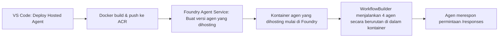
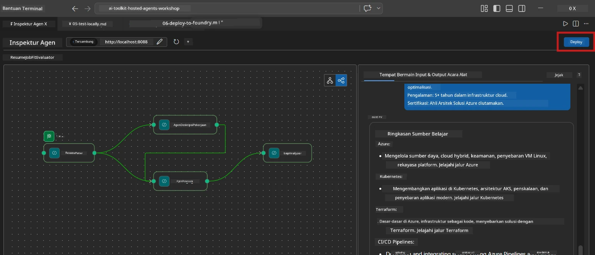

# Modul 6 - Deploy ke Foundry Agent Service

⏱️ ~10 menit

Dalam modul ini, Anda menerapkan alur kerja multi-agen yang telah diuji secara lokal ke [Microsoft Foundry](https://learn.microsoft.com/azure/foundry/agents/concepts/hosted-agents) sebagai **Hosted Agent**. Proses penerapan membangun image kontainer Docker, mendorongnya ke [Azure Container Registry (ACR)](https://learn.microsoft.com/azure/container-registry/container-registry-intro), dan membuat versi agen yang di-host di [Foundry Agent Service](https://learn.microsoft.com/azure/foundry/agents/how-to/publish-agent).

> **Perbedaan utama dari Lab 01:** Proses penerapan identik. Foundry memperlakukan alur kerja multi-agen Anda sebagai satu hosted agent - kompleksitas ada di dalam kontainer, tetapi permukaan penerapan adalah endpoint `/responses` yang sama.

### Pipeline penerapan


```mermaid
flowchart LR
    A[VS Code: Deploy Hosted Agent] --> B[Docker build & push ke ACR]
    B --> C[Foundry Agent Service: Buat versi agen yang dihosting]
    C --> D[Kontainer agen yang dihosting mulai di Foundry]
    D --> E[WorkflowBuilder menjalankan 4 agen secara berurutan di dalam kontainer]
    E --> F[Agen merespon permintaan /responses]
```

---

## Pemeriksaan prasyarat

Sebelum menerapkan, verifikasi setiap item berikut:

1. **Agen lulus tes lokal:**
   - Anda telah menyelesaikan ketiga tes di [Modul 5](05-test-locally.md) dan alur kerja menghasilkan output lengkap dengan kartu gap dan URL Microsoft Learn.

2. **Anda memiliki peran [Foundry User](https://learn.microsoft.com/azure/foundry/concepts/rbac-foundry)** (untuk menerapkan, minimal perlu **Foundry Project Manager** pada cakupan proyek):

   > **Catatan:** Peran RBAC Foundry baru-baru ini diubah namanya - **Foundry User**, **Foundry Owner**, dan **Foundry Project Manager** sebelumnya bernama Azure AI User, Azure AI Owner, dan Azure AI Project Manager. ID peran dan izin tidak berubah.

   - Verifikasi di [Azure Portal](https://portal.azure.com) → resource **proyek** Foundry Anda → **Access control (IAM)** → **Role assignments** → pastikan **Foundry User** (atau lebih tinggi) tercantum untuk akun Anda.

3. **Anda masuk ke Azure di VS Code:**
   - Periksa ikon Akun di kiri bawah VS Code. Nama akun Anda harus terlihat.

4. **`agent.yaml` berisi nilai yang benar:**
   - Buka `PersonalCareerCopilot/agent.yaml` dan verifikasi:
     ```yaml
     environment_variables:
       - name: AZURE_AI_MODEL_DEPLOYMENT_NAME
         value: ${AZURE_AI_MODEL_DEPLOYMENT_NAME}
     ```
   - `FOUNDRY_PROJECT_ENDPOINT` **tidak** tercantum di sini - Foundry menyuntikkannya saat runtime. Hanya `AZURE_AI_MODEL_DEPLOYMENT_NAME` yang perlu dideklarasikan.

5. **`requirements.txt` berisi versi yang benar:**
   ```
   agent-framework-foundry
   agent-framework-foundry-hosting
   mcp<2,>=1.24.0
   debugpy
   ```

---

## Langkah 1: Mulai penerapan

### Pilihan A: Deploy dari Agent Inspector (direkomendasikan)

Jika agen berjalan melalui F5 dengan Agent Inspector terbuka:

1. Lihat di **pojok kanan atas** panel Agent Inspector.
2. Klik tombol **Deploy** (ikon awan dengan panah ke atas ↑).
3. Wizard penerapan akan terbuka.



### Pilihan B: Deploy dari Command Palette

1. Tekan `Ctrl+Shift+P` untuk membuka **Command Palette**.
2. Ketik: **Foundry Toolkit: Deploy Hosted Agent** dan pilih.
3. Wizard penerapan akan terbuka.

---

## Langkah 2: Konfigurasikan penerapan

### 2.1 Pilih proyek target

1. Dropdown menunjukkan proyek Foundry Anda.
2. Pilih proyek yang Anda gunakan selama workshop (misal, `workshop-agents`).

### 2.2 Pilih file agen kontainer

1. Anda akan diminta memilih titik masuk agen.
2. Navigasi ke `workshop/lab02-multi-agent/PersonalCareerCopilot/` dan pilih **`main.py`**.

### 2.3 Konfigurasikan sumber daya

| Pengaturan | Nilai yang direkomendasikan | Catatan |
|---------|------------------|-------|
| **Metode Penerapan** | **Container** (direkomendasikan) atau **Code** | Container membangun image Docker; Code mengunggah sumber sebagai ZIP (preview) |
| **Container Registry** | **Default ACR** | Foundry membuat dan mengelola satu untuk Anda |
| **CPU** | `0.25` | Default. Alur kerja multi-agen tidak perlu CPU lebih karena panggilan model adalah I/O-bound |
| **Memori** | `0.5Gi` | Default. Tingkatkan ke `1Gi` jika Anda menambahkan alat pemrosesan data besar |

---

## Langkah 3: Konfirmasi dan terapkan

1. Wizard menunjukkan ringkasan penerapan.
2. Tinjau dan klik **Confirm and Deploy**.
3. Pantau kemajuan di VS Code.

### Apa yang terjadi selama penerapan

Pantau panel **Output** VS Code (pilih dropdown "Microsoft Foundry"):

1. **Docker build** - Membangun kontainer dari `Dockerfile` Anda
   ```
   Step 1/6 : FROM python:3.12-slim
   Step 2/6 : WORKDIR /app
   ...
   Successfully built abc123def456
   ```

2. **Docker push** - Mendorong image ke ACR (1-3 menit saat deploy pertama).

3. **Registrasi agen** - Foundry membuat hosted agent menggunakan metadata `agent.yaml`. Nama agen adalah `resume-job-fit-evaluator`.

4. **Memulai kontainer** - Kontainer mulai di infrastruktur yang dikelola Foundry dengan identitas yang dikelola sistem.

> **Penerapan pertama lebih lambat** (Docker mendorong semua lapisan). Penerapan berikutnya menggunakan lapisan cache dan lebih cepat.

### Catatan khusus multi-agen

- **Keempat agen ada dalam satu kontainer.** Foundry melihat satu hosted agent saja. Grafik WorkflowBuilder berjalan secara internal.
- **Panggilan MCP keluar.** Kontainer membutuhkan akses internet untuk menjangkau `https://learn.microsoft.com/api/mcp`. Infrastruktur terkelola Foundry menyediakan ini secara default.
- **[Managed Identity](https://learn.microsoft.com/azure/foundry/agents/concepts/agent-identity).** Foundry secara otomatis membuat **identitas Entra per-agen khusus** untuk setiap Hosted agent saat deploy. Di lingkungan hosting, `DefaultAzureCredential` secara otomatis mengarah ke identitas agen ini - tanpa konfigurasi identitas terkelola manual diperlukan.

---

## Langkah 4: Verifikasi status penerapan

1. Buka sidebar **Microsoft Foundry** (klik ikon Foundry di Activity Bar).
2. Perluas **Hosted Agents (Preview)** di bawah proyek Anda.
3. Temukan **resume-job-fit-evaluator** (atau nama agen Anda).
4. Klik nama agen → perluas versi (misal, `v1`).
5. Klik versi → periksa **Container Details** → **Status**:


| Status | Arti |
|--------|---------|
| **active** | Agen berjalan dan siap menerima permintaan |
| **creating** | Kontainer sedang memulai (tunggu 30–60 detik) |
| **failed** | Kontainer gagal memulai (cek log - lihat di bawah) |

> **Catatan:** Sidebar VS Code mungkin menampilkan label seperti "Running" atau "Started" sementara status API yang mendasarinya menggunakan `active`/`creating`. Kedua tampilan menunjukkan keadaan yang sama.

> **Startup multi-agen memakan waktu lebih lama** daripada single-agent karena kontainer membuat 4 instance agen saat startup. `creating` hingga 2 menit adalah normal.

---

## Kesalahan umum saat penerapan dan perbaikannya

### Kesalahan 1: Izin ditolak - `agents/write`

```
Error: lacks the required data action 
Microsoft.CognitiveServices/accounts/AIServices/agents/write
```

**Perbaikan:** Tetapkan peran **[Foundry User](https://learn.microsoft.com/azure/foundry/concepts/rbac-foundry)** (sebelumnya **Azure AI User**) pada tingkat **proyek**. Lihat [Modul 8 - Pemecahan Masalah](08-troubleshooting.md) untuk instruksi langkah demi langkah.

### Kesalahan 2: Docker tidak berjalan

```
Error: Docker build failed / Cannot connect to Docker daemon
```

**Perbaikan:**
1. Mulai Docker Desktop.
2. Tunggu hingga muncul "Docker Desktop is running".
3. Verifikasi dengan: `docker info`
4. **Windows:** Pastikan backend WSL 2 diaktifkan di pengaturan Docker Desktop.
5. Coba kembali.

### Kesalahan 3: pip install gagal saat build Docker

```
Error: Could not find a version that satisfies the requirement agent-framework-foundry
```

**Perbaikan:** Verifikasi `requirements.txt` sesuai dengan:
```
agent-framework-foundry
agent-framework-foundry-hosting
mcp<2,>=1.24.0
debugpy
```

Jika build masih gagal, jaringan Docker Anda mungkin memblokir PyPI. Periksa `docker info` untuk pengaturan proxy.

### Kesalahan 4: Alat MCP gagal di hosted agent

Jika Gap Analyzer berhenti menghasilkan URL Microsoft Learn setelah penerapan:

**Penyebab:** Kebijakan jaringan mungkin memblokir HTTPS keluar dari kontainer.

**Perbaikan:**
1. Ini biasanya bukan masalah dengan konfigurasi default Foundry.
2. Jika terjadi, periksa apakah jaringan virtual proyek Foundry memiliki NSG yang memblokir HTTPS keluar.
3. Alat MCP memiliki URL fallback bawaan, sehingga agen masih akan menghasilkan output (tanpa URL langsung).

---

### Titik pemeriksaan

- [ ] Perintah penerapan selesai tanpa kesalahan di VS Code
- [ ] Agen muncul di bawah **Hosted Agents (Preview)** pada sidebar Foundry
- [ ] Nama agen adalah `resume-job-fit-evaluator` (atau nama yang Anda pilih)
- [ ] Status kontainer menunjukkan **Started** atau **Running**
- [ ] (Jika ada kesalahan) Anda telah mengidentifikasi kesalahan, menerapkan perbaikan, dan berhasil menerapkan ulang

---

**Sebelumnya:** [05 - Test Locally](05-test-locally.md) · **Selanjutnya:** [07 - Verify in Playground →](07-verify-in-playground.md)

---

<!-- CO-OP TRANSLATOR DISCLAIMER START -->
**Penafian**:
Dokumen ini telah diterjemahkan menggunakan layanan terjemahan AI [Co-op Translator](https://github.com/Azure/co-op-translator). Meskipun kami berupaya untuk mencapai akurasi, harap diketahui bahwa terjemahan otomatis mungkin mengandung kesalahan atau ketidakakuratan. Dokumen asli dalam bahasa aslinya harus dianggap sebagai sumber yang sah. Untuk informasi penting, disarankan menggunakan terjemahan profesional oleh manusia. Kami tidak bertanggung jawab atas kesalahpahaman atau penafsiran yang keliru yang timbul dari penggunaan terjemahan ini.
<!-- CO-OP TRANSLATOR DISCLAIMER END -->