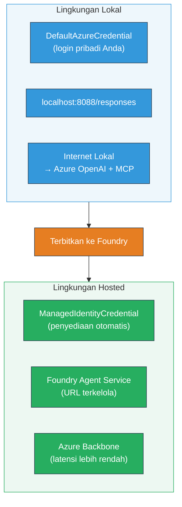

# Modul 7 - Verifikasi di Playground

Dalam modul ini, Anda menguji alur kerja multi-agen yang telah Anda terapkan baik di **VS Code** maupun **[Foundry Portal](https://ai.azure.com)**, memastikan agen berperilaku identik dengan pengujian lokal.

---

## Mengapa verifikasi setelah penerapan?

Alur kerja multi-agen Anda berjalan sempurna secara lokal, lalu mengapa diuji lagi? Lingkungan hosting berbeda dalam beberapa hal:


| Perbedaan | Lokal | Hosting |
|-----------|-------|---------|
| **Identitas** | [`DefaultAzureCredential`](https://learn.microsoft.com/azure/developer/python/sdk/authentication/credential-chains#defaultazurecredential-overview) (masuk pribadi Anda) | [`ManagedIdentityCredential`](https://learn.microsoft.com/python/api/overview/azure/identity-readme#managed-identity-support) (auto-provisi) |
| **Endpoint** | `http://localhost:8088/responses` | endpoint [Foundry Agent Service](https://learn.microsoft.com/azure/foundry/agents/concepts/hosted-agents) (URL terkelola) |
| **Jaringan** | Mesin lokal → Azure OpenAI + MCP outbound | Tulang punggung Azure (latensi lebih rendah antar layanan) |
| **Konektivitas MCP** | Internet lokal → `learn.microsoft.com/api/mcp` | Container outbound → `learn.microsoft.com/api/mcp` |

Jika ada variabel lingkungan yang salah konfigurasi, RBAC berbeda, atau MCP outbound diblokir, Anda akan menemukannya di sini.

---

## Opsi A: Uji di VS Code Playground (direkomendasikan pertama)

[Ekstensi Foundry](https://marketplace.visualstudio.com/items?itemName=TeamsDevApp.vscode-ai-foundry) menyertakan Playground terintegrasi yang memungkinkan Anda mengobrol dengan agen yang telah diterapkan tanpa meninggalkan VS Code.

### Langkah 1: Navigasi ke agen hosting Anda

1. Klik ikon **Microsoft Foundry** di **Activity Bar** VS Code (sidebar kiri) untuk membuka panel Foundry.
2. Perluas proyek yang terhubung (misal, `workshop-agents`).
3. Perluas **Hosted Agents (Preview)**.
4. Anda harus melihat nama agen Anda (misal, `resume-job-fit-evaluator`).

### Langkah 2: Pilih versi

1. Klik nama agen untuk membuka versinya.
2. Klik versi yang Anda terapkan (misal, `v1`).
3. Panel detail terbuka menampilkan Detail Container.
4. Verifikasi status adalah **Started** atau **Running**.

### Langkah 3: Buka Playground

1. Di panel detail, klik tombol **Playground** (atau klik kanan versi → **Open in Playground**).
2. Antarmuka obrolan terbuka di tab VS Code.

### Langkah 4: Jalankan tes smoke Anda

Gunakan 3 tes yang sama dari [Modul 5](05-test-locally.md). Ketik setiap pesan di kotak input Playground dan tekan **Send** (atau **Enter**).

#### Tes 1 - Resume penuh + JD (alur standar)

Tempel prompt resume penuh + JD dari Modul 5, Tes 1 (Jane Doe + Senior Cloud Engineer di Contoso Ltd).

**Harapan:**
- Skor kecocokan dengan rincian perhitungan (skala 100 poin)
- Bagian Keterampilan yang sesuai
- Bagian Keterampilan yang hilang
- **Satu kartu gap per keterampilan hilang** dengan URL Microsoft Learn
- Peta jalan pembelajaran dengan garis waktu

#### Tes 2 - Tes cepat singkat (input minimal)

```
RESUME: 3 years Python developer, knows Django and PostgreSQL, no cloud experience.

JOB: Cloud DevOps Engineer requiring AWS, Kubernetes, Terraform, CI/CD. 5 years needed.
```

**Harapan:**
- Skor kecocokan lebih rendah (< 40)
- Penilaian jujur dengan jalur pembelajaran bertahap
- Beberapa kartu gap (AWS, Kubernetes, Terraform, CI/CD, gap pengalaman)

#### Tes 3 - Kandidat cocok tinggi

```
RESUME:
10 years Azure Cloud Architect. AZ-305 certified. Expert in AKS, Terraform, Azure DevOps, 
Azure Functions, Helm, Prometheus, Grafana, Python, Go. Led platform team of 8.

JOB:
Senior Cloud Engineer. Required: AKS, Terraform, Azure DevOps, Python. Preferred: Helm, Go.
5+ years experience. AZ-305 preferred.
```

**Harapan:**
- Skor kecocokan tinggi (≥ 80)
- Fokus pada kesiapan wawancara dan pemolesan
- Sedikit atau tanpa kartu gap
- Garis waktu singkat fokus pada persiapan

### Langkah 5: Bandingkan dengan hasil lokal

Buka catatan atau tab browser dari Modul 5 tempat Anda menyimpan respons lokal. Untuk setiap tes:

- Apakah respons memiliki **struktur yang sama** (skor kecocokan, kartu gap, peta jalan)?
- Apakah mengikuti **rubrik penilaian yang sama** (rincian 100 poin)?
- Apakah **URL Microsoft Learn** masih ada di kartu gap?
- Apakah ada **satu kartu gap per keterampilan hilang** (tidak terpotong)?

> **Perbedaan kata-kata minor adalah normal** - model non-deterministik. Fokus pada struktur, konsistensi penilaian, dan penggunaan alat MCP.

---

## Opsi B: Uji di Foundry Portal

[Foundry Portal](https://ai.azure.com) menyediakan playground berbasis web yang berguna untuk berbagi dengan rekan tim atau pemangku kepentingan.

### Langkah 1: Buka Foundry Portal

1. Buka browser Anda dan navigasi ke [https://ai.azure.com](https://ai.azure.com).
2. Masuk dengan akun Azure yang sama yang digunakan selama workshop.

### Langkah 2: Navigasi ke proyek Anda

1. Di halaman utama, cari **Recent projects** di sidebar kiri.
2. Klik nama proyek Anda (misal, `workshop-agents`).
3. Jika tidak ada, klik **All projects** dan cari.

### Langkah 3: Temukan agen yang diterapkan

1. Di navigasi kiri proyek, klik **Build** → **Agents** (atau cari bagian **Agents**).
2. Anda harus melihat daftar agen. Temukan agen yang diterapkan (misal, `resume-job-fit-evaluator`).
3. Klik nama agen untuk membuka halaman detailnya.

### Langkah 4: Buka Playground

1. Di halaman detail agen, lihat toolbar atas.
2. Klik **Open in playground** (atau **Try in playground**).
3. Antarmuka obrolan terbuka.

### Langkah 5: Jalankan tes smoke yang sama

Ulangi ketiga tes dari bagian VS Code Playground di atas. Bandingkan setiap respons dengan hasil lokal (Modul 5) dan hasil VS Code Playground (Opsi A di atas).

---

## Verifikasi khusus multi-agen

Selain ketepatan dasar, verifikasi perilaku khusus multi-agen ini:

### Eksekusi alat MCP

| Pemeriksaan | Cara verifikasi | Kondisi lulus |
|-------------|-----------------|---------------|
| Panggilan MCP berhasil | Kartu gap mengandung URL `learn.microsoft.com` | URL asli, bukan pesan fallback |
| Banyak panggilan MCP | Setiap gap prioritas Tinggi/Sedang punya sumber daya | Tidak hanya kartu gap pertama |
| Fallback MCP bekerja | Jika URL hilang, cek teks fallback | Agen tetap menghasilkan kartu gap (dengan atau tanpa URL) |

### Koordinasi agen

| Pemeriksaan | Cara verifikasi | Kondisi lulus |
|-------------|-----------------|---------------|
| Semua 4 agen berjalan | Output mengandung skor kecocokan DAN kartu gap | Skor dari MatchingAgent, kartu dari GapAnalyzer |
| Parallel fan-out | Waktu respons wajar (< 2 menit) | Jika > 3 menit, eksekusi paralel mungkin tidak bekerja |
| Integritas aliran data | Kartu gap merujuk keterampilan dari laporan matching | Tidak ada keterampilan halusinasi yang tidak ada di JD |

---

## Rubrik validasi

Gunakan rubrik ini untuk mengevaluasi perilaku host alur kerja multi-agen Anda:

| # | Kriteria | Kondisi lulus | Lulus? |
|---|----------|---------------|--------|
| 1 | **Ketepatan fungsional** | Agen merespons resume + JD dengan skor kecocokan dan analisis gap | |
| 2 | **Konsistensi penilaian** | Skor kecocokan menggunakan skala 100 poin dengan rincian perhitungan | |
| 3 | **Kelengkapan kartu gap** | Satu kartu per keterampilan hilang (tidak terpotong atau digabung) | |
| 4 | **Integrasi alat MCP** | Kartu gap menyertakan URL Microsoft Learn asli | |
| 5 | **Konsistensi struktur** | Struktur output cocok antara lokal dan host | |
| 6 | **Waktu respons** | Agen hosting merespons dalam 2 menit untuk penilaian penuh | |
| 7 | **Tanpa kesalahan** | Tidak ada error HTTP 500, timeout, atau respons kosong | |

> "Lulus" berarti semua 7 kriteria terpenuhi untuk semua 3 tes smoke di setidaknya satu playground (VS Code atau Portal).

---

## Pemecahan masalah playground

| Gejala | Penyebab kemungkinan | Solusi |
|---------|---------------------|--------|
| Playground tidak memuat | Status container bukan "Started" | Kembali ke [Modul 6](06-deploy-to-foundry.md), verifikasi status penerapan. Tunggu jika "Pending" |
| Agen mengembalikan respons kosong | Nama deployment model tidak cocok | Cek `agent.yaml` → `environment_variables` → `MODEL_DEPLOYMENT_NAME` cocok dengan model yang diterapkan |
| Agen mengembalikan pesan error | Izin [RBAC](https://learn.microsoft.com/azure/foundry/concepts/rbac-foundry) tidak ada | Tetapkan **[Azure AI User](https://aka.ms/foundry-ext-project-role)** pada lingkup proyek |
| Tidak ada URL Microsoft Learn di kartu gap | MCP outbound diblokir atau server MCP tidak tersedia | Cek apakah container dapat mengakses `learn.microsoft.com`. Lihat [Modul 8](08-troubleshooting.md) |
| Hanya 1 kartu gap (terpotong) | Instruksi GapAnalyzer kurang blok "CRITICAL" | Tinjau [Modul 3, Langkah 2.4](03-configure-agents.md) |
| Skor kecocokan sangat berbeda dengan lokal | Model atau instruksi berbeda diterapkan | Bandingkan variabel env `agent.yaml` dengan lokal `.env`. Deploy ulang jika perlu |
| "Agent not found" di Portal | Deployment masih propagasi atau gagal | Tunggu 2 menit, refresh. Jika masih hilang, deploy ulang dari [Modul 6](06-deploy-to-foundry.md) |

---

### Checkpoint

- [ ] Telah menguji agen di VS Code Playground - semua 3 tes smoke lulus
- [ ] Telah menguji agen di Playground [Foundry Portal](https://ai.azure.com) - semua 3 tes smoke lulus
- [ ] Respons memiliki struktur yang konsisten dengan pengujian lokal (skor kecocokan, kartu gap, peta jalan)
- [ ] URL Microsoft Learn ada di kartu gap (alat MCP berfungsi di lingkungan hosting)
- [ ] Satu kartu gap per keterampilan hilang (tidak terpotong)
- [ ] Tidak ada error atau timeout selama pengujian
- [ ] Rubrik validasi lengkap (semua 7 kriteria lulus)

---

**Sebelumnya:** [06 - Deploy ke Foundry](06-deploy-to-foundry.md) · **Berikutnya:** [08 - Pemecahan Masalah →](08-troubleshooting.md)

---

<!-- CO-OP TRANSLATOR DISCLAIMER START -->
**Penafian**:  
Dokumen ini telah diterjemahkan menggunakan layanan terjemahan AI [Co-op Translator](https://github.com/Azure/co-op-translator). Meskipun kami berupaya untuk menjaga akurasi, harap diperhatikan bahwa terjemahan otomatis mungkin mengandung kesalahan atau ketidaktepatan. Dokumen asli dalam bahasa aslinya harus dianggap sebagai sumber yang sahih. Untuk informasi yang sangat penting, disarankan menggunakan terjemahan profesional oleh manusia. Kami tidak bertanggung jawab atas kesalahpahaman atau penafsiran yang keliru yang timbul dari penggunaan terjemahan ini.
<!-- CO-OP TRANSLATOR DISCLAIMER END -->