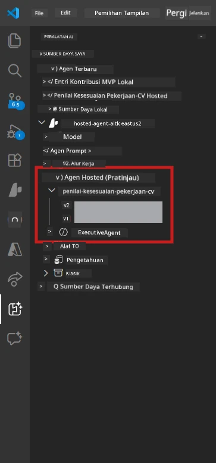

# Modul 7 - Verifikasi di Playground

⏱️ ~10 menit

Dalam modul ini, Anda menguji alur kerja multi-agent yang telah diterapkan di VS Code dan Foundry Portal, memastikan agen berperilaku sama seperti saat pengujian lokal.

---

## Mengapa menguji lagi setelah diterapkan?

Lingkungan hosting berbeda dari lokal dalam beberapa cara penting:

| | Lokal | Hosting |
|--|-------|--------|
| **Identitas** | Masuk pribadi Anda (`DefaultAzureCredential`) | Identitas Entra khusus per agen (otomatis disediakan saat penerapan) |
| **Endpoint** | `http://localhost:8088/responses` | URL yang dikelola Foundry Agent Service |
| **Jaringan** | Mesin Anda → Azure OpenAI + MCP | Backbone Azure (latensi lebih rendah) |

Variabel lingkungan yang salah konfigurasi, masalah RBAC, atau panggilan MCP keluar yang diblokir akan muncul di sini terlebih dahulu.

---

## Opsi A: Uji di VS Code Playground (direkomendasikan pertama)

### Langkah 1: Arahkan ke agen yang dihosting

1. Klik ikon **Foundry Toolkit** di Bilah Aktivitas.
2. Perluas proyek Anda → **Hosted Agents (Preview)** → temukan agen Anda.



### Langkah 2: Pilih versi

1. Klik agen untuk membuka versinya.
2. Klik `v1` → verifikasi statusnya **aktif** (bilah sisi mungkin menampilkan "Running" atau "Started" - keduanya menunjukkan status siap yang sama).

### Langkah 3: Buka Playground

1. Klik **Playground** (atau klik kanan versi → **Open in Playground**).
2. Jendela obrolan terbuka di tab VS Code.

### Langkah 4: Jalankan pengujian awal Anda

Gunakan ketiga pengujian yang sama dari [Modul 5](05-test-locally.md). Ketik setiap pesan di kotak input Playground dan tekan **Kirim** (atau **Enter**).

#### Pengujian 1 - Resume lengkap + JD (alur standar)

Tempel prompt resume lengkap + JD dari Modul 5, Pengujian 1 (Jane Doe + Senior Cloud Engineer di Contoso Ltd).

**Ekspektasi:**
- Skor kecocokan dengan perhitungan terperinci (skala 100 poin)
- Bagian Keterampilan yang Cocok
- Bagian Keterampilan yang Hilang
- **Satu kartu kekurangan per keterampilan yang hilang** dengan URL Microsoft Learn
- Peta jalan pembelajaran dengan garis waktu

#### Pengujian 2 - Tes cepat singkat (input minimal)

```
RESUME: 3 years Python developer, knows Django and PostgreSQL, no cloud experience.

JOB: Cloud DevOps Engineer requiring AWS, Kubernetes, Terraform, CI/CD. 5 years needed.
```

**Ekspektasi:**
- Skor kecocokan lebih rendah (< 40)
- Penilaian jujur dengan jalur pembelajaran bertahap
- Beberapa kartu kekurangan (AWS, Kubernetes, Terraform, CI/CD, kekurangan pengalaman)

#### Pengujian 3 - Kandidat cocok tinggi

```
RESUME:
10 years Azure Cloud Architect. AZ-305 certified. Expert in AKS, Terraform, Azure DevOps, 
Azure Functions, Helm, Prometheus, Grafana, Python, Go. Led platform team of 8.

JOB:
Senior Cloud Engineer. Required: AKS, Terraform, Azure DevOps, Python. Preferred: Helm, Go.
5+ years experience. AZ-305 preferred.
```

**Ekspektasi:**
- Skor kecocokan tinggi (≥ 80)
- Fokus pada kesiapan wawancara dan penyempurnaan
- Sedikit atau tanpa kartu kekurangan
- Garis waktu pendek fokus pada persiapan

### Langkah 5: Bandingkan dengan hasil lokal

Buka catatan atau tab browser dari Modul 5 tempat Anda menyimpan respons lokal. Untuk setiap pengujian:

- Apakah respons memiliki **struktur yang sama** (skor kecocokan, kartu kekurangan, peta jalan)?
- Apakah mengikuti **rubrik penilaian yang sama** (rincian 100 poin)?
- Apakah **URL Microsoft Learn** masih ada dalam kartu kekurangan?
- Apakah ada **satu kartu kekurangan per keterampilan yang hilang** (tidak terpotong)?

> **Perbedaan kata minor itu normal** - model tidak deterministik. Fokus pada struktur, konsistensi skor, dan penggunaan alat MCP.

---

## Opsi B: Uji di Foundry Portal

[Foundry Portal](https://ai.azure.com) menyediakan playground berbasis web yang berguna untuk berbagi dengan rekan atau pemangku kepentingan.

### Langkah 1: Buka Foundry Portal

1. Buka browser Anda dan navigasikan ke [https://ai.azure.com](https://ai.azure.com).
2. Masuk dengan akun Azure yang sama yang Anda gunakan selama workshop.

### Langkah 2: Arahkan ke proyek Anda

1. Di halaman beranda, cari **Recent projects** di bilah sisi kiri.
2. Klik nama proyek Anda (misalnya, `workshop-agents`).
3. Jika tidak terlihat, klik **All projects** dan cari.

### Langkah 3: Temukan agen yang diterapkan

1. Di navigasi kiri proyek, klik **Build** → **Agents** (atau cari bagian **Agents**).
2. Anda akan melihat daftar agen. Temukan agen yang dipasang (misalnya, `resume-job-fit-evaluator`).
3. Klik nama agen untuk membuka halaman detailnya.

### Langkah 4: Buka Playground

1. Di halaman detail agen, lihat bilah alat atas.
2. Klik **Open in playground** (atau **Try in playground**).
3. Antarmuka obrolan terbuka.

### Langkah 5: Jalankan pengujian awal yang sama

Ulangi ketiga pengujian dari bagian VS Code Playground di atas. Bandingkan setiap respons dengan hasil lokal (Modul 5) dan hasil VS Code Playground (Opsi A di atas).

---

## Verifikasi khusus multi-agent

Selain kebenaran dasar, verifikasi perilaku khusus multi-agent ini:

### Eksekusi alat MCP

| Periksa | Cara verifikasi | Kondisi lolos |
|-------|---------------|-------------|
| Panggilan MCP berhasil | Kartu kekurangan mengandung URL `learn.microsoft.com` | URL asli, bukan pesan fallback |
| Beberapa panggilan MCP | Setiap kekurangan prioritas Tinggi/Sedang memiliki sumber daya | Bukan hanya kartu kekurangan pertama |
| Fallback MCP berfungsi | Jika URL hilang, periksa teks fallback | Agen masih menghasilkan kartu kekurangan (dengan atau tanpa URL) |

### Koordinasi agen

| Periksa | Cara verifikasi | Kondisi lolos |
|-------|---------------|-------------|
| Semua 4 agen berjalan | Output mengandung skor kecocokan DAN kartu kekurangan | Skor dari MatchingAgent, kartu dari GapAnalyzer |
| Eksekusi berurutan | Waktu respons masuk akal (< 2 menit) | Jika > 3 menit, periksa kesalahan di log terminal |
| Integritas alur data | Kartu kekurangan merujuk keterampilan dari laporan pencocokan | Tidak ada keterampilan halusinasi yang bukan di JD |

---

## Rubrik validasi

Gunakan rubrik ini untuk menilai perilaku hosting alur kerja multi-agent Anda:

| # | Kriteria | Kondisi lolos | Lolos? |
|---|----------|-------------|--------|
| 1 | **Kebenaran fungsional** | Agen merespons resume + JD dengan skor kecocokan dan analisis kekurangan | |
| 2 | **Konsistensi penilaian** | Skor kecocokan menggunakan skala 100 poin dengan perhitungan terperinci | |
| 3 | **Kelengkapan kartu kekurangan** | Satu kartu per keterampilan yang hilang (tidak terpotong atau digabung) | |
| 4 | **Integrasi alat MCP** | Kartu kekurangan menyertakan URL Microsoft Learn asli | |
| 5 | **Konsistensi struktur** | Struktur output cocok antara running lokal dan hosting | |
| 6 | **Waktu respons** | Agen hosting merespons dalam 2 menit untuk penilaian lengkap | |
| 7 | **Tanpa kesalahan** | Tidak ada kesalahan HTTP 500, habis waktu, atau respons kosong | |

> "Lulus" berarti semua 7 kriteria terpenuhi untuk semua 3 pengujian awal di setidaknya satu playground (VS Code atau Portal).

---

## Pemecahan masalah masalah playground

| Gejala | Penyebab kemungkinan | Perbaikan |
|---------|------------------|---------|
| Playground tidak dimuat | Kontainer tidak dalam status `active` | Kembali ke [Modul 6](06-deploy-to-foundry.md), verifikasi status penerapan. Tunggu jika `creating` |
| Agen mengembalikan respons kosong | Nama penerapan model tidak cocok | Periksa `agent.yaml` → `environment_variables` → `AZURE_AI_MODEL_DEPLOYMENT_NAME` cocok dengan model yang diterapkan |
| Agen mengembalikan pesan kesalahan | Izin [RBAC](https://learn.microsoft.com/azure/foundry/concepts/rbac-foundry) hilang | Tetapkan **[Foundry User](https://aka.ms/foundry-ext-project-role)** (sebelumnya Azure AI User) pada lingkup proyek |
| Tidak ada URL Microsoft Learn di kartu kekurangan | MCP keluar diblokir atau server MCP tidak tersedia | Periksa apakah kontainer dapat mengakses `learn.microsoft.com`. Lihat [Modul 8](08-troubleshooting.md) |
| Hanya 1 kartu kekurangan (terpotong) | Instruksi GapAnalyzer tidak menyertakan blok "CRITICAL" | Tinjau [Modul 3, Langkah 2.4](03-configure-agents.md) |
| Skor kecocokan sangat berbeda dari lokal | Model atau instruksi berbeda diterapkan | Bandingkan env var `agent.yaml` dengan `.env` lokal. Terapkan ulang jika perlu |
| "Agen tidak ditemukan" di Portal | Penerapan masih dalam propagasi atau gagal | Tunggu 2 menit, segarkan. Jika masih hilang, terapkan ulang dari [Modul 6](06-deploy-to-foundry.md) |

---

### Titik pemeriksaan

- [ ] Menguji agen di VS Code Playground - semua 3 pengujian awal lulus
- [ ] Menguji agen di Playground [Foundry Portal](https://ai.azure.com) - semua 3 pengujian awal lulus
- [ ] Respons konsisten secara struktural dengan pengujian lokal (skor kecocokan, kartu kekurangan, peta jalan)
- [ ] URL Microsoft Learn ada dalam kartu kekurangan (alat MCP bekerja di lingkungan hosting)
- [ ] Satu kartu kekurangan per keterampilan yang hilang (tidak ada pemotongan)
- [ ] Tidak ada kesalahan atau habis waktu selama pengujian
- [ ] Menyelesaikan rubrik validasi (semua 7 kriteria lolos)

---

**Sebelumnya:** [06 - Deploy to Foundry](06-deploy-to-foundry.md) · **Selanjutnya:** [08 - Pemecahan Masalah →](08-troubleshooting.md)

---

<!-- CO-OP TRANSLATOR DISCLAIMER START -->
**Penafian**:
Dokumen ini telah diterjemahkan menggunakan layanan terjemahan AI [Co-op Translator](https://github.com/Azure/co-op-translator). Meskipun kami berupaya untuk mencapai akurasi, harap diketahui bahwa terjemahan otomatis mungkin mengandung kesalahan atau ketidakakuratan. Dokumen asli dalam bahasa aslinya harus dianggap sebagai sumber yang sah. Untuk informasi penting, disarankan menggunakan terjemahan profesional oleh manusia. Kami tidak bertanggung jawab atas kesalahpahaman atau penafsiran yang keliru yang timbul dari penggunaan terjemahan ini.
<!-- CO-OP TRANSLATOR DISCLAIMER END -->