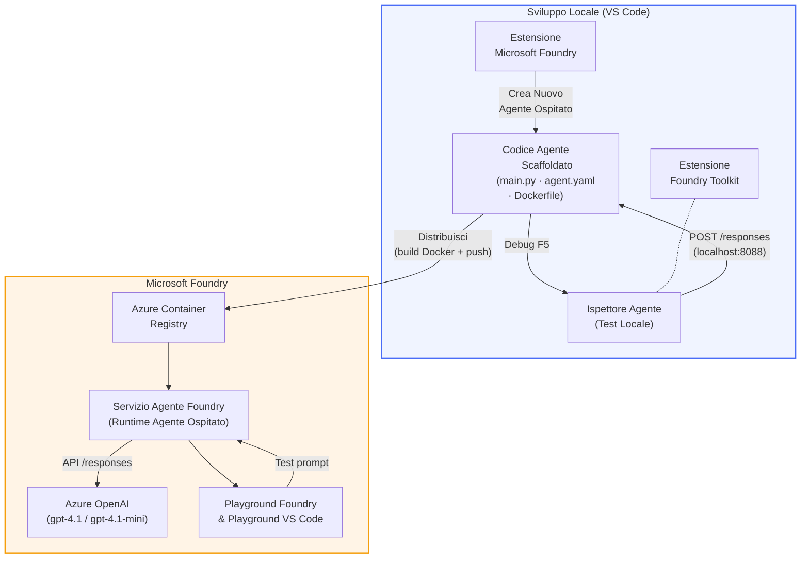

# Foundry Toolkit + Laboratorio Agenti Hosted Foundry

[](https://www.python.org/)
[](https://github.com/microsoft/agents)
[](https://learn.microsoft.com/azure/ai-foundry/agents/concepts/hosted-agents/)
[](https://ai.azure.com/)
[](https://learn.microsoft.com/azure/ai-services/openai/)
[](https://learn.microsoft.com/cli/azure/install-azure-cli)
[](https://learn.microsoft.com/azure/developer/azure-developer-cli/install-azd)
[](https://www.docker.com/)
[](https://marketplace.visualstudio.com/items?itemName=ms-windows-ai-studio.windows-ai-studio)
[](LICENSE)

Crea, testa e distribuisci agenti AI al **Microsoft Foundry Agent Service** come **Hosted Agents** - interamente da VS Code utilizzando l'**estensione Microsoft Foundry** e il **Foundry Toolkit**.

> **Gli Hosted Agents sono attualmente in anteprima.** Le regioni supportate sono limitate - vedi [disponibilità delle regioni](https://learn.microsoft.com/azure/foundry/agents/concepts/hosted-agents#region-availability).

> La cartella `agent/` all’interno di ogni laboratorio viene **generata automaticamente** dall’estensione Foundry - poi personalizzi il codice, testi in locale e distribuisci.

<!-- CO-OP TRANSLATOR LANGUAGES TABLE START -->
[Arabic](../ar/README.md) | [Bengali](../bn/README.md) | [Bulgarian](../bg/README.md) | [Burmese (Myanmar)](../my/README.md) | [Chinese (Simplified)](../zh-CN/README.md) | [Chinese (Traditional, Hong Kong)](../zh-HK/README.md) | [Chinese (Traditional, Macau)](../zh-MO/README.md) | [Chinese (Traditional, Taiwan)](../zh-TW/README.md) | [Croatian](../hr/README.md) | [Czech](../cs/README.md) | [Danish](../da/README.md) | [Dutch](../nl/README.md) | [Estonian](../et/README.md) | [Finnish](../fi/README.md) | [French](../fr/README.md) | [German](../de/README.md) | [Greek](../el/README.md) | [Hebrew](../he/README.md) | [Hindi](../hi/README.md) | [Hungarian](../hu/README.md) | [Indonesian](../id/README.md) | [Italian](./README.md) | [Japanese](../ja/README.md) | [Kannada](../kn/README.md) | [Khmer](../km/README.md) | [Korean](../ko/README.md) | [Lithuanian](../lt/README.md) | [Malay](../ms/README.md) | [Malayalam](../ml/README.md) | [Marathi](../mr/README.md) | [Nepali](../ne/README.md) | [Nigerian Pidgin](../pcm/README.md) | [Norwegian](../no/README.md) | [Persian (Farsi)](../fa/README.md) | [Polish](../pl/README.md) | [Portuguese (Brazil)](../pt-BR/README.md) | [Portuguese (Portugal)](../pt-PT/README.md) | [Punjabi (Gurmukhi)](../pa/README.md) | [Romanian](../ro/README.md) | [Russian](../ru/README.md) | [Serbian (Cyrillic)](../sr/README.md) | [Slovak](../sk/README.md) | [Slovenian](../sl/README.md) | [Spanish](../es/README.md) | [Swahili](../sw/README.md) | [Swedish](../sv/README.md) | [Tagalog (Filipino)](../tl/README.md) | [Tamil](../ta/README.md) | [Telugu](../te/README.md) | [Thai](../th/README.md) | [Turkish](../tr/README.md) | [Ukrainian](../uk/README.md) | [Urdu](../ur/README.md) | [Vietnamese](../vi/README.md)

> **Preferisci Clonare Localmente?**
>
> Questo repository include oltre 50 traduzioni linguistiche che aumentano significativamente la dimensione del download. Per clonare senza le traduzioni, usa sparse checkout:
>
> **Bash / macOS / Linux:**
> ```bash
> git clone --filter=blob:none --sparse https://github.com/microsoft-foundry/Foundry_Toolkit_for_VSCode_Lab.git
> cd Foundry_Toolkit_for_VSCode_Lab
> git sparse-checkout set --no-cone '/*' '!translations' '!translated_images'
> ```
>
> **CMD (Windows):**
> ```cmd
> git clone --filter=blob:none --sparse https://github.com/microsoft-foundry/Foundry_Toolkit_for_VSCode_Lab.git
> cd Foundry_Toolkit_for_VSCode_Lab
> git sparse-checkout set --no-cone "/*" "!translations" "!translated_images"
> ```
>
> Così hai tutto il necessario per completare il corso con un download molto più veloce.
<!-- CO-OP TRANSLATOR LANGUAGES TABLE END -->

---

## Architettura


**Flusso:** l’estensione Foundry genera lo scheletro dell’agente → personalizzi codice e istruzioni → testi localmente con Agent Inspector → distribuisci su Foundry (immagine Docker inviata ad ACR) → verifichi in Playground.

---

## Cosa costruirai

| Laboratorio | Descrizione | Stato |
|-----|-------------|--------|
| **Lab 01 - Singolo Agente** | Costruisci l’Agente **"Spiega Come Se Fosse Un Dirigente"**, testalo localmente e distribuiscilo su Foundry | ✅ Disponibile |
| **Lab 02 - Flusso Multi-Agente** | Costruisci il **"Valutatore CV → Adattamento al Lavoro"** - 4 agenti collaborano per valutare l’idoneità del CV e generare una roadmap di apprendimento | ✅ Disponibile |

---

## Incontra l’Agente Dirigente

In questo laboratorio costruirai l’Agente **"Spiega Come Se Fosse Un Dirigente"** - un agente AI che prende termini tecnici complessi e li traduce in riassunti calmi, pronti per il consiglio di amministrazione. Perché siamo onesti, nessuno nel C-suite vuole sentire parlare di "esaurimento del thread pool causato da chiamate sincrone introdotte in v3.2."

Ho creato questo agente dopo un numero eccessivo di incidenti in cui il mio post-mortem perfettamente scritto riceveva la risposta: *"Quindi... il sito è giù oppure no?"*

### Come funziona

Gli dai un aggiornamento tecnico. Ti restituisce un sommario per dirigenti - tre punti chiave, niente gergo, niente tracce di stack, niente panico esistenziale. Solo **cosa è successo**, **impatto sul business**, e **prossimo passo**.

### Vedi come funziona

**Tu dici:**
> "La latenza API è aumentata a causa dell’esaurimento del thread pool dovuto a chiamate sincrone introdotte in v3.2."

**L’agente risponde:**

> **Sommario per dirigenti:**
> - **Cosa è successo:** Dopo l’ultima versione, il sistema ha rallentato.
> - **Impatto sul business:** Alcuni utenti hanno sperimentato ritardi nell’uso del servizio.
> - **Prossimo passo:** La modifica è stata annullata e si sta preparando una correzione prima di ridistribuire.

### Perché questo agente?

È un agente semplice, monocompito - perfetto per imparare il flusso di lavoro degli hosted agent dall’inizio alla fine senza complicazioni complesse nella catena di strumenti. E onestamente? Ogni team di ingegneri potrebbe usarne uno così.

---

## Struttura del laboratorio

```
📂 Foundry_Toolkit_for_VSCode_Lab/
├── 📄 README.md                      ← You are here
├── 📂 ExecutiveAgent/                ← Standalone hosted agent project
│   ├── agent.yaml
│   ├── Dockerfile
│   ├── main.py
│   └── requirements.txt
└── 📂 workshop/
    ├── 📂 lab01-single-agent/        ← Full lab: docs + agent code
    │   ├── README.md                 ← Hands-on lab instructions
    │   ├── 📂 docs/                  ← Step-by-step tutorial modules
    │   │   ├── 00-prerequisites.md
    │   │   ├── 01-install-foundry-toolkit.md
    │   │   ├── 02-create-foundry-project.md
    │   │   ├── 03-create-hosted-agent.md
    │   │   ├── 04-configure-and-code.md
    │   │   ├── 05-test-locally.md
    │   │   ├── 06-deploy-to-foundry.md
    │   │   ├── 07-verify-in-playground.md
    │   │   └── 08-troubleshooting.md
    │   └── 📂 agent/                 ← Reference solution (auto-scaffolded by Foundry extension)
    │       ├── agent.yaml
    │       ├── Dockerfile
    │       ├── main.py
    │       └── requirements.txt
    └── 📂 lab02-multi-agent/         ← Resume → Job Fit Evaluator
        ├── README.md                 ← Hands-on lab instructions (end-to-end)
        ├── 📂 docs/                  ← Step-by-step tutorial modules
        │   ├── 00-prerequisites.md
        │   ├── 01-understand-multi-agent.md
        │   ├── 02-scaffold-multi-agent.md
        │   ├── 03-configure-agents.md
        │   ├── 04-orchestration-patterns.md
        │   ├── 05-test-locally.md
        │   ├── 06-deploy-to-foundry.md
        │   ├── 07-verify-in-playground.md
        │   └── 08-troubleshooting.md
        └── 📂 PersonalCareerCopilot/ ← Reference solution (multi-agent workflow)
            ├── agent.yaml
            ├── Dockerfile
            ├── main.py
            └── requirements.txt
```

> **Nota:** La cartella `agent/` all’interno di ogni laboratorio è ciò che genera l’**estensione Microsoft Foundry** quando esegui `Microsoft Foundry: Create a New Hosted Agent` dalla Command Palette. I file vengono poi personalizzati con le istruzioni, gli strumenti e la configurazione del tuo agente. Il Lab 01 ti guida a ricreare questo da zero.

---

## Iniziare

### 1. Clona il repository

```bash
git clone https://github.com/microsoft-foundry/Foundry_Toolkit_for_VSCode_Lab.git
cd Foundry_Toolkit_for_VSCode_Lab
```

### 2. Configura un ambiente virtuale Python

```bash
python -m venv venv
```

Attivalo:

- **Windows (PowerShell):**
  ```powershell
  .\venv\Scripts\Activate.ps1
  ```
- **macOS / Linux:**
  ```bash
  source venv/bin/activate
  ```

### 3. Installa le dipendenze

```bash
pip install -r workshop/lab01-single-agent/agent/requirements.txt
```

### 4. Configura le variabili d’ambiente

Copia il file esempio `.env` dentro la cartella agent e compila i tuoi valori:

```bash
cp workshop/lab01-single-agent/agent/.env.example workshop/lab01-single-agent/agent/.env
```

Modifica `workshop/lab01-single-agent/agent/.env`:

```env
AZURE_AI_PROJECT_ENDPOINT=https://<your-account>.services.ai.azure.com/api/projects/<your-project>
MODEL_DEPLOYMENT_NAME=<your-model-deployment-name>
```

### 5. Segui i laboratori

Ogni laboratorio è autonomo con i suoi moduli. Inizia con **Lab 01** per imparare le basi, poi passa a **Lab 02** per flussi multi-agente.

#### Lab 01 - Singolo Agente ([istruzioni complete](workshop/lab01-single-agent/README.md))

| # | Modulo | Link |
|---|--------|------|
| 1 | Leggi i prerequisiti | [00-prerequisites.md](workshop/lab01-single-agent/docs/00-prerequisites.md) |
| 2 | Installa Foundry Toolkit & estensione Foundry | [01-install-foundry-toolkit.md](workshop/lab01-single-agent/docs/01-install-foundry-toolkit.md) |
| 3 | Crea un progetto Foundry | [02-create-foundry-project.md](workshop/lab01-single-agent/docs/02-create-foundry-project.md) |
| 4 | Crea un agente hosted | [03-create-hosted-agent.md](workshop/lab01-single-agent/docs/03-create-hosted-agent.md) |
| 5 | Configura istruzioni & ambiente | [04-configure-and-code.md](workshop/lab01-single-agent/docs/04-configure-and-code.md) |
| 6 | Testa localmente | [05-test-locally.md](workshop/lab01-single-agent/docs/05-test-locally.md) |
| 7 | Distribuisci su Foundry | [06-deploy-to-foundry.md](workshop/lab01-single-agent/docs/06-deploy-to-foundry.md) |
| 8 | Verifica in playground | [07-verify-in-playground.md](workshop/lab01-single-agent/docs/07-verify-in-playground.md) |
| 9 | Risoluzione problemi | [08-troubleshooting.md](workshop/lab01-single-agent/docs/08-troubleshooting.md) |

#### Lab 02 - Flusso Multi-Agente ([istruzioni complete](workshop/lab02-multi-agent/README.md))

| # | Modulo | Link |
|---|--------|------|
| 1 | Prerequisiti (Lab 02) | [00-prerequisites.md](workshop/lab02-multi-agent/docs/00-prerequisites.md) |
| 2 | Comprendere l’architettura multi-agente | [01-understand-multi-agent.md](workshop/lab02-multi-agent/docs/01-understand-multi-agent.md) |
| 3 | Genera il progetto multi-agente | [02-scaffold-multi-agent.md](workshop/lab02-multi-agent/docs/02-scaffold-multi-agent.md) |
| 4 | Configura agenti & ambiente | [03-configure-agents.md](workshop/lab02-multi-agent/docs/03-configure-agents.md) |
| 5 | Pattern di orchestrazione | [04-orchestration-patterns.md](workshop/lab02-multi-agent/docs/04-orchestration-patterns.md) |
| 6 | Testa localmente (multi-agente) | [05-test-locally.md](workshop/lab02-multi-agent/docs/05-test-locally.md) |
| 7 | Distribuire su Foundry | [06-deploy-to-foundry.md](workshop/lab02-multi-agent/docs/06-deploy-to-foundry.md) |
| 8 | Verificare nel playground | [07-verify-in-playground.md](workshop/lab02-multi-agent/docs/07-verify-in-playground.md) |
| 9 | Risoluzione problemi (multi-agente) | [08-troubleshooting.md](workshop/lab02-multi-agent/docs/08-troubleshooting.md) |

---

## Manutentore

<table>
<tr>
    <td align="center"><a href="https://github.com/ShivamGoyal03">
        <br />
        <sub><b>Shivam Goyal</b></sub>
    </a><br />
    </td>
</tr>
</table>

---

## Permessi richiesti (riferimento rapido)

| Scenario | Ruoli richiesti |
|----------|-----------------|
| Creare un nuovo progetto Foundry | **Proprietario Azure AI** sulla risorsa Foundry |
| Distribuire su progetto esistente (nuove risorse) | **Proprietario Azure AI** + **Collaboratore** sulla sottoscrizione |
| Distribuire su progetto completamente configurato | **Lettore** sull'account + **Utente Azure AI** sul progetto |

> **Importante:** I ruoli Azure `Proprietario` e `Collaboratore` includono solo i permessi di *gestione*, non quelli di *sviluppo* (azioni sui dati). È necessario essere **Utente Azure AI** o **Proprietario Azure AI** per creare e distribuire agenti.

---

## Riferimenti

- [Guida rapida: distribuisci il tuo primo agente ospitato (VS Code)](https://learn.microsoft.com/azure/foundry/agents/quickstarts/quickstart-hosted-agent)
- [Che cosa sono gli agenti ospitati?](https://learn.microsoft.com/azure/foundry/agents/concepts/hosted-agents)
- [Creare flussi di lavoro per agenti ospitati in VS Code](https://learn.microsoft.com/azure/foundry/agents/how-to/vs-code-agents-workflow-pro-code)
- [Distribuire un agente ospitato](https://learn.microsoft.com/azure/foundry/agents/how-to/deploy-hosted-agent)
- [RBAC per Microsoft Foundry](https://learn.microsoft.com/azure/foundry/concepts/rbac-foundry)
- [Esempio agente Architettura Review](https://github.com/Azure-Samples/agent-architecture-review-sample) - Agente ospitato reale con strumenti MCP, diagrammi Excalidraw e doppia distribuzione

---

## Licenza

[MIT](../../LICENSE)

---

<!-- CO-OP TRANSLATOR DISCLAIMER START -->
**Disclaimer**:  
Questo documento è stato tradotto utilizzando il servizio di traduzione AI [Co-op Translator](https://github.com/Azure/co-op-translator). Pur impegnandoci per l'accuratezza, si prega di notare che le traduzioni automatizzate possono contenere errori o imprecisioni. Il documento originale nella sua lingua originaria deve essere considerato la fonte autorevole. Per informazioni critiche, si consiglia la traduzione professionale umana. Non siamo responsabili per eventuali malintesi o interpretazioni errate derivanti dall'uso di questa traduzione.
<!-- CO-OP TRANSLATOR DISCLAIMER END -->