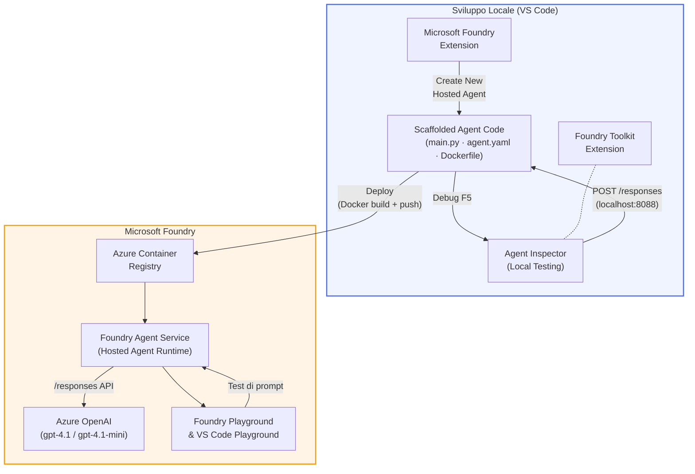

# Foundry Toolkit + Laboratorio Agenti Hosted Foundry

[](https://www.python.org/)
[](https://github.com/microsoft/agents)
[](https://learn.microsoft.com/azure/foundry/agents/concepts/hosted-agents)
[](https://ai.azure.com/)
[](https://learn.microsoft.com/azure/ai-services/openai/)
[](https://learn.microsoft.com/cli/azure/install-azure-cli)
[](https://learn.microsoft.com/azure/developer/azure-developer-cli/install-azd)
[](https://www.docker.com/)
[](https://marketplace.visualstudio.com/items?itemName=ms-windows-ai-studio.windows-ai-studio)
[](LICENSE)

Costruisci, testa e distribuisci agenti AI su **Microsoft Foundry Agent Service** come **Hosted Agents** - interamente da VS Code usando l'**estensione Microsoft Foundry** e il **Foundry Toolkit**.

> **Hosted Agents sono attualmente in anteprima.** Le regioni supportate sono limitate - vedi [disponibilità regionale](https://learn.microsoft.com/azure/foundry/agents/concepts/hosted-agents#region-availability).

> La cartella `agent/` all’interno di ogni laboratorio è **generata automaticamente** dall’estensione Foundry - poi personalizzi il codice, testi localmente, e distribuisci.

### 🌐 Supporto Multilingue

#### Supportato tramite GitHub Action (Automatizzato & Sempre Aggiornato)

<!-- CO-OP TRANSLATOR LANGUAGES TABLE START -->
[Arabo](../ar/README.md) | [Bengalese](../bn/README.md) | [Bulgare](../bg/README.md) | [Birmano (Myanmar)](../my/README.md) | [Cinese (Semplificato)](../zh-CN/README.md) | [Cinese (Tradizionale, Hong Kong)](../zh-HK/README.md) | [Cinese (Tradizionale, Macao)](../zh-MO/README.md) | [Cinese (Tradizionale, Taiwan)](../zh-TW/README.md) | [Croato](../hr/README.md) | [Ceco](../cs/README.md) | [Danese](../da/README.md) | [Olandese](../nl/README.md) | [Estone](../et/README.md) | [Finlandese](../fi/README.md) | [Francese](../fr/README.md) | [Tedesco](../de/README.md) | [Greco](../el/README.md) | [Ebraico](../he/README.md) | [Hindi](../hi/README.md) | [Ungherese](../hu/README.md) | [Indonesiano](../id/README.md) | [Italiano](./README.md) | [Giapponese](../ja/README.md) | [Kannada](../kn/README.md) | [Khmer](../km/README.md) | [Coreano](../ko/README.md) | [Lituano](../lt/README.md) | [Malese](../ms/README.md) | [Malayalam](../ml/README.md) | [Marathi](../mr/README.md) | [Nepalese](../ne/README.md) | [Pidgin Nigeriano](../pcm/README.md) | [Norvegese](../no/README.md) | [Persiano (Farsi)](../fa/README.md) | [Polacco](../pl/README.md) | [Portoghese (Brasile)](../pt-BR/README.md) | [Portoghese (Portogallo)](../pt-PT/README.md) | [Punjabi (Gurmukhi)](../pa/README.md) | [Rumeno](../ro/README.md) | [Russo](../ru/README.md) | [Serbo (Cirillico)](../sr/README.md) | [Slovacco](../sk/README.md) | [Sloveno](../sl/README.md) | [Spagnolo](../es/README.md) | [Swahili](../sw/README.md) | [Svedese](../sv/README.md) | [Tagalog (Filippino)](../tl/README.md) | [Tamil](../ta/README.md) | [Telugu](../te/README.md) | [Thai](../th/README.md) | [Turco](../tr/README.md) | [Ucraino](../uk/README.md) | [Urdu](../ur/README.md) | [Vietnamita](../vi/README.md)

> **Preferisci clonare localmente?**
>
> Questo repository include oltre 50 traduzioni che aumentano significativamente la dimensione del download. Per clonare senza traduzioni, usa sparse checkout:
>
> **Bash / macOS / Linux:**
> ```bash
> git clone --filter=blob:none --sparse https://github.com/microsoft-foundry/Foundry_Toolkit_for_VSCode_Lab.git
> cd Foundry_Toolkit_for_VSCode_Lab
> git sparse-checkout set --no-cone '/*' '!translations' '!translated_images'
> ```
>
> **CMD (Windows):**
> ```cmd
> git clone --filter=blob:none --sparse https://github.com/microsoft-foundry/Foundry_Toolkit_for_VSCode_Lab.git
> cd Foundry_Toolkit_for_VSCode_Lab
> git sparse-checkout set --no-cone "/*" "!translations" "!translated_images"
> ```
>
> Questo ti dà tutto il necessario per completare il corso con un download molto più veloce.
<!-- CO-OP TRANSLATOR LANGUAGES TABLE END -->

---

## Architettura


```mermaid
flowchart TB
    subgraph Local["Sviluppo Locale (VS Code)"]
        direction TB
        FE["Microsoft Foundry
        Extension"]
        FoundryToolkit["Foundry Toolkit
        Extension"]
        Scaffold["Scaffolded Agent Code
        (main.py · agent.yaml · Dockerfile)"]
        Inspector["Agent Inspector
        (Local Testing)"]
        FE -- "Create New
        Hosted Agent" --> Scaffold
        Scaffold -- "Debug F5" --> Inspector
        FoundryToolkit -.- Inspector
    end

    subgraph Cloud["Microsoft Foundry"]
        direction TB
        ACR["Azure Container
        Registry"]
        AgentService["Foundry Agent Service
        (Hosted Agent Runtime)"]
        Model["Azure OpenAI
        (gpt-4.1 / gpt-4.1-mini)"]
        Playground["Foundry Playground
        & VS Code Playground"]
        ACR --> AgentService
        AgentService -- "/responses API" --> Model
        AgentService --> Playground
    end

    Scaffold -- "Deploy
    (Docker build + push)" --> ACR
    Inspector -- "POST /responses
    (localhost:8088)" --> Scaffold
    Playground -- "Test di prompt" --> AgentService

    style Local fill:#f0f4ff,stroke:#4a6cf7,stroke-width:2px
    style Cloud fill:#fff4e6,stroke:#f59e0b,stroke-width:2px
```

**Flusso:** l’estensione Foundry genera l’agente → personalizzi codice e istruzioni → testi localmente con Agent Inspector → distribuisci su Foundry (immagine Docker inviata a ACR) → verifichi in Playground.

---

## Cosa costruirai

| Lab | Descrizione | Stato |
|-----|-------------|--------|
| **Lab 01 - Agente Singolo** | Costruisci l'agente **"Spiega come se fossi un dirigente"**, testalo localmente e distribuiscilo su Foundry | ✅ Disponibile |
| **Lab 02 - Workflow Multi-Agente** | Costruisci il **"Valutatore di Curriculum → Adattamento al lavoro"** - 4 agenti collaborano per valutare il curriculum e generare una roadmap formativa | ✅ Disponibile |

---

## Incontra l’Agente Dirigente

In questo laboratorio costruirai l’agente **"Spiega come se fossi un dirigente"** - un agente AI che prende gergo tecnico complicato e lo traduce in riassunti calmi e pronti per il consiglio di amministrazione. Perché, diciamocelo, nessuno nel C-suite vuole sentire parlare di "esaurimento del thread pool causato da chiamate sincrone introdotte in v3.2."

Ho creato questo agente dopo troppo frequenti incidenti in cui il mio post-mortem perfettamente scritto riceveva la risposta: *"Quindi... il sito è giù o no?"*

### Come funziona

Gli fornisci un aggiornamento tecnico. Ti restituisce un sommario esecutivo - tre punti chiave, senza gergo, senza trace di stack, senza angoscia esistenziale. Solo **cosa è successo**, **impatto sul business**, e **prossima mossa**.

### Vederlo in azione

**Tu dici:**
> "La latenza API è aumentata a causa dell’esaurimento del pool di thread dovuto a chiamate sincrone introdotte in v3.2."

**L’agente risponde:**

> **Sommario esecutivo:**
> - **Cosa è successo:** Dopo l’ultima release, il sistema ha rallentato.
> - **Impatto sul business:** Alcuni utenti hanno sperimentato ritardi nell’uso del servizio.
> - **Prossima mossa:** La modifica è stata annullata e una correzione è in preparazione prima della nuova distribuzione.

### Perché questo agente?

È un agente semplicissimo e a scopo unico - perfetto per imparare il workflow dell’agente hosted end-to-end senza complicazioni dovute a toolchain complesse. E onestamente? Ogni team di ingegneri potrebbe usarne uno così.

---

## Struttura del laboratorio

```
📂 Foundry_Toolkit_for_VSCode_Lab/
├── 📄 README.md                      ← You are here
└── 📂 workshop/
    ├── 📂 lab01-single-agent/        ← Full lab: docs + agent code
    │   ├── README.md                 ← Hands-on lab instructions
    │   ├── 📂 docs/                  ← Step-by-step tutorial modules
    │   │   ├── 00-prerequisites.md
    │   │   ├── 01-setup.md
    │   │   ├── 02-create-hosted-agent.md
    │   │   ├── 03-configure-and-code.md
    │   │   ├── 04-test-locally.md
    │   │   ├── 05-deploy-to-foundry.md
    │   │   ├── 06-verify-in-playground.md
    │   │   ├── 07-summary.md
    │   │   └── 08-troubleshooting.md
    │   └── 📂 agent/                 ← Reference solution (auto-scaffolded by Foundry extension)
    │       ├── agent.yaml
    │       ├── Dockerfile
    │       ├── main.py
    │       └── requirements.txt
    └── 📂 lab02-multi-agent/         ← Resume → Job Fit Evaluator
        ├── README.md                 ← Hands-on lab instructions (end-to-end)
        ├── 📂 docs/                  ← Step-by-step tutorial modules
        │   ├── 00-prerequisites.md
        │   ├── 01-understand-multi-agent.md
        │   ├── 02-scaffold-multi-agent.md
        │   ├── 03-configure-agents.md
        │   ├── 04-orchestration-patterns.md
        │   ├── 05-test-locally.md
        │   ├── 06-deploy-to-foundry.md
        │   ├── 07-verify-in-playground.md
        │   └── 08-troubleshooting.md
        └── 📂 PersonalCareerCopilot/ ← Reference solution (multi-agent workflow)
            ├── agent.yaml
            ├── Dockerfile
            ├── main.py
            └── requirements.txt
```

> **Nota:** La cartella `agent/` dentro ogni laboratorio è ciò che genera l’**estensione Microsoft Foundry** quando esegui `Microsoft Foundry: Create a New Hosted Agent` dal Command Palette. I file vengono poi personalizzati con istruzioni, strumenti e configurazione del tuo agente. Il Lab 01 ti guida nella ricreazione da zero.

---

## Inizio rapido

### 1. Clona il repository

```bash
git clone https://github.com/microsoft-foundry/Foundry_Toolkit_for_VSCode_Lab.git
cd Foundry_Toolkit_for_VSCode_Lab
```

### 2. Configura un ambiente virtuale Python

```bash
python -m venv venv
```

Attivalo:

- **Windows (PowerShell):**
  ```powershell
  .\venv\Scripts\Activate.ps1
  ```
- **macOS / Linux:**
  ```bash
  source venv/bin/activate
  ```

### 3. Installa le dipendenze

```bash
pip install -r workshop/lab01-single-agent/agent/requirements.txt
```

### 4. Configura le variabili di ambiente

Copia il file `.env` di esempio dentro la cartella agente e compila i valori:

```bash
cp workshop/lab01-single-agent/agent/.env.example workshop/lab01-single-agent/agent/.env
```

Modifica `workshop/lab01-single-agent/agent/.env`:

```env
AZURE_AI_PROJECT_ENDPOINT=https://<your-account>.services.ai.azure.com/api/projects/<your-project>
AZURE_AI_MODEL_DEPLOYMENT_NAME=<your-model-deployment-name>
```

### 5. Segui i laboratori del workshop

Ogni laboratorio è autonomo con i suoi moduli. Inizia con **Lab 01** per imparare le basi, poi passa a **Lab 02** per workflow multi-agente.

#### Lab 01 - Agente Singolo ([istruzioni complete](workshop/lab01-single-agent/README.md))

| # | Modulo | Link |
|---|--------|------|
| 1 | Leggi i prerequisiti | [00-prerequisites.md](workshop/lab01-single-agent/docs/00-prerequisites.md) |
| 2 | Installa Foundry Toolkit & estensione Foundry | [01-setup.md](workshop/lab01-single-agent/docs/01-setup.md) |
| 3 | Crea un progetto Foundry | [01-setup.md](workshop/lab01-single-agent/docs/01-setup.md) |
| 4 | Crea un agente hosted | [02-create-hosted-agent.md](workshop/lab01-single-agent/docs/02-create-hosted-agent.md) |
| 5 | Configura istruzioni & ambiente | [03-configure-and-code.md](workshop/lab01-single-agent/docs/03-configure-and-code.md) |
| 6 | Testa localmente | [04-test-locally.md](workshop/lab01-single-agent/docs/04-test-locally.md) |
| 7 | Distribuisci su Foundry | [05-deploy-to-foundry.md](workshop/lab01-single-agent/docs/05-deploy-to-foundry.md) |
| 8 | Verifica in playground | [06-verify-in-playground.md](workshop/lab01-single-agent/docs/06-verify-in-playground.md) |
| 9 | Risoluzione problemi | [08-troubleshooting.md](workshop/lab01-single-agent/docs/08-troubleshooting.md) |

#### Lab 02 - Workflow Multi-Agente ([istruzioni complete](workshop/lab02-multi-agent/README.md))

| # | Modulo | Link |
|---|--------|------|
| 1 | Prerequisiti (Lab 02) | [00-prerequisites.md](workshop/lab02-multi-agent/docs/00-prerequisites.md) |
| 2 | Comprendi l’architettura multi-agente | [01-understand-multi-agent.md](workshop/lab02-multi-agent/docs/01-understand-multi-agent.md) |
| 3 | Genera il progetto multi-agente | [02-scaffold-multi-agent.md](workshop/lab02-multi-agent/docs/02-scaffold-multi-agent.md) |
| 4 | Configura agenti & ambiente | [03-configure-agents.md](workshop/lab02-multi-agent/docs/03-configure-agents.md) |
| 5 | Schemi di orchestrazione | [04-orchestration-patterns.md](workshop/lab02-multi-agent/docs/04-orchestration-patterns.md) |
| 6 | Testa localmente (multi-agente) | [05-test-locally.md](workshop/lab02-multi-agent/docs/05-test-locally.md) |

| 7 | Distribuire su Foundry | [06-deploy-to-foundry.md](workshop/lab02-multi-agent/docs/06-deploy-to-foundry.md) |
| 8 | Verificare nel playground | [07-verify-in-playground.md](workshop/lab02-multi-agent/docs/07-verify-in-playground.md) |
| 9 | Risoluzione dei problemi (multi-agente) | [08-troubleshooting.md](workshop/lab02-multi-agent/docs/08-troubleshooting.md) |

---

## Responsabile

<table>
<tr>
    <td align="center"><a href="https://github.com/ShivamGoyal03">
        <br />
        <sub><b>Shivam Goyal</b></sub>
    </a><br />
    </td>
</tr>
</table>

---

## Permessi richiesti (riferimento rapido)

| Scenario | Ruoli richiesti |
|----------|---------------|
| Creare un nuovo progetto Foundry | **Azure AI Owner** sulla risorsa Foundry |
| Distribuire su progetto esistente (nuove risorse) | **Azure AI Owner** + **Contributor** sulla sottoscrizione |
| Distribuire su progetto completamente configurato | **Reader** sull'account + **Azure AI User** sul progetto |

> **Importante:** I ruoli Azure `Owner` e `Contributor` includono solo i permessi di *gestione*, non quelli di *sviluppo* (azione dati). Per creare e distribuire agenti serve **Azure AI User** o **Azure AI Owner**.

---

## Riferimenti

- [Avvio rapido: Distribuisci il tuo primo agente ospitato (VS Code)](https://learn.microsoft.com/azure/foundry/agents/quickstarts/quickstart-hosted-agent)
- [Cosa sono gli agenti ospitati?](https://learn.microsoft.com/azure/foundry/agents/concepts/hosted-agents)
- [Crea workflow per agenti ospitati in VS Code](https://learn.microsoft.com/azure/foundry/agents/how-to/vs-code-agents-workflow-pro-code)
- [Distribuisci un agente ospitato](https://learn.microsoft.com/azure/foundry/agents/how-to/deploy-hosted-agent)
- [RBAC per Microsoft Foundry](https://learn.microsoft.com/azure/foundry/concepts/rbac-foundry)
- [Esempio agente di revisione architettura](https://github.com/Azure-Samples/agent-architecture-review-sample) - Agente ospitato reale con strumenti MCP, diagrammi Excalidraw, e doppia distribuzione

---


## Licenza

[MIT](../../LICENSE)

---

<!-- CO-OP TRANSLATOR DISCLAIMER START -->
**Disclaimer**:
Questo documento è stato tradotto utilizzando il servizio di traduzione AI [Co-op Translator](https://github.com/Azure/co-op-translator). Sebbene ci impegniamo per garantire la precisione, si prega di notare che le traduzioni automatizzate possono contenere errori o imprecisioni. Il documento originale nella sua lingua nativa deve essere considerato la fonte autorevole. Per informazioni critiche, si raccomanda una traduzione professionale effettuata da un essere umano. Non siamo responsabili per eventuali malintesi o interpretazioni errate derivanti dall’uso di questa traduzione.
<!-- CO-OP TRANSLATOR DISCLAIMER END -->