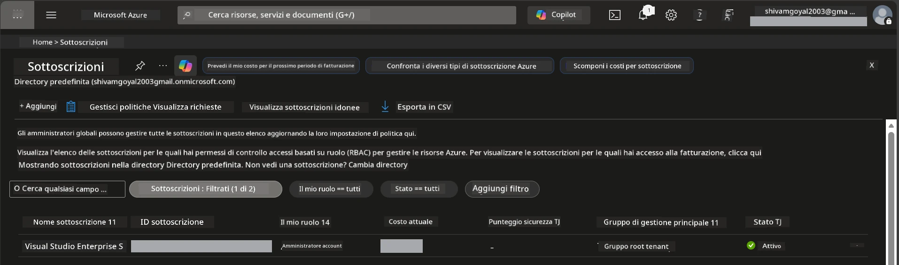

# Module 0 - Prerequisiti

Prima di iniziare il workshop, conferma di avere pronti i seguenti strumenti, accessi e ambiente. Segui ogni passaggio qui sotto - non saltare nulla.

---

## 1. Account e sottoscrizione Azure

### 1.1 Crea o verifica la tua sottoscrizione Azure

1. Apri un browser e vai su [https://azure.microsoft.com/free/](https://azure.microsoft.com/free/).
2. Se non hai un account Azure, clicca **Start free** e segui la procedura di registrazione. Ti servirà un account Microsoft (o crearne uno) e una carta di credito per la verifica dell'identità.
3. Se hai già un account, accedi su [https://portal.azure.com](https://portal.azure.com).
4. Nel Portale, clicca sul pannello **Subscriptions** nella navigazione a sinistra (o cerca "Subscriptions" nella barra di ricerca in alto).
5. Verifica di vedere almeno una sottoscrizione **Active**. Annota il **Subscription ID** - ti servirà più avanti.



### 1.2 Comprendere i ruoli RBAC richiesti

Il [Hosted Agent](https://learn.microsoft.com/azure/foundry/agents/concepts/hosted-agents) richiede permessi di **azione sui dati** che i ruoli standard Azure `Owner` e `Contributor` **non** includono. Avrai bisogno di una di queste [combinazioni di ruoli](https://learn.microsoft.com/azure/foundry/concepts/rbac-foundry#built-in-roles):

| Scenario | Ruoli richiesti | Dove assegnarli |
|----------|-----------------|-----------------|
| Creare un nuovo progetto Foundry | **Azure AI Owner** sulla risorsa Foundry | Risorsa Foundry nel Portale Azure |
| Distribuire su progetto esistente (nuove risorse) | **Azure AI Owner** + **Contributor** sulla sottoscrizione | Sottoscrizione + risorsa Foundry |
| Distribuire su progetto totalmente configurato | **Reader** sull’account + **Azure AI User** sul progetto | Account + Progetto nel Portale Azure |

> **Punto chiave:** I ruoli Azure `Owner` e `Contributor` coprono solo i permessi di *gestione* (operazioni ARM). Serve [**Azure AI User**](https://learn.microsoft.com/azure/foundry/concepts/rbac-foundry#built-in-roles) (o superiore) per le *azioni sui dati* come `agents/write` necessario per creare e distribuire agenti. Assegnerai questi ruoli in [Modulo 2](02-create-foundry-project.md).

---

## 2. Installare gli strumenti locali

Installa ognuno degli strumenti qui sotto. Dopo l’installazione, verifica che funzioni eseguendo il comando di controllo.

### 2.1 Visual Studio Code

1. Vai su [https://code.visualstudio.com/](https://code.visualstudio.com/).
2. Scarica il programma di installazione per il tuo sistema operativo (Windows/macOS/Linux).
3. Esegui l’installer con impostazioni predefinite.
4. Apri VS Code per confermare che si avvia.

### 2.2 Python 3.10+

1. Vai su [https://www.python.org/downloads/](https://www.python.org/downloads/).
2. Scarica Python 3.10 o versione successiva (consigliato 3.12+).
3. **Windows:** Durante l’installazione, seleziona **"Add Python to PATH"** nella prima schermata.
4. Apri un terminale e verifica:

   ```powershell
   python --version
   ```

   Output previsto: `Python 3.10.x` o superiore.

### 2.3 Azure CLI

1. Vai su [https://learn.microsoft.com/cli/azure/install-azure-cli](https://learn.microsoft.com/cli/azure/install-azure-cli).
2. Segui le istruzioni di installazione per il tuo sistema operativo.
3. Verifica:

   ```powershell
   az --version
   ```

   Previsto: `azure-cli 2.80.0` o superiore.

4. Accedi:

   ```powershell
   az login
   ```

### 2.4 Azure Developer CLI (azd)

1. Vai su [https://learn.microsoft.com/azure/developer/azure-developer-cli/install-azd](https://learn.microsoft.com/azure/developer/azure-developer-cli/install-azd).
2. Segui le istruzioni di installazione per il tuo sistema operativo. Su Windows:

   ```powershell
   winget install microsoft.azd
   ```

3. Verifica:

   ```powershell
   azd version
   ```

   Previsto: `azd version 1.x.x` o superiore.

4. Accedi:

   ```powershell
   azd auth login
   ```

### 2.5 Docker Desktop (opzionale)

Docker serve solo se vuoi costruire e testare localmente l’immagine del container prima della distribuzione. L’estensione Foundry gestisce automaticamente la build del container durante la distribuzione.

1. Vai su [https://docs.docker.com/get-docker/](https://docs.docker.com/get-docker/).
2. Scarica e installa Docker Desktop per il tuo sistema operativo.
3. **Windows:** Assicurati che il backend WSL 2 sia selezionato durante l’installazione.
4. Avvia Docker Desktop e attendi che l’icona nell’area di notifica mostri **"Docker Desktop is running"**.
5. Apri un terminale e verifica:

   ```powershell
   docker info
   ```

   Questo dovrebbe stampare le informazioni di sistema di Docker senza errori. Se vedi `Cannot connect to the Docker daemon`, attendi qualche secondo in più per l’avvio completo di Docker.

---

## 3. Installare le estensioni di VS Code

Ti servono tre estensioni. Installale **prima** che inizi il workshop.

### 3.1 Microsoft Foundry per VS Code

1. Apri VS Code.
2. Premi `Ctrl+Shift+X` per aprire il pannello Estensioni.
3. Nella barra di ricerca digita **"Microsoft Foundry"**.
4. Trova **Microsoft Foundry for Visual Studio Code** (editore: Microsoft, ID: `TeamsDevApp.vscode-ai-foundry`).
5. Clicca **Install**.
6. Dopo l’installazione, vedrai l’icona **Microsoft Foundry** apparire nella barra delle attività (barra laterale a sinistra).

### 3.2 Foundry Toolkit

1. Nel pannello Estensioni (`Ctrl+Shift+X`), cerca **"Foundry Toolkit"**.
2. Trova **Foundry Toolkit** (editore: Microsoft, ID: `ms-windows-ai-studio.windows-ai-studio`).
3. Clicca **Install**.
4. L’icona **Foundry Toolkit** apparirà nella barra delle attività.

### 3.3 Python

1. Nel pannello Estensioni, cerca **"Python"**.
2. Trova **Python** (editore: Microsoft, ID: `ms-python.python`).
3. Clicca **Install**.

---

## 4. Accedere ad Azure da VS Code

Il [Microsoft Agent Framework](https://learn.microsoft.com/agent-framework/overview/) utilizza [`DefaultAzureCredential`](https://learn.microsoft.com/azure/developer/python/sdk/authentication/credential-chains#defaultazurecredential-overview) per l’autenticazione. Devi essere connesso ad Azure in VS Code.

### 4.1 Accedi tramite VS Code

1. Guarda in basso a sinistra in VS Code e clicca sull’icona **Accounts** (silhouette persona).
2. Clicca **Sign in to use Microsoft Foundry** (o **Sign in with Azure**).
3. Si apre una finestra del browser: accedi con l’account Azure che ha accesso alla tua sottoscrizione.
4. Torna a VS Code. Dovresti vedere il nome account in basso a sinistra.

### 4.2 (Opzionale) Accedi tramite Azure CLI

Se hai installato Azure CLI e preferisci l’autenticazione via CLI:

```powershell
az login
```

Si apre un browser per il login. Dopo aver effettuato l’accesso, imposta la sottoscrizione corretta:

```powershell
az account set --subscription "<your-subscription-id>"
```

Verifica:

```powershell
az account show --query "{name:name, id:id, state:state}" --output table
```

Dovresti vedere il nome della tua sottoscrizione, ID e stato = `Enabled`.

### 4.3 (Alternativo) Autenticazione tramite service principal

Per CI/CD o ambienti condivisi, imposta queste variabili d’ambiente:

```powershell
$env:AZURE_TENANT_ID = "<your-tenant-id>"
$env:AZURE_CLIENT_ID = "<your-client-id>"
$env:AZURE_CLIENT_SECRET = "<your-client-secret>"
```

---

## 5. Limitazioni di anteprima

Prima di procedere, sii consapevole delle limitazioni attuali:

- Gli [**Hosted Agents**](https://learn.microsoft.com/azure/foundry/agents/concepts/hosted-agents) sono attualmente in **preview pubblica** - non consigliati per carichi di lavoro in produzione.
- Le **regioni supportate sono limitate** - controlla la [disponibilità delle regioni](https://learn.microsoft.com/azure/foundry/agents/concepts/hosted-agents#region-availability) prima di creare risorse. Se scegli una regione non supportata, la distribuzione fallirà.
- Il pacchetto `azure-ai-agentserver-agentframework` è in pre-release (`1.0.0b16`) - le API possono cambiare.
- Limiti di scala: gli hosted agent supportano da 0 a 5 repliche (incluso scale-to-zero).

---

## 6. Lista di controllo pre-volo

Verifica ogni voce qui sotto. Se qualche passaggio fallisce, torna indietro e risolvilo prima di continuare.

- [ ] VS Code si apre senza errori
- [ ] Python 3.10+ è nel tuo PATH (`python --version` stampa `3.10.x` o superiore)
- [ ] Azure CLI è installato (`az --version` stampa `2.80.0` o superiore)
- [ ] Azure Developer CLI è installato (`azd version` stampa informazioni versione)
- [ ] L’estensione Microsoft Foundry è installata (icona visibile nella barra delle attività)
- [ ] L’estensione Foundry Toolkit è installata (icona visibile nella barra delle attività)
- [ ] L’estensione Python è installata
- [ ] Sei connesso ad Azure in VS Code (controlla l’icona Accounts in basso a sinistra)
- [ ] `az account show` restituisce la tua sottoscrizione
- [ ] (Opzionale) Docker Desktop è avviato (`docker info` restituisce info di sistema senza errori)

### Punto di controllo

Apri la barra delle attività di VS Code e conferma di vedere entrambe le viste sidebar **Foundry Toolkit** e **Microsoft Foundry**. Cliccaci sopra per verificare che si aprano senza errori.

---

**Prossimo:** [01 - Installare Foundry Toolkit & Foundry Extension →](01-install-foundry-toolkit.md)

---

<!-- CO-OP TRANSLATOR DISCLAIMER START -->
**Disclaimer**:
Questo documento è stato tradotto utilizzando il servizio di traduzione AI [Co-op Translator](https://github.com/Azure/co-op-translator). Anche se ci impegniamo per l'accuratezza, ti preghiamo di essere consapevole che le traduzioni automatiche possono contenere errori o inesattezze. Il documento originale nella sua lingua natia deve essere considerato la fonte autorevole. Per informazioni critiche, si raccomanda una traduzione professionale umana. Non siamo responsabili per eventuali malintesi o interpretazioni errate derivanti dall'uso di questa traduzione.
<!-- CO-OP TRANSLATOR DISCLAIMER END -->