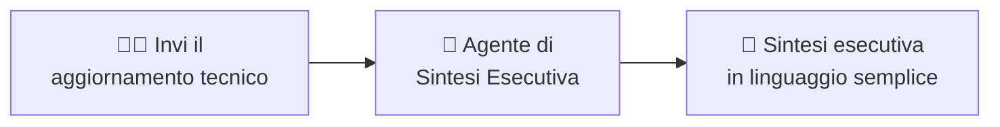

# Modulo 0 - Introduzione

⏱️ ~10 min

> [!WARNING]
> **Anteprima e limitazioni:** Gli [Hosted Agents](https://learn.microsoft.com/azure/foundry/agents/concepts/hosted-agents) sono attualmente in **anteprima pubblica** - non consigliati per carichi di lavoro in produzione. Tenete presente quanto segue:
> - **Le regioni supportate sono limitate** - verificate la [disponibilità della regione](https://learn.microsoft.com/azure/foundry/agents/concepts/hosted-agents#region-availability) prima di creare le risorse. Se scegliete una regione non supportata, il deployment fallirà.
> - Il pacchetto `azure-ai-agentserver-agentframework` è pre-release - le API potrebbero cambiare tra le versioni.
> - Limiti di scala: gli hosted agents supportano da 0 a 5 repliche (incluso scale-to-zero).
> - Alcune funzionalità mostrate in questo workshop potrebbero cambiare man mano che il servizio si avvicina alla GA.

## Cosa costruirai

In questo workshop, costruirai un agente **"Spiega come se fossi un dirigente"** - un agente AI ospitato che prende aggiornamenti tecnici complessi e li riscrive come sintetiche presentazioni in inglese semplice adatte ai dirigenti.

```mermaid
flowchart LR
    A["🧑‍💻 Invi il\naggiornamento tecnico"] --> B["🤖 Agente di\nSintesi Esecutiva"]
    B --> C["📝 Sintesi esecutiva\nin linguaggio semplice"]
```

**L'agente usa:**
- **Microsoft Agent Framework** - per la logica e la struttura dell'agente
- **Foundry Toolkit per VS Code** - per creare lo scheletro, testare localmente e distribuire
- **Un modello AI** (ad esempio, `gpt-4.1-mini/gpt-5-mini`) - per generare le sintesi

Alla fine di questo laboratorio, avrai un agente funzionante che potrai testare localmente tramite l'Agent Inspector e, opzionalmente, distribuire nel cloud.

---

## Cosa sono gli hosted agents?

Un **hosted agent** è un agente AI che viene eseguito come servizio gestito in Microsoft Foundry. Invece di gestire la tua infrastruttura, impacchetti il codice del tuo agente in un container e Foundry si occupa di scalare, ospitare e esporlo tramite un endpoint HTTP standard.

| Concetto | Cosa significa |
|---------|--------------|
| **Agente** | Il tuo codice Python che riceve un messaggio dall'utente, chiama un modello AI e restituisce una risposta strutturata |
| **Hosted** | Foundry esegue il tuo container per te - niente VM, niente Kubernetes, nessuna infrastruttura da gestire |
| **Protocollo risposte** | Una API HTTP standard (`POST /responses`) che qualsiasi client può chiamare per interagire con il tuo agente |
| **Agent Inspector** | Un'interfaccia utente per test locale (inclusa in Foundry Toolkit) che ti permette di chattare con il tuo agente prima di distribuirlo |

In questo workshop, passerai da zero a un agente completamente ospitato - oppure ti fermerai al test locale, se preferisci.

---

## Scegli il tuo percorso

> ⚠️ **Scegli un percorso prima di continuare.** La tua scelta determina quali strumenti installare e quali moduli seguire. Puoi passare dal Percorso B → Percorso A in seguito se ottieni un abbonamento.

<strong>🅰️ Percorso A - Azure cloud (richiede abbonamento Azure)</strong>

| | Dettagli |
|---|---|
| **Per chi è?** | Hai un abbonamento Azure attivo e puoi creare risorse Foundry |
| **Modello** | Azure OpenAI via Foundry (es. `gpt-4.1-mini/gpt-5-mini`) |
| **Moduli trattati** | Tutti i moduli (00–07) |
| **Distribuire sul cloud?** | ✅ Sì - distribuzione completa end-to-end |

<strong>🅱️ Percorso B - Locale / livello gratuito (non serve abbonamento Azure)</strong>

| | Dettagli |
|---|---|
| **Per chi è?** | MVP, studenti o chiunque non abbia accesso ad Azure |
| **Modello** | **Foundry Local** (gratuito, gira sulla tua macchina) |
| **Moduli trattati** | Moduli 00–04 (salta deploy e verifica cloud) |
| **Distribuire sul cloud?** | ❌ No - solo test locale tramite Agent Inspector |

---

## Tutti i percorsi: Strumenti richiesti

Installa ciascuno strumento qui sotto. Dopo l'installazione, verifica che funzioni eseguendo il comando di controllo.

| # | Strumento | Versione | Installazione | Verifica (Output atteso) |
|---|----------|----------|--------------|-------------------------|
| 1 | **Visual Studio Code** | Ultima | [code.visualstudio.com](https://code.visualstudio.com/) | Si apre senza errori |
| 2 | **Python** | 3.12 o superiore | [python.org/downloads](https://www.python.org/downloads/) | `python --version` $\rightarrow$ `Python 3.12.x` |
| 3 | **Foundry Toolkit per VS Code** | Ultima | Extension ID: `ms-windows-ai-studio.windows-ai-studio` | Icona Foundry nella barra attività |
| 4 | **Estensione Python per VS Code** | Ultima | Extension ID: `ms-python.python` | Installata nel pannello Estensioni |

> [!TIP]
> **Consigli per l'installazione:**
> - **Python PATH (Windows):** Assicurati sempre di selezionare **"Add Python to PATH"** nella prima schermata dell’installer Python. Senza questo, `python` non sarà riconosciuto nel terminale.
> - **Più versioni Python:** Se hai sia Python 3.10 che 3.12 installati, usa `python3.12 -m venv .venv` per assicurarti che la versione corretta venga usata per l’ambiente virtuale.
> - **Docker WSL 2 (Windows):** Durante l’installazione di Docker Desktop, assicurati che sia selezionato il backend **WSL 2**. Docker con Hyper-V è più lento e potrebbe causare problemi nelle build dei container Foundry.
> - **Docker non si avvia?** Attendi 30–60 secondi dopo aver lanciato Docker Desktop. Esegui `docker info` - se vedi "Cannot connect to the Docker daemon", Docker è ancora in fase di avvio.
> - **Estensioni VS Code che non si caricano?** Dopo aver installato le estensioni, ricarica la finestra: `Ctrl+Shift+P` → `Developer: Reload Window`.

> **Utenti Windows:** Controllate di scegliere **"Add Python to PATH"** durante l'installazione di Python.

**Successivo:** [01 - Setup →](01-setup.md)

---

<!-- CO-OP TRANSLATOR DISCLAIMER START -->
**Disclaimer**:
Questo documento è stato tradotto utilizzando il servizio di traduzione AI [Co-op Translator](https://github.com/Azure/co-op-translator). Sebbene ci impegniamo per garantire la precisione, si prega di notare che le traduzioni automatizzate possono contenere errori o imprecisioni. Il documento originale nella sua lingua nativa deve essere considerato la fonte autorevole. Per informazioni critiche, si raccomanda una traduzione professionale effettuata da un essere umano. Non siamo responsabili per eventuali malintesi o interpretazioni errate derivanti dall’uso di questa traduzione.
<!-- CO-OP TRANSLATOR DISCLAIMER END -->