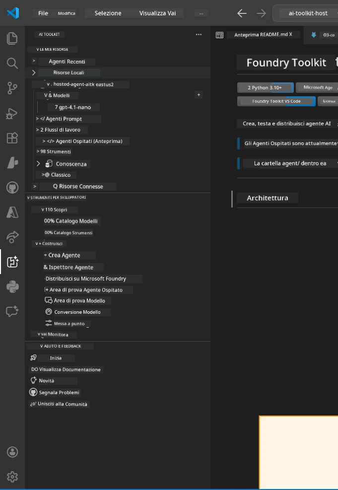
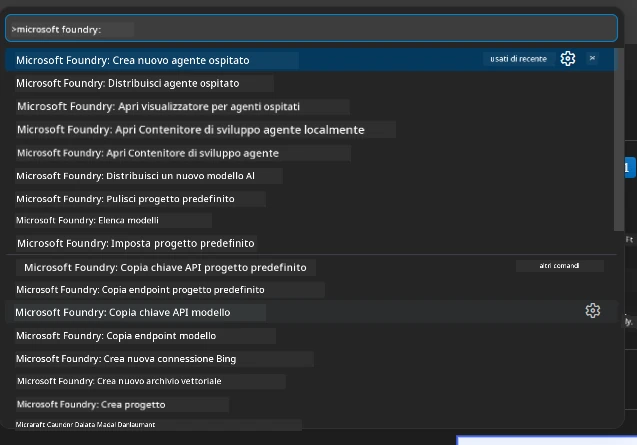

# Modulo 1 - Installare Foundry Toolkit & Estensione Foundry

Questo modulo ti guida nell'installazione e nella verifica delle due estensioni chiave di VS Code per questo laboratorio. Se le hai già installate durante il [Modulo 0](00-prerequisites.md), utilizza questo modulo per verificare che funzionino correttamente.

---

## Passo 1: Installare l'Estensione Microsoft Foundry

L'estensione **Microsoft Foundry per VS Code** è il tuo strumento principale per creare progetti Foundry, distribuire modelli, scaffolding di agenti ospitati e distribuire direttamente da VS Code.

1. Apri VS Code.
2. Premi `Ctrl+Shift+X` per aprire il pannello **Estensioni**.
3. Nella casella di ricerca in alto, digita: **Microsoft Foundry**
4. Cerca il risultato intitolato **Microsoft Foundry for Visual Studio Code**.
   - Editore: **Microsoft**
   - ID estensione: `TeamsDevApp.vscode-ai-foundry`
5. Clicca sul pulsante **Installa**.
6. Attendi che l'installazione sia completata (vedrai un piccolo indicatore di progresso).
7. Dopo l'installazione, guarda la **Barra attività** (la barra verticale di icone sul lato sinistro di VS Code). Dovresti vedere una nuova icona **Microsoft Foundry** (assomiglia a un diamante/icona AI).
8. Clicca sull'icona **Microsoft Foundry** per aprire la sua vista laterale. Dovresti vedere sezioni per:
   - **Risorse** (o Progetti)
   - **Agenti**
   - **Modelli**

> **Se l'icona non appare:** Prova a ricaricare VS Code (`Ctrl+Shift+P` → `Developer: Reload Window`).

---

## Passo 2: Installare l'Estensione Foundry Toolkit

L'estensione **Foundry Toolkit** fornisce l'[**Agent Inspector**](https://learn.microsoft.com/azure/foundry/agents/how-to/vs-code-agents-workflow-pro-code) - un'interfaccia visiva per testare e fare debug degli agenti localmente - più il playground, la gestione dei modelli e gli strumenti di valutazione.

1. Nel pannello Estensioni (`Ctrl+Shift+X`), cancella la casella di ricerca e digita: **Foundry Toolkit**
2. Trova **Foundry Toolkit** nei risultati.
   - Editore: **Microsoft**
   - ID estensione: `ms-windows-ai-studio.windows-ai-studio`
3. Clicca su **Installa**.
4. Dopo l'installazione, l'icona **Foundry Toolkit** appare nella Barra attività (assomiglia a un'icona robot/luminosità).
5. Clicca sull'icona **Foundry Toolkit** per aprire la sua vista laterale. Dovresti vedere la schermata di benvenuto di Foundry Toolkit con opzioni per:
   - **Modelli**
   - **Playground**
   - **Agenti**

---

## Passo 3: Verificare che entrambe le estensioni funzionino

### 3.1 Verifica Estensione Microsoft Foundry

1. Clicca sull'icona **Microsoft Foundry** nella Barra attività.
2. Se hai effettuato l'accesso ad Azure (dal Modulo 0), dovresti vedere i tuoi progetti elencati sotto **Risorse**.
3. Se ti viene richiesto di accedere, clicca su **Accedi** e segui il flusso di autenticazione.
4. Conferma che puoi vedere la barra laterale senza errori.

### 3.2 Verifica Estensione Foundry Toolkit

1. Clicca sull'icona **Foundry Toolkit** nella Barra attività.
2. Conferma che la vista di benvenuto o il pannello principale si carichino senza errori.
3. Non è necessario configurare nulla ancora - useremo l'Agent Inspector nel [Modulo 5](05-test-locally.md).

### 3.3 Verifica tramite Command Palette

1. Premi `Ctrl+Shift+P` per aprire il Command Palette.
2. Digita **"Microsoft Foundry"** - dovresti vedere comandi come:
   - `Microsoft Foundry: Create a New Hosted Agent`
   - `Microsoft Foundry: Deploy Hosted Agent`
   - `Microsoft Foundry: Open Model Catalog`
3. Premi `Esc` per chiudere il Command Palette.
4. Apri di nuovo il Command Palette e digita **"Foundry Toolkit"** - dovresti vedere comandi come:
   - `Foundry Toolkit: Open Agent Inspector`

> Se non vedi questi comandi, le estensioni potrebbero non essere installate correttamente. Prova a disinstallarle e reinstallarle.

---

## Cosa fanno queste estensioni in questo laboratorio

| Estensione | Cosa fa | Quando la userai |
|-----------|-------------|-------------------|
| **Microsoft Foundry for VS Code** | Crea progetti Foundry, distribuisce modelli, **scaffolding di [agenti ospitati](https://learn.microsoft.com/azure/foundry/agents/concepts/hosted-agents)** (genera automaticamente `agent.yaml`, `main.py`, `Dockerfile`, `requirements.txt`), distribuisce al [Foundry Agent Service](https://learn.microsoft.com/azure/foundry/agents/overview) | Moduli 2, 3, 6, 7 |
| **Foundry Toolkit** | Agent Inspector per test/debug locali, UI playground, gestione modelli | Moduli 5, 7 |

> **L'estensione Foundry è lo strumento più critico in questo laboratorio.** Gestisce l'intero ciclo di vita: scaffold → configurazione → distribuzione → verifica. Il Foundry Toolkit lo integra fornendo l'Agent Inspector visivo per i test locali.

---

### Checkpoint

- [ ] L'icona Microsoft Foundry è visibile nella Barra attività
- [ ] Cliccando su di essa si apre la barra laterale senza errori
- [ ] L'icona Foundry Toolkit è visibile nella Barra attività
- [ ] Cliccando su di essa si apre la barra laterale senza errori
- [ ] `Ctrl+Shift+P` → digitando "Microsoft Foundry" mostra i comandi disponibili
- [ ] `Ctrl+Shift+P` → digitando "Foundry Toolkit" mostra i comandi disponibili

---

**Precedente:** [00 - Prerequisiti](00-prerequisites.md) · **Successivo:** [02 - Creare Progetto Foundry →](02-create-foundry-project.md)

---

<!-- CO-OP TRANSLATOR DISCLAIMER START -->
**Disclaimer**:
Questo documento è stato tradotto utilizzando il servizio di traduzione AI [Co-op Translator](https://github.com/Azure/co-op-translator). Pur cercando di garantire l'accuratezza, si prega di notare che le traduzioni automatiche possono contenere errori o inesattezze. Il documento originale nella sua lingua nativa deve essere considerato la fonte autorevole. Per informazioni critiche, si consiglia la traduzione professionale effettuata da un umano. Non siamo responsabili per eventuali malintesi o interpretazioni errate derivanti dall'uso di questa traduzione.
<!-- CO-OP TRANSLATOR DISCLAIMER END -->