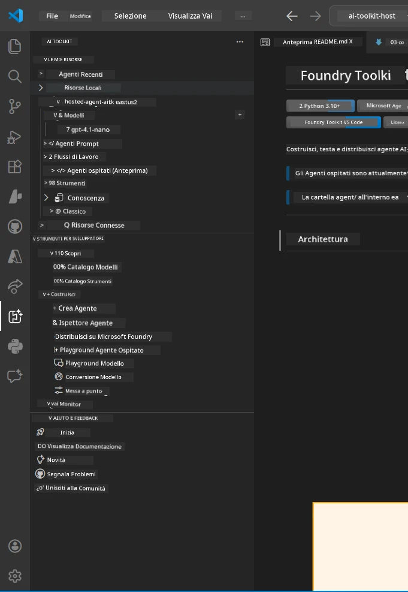
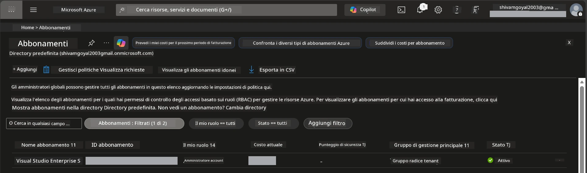
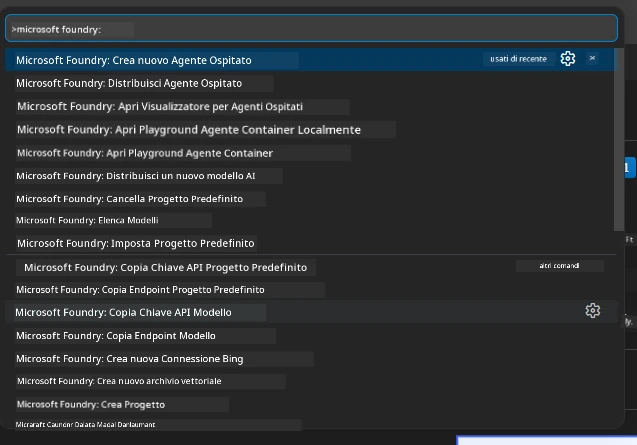
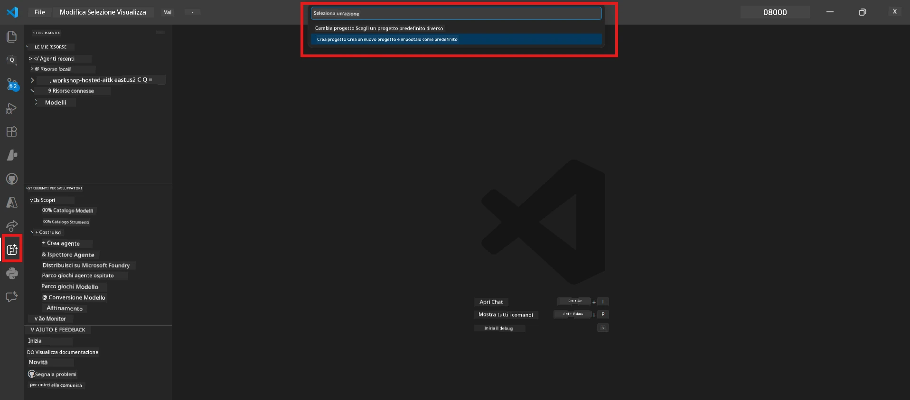
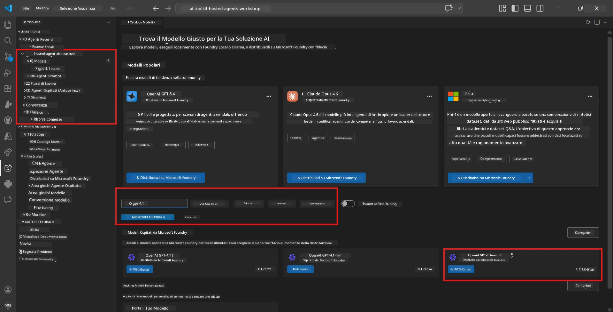
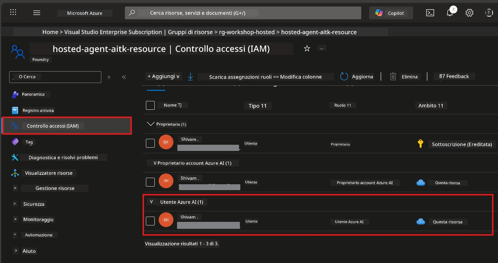

# Configurazione: Estensione, Progetto e Modello

⏱️ ~15 min

In questo modulo, installerai e verificherai l’estensione Foundry Toolkit, creerai (o ti connetterai a) un progetto Foundry e distribuirai un modello che il tuo agente utilizzerà.

## Passo 1: Installa Foundry Toolkit

**Foundry Toolkit per VS Code** è l’estensione principale per questo laboratorio. Offre creazione di progetti, distribuzione di modelli, scaffolding di agenti, test locale (Agent Inspector) e distribuzione nel cloud - tutto da VS Code.

1. Apri VS Code quindi premi `Ctrl+Shift+X` per aprire il pannello **Estensioni**.
2. Cerca **Foundry Toolkit**.
3. Installa **Foundry Toolkit for VS Code** (Publisher: Microsoft, ID: `ms-windows-ai-studio.windows-ai-studio`).
4. Dopo l’installazione, l’icona **Foundry Toolkit** appare nella Barra delle attività (barra laterale sinistra).

> *Nota: La Barra delle attività può visualizzare "AI TOOLKIT" in versioni precedenti dell’estensione. La funzionalità è identica.*



## Passo 2: Configurazione in base al tuo accesso

> **Scegli il tuo percorso:** Espandi la sezione qui sotto che corrisponde alla tua configurazione. Devi completare solo **un** percorso.

<details>
<summary><strong>🅰️ Percorso A - Cloud Azure (richiede abbonamento Azure)</strong></summary>

### Azure CLI

1. Installa da [learn.microsoft.com/cli/azure/install-azure-cli](https://learn.microsoft.com/cli/azure/install-azure-cli).
2. Verifica: `az --version` (attendi versione 2.80.0+).
3. Accedi: `az login`

### Opzioni di autenticazione

Il [Microsoft Agent Framework](https://learn.microsoft.com/agent-framework/overview/) usa [`DefaultAzureCredential`](https://learn.microsoft.com/azure/developer/python/sdk/authentication/credential-chains#defaultazurecredential-overview) che prova vari metodi di autenticazione in ordine. Scegli quello adatto al tuo ambiente:

#### Opzione 1: Account VS Code (consigliato per i laboratori)
1. Clicca l’icona **Account** (sagoma persona) nell’angolo in basso a sinistra di VS Code.
2. Seleziona **Accedi per usare Microsoft Foundry** (o **Accedi con Azure**).
3. Si apre un browser - accedi con l’account Azure che ha accesso all’abbonamento.
4. Torna a VS Code. Dovresti vedere il nome del tuo account in basso a sinistra.

#### Opzione 2: Azure CLI
```bash
az login
az account set --subscription "<your-subscription-id>"
```

#### Opzione 3: Service Principal (Enterprise/CI)
Per ambienti con restrizioni o pipeline CI/CD, imposta queste variabili d’ambiente nel tuo file `.env`:
```env
AZURE_TENANT_ID=<your-tenant-id>
AZURE_CLIENT_ID=<your-client-id>
AZURE_CLIENT_SECRET=<your-client-secret>
```

> **Come funziona `DefaultAzureCredential`:** Prova prima le variabili d’ambiente, poi l’identità gestita, poi accesso in VS Code, poi Azure CLI - usa il primo che riesce. Vedi [documentazione catena di credenziali](https://learn.microsoft.com/azure/developer/python/sdk/authentication/credential-chains#defaultazurecredential-overview).

### Azure Developer CLI (azd)

1. Installa: `winget install microsoft.azd` (Windows) o consulta [documentazione installazione](https://learn.microsoft.com/azure/developer/azure-developer-cli/install-azd).
2. Verifica: `azd version`
3. Accedi: `azd auth login`

### Docker Desktop (opzionale)

Docker serve solo se vuoi costruire container localmente. L’estensione Foundry gestisce automaticamente le build durante la distribuzione.

1. Installa da [docs.docker.com/get-docker](https://docs.docker.com/get-docker/).
2. Verifica: `docker info`

### Abbonamento Azure & RBAC

1. Accedi su [portal.azure.com](https://portal.azure.com).
2. Naviga su **Abbonamenti** e conferma che almeno uno sia **Attivo**.
3. Annota il tuo **ID abbonamento** - ti servirà nel Modulo 01.



#### Tabella scenari RBAC

La distribuzione di [Hosted Agent](https://learn.microsoft.com/azure/foundry/agents/concepts/hosted-agents) richiede permessi di **azione sui dati** che i ruoli standard Azure `Owner` e `Contributor` **non** includono. Usa la tabella sotto per capire quali ruoli ti servono:

| Scenario | Ruoli richiesti | Dove assegnarli |
|----------|-----------------|-----------------|
| Creare nuovo progetto Foundry | **Azure AI Owner** sulla risorsa Foundry | Risorsa Foundry nel Portale Azure |
| Distribuire su progetto esistente (nuove risorse) | **Azure AI Owner** + **Contributor** sull’abbonamento | Abbonamento + Risorsa Foundry |
| Distribuire su progetto completamente configurato | **Reader** sull’account + **Azure AI User** sul progetto | Account + Progetto nel Portale Azure |
| Solo test locale (nessuna distribuzione) | **Azure AI User** sul progetto | Progetto nel Portale Azure |

> **Punto chiave:** I ruoli Azure `Owner` e `Contributor` coprono solo permessi di *gestione* (operazioni ARM). Per azioni sui dati come `agents/write`, necessarie per creare e distribuire agenti, serve [**Azure AI User**](https://learn.microsoft.com/azure/foundry/concepts/rbac-foundry#built-in-roles) (o superiore).

## Connettiti o crea un progetto Foundry



1. Premi `Ctrl+Shift+P` → digita **Foundry Toolkit: Create Project** → selezionalo.
2. Seleziona il tuo **abbonamento Azure** dal menu a tendina.
3. Seleziona o crea un **gruppo di risorse** (es. `rg-hosted-agents-workshop`).
4. Seleziona una **regione** che supporti gli hosted agents: `East US`, `West US 2` o `Sweden Central`. Vedi [disponibilità regioni](https://learn.microsoft.com/azure/foundry/agents/concepts/hosted-agents#region-availability).
5. Inserisci un nome progetto (es. `workshop-agents`).
6. Attendi 2–5 minuti per il provisioning. Una notifica di progresso appare in VS Code.
7. Al completamento, il progetto appare nella barra laterale **Foundry Toolkit** sotto **MY RESOURCES**.



## Distribuisci un modello & assegna RBAC

Il tuo agente ospitato ha bisogno di un modello AI per generare risposte.

#### Matrice di selezione modello
A seconda delle tue esigenze, puoi scegliere tra diversi tier di modelli:

| Modello | Ideale per | Costo | Note |
|---------|------------|-------|-------|
| `gpt-4.1` | Risposte di alta qualità, sfumate | Maggiore | Migliori risultati, consigliato per test finale |
| `gpt-4.1-mini/gpt-5-mini` | Iterazioni veloci, costo più basso | Inferiore | Buono per sviluppo e test rapidi nel laboratorio |
| `gpt-4.1-nano` | Compiti leggeri | Più basso | Più economico, risposte più semplici |

1. Premi `Ctrl+Shift+P` → **Foundry Toolkit: Open Model Catalog** (o clicca **Model Catalog** nella sidebar sotto DEVELOPER TOOLS → Discover).
2. Cerca **gpt-4.1** nel catalogo.
3. Trova **OpenAI GPT-4.1-mini** (o `gpt-5-mini` per qualità migliore) e clicca **Deploy**.



4. Nella configurazione di distribuzione:
   - **Nome distribuzione:** Lascia il default o inserisci un nome personalizzato. **Ricorda questo nome.**
   - **Destinazione:** Seleziona **Deploy to Foundry Toolkit** → scegli il tuo progetto.
5. Clicca **Deploy** e attendi 1–3 minuti.

> **Consiglio:** Usa `gpt-4.1-mini/gpt-5-mini` per il laboratorio - veloce, economico e con buoni risultati.

### Annota i tuoi valori

Dopo la distribuzione, annota questi due valori (ti serviranno nel Modulo 03):

| Valore | Dove trovarlo |
|--------|--------------|
| **Endpoint progetto** | Clicca il tuo progetto nella sidebar → la vista dettagli mostra l’URL (es. `https://<account>.services.ai.azure.com/api/projects/<project>`) |
| **Nome distribuzione modello** | Espandi progetto → **Models** → il nome accanto al modello distribuito (es. `gpt-4.1-mini/gpt-5-mini`) |

### Assegna ruolo RBAC

> ⚠️ **Questo è il passo più spesso dimenticato.** Senza il ruolo corretto, la distribuzione nel Modulo 05 fallirà.

#### Quale ruolo mi serve?
A seconda dello scenario, ti servono queste combinazioni di ruoli:

| Scenario | Ruoli richiesti | Dove assegnarli |
|----------|-----------------|-----------------|
| Creare nuovo progetto Foundry | **Azure AI Owner** sulla risorsa Foundry | Risorsa Foundry nel Portale Azure |
| Distribuire su progetto esistente (nuove risorse) | **Azure AI Owner** + **Contributor** sull’abbonamento | Abbonamento + Risorsa Foundry |
| Distribuire su progetto completamente configurato | **Reader** sull’account + **Azure AI User** sul progetto | Account + Progetto nel Portale Azure |

**Punto chiave:** I ruoli Azure `Owner` e `Contributor` coprono solo permessi di *gestione*. Serve **Azure AI User** (o superiore) per azioni sui dati come `agents/write` richieste per creare e distribuire agenti.

1. Apri [portal.azure.com](https://portal.azure.com).
2. Cerca il nome del tuo **progetto Foundry** → clicca il risultato di tipo **"Foundry Toolkit project"** (NON l’account padre).
3. Clicca **Controllo accesso (IAM)** nella navigazione sinistra.
4. Clicca **+ Aggiungi** → **Aggiungi assegnazione ruolo**.
5. **Scheda Ruolo:** Cerca **Azure AI User**, selezionalo, clicca **Avanti**.
6. **Scheda Membri:** Seleziona **Utente, gruppo o service principal** → clicca **+ Seleziona membri** → trova e selezionati → clicca **Seleziona**.
7. Clicca **Rivedi + assegna** → di nuovo **Rivedi + assegna**.
8. **Attendi 1–2 minuti** per la propagazione.

> **Perché questo ruolo?** I ruoli Azure `Owner`/`Contributor` concedono solo permessi di gestione. Il ruolo **Azure AI User** concede l’azione sui dati `agents/write` necessaria per creare e distribuire agenti. Vedi [documenti RBAC Foundry](https://learn.microsoft.com/azure/foundry/concepts/rbac-foundry#built-in-roles).



</details>

<details>
<summary><strong>🅱️ Percorso B - Locale / livello gratuito (non serve abbonamento Azure)</strong></summary>

### Foundry Locale

Foundry Locale ti consente di eseguire modelli AI sulla tua macchina - non serve un account cloud. Puoi accedere ai modelli Foundry Locale tramite Foundry Toolkit usando il catalogo modelli come segue:

1. Vai all’estensione Foundry Toolkit.
2. Nella navigazione di Foundry Toolkit vai su **Developer Tools** > seleziona **Model Catalog**
3. Nella nuova finestra, seleziona **local** nella barra di navigazione.
4. Scorri verso il basso fino a **Phi 4 Mini,** e clicca il **pulsante aggiungi**; apparirà una finestra che indica che il modello sta venendo scaricato.
5. Una volta scaricato il modello, puoi procedere al passo successivo.

</details>

### ✅ Checkpoint


- [ ] `Ctrl+Shift+P` → "Foundry Toolkit" mostra i comandi disponibili
- [ ] Estensione Foundry Toolkit installata e sidebar si carica senza errori
- [ ] VS Code si apre ed esegue correttamente
- [ ] `python --version` mostra 3.10+
- [ ] Icona Foundry Toolkit visibile nella Barra Attività di VS Code
- [ ] **Percorso A:** `az login` funziona, abbonamento Attivo
- [ ] **Percorso B:** Foundry Locale è in esecuzione (`foundry local status`)
- [ ] **Percorso A:** Progetto Foundry visibile nella sidebar, modello distribuito, ruolo Azure AI User assegnato
- [ ] **Percorso B:** Foundry Locale è in esecuzione con un modello
- [ ] Hai annotato il tuo **endpoint** e il **nome distribuzione modello**


**Precedente:** [00 - Prerequisiti](00-prerequisites.md) · **Successivo:** [02 - Crea Hosted Agent →](02-create-hosted-agent.md)

---

<!-- CO-OP TRANSLATOR DISCLAIMER START -->
**Disclaimer**:
Questo documento è stato tradotto utilizzando il servizio di traduzione AI [Co-op Translator](https://github.com/Azure/co-op-translator). Sebbene ci impegniamo per garantire la precisione, si prega di notare che le traduzioni automatizzate possono contenere errori o imprecisioni. Il documento originale nella sua lingua nativa deve essere considerato la fonte autorevole. Per informazioni critiche, si raccomanda una traduzione professionale effettuata da un essere umano. Non siamo responsabili per eventuali malintesi o interpretazioni errate derivanti dall’uso di questa traduzione.
<!-- CO-OP TRANSLATOR DISCLAIMER END -->