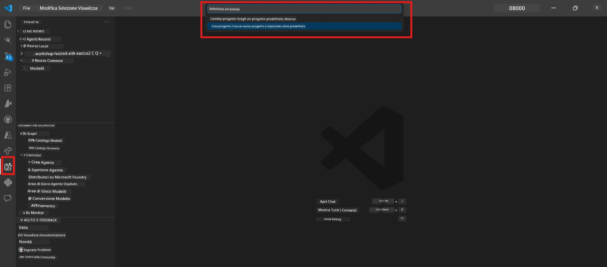
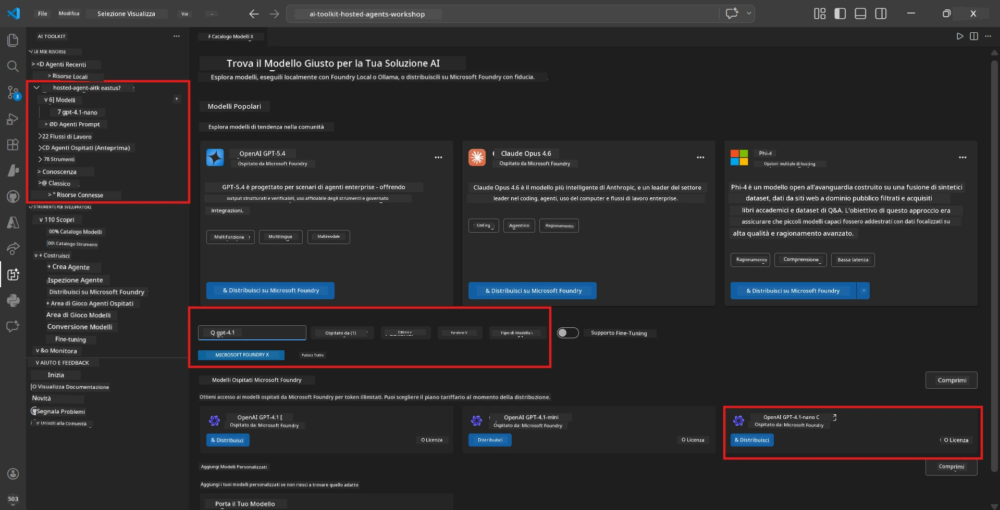
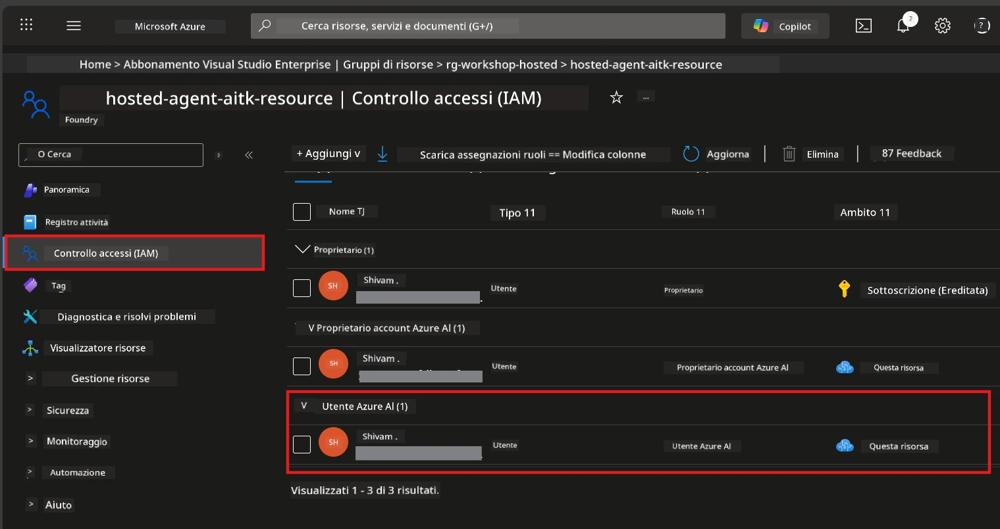

# Modulo 2 - Creare un progetto Foundry e distribuire un modello

In questo modulo, creerai (o selezionerai) un progetto Microsoft Foundry e distribuirai un modello che il tuo agente utilizzerà. Ogni passaggio è scritto esplicitamente: seguili in ordine.

> Se hai già un progetto Foundry con un modello distribuito, passa a [Modulo 3](03-create-hosted-agent.md).

---

## Passo 1: Creare un progetto Foundry da VS Code

Userai l'estensione Microsoft Foundry per creare un progetto senza uscire da VS Code.

1. Premi `Ctrl+Shift+P` per aprire la **Command Palette**.
2. Digita: **Microsoft Foundry: Create Project** e selezionalo.
3. Apparirà un menu a tendina - seleziona la tua **sottoscrizione Azure** dall'elenco.
4. Ti verrà chiesto di selezionare o creare un **gruppo di risorse**:
   - Per crearne uno nuovo: digita un nome (es. `rg-hosted-agents-workshop`) e premi Invio.
   - Per usare uno esistente: selezionalo dal menu a tendina.
5. Seleziona una **regione**. **Importante:** Scegli una regione che supporta agenti ospitati. Controlla la [disponibilità delle regioni](https://learn.microsoft.com/azure/foundry/agents/concepts/hosted-agents#region-availability) - scelte comuni sono `East US`, `West US 2` o `Sweden Central`.
6. Inserisci un **nome** per il progetto Foundry (es. `workshop-agents`).
7. Premi Invio e attendi che il provisioning sia completato.

> **Il provisioning richiede da 2 a 5 minuti.** Vedrai una notifica di avanzamento nell'angolo in basso a destra di VS Code. Non chiudere VS Code durante il provisioning.

8. Quando è completo, la barra laterale **Microsoft Foundry** mostrerà il tuo nuovo progetto sotto **Resources**.
9. Clicca sul nome del progetto per espanderlo e conferma che mostri sezioni come **Models + endpoints** e **Agents**.



### Alternativa: Creazione via il Portale Foundry

Se preferisci usare il browser:

1. Apri [https://ai.azure.com](https://ai.azure.com) ed esegui l’accesso.
2. Clicca su **Create project** nella pagina iniziale.
3. Inserisci un nome del progetto, seleziona la tua sottoscrizione, gruppo di risorse e regione.
4. Clicca su **Create** e attendi il provisioning.
5. Una volta creato, torna in VS Code: il progetto dovrebbe apparire nella barra laterale Foundry dopo un aggiornamento (clicca sull’icona di aggiornamento).

---

## Passo 2: Distribuire un modello

Il tuo [agente ospitato](https://learn.microsoft.com/azure/foundry/agents/concepts/hosted-agents) ha bisogno di un modello Azure OpenAI per generare risposte. Ora ne [distribuirai uno](https://learn.microsoft.com/azure/ai-foundry/openai/how-to/create-resource#deploy-a-model).

1. Premi `Ctrl+Shift+P` per aprire la **Command Palette**.
2. Digita: **Microsoft Foundry: Open [Model Catalog](https://learn.microsoft.com/azure/ai-foundry/openai/concepts/models)** e selezionalo.
3. La vista del Catalogo Modelli si apre in VS Code. Sfoglia o usa la barra di ricerca per trovare **gpt-4.1**.
4. Clicca sulla scheda del modello **gpt-4.1** (o `gpt-4.1-mini` se preferisci un costo inferiore).
5. Clicca su **Deploy**.

  
6. Nella configurazione di deployment:  
   - **Deployment name**: lascia il valore predefinito (es. `gpt-4.1`) oppure inserisci un nome personalizzato. **Ricorda questo nome** - ti servirà nel Modulo 4.  
   - **Target**: seleziona **Deploy to Microsoft Foundry** e scegli il progetto appena creato.  
7. Clicca **Deploy** e attendi che la distribuzione sia completata (1-3 minuti).

### Scelta del modello

| Modello | Indicato per | Costo | Note |
|---------|--------------|-------|-------|
| `gpt-4.1` | Risposte di alta qualità e sfumate | Più alto | Migliori risultati, raccomandato per test finali |
| `gpt-4.1-mini` | Iterazioni rapide, costo inferiore | Più basso | Buono per lo sviluppo in workshop e test rapidi |
| `gpt-4.1-nano` | Compiti leggeri | Il più basso | Più economico, ma risposte più semplici |

> **Raccomandazione per questo workshop:** Usa `gpt-4.1-mini` per lo sviluppo e i test. È veloce, economico e fornisce buoni risultati per gli esercizi.

### Verifica della distribuzione del modello

1. Nella barra laterale **Microsoft Foundry**, espandi il tuo progetto.
2. Cerca sotto **Models + endpoints** (o sezione simile).
3. Dovresti vedere il modello distribuito (es. `gpt-4.1-mini`) con stato **Succeeded** o **Active**.
4. Clicca sulla distribuzione del modello per vedere i dettagli.
5. **Annota** questi due valori - ti serviranno nel Modulo 4:

   | Impostazione | Dove trovarla | Esempio |
   |--------------|--------------|---------|
   | **Project endpoint** | Clicca sul nome del progetto nella barra laterale Foundry. L’URL endpoint è visibile nella vista dettagli. | `https://<account>.services.ai.azure.com/api/projects/<project>` |
   | **Model deployment name** | Il nome mostrato accanto al modello distribuito. | `gpt-4.1-mini` |

---

## Passo 3: Assegnare i ruoli RBAC richiesti

Questo è il **passaggio più comunemente dimenticato**. Senza i ruoli corretti, la distribuzione nel Modulo 6 fallirà con errore di permessi.

### 3.1 Assegna a te stesso il ruolo Azure AI User

1. Apri un browser e vai su [https://portal.azure.com](https://portal.azure.com).
2. Nella barra di ricerca in alto, digita il nome del tuo **progetto Foundry** e cliccaci sopra nei risultati.
   - **Importante:** Naviga alla risorsa **progetto** (tipo: "Microsoft Foundry project"), **non** alla risorsa padre account/hub.
3. Nel menu a sinistra del progetto, clicca su **Access control (IAM)**.
4. Clicca il pulsante **+ Add** in alto → seleziona **Add role assignment**.
5. Nella scheda **Role**, cerca e seleziona [**Azure AI User**](https://learn.microsoft.com/azure/foundry/concepts/rbac-foundry#built-in-roles). Premi **Next**.
6. Nella scheda **Members**:  
   - Seleziona **User, group, or service principal**.  
   - Clicca **+ Select members**.  
   - Cerca il tuo nome o la tua email, selezionati e premi **Select**.
7. Premi **Review + assign** → poi ancora **Review + assign** per confermare.



### 3.2 (Opzionale) Assegna il ruolo Azure AI Developer

Se devi creare risorse aggiuntive nel progetto o gestire distribuzioni programmativamente:

1. Ripeti i passaggi sopra, ma al punto 5 seleziona **Azure AI Developer**.
2. Assegna questo ruolo a livello di **risorsa Foundry (account)**, non solo a livello progetto.

### 3.3 Verifica le assegnazioni di ruolo

1. Nella pagina **Access control (IAM)** del progetto, clicca sulla scheda **Role assignments**.
2. Cerca il tuo nome.
3. Dovresti vedere elencato almeno il ruolo **Azure AI User** per l'ambito progetto.

> **Perché è importante:** Il ruolo [`Azure AI User`](https://learn.microsoft.com/azure/foundry/concepts/rbac-foundry#built-in-roles) concede l'azione dati `Microsoft.CognitiveServices/accounts/AIServices/agents/write`. Senza questo, vedrai questo errore durante la distribuzione:  
>
> ```
> Error: lacks the required data action 
> Microsoft.CognitiveServices/accounts/AIServices/agents/write 
> to perform POST /api/projects/{projectName}/assistants operation.
> ```
>  
> Consulta [Modulo 8 - Risoluzione dei problemi](08-troubleshooting.md) per maggiori dettagli.

---

### Checkpoint

- [ ] Il progetto Foundry esiste ed è visibile nella barra laterale Microsoft Foundry in VS Code  
- [ ] Almeno un modello è distribuito (es. `gpt-4.1-mini`) con stato **Succeeded**  
- [ ] Hai annotato l’URL **project endpoint** e il **nome della distribuzione modello**  
- [ ] Hai il ruolo **Azure AI User** assegnato a livello **progetto** (verifica in Portale Azure → IAM → Assegnazioni ruolo)  
- [ ] Il progetto si trova in una [regione supportata](https://learn.microsoft.com/azure/foundry/agents/concepts/hosted-agents#region-availability) per agenti ospitati

---

**Precedente:** [01 - Installare Foundry Toolkit](01-install-foundry-toolkit.md) · **Successivo:** [03 - Creare un Hosted Agent →](03-create-hosted-agent.md)

---

<!-- CO-OP TRANSLATOR DISCLAIMER START -->
**Disclaimer**:
Questo documento è stato tradotto utilizzando il servizio di traduzione AI [Co-op Translator](https://github.com/Azure/co-op-translator). Pur impegnandoci per l'accuratezza, si prega di essere consapevoli che le traduzioni automatizzate possono contenere errori o imprecisioni. Il documento originale nella sua lingua madre deve essere considerato la fonte autorevole. Per informazioni critiche, si raccomanda una traduzione professionale effettuata da un umano. Non ci assumiamo alcuna responsabilità per eventuali fraintendimenti o interpretazioni errate derivanti dall'uso di questa traduzione.
<!-- CO-OP TRANSLATOR DISCLAIMER END -->